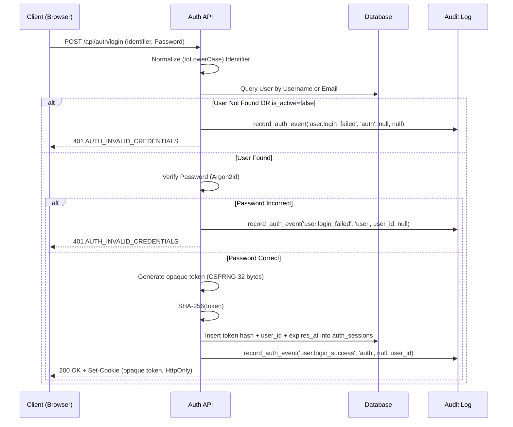
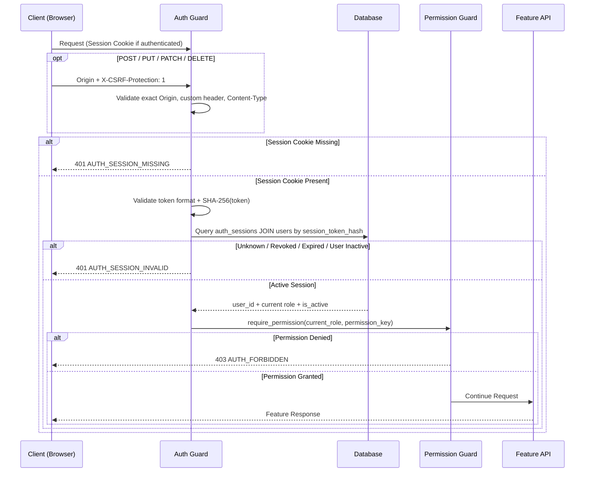
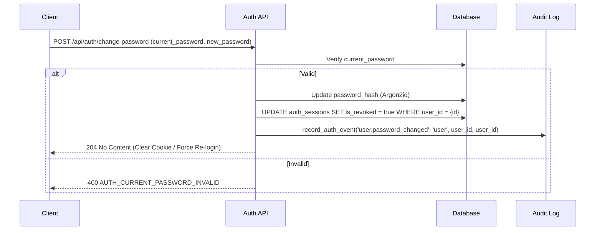

# Component & Flow Diagram - Authentication

## 1. Login Flow



> Token ดิบมีอยู่เฉพาะใน Memory ชั่วคราวระหว่างสร้าง Response และใน Cookie ของ Browser เท่านั้น ห้ามเก็บลง Database, Response JSON หรือ Log

## 2. Protected Request & RBAC Flow



Backend ต้องอ่าน Role ปัจจุบันจาก `users` ทุก Request ห้ามเก็บหรือเชื่อ Role จาก Cookie และต้อง Fail Closed หาก Database ใช้งานไม่ได้

## 3. Self-Change Password Flow
เมื่อผู้ใช้ต้องการเปลี่ยนรหัสผ่านของตนเอง



## 4. Audit Trail Contract (Reconciled DTO)
ส่วน Authentication จะสร้างข้อมูลส่งให้ระบบ Audit ผ่าน Auth-only wrapper function `record_auth_event()`:

### 4.1 Caller Function Signature (Auth Layer)
Caller (เช่น Login Flow) จะเรียกใช้ด้วย 4 Arguments พื้นฐาน:
```
record_auth_event(
    action:         str,        -- Canonical Action Name (ดูตาราง 4.2)
    resource_type:  str,        -- เช่น 'auth', 'user'
    resource_id:    UUID|null,  -- ID ของเป้าหมาย (nullable)
    actor_id:       UUID|null   -- ID ของผู้กระทำที่ยืนยันตัวตนแล้ว (nullable)
)
```

**กฎเรื่อง `actor_id`:** ต้องเป็น ID ของผู้ใช้ที่ **ยืนยันตัวตนสำเร็จแล้ว** เท่านั้น
- Login สำเร็จ → `actor_id = user_id` ของผู้ Login
- Login ล้มเหลว (password ผิด) → `actor_id = null` (ยังไม่รู้ว่าใครคือผู้กระทำจริง) แต่ใช้ `resource_type='user'` + `resource_id=target_user_id` เพื่อชี้ไปที่บัญชีเป้าหมาย
- Login ล้มเหลว (ไม่พบบัญชี) → `actor_id = null`, `resource_id = null`
- Admin ระงับบัญชี → `actor_id = admin_id`, `resource_id = target_user_id`

### 4.2 Canonical Mapping & DTO Translation

ฟังก์ชัน `record_auth_event()` ทำหน้าที่เป็น Registry Map มันจะดึงค่า `result`, `safe_error_category` และ `created_at` (now()) อัตโนมัติจากตารางด้านล่าง หากมีการส่ง Action ที่ไม่อยู่ในตารางนี้เข้ามา ฟังก์ชันต้อง **Reject (โยน Exception) ทันที** (ช่วยป้องกันการส่ง Action ของระบบอื่นเช่น `device` ผิดเข้ามา)

| Action | `resource_type` | `result` | `safe_error_category` |
| :--- | :--- | :--- | :--- |
| `user.login_success` | `auth` | `success` | `null` |
| `user.login_failed` | `user` / `auth` | `failure` | `'authentication_error'` |
| `user.logout` | `auth` | `success` | `null` |
| `user.password_changed` | `user` | `success` | `null` |
| `user.created` | `user` | `success` | `null` |
| `user.updated` | `user` | `success` | `null` |
| `user.deactivated` | `user` | `success` | `null` |
| `auth.permission_denied`| `auth` | `failure` | `'authorization_error'` |

*(หมายเหตุ: ค่า Enum ของ `safe_error_category` สำหรับฝั่ง Auth ที่เปิดให้ใช้งานใน P1 คือ `authentication_error`, `authorization_error`, และ `null` เท่านั้น ส่วน `validation_error` และ `server_error` ถือเป็น Reserved ไว้ก่อน ยังไม่อนุญาตให้ใช้งานจนกว่าจะมีการเพิ่ม Registry Entry ใหม่)*

### 4.3 Data Storage & Consumer API Mapping

เพื่อยุติปัญหาการใช้ชื่อ Field ไม่ตรงกันระหว่าง Database, Auth API และ D&M Contract ระบบกำหนดกฎการ Mapping ดังนี้:

| Auth Function Caller | Central DB Storage (`audit_logs`) | Full Audit API DTO (Admin Only) |
| :--- | :--- | :--- |
| `actor_id` | `user_id` | `actor_user_id` |
| (computed now) | `created_at` | `occurred_at` |
| (mapped) | `result` | `result` |
| (mapped) | `safe_error_category` | `safe_error_category` |

> [!NOTE]
> **สถานะสัญญา (Approved & Reconciled):**
> 1. **D&M Projection (Recent Activity):** D&M จะดึงข้อมูลไปแสดงเฉพาะ `action`, ชื่อผู้กระทำ (`actor display name` หรือ `Unknown`), เป้าหมาย (`resource display`), และ `timestamp` **โดยห้ามส่ง `safe_error_category`, `description`, และ `ip_address` ไปให้ D&M เด็ดขาด** ตามข้อกำหนดเรื่อง Data Privacy
> 2. **Central Schema:** ตาราง `audit_logs` กลางได้รับการอัปเดตเพื่อเพิ่มคอลัมน์ `result` และ `safe_error_category` เรียบร้อยแล้ว รองรับการจัดเก็บค่าที่ `record_auth_event()` คำนวณไว้ได้อย่างสมบูรณ์
