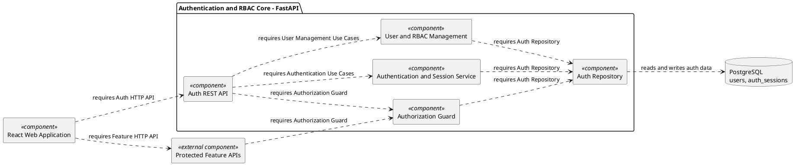
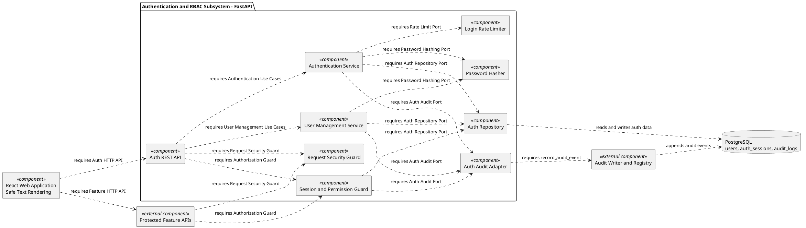
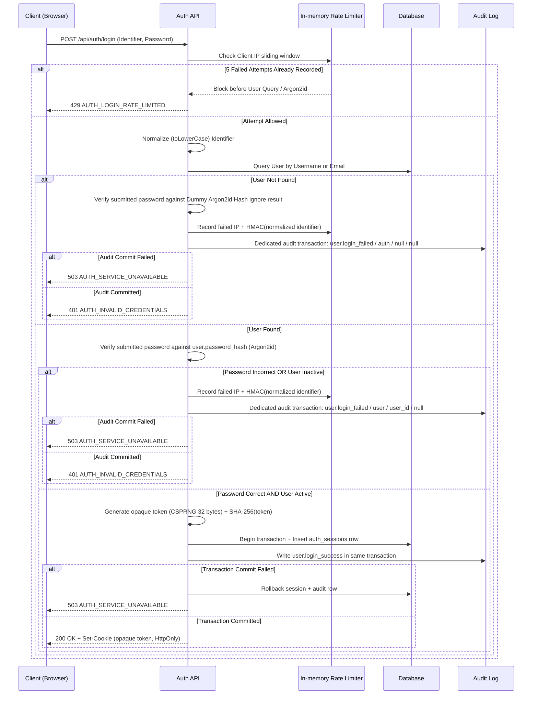
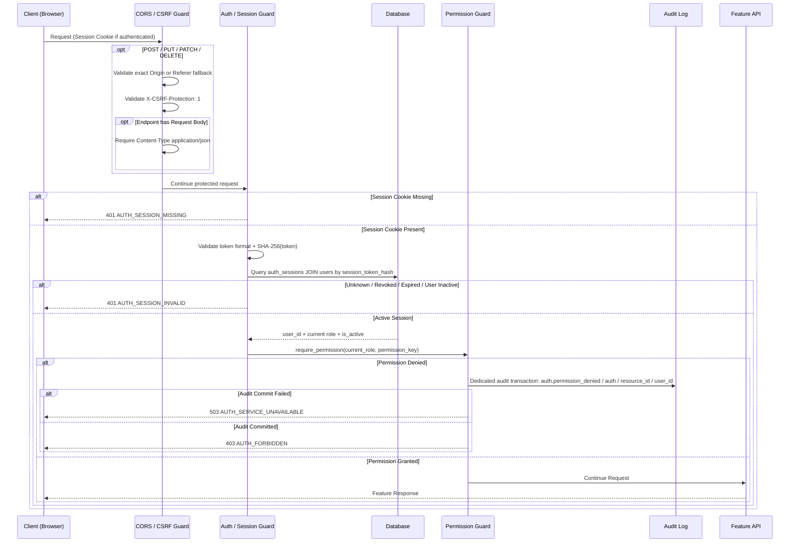
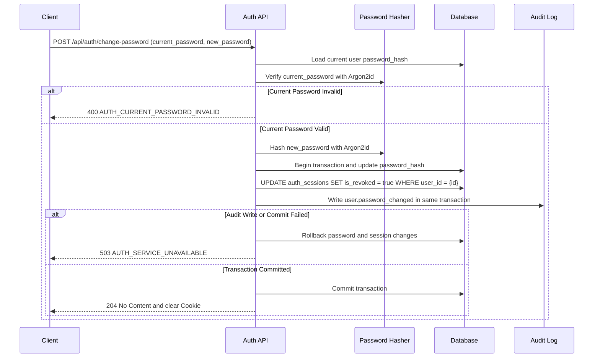

# Component & Flow Diagram - Authentication

## 1. UML Component Diagram (Architecture View)

### 1.1 หลักคิดร่วมตาม UML

อ้างอิงหลักจาก `05_knowledge_base/UML/Component based Diagram - UML.md` โดยใช้ลำดับคิดดังนี้:

1. **กำหนด System Boundary:**
	1. Authentication & RBAC Subsystem ของ FastAPI
	2. แสดง React, Feature API, Audit Trail และ PostgreSQL เป็น Dependency ภายนอก
2. **แยก Component ตาม Responsibility:** 
	1. Request Security, 
	2. Authentication,
	3. User Management, Session/RBAC,
	4. Password Hashing,
	5. Rate Limiting,
	6. Persistence
	7. Audit Adapter
	8. ไม่แตกทุก Class หรือ Function เป็น Component
3. **หา Provided Interface:**
	1. ระบุบริการที่ Auth ให้ระบบอื่น เช่น
	2. Auth HTTP API
	3. Authorization Guard
4. **หา Required Interface:**
	1. ระบุสิ่งที่แต่ละ Component ต้องใช้ เช่น
		1. Password Hashing Port,
		2. Auth Repository Port
		3. Audit Writer Interface
5. **ลาก Dependency จากผู้ใช้ไปหาผู้ให้บริการ:**
	1. ลูกศรเส้นประหมายถึง Component ต้นทางต้องใช้ Interface ของ Component ปลายทาง
6. **แยก External Component:**
	1. Audit Writer เป็น Shared-core ของ Audit Trail
	2. PostgreSQL เป็น Data Store กลาง ไม่ถือเป็นความรับผิดชอบภายใน Auth
7. **ไม่ใส่ลำดับเวลาในภาพนี้:**
	1. ลำดับ Login, Permission Check และ Password Change แสดงด้วย Sequence Diagram ในหัวข้อถัดไป

> ชื่อในภาพเป็น Logical Component Boundary สำหรับแบ่งความรับผิดชอบ ไม่ได้บังคับว่าต้องสร้างหนึ่ง Class หรือหนึ่งไฟล์ต่อหนึ่ง Component

### 1.2 Diagram A — Core Functional Architecture (ก่อนเพิ่ม Security Hardening)

**วิธีคิดของ Diagram A — เริ่มจาก Functional Requirement:**

1. ระบุสิ่งที่ระบบต้องทำ ได้แก่
	1. Login/Logout,
	2. Session,
	3. Current
	4. User,
	5. User Management
	6. RBAC
2. รวมหน้าที่ที่เกี่ยวข้องกันเป็น Component หลัก ได้แก่
	1. Auth API,
	2. Authentication/Session Service,
	3. User/RBAC Management,
	4. Authorization Guard และ
	5. Repository
3. หา Provided Interface ขั้นต่ำ คือ
	1. Auth HTTP API และ
	2. Authorization Guard ที่ Feature อื่นเรียกใช้
4. แสดงเฉพาะ Dependency ที่จำเป็นต่อการทำงาน โดยยังรวม Password Verification และรายละเอียด Security ไว้ภายใน Service
5. แยก React, Protected Feature APIs และ PostgreSQL ออกจาก Auth Boundary

คำถามที่ภาพนี้ต้องตอบคือ **“ระบบทำอะไร และโมดูลหลักใดต้องคุยกับใคร?”**

ภาพนี้แสดงเฉพาะความสามารถหลัก ได้แก่ Login/Session, User Management, RBAC และการอ่านเขียนข้อมูล โดยยังไม่แยก Security Control เช่น CSRF Guard, Rate Limiter, Password Hasher และ Audit Adapter ออกมาเป็น Component ชัดเจน


#### วิธีอ่านเส้นใน Diagram A

ใน PlantUML รูปแบบ `A ..> B : requires X` หมายถึง **A เป็น Consumer ที่ต้องใช้ Interface X ซึ่ง B เป็น Provider** เส้นนี้แสดง Dependency ไม่ได้หมายความว่า B จะไม่ตอบกลับ A และไม่ได้บอกว่าเหตุการณ์ใดเกิดก่อนหลัง

|  #  | เส้น Dependency       | Required → Provided Interface                    | ความหมายและเหตุผล                                                                                                                                                    | ถ้าไม่มีเส้นนี้                                                     |
| :-: | :-------------------- | :----------------------------------------------- | :------------------------------------------------------------------------------------------------------------------------------------------------------------------- | :------------------------------------------------------------------ |
| A1  | `WEB ..> API`         | React ต้องใช้ → Auth HTTP API                    | React เรียก Login, Logout, Current User, Change Password และ User Management ผ่าน HTTP โดยไม่เข้าถึง Service/Database โดยตรง                                         | หน้าเว็บใช้งานความสามารถ Auth ไม่ได้ หรือเกิดการข้าม API Boundary   |
| A2  | `WEB ..> FEATURES`    | React ต้องใช้ → Feature HTTP API                 | หลัง Login แล้ว React เรียก Device, Config, CIS, Settings และ Feature API อื่น โดย Browser แนบ Session Cookie ตาม HTTP Contract                                      | ผู้ใช้ Login ได้แต่ใช้งาน Feature หลักของ MyNetMate ไม่ได้          |
| A3  | `API ..> AUTHN`       | Auth API ต้องใช้ → Authentication Use Cases      | Endpoint ส่งงาน Login, Logout, Current User และ Session Lifecycle ให้ Service เพื่อไม่ใส่ Business Logic ไว้ใน Route Handler                                         | Route จะรับผิดชอบมากเกินไปและทดสอบ Business Logic แยกได้ยาก         |
| A4  | `API ..> USERS`       | Auth API ต้องใช้ → User Management Use Cases     | Admin Endpoint ส่งงาน Create User, Change Role และ Activate/Deactivate ให้ Component ที่เป็นเจ้าของกฎผู้ใช้                                                          | กฎ User Management จะกระจายอยู่ตาม Endpoint และเสี่ยงใช้ไม่สม่ำเสมอ |
| A5  | `API ..> ACCESS`      | Protected Auth API ต้องใช้ → Authorization Guard | Endpoint ที่ต้อง Login เช่น `/me`, Change Password และ Admin User API ต้องตรวจ Session/Permission ก่อนเข้า Use Case ส่วน Login เป็น Public Endpoint และเป็นข้อยกเว้น | ผู้ที่ไม่มี Session หรือ Permission อาจเรียก Protected Auth API ได้ |
| A6  | `FEATURES ..> ACCESS` | Feature API ต้องใช้ → Authorization Guard        | Device, Config, CIS และ Settings ต้องพึ่ง Guard กลางเพื่อใช้ RBAC ชุดเดียวกันแบบ Default Deny                                                                        | แต่ละ Feature อาจตรวจสิทธิ์ไม่เหมือนกันหรือเผลอเปิด Endpoint        |
| A7  | `AUTHN ..> REPO`      | Authentication Service ต้องใช้ → Auth Repository | Service ค้นผู้ใช้ สร้าง/Revoke Session และอ่าน Current User ผ่าน Repository โดยไม่เขียน SQL โดยตรง                                                                   | Login และ Session Lifecycle ไม่มีช่องทาง Persistence ที่ควบคุมได้   |
| A8  | `USERS ..> REPO`      | User Management ต้องใช้ → Auth Repository        | Service อ่าน/แก้ `users` และ Revoke Session เมื่อเปลี่ยน Role หรือ Deactivate                                                                                        | การแก้ผู้ใช้ไม่คงอยู่ หรือ Session เก่ายังใช้สิทธิ์เดิมต่อได้       |
| A9  | `ACCESS ..> REPO`     | Authorization Guard ต้องใช้ → Auth Repository    | Guard นำ Cookie Token ไปหา Session แล้วอ่าน `is_active` และ Role ปัจจุบันจาก Database ทุก Protected Request                                                          | ไม่สามารถตรวจ Expiry/Revoke หรือทำให้ Role Change มีผลทันทีได้      |
| A10 | `REPO ..> DB`         | Repository ต้องใช้ → PostgreSQL Persistence      | Repository เป็นจุดรวม SQLAlchemy Query สำหรับ `users` และ `auth_sessions`                                                                                            | Auth ไม่มี Source of Truth สำหรับผู้ใช้และ Session                  |


> ภาพ A เป็น Baseline สำหรับอธิบายพัฒนาการของ Architecture เท่านั้น ไม่ใช่แบบที่อนุมัติให้นำไป Implement เพราะยังไม่แสดง Security Boundary และ Audit Evidence ที่ P1 บังคับใช้

### 1.3 Diagram B — P1 Security-hardened Architecture (แบบที่ใช้ Implement)

**วิธีคิดของ Diagram B — เริ่มจาก Threat และ Security Contract:**

1. นำความเสี่ยงของ P1 มาจับคู่กับผู้รับผิดชอบ ได้แก่ CSRF/CORS, Brute-force Login, Password Hashing, Session Revocation, Permission Denied, XSS-safe Rendering และ Audit Evidence
2. แยก Security Control ที่ต้องใช้ซ้ำหรือทดสอบอิสระออกเป็น Component ได้แก่ Request Security Guard, Rate Limiter, Password Hasher, Session/Permission Guard และ Auth Audit Adapter
3. ระบุ Provided/Required Interface เช่น Password Hashing Port, Auth Repository Port, Auth Audit Port และ Audit Writer Interface
4. ใช้ Adapter กั้น Ownership ระหว่าง Auth กับ Shared Audit Writer เพื่อให้ Auth ส่งเพียง 4 Business Arguments และไม่เขียน `audit_logs` โดยตรง
5. ลาก Dependency จาก Component ผู้ใช้บริการไปยังผู้ให้บริการ และแสดง Audit Writer/PostgreSQL เป็น External Dependency
6. เก็บ XSS Safe Rendering เป็นความรับผิดชอบของ React และเก็บ Cookie Attribute เป็น HTTP Contract แทนการสร้าง Component ปลอมสำหรับ Policy

คำถามที่ภาพนี้ต้องตอบคือ **“เมื่อเพิ่ม Threat Model แล้ว ต้องมี Security Boundary และ Interface ใดเพื่อให้ P1 Implement และทดสอบได้?”**





#### วิธีอ่านเส้นใน Diagram B

ใน Mermaid รูปแบบ `A -.->|requires X| B` มีความหมายเดียวกับ Dependency ใน Diagram A คือ **A ต้องใช้ Interface X จาก B** ไม่ใช่ Sequence ของ Request

|  #  | เส้น Dependency     | Required → Provided Interface                           | ความหมายและเหตุผล                                                                                         | ถ้าไม่มีเส้นนี้                                                            |
| :-: | :------------------ | :------------------------------------------------------ | :-------------------------------------------------------------------------------------------------------- | :------------------------------------------------------------------------- |
| B1  | `WEB → API`         | React ต้องใช้ → Auth HTTP API                           | UI ใช้ Auth Endpoint ผ่าน Cookie-based HTTP Contract และรับ DTO/Error Envelope กลาง                       | Frontend ไม่สามารถ Login หรือจัดการ Auth State ได้                         |
| B2  | `WEB → FEATURES`    | React ต้องใช้ → Feature HTTP API                        | UI เรียก Feature หลัง Login โดย Browser แนบ HttpOnly Cookie อัตโนมัติ                                     | ผู้ใช้พิสูจน์ตัวตนได้แต่เข้าถึงงานหลักไม่ได้                               |
| B3  | `API → SEC`         | Auth API ต้องใช้ → Request Security Guard               | State-changing Auth Endpoint รวม Login ต้องผ่าน Exact Origin/Referer, CSRF Header และ Content-Type Policy | Auth Endpoint เสี่ยง CSRF และรับ Request รูปแบบที่ Contract ไม่อนุญาต      |
| B4  | `FEATURES → SEC`    | Feature API ต้องใช้ → Request Security Guard            | State-changing Endpoint ของ Feature อื่นใช้ Security Boundary กลางชุดเดียวกัน                             | การแก้ Device/Config/Settings อาจถูกเรียกจาก Cross-site Request            |
| B5  | `API → AUTHN`       | Auth API ต้องใช้ → Authentication Use Cases             | Route Delegate Login, Logout, Current User และ Change Password ไปยัง Business Service                     | Business Logic จะผูกกับ HTTP Layer และทดสอบแยกยาก                          |
| B6  | `API → USERS`       | Auth API ต้องใช้ → User Management Use Cases            | Admin Route Delegate การสร้างผู้ใช้ เปลี่ยน Role และ Activate/Deactivate                                  | Last-admin Guard และ Session Revoke อาจถูกใช้ไม่สม่ำเสมอ                   |
| B7  | `API → ACCESS`      | Protected Auth API ต้องใช้ → Authorization Guard        | Auth Route ที่ไม่ใช่ Public Route ตรวจ Opaque Session และ Permission ก่อนทำงาน                            | Protected Auth Endpoint อาจถูกเรียกโดยผู้ไม่มีสิทธิ์                       |
| B8  | `FEATURES → ACCESS` | Feature API ต้องใช้ → Authorization Guard               | ทุก Feature ใช้ Permission Catalog และ Default Deny จากจุดกลาง                                            | RBAC จะกระจาย ซ้ำซ้อน และมีโอกาสเปิดช่องว่าง                               |
| B9  | `AUTHN → RATE`      | Authentication Service ต้องใช้ → Rate Limit Port        | Login ตรวจ Sliding-window Counter ก่อน User Query และ Argon2id เพื่อจำกัด Brute Force/Resource Exhaustion | ผู้โจมตีเรียก Password Verification จำนวนมากได้                            |
| B10 | `AUTHN → HASH`      | Authentication Service ต้องใช้ → Password Hashing Port  | Login และ Change Password ใช้ Argon2id Configuration/Dummy Hash ชุดเดียวกัน                               | Password Verification อาจไม่สม่ำเสมอหรือเกิด User Enumeration จาก Timing   |
| B11 | `AUTHN → REPO`      | Authentication Service ต้องใช้ → Auth Repository Port   | อ่านผู้ใช้และสร้าง/Revoke `auth_sessions` ผ่าน Persistence Boundary                                       | Session ไม่สามารถตรวจหรือ Revoke แบบ Server-side ได้                       |
| B12 | `AUTHN → ADAPTER`   | Authentication Service ต้องใช้ → Auth Audit Port        | Login, Logout และ Password Change ส่งเฉพาะ 4 Business Arguments ผ่าน Auth Adapter                         | เหตุการณ์ Auth สำคัญไม่มีหลักฐานหรืออาจส่งข้อมูลเกิน Contract              |
| B13 | `USERS → HASH`      | User Management ต้องใช้ → Password Hashing Port         | Create User ต้อง Hash Password ด้วย Argon2id ชุดเดียวกับ Login/Seed                                       | อาจเก็บ Password ไม่ปลอดภัยหรือสร้าง Hash ที่ Login ตรวจไม่ได้             |
| B14 | `USERS → REPO`      | User Management ต้องใช้ → Auth Repository Port          | จัดเก็บผู้ใช้ เปลี่ยน Role/Status และ Revoke Session แบบ Transactional                                    | User Mutation และ Session State อาจไม่สอดคล้องกัน                          |
| B15 | `USERS → ADAPTER`   | User Management ต้องใช้ → Auth Audit Port               | สร้าง `user.created`, `user.updated`, `user.deactivated` โดยไม่เขียน Audit Table ตรง                      | การจัดการบัญชีไม่มี Security Evidence ตาม Canonical Registry               |
| B16 | `ACCESS → REPO`     | Session/Permission Guard ต้องใช้ → Auth Repository Port | Hash Token แล้ว Query `auth_sessions JOIN users` เพื่ออ่าน Session, Active Status และ Role ปัจจุบัน       | Cookie จะถูกเชื่อโดยไม่ตรวจ Source of Truth ฝั่ง Server                    |
| B17 | `ACCESS → ADAPTER`  | Session/Permission Guard ต้องใช้ → Auth Audit Port      | เมื่อ Permission Denied ให้บันทึก `auth.permission_denied` ผ่าน Intentional Audit Transaction             | การปฏิเสธสิทธิ์ไม่มีหลักฐานตรวจสอบย้อนหลัง                                 |
| B18 | `ADAPTER → AUDIT`   | Auth Audit Adapter ต้องใช้ → `record_audit_event`       | Adapter แปลง Auth Contract ไปยัง Shared Writer/Registry โดย Auth ไม่เขียน `audit_logs` เอง                | Ownership จะปนกันและ Canonical Mapping/Redaction อาจไม่เป็นมาตรฐานเดียวกัน |
| B19 | `REPO → DB`         | Auth Repository ต้องใช้ → PostgreSQL                    | SQLAlchemy Repository อ่าน/เขียนเฉพาะ `users` และ `auth_sessions`                                         | Auth ไม่มี Persistence Source of Truth                                     |
| B20 | `AUDIT → DB`        | Audit Writer ต้องใช้ → Audit Persistence                | Shared Writer ตรวจ Registry/Redaction แล้ว Append ลง `audit_logs`                                         | Event ผ่านการตรวจแล้วแต่ไม่ถูกเก็บเป็นหลักฐานถาวร                          |

สิ่งที่ไม่มีเส้นแยกไม่ได้แปลว่าไม่มี Security Control: XSS Safe Rendering เป็น Responsibility ภายใน React, Cookie Attributes เป็น Auth HTTP Contract และ HTTPS/Server Placement ควรอธิบายใน Deployment Diagram ไม่ใช่สร้าง Component เพิ่มโดยไม่มีพฤติกรรมของตนเอง

### 1.4 Responsibility และ Interface Contract

ตารางต่อไปนี้อธิบาย Component ของ **Diagram B** ซึ่งเป็น Target Architecture สำหรับ P1:

| Component                    | Responsibility                                                     | Provided Interface        | Required Interface                                     |
| :--------------------------- | :----------------------------------------------------------------- | :------------------------ | :----------------------------------------------------- |
| React Web Application        | แสดง Login/User UI และเรียก API ด้วย Cookie                        | User Interface            | Auth HTTP API, Feature HTTP API                        |
| Request Security Guard       | ตรวจ CORS, Origin/Referer, CSRF Header และ JSON Content Type       | Request Security Guard    | Environment Configuration                              |
| Auth REST API                | รับ/ตรวจ DTO และส่ง Error Envelope กลาง                            | Auth HTTP API             | Auth Use Cases, User Management, Authorization Guard   |
| Authentication Service       | Login, Logout, Current User, Change Password และ Session Lifecycle | Authentication Use Cases  | Rate Limit, Password Hasher, Repository, Audit Adapter |
| User Management Service      | Create User, Change Role และ Activate/Deactivate                   | User Management Use Cases | Password Hasher, Repository, Audit Adapter             |
| Session and Permission Guard | ตรวจ Opaque Session, User Status และ Permission แบบ Default Deny   | Authorization Guard       | Auth Repository, Audit Adapter                         |
| Login Rate Limiter           | จำกัด Failed Login แบบ In-memory Sliding Window                    | Rate Limit Port           | Client IP Policy, HMAC Key                             |
| Password Hasher              | Hash/Verify Argon2id และ Dummy Hash                                | Password Hashing Port     | Argon2id Library/Configuration                         |
| Auth Repository              | อ่าน/เขียน `users` และ `auth_sessions` ผ่าน SQLAlchemy             | Auth Repository Port      | PostgreSQL                                             |
| Auth Audit Adapter           | แปลง 4 Business Arguments ของ Auth ไปยัง Contract กลาง             | Auth Audit Port           | Audit Writer Interface                                 |
| Audit Writer and Registry    | ตรวจ Canonical Event, Redact และเขียน `audit_logs`                 | `record_audit_event`      | PostgreSQL                                             |

เส้น Dependency ในภาพทำหน้าที่เทียบเท่าแนวคิด **Required Interface → Provided Interface** หรือ Assembly Connector ใน UML แม้ Mermaid จะไม่ได้วาดสัญลักษณ์ Lollipop/Socket โดยตรง

## 2. Login Sequence Flow




> Dummy Hash สร้างหนึ่งครั้งตอน Application Startup ด้วย Password Hasher ชุดเดียวกับผู้ใช้จริง (`Argon2id m=19456 KiB, t=2, p=1`) และไม่ผูกกับบัญชีใด Rate Limiter ต้องทำงานก่อน User Query/Argon2id ส่วน Token ดิบมีอยู่เฉพาะใน Memory ชั่วคราวระหว่างสร้าง Response และใน Cookie ของ Browser เท่านั้น ห้ามเก็บลง Database, Response JSON หรือ Log การตรวจและเพิ่ม Rate-limit Counter ต้องเป็น Atomic ภายใน Process เพื่อให้ Concurrent Request หลบ Threshold ไม่ได้

## 3. Request Security, Session & RBAC Sequence Flow



CSRF Guard ต้องทำงานกับ State-changing Request ทุกเส้น รวมถึง Public Endpoint เช่น `POST /api/auth/login`; Public Endpoint จะข้าม Auth/Permission Guard แล้วไปยัง Handler หลังผ่าน CSRF Guard ส่วน `OPTIONS` เป็น CORS Preflight และไม่ถือเป็น State-changing Request

การตรวจ `Content-Type` ใช้เฉพาะ Endpoint ที่มี Request Body ดังนั้น `POST /api/auth/logout` ซึ่งไม่มี Body ต้องผ่านได้โดยไม่ส่ง `Content-Type` หาก Origin/Referer และ CSRF Header ถูกต้อง Backend ต้องอ่าน Role ปัจจุบันจาก `users` ทุก Protected Request ห้ามเก็บหรือเชื่อ Role จาก Cookie และต้อง Fail Closed หาก Database ใช้งานไม่ได้

## 4. Self-Change Password Sequence Flow
เมื่อผู้ใช้ต้องการเปลี่ยนรหัสผ่านของตนเอง



## 5. Audit Trail Contract (Reconciled DTO)
ส่วน Authentication จะสร้างข้อมูลส่งให้ระบบ Audit ผ่าน Auth-only wrapper function `record_auth_event()`:

### 5.1 Caller Function Signature (Auth Layer)
Caller (เช่น Login Flow) จะเรียกใช้ด้วย 4 Business Arguments พื้นฐาน โดย DB Session/Transaction ถูก Inject ผ่าน Auth Audit Adapter หรือ Request-scoped Service Context และไม่นับเป็น Business Argument:
```
record_auth_event(
    action:         str,        -- Canonical Action Name (ดูตาราง 5.2)
    resource_type:  str,        -- เช่น 'auth', 'user'
    resource_id:    UUID|null,  -- ID ของเป้าหมาย (nullable)
    actor_id:       UUID|null   -- ID ของผู้กระทำที่ยืนยันตัวตนแล้ว (nullable)
)
```

Auth Caller **ห้ามส่ง** `description` หรือ Client IP เข้า Wrapper นี้ `record_auth_event()` หรือ Audit Writer ต้องกำหนด `description` เป็น `null` หรือ Fixed Safe Template ภายในเท่านั้น และต้องไม่คัดลอก `auth_sessions.ip_address` ลง `audit_logs`

**กฎเรื่อง `actor_id`:** ต้องเป็น ID ของผู้ใช้ที่ **ยืนยันตัวตนสำเร็จแล้ว** เท่านั้น
- Login สำเร็จ → `actor_id = user_id` ของผู้ Login
- Login ล้มเหลว (password ผิด) → `actor_id = null` (ยังไม่รู้ว่าใครคือผู้กระทำจริง) แต่ใช้ `resource_type='user'` + `resource_id=target_user_id` เพื่อชี้ไปที่บัญชีเป้าหมาย
- Login ล้มเหลว (ไม่พบบัญชี) → `actor_id = null`, `resource_id = null`
- Admin ระงับบัญชี → `actor_id = admin_id`, `resource_id = target_user_id`

### 5.2 Canonical Mapping & DTO Translation

ฟังก์ชัน `record_auth_event()` ทำหน้าที่เป็น Registry Map มันจะดึงค่า `result`, `safe_error_category` และ `created_at` (now()) อัตโนมัติจากตารางด้านล่าง หากมีการส่ง Action ที่ไม่อยู่ในตารางนี้เข้ามา ฟังก์ชันต้อง **Reject (โยน Exception) ทันที** (ช่วยป้องกันการส่ง Action ของระบบอื่นเช่น `device` ผิดเข้ามา)

| Action | `resource_type` | `result` | `safe_error_category` |
| :--- | :--- | :--- | :--- |
| `user.login_success` | `auth` | `success` | `null` |
| `user.login_failed` | `user` / `auth` | `failure` | `'authentication_error'` |
| `user.logout` | `auth` | `success` | `null` |
| `user.password_changed` | `user` | `success` | `null` |
| `user.created` | `user` | `success` | `null` |
| `user.updated` | `user` | `success` | `null` |
| `user.deactivated` | `user` | `success` | `null` |
| `auth.permission_denied`| `auth` | `failure` | `'authorization_error'` |

*(หมายเหตุ: ค่า Enum ของ `safe_error_category` สำหรับฝั่ง Auth ที่เปิดให้ใช้งานใน P1 คือ `authentication_error`, `authorization_error`, และ `null` เท่านั้น ส่วน `validation_error` และ `server_error` ถือเป็น Reserved ไว้ก่อน ยังไม่อนุญาตให้ใช้งานจนกว่าจะมีการเพิ่ม Registry Entry ใหม่)*

### 5.3 Transaction Boundary

- `user.login_success`, `user.logout`, `user.password_changed`, `user.created`, `user.updated` และ `user.deactivated` ต้องเขียน Audit ด้วย DB Session และ Transaction เดียวกับ Business Action หาก Audit Write ล้มเหลวต้อง Rollback Business Action และตอบ `503 AUTH_SERVICE_UNAVAILABLE`
- `user.login_failed` ไม่มี Business Action ที่จะ Commit จึงต้องเปิด Intentional Audit Transaction แยกและ Commit Audit Row ก่อนตอบ `401 AUTH_INVALID_CREDENTIALS`; หาก Audit Commit ล้มเหลวให้ตอบ `503 AUTH_SERVICE_UNAVAILABLE`
- `auth.permission_denied` ต้องบันทึกด้วย Intentional Audit Transaction ที่ Commit ได้แม้ Request หลักถูกปฏิเสธด้วย `403`; หาก Audit Store ใช้งานไม่ได้ให้ Fail Closed และตอบ `503 AUTH_SERVICE_UNAVAILABLE`

### 5.4 Data Storage & Consumer API Mapping

เพื่อยุติปัญหาการใช้ชื่อ Field ไม่ตรงกันระหว่าง Database, Auth API และ D&M Contract ระบบกำหนดกฎการ Mapping ดังนี้:

| Auth Function Caller | Central DB Storage (`audit_logs`) | Full Audit API DTO (Admin Only) |
| :------------------- | :-------------------------------- | :------------------------------ |
| `actor_id`           | `user_id`                         | `actor_user_id`                 |
| (computed now)       | `created_at`                      | `occurred_at`                   |
| (mapped)             | `result`                          | `result`                        |
| (mapped)             | `safe_error_category`             | `safe_error_category`           |

> [!NOTE]
> **สถานะสัญญา (Approved & Reconciled):**
> 1. **D&M Projection (Recent Activity):** D&M จะดึงข้อมูลไปแสดงเฉพาะ `action`, ชื่อผู้กระทำ (`actor display name` หรือ `Unknown`), เป้าหมาย (`resource display`), และ `timestamp` **โดยห้ามส่ง `safe_error_category`, `description`, และ `ip_address` ไปให้ D&M เด็ดขาด** ตามข้อกำหนดเรื่อง Data Privacy
> 2. **Central Schema:** ตาราง `audit_logs` กลางได้รับการอัปเดตเพื่อเพิ่มคอลัมน์ `result` และ `safe_error_category` เรียบร้อยแล้ว รองรับการจัดเก็บค่าที่ `record_auth_event()` คำนวณไว้ได้อย่างสมบูรณ์
> 3. **Cross-feature Sign-off:** Auth ยืนยันว่าจะไม่ส่ง Client IP หรือ `description` จาก Caller เข้า Audit Writer และ D&M Contract ยืนยันว่าจะไม่เลือกหรือส่ง IP/Description ออก Recent Activity แล้ว สถานะร่วมอ้างอิง `02_feature/11_Audit Trail(Naphat)/06_Integration Contract Matrix.md`
