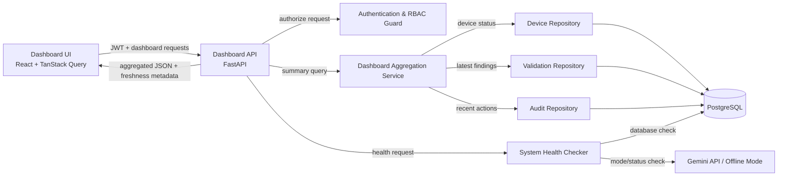

## 6. Component Architecture

### Component Responsibilities

| Component                         | หน้าที่                                                                             |
| --------------------------------- | ----------------------------------------------------------------------------------- |
| **Dashboard UI**                  | แสดง Widget, Polling/Manual Refresh, Empty/Error/Stale state และ RBAC-aware actions |
| **Dashboard API**                 | รับ Request และคืน Response ที่เหมาะกับหน้า Dashboard                               |
| **Dashboard Aggregation Service** | รวม Device, Validation และ Audit data เป็น Response เดียว                           |
| **Authentication & RBAC Guard**   | ตรวจ Session/JWT และสิทธิ์ของผู้ใช้                                                 |
| **Repositories**                  | แยก Query ตาม Domain และป้องกัน Query logic กระจายใน Route                          |
| **System Health Checker**         | ตรวจ Dependency แบบ Asynchronous และจำกัด Timeout                                   |
| **PostgreSQL**                    | Source of Truth ของ Current state, Validation และ Audit                             |

สถาปัตยกรรม P1 ไม่ต้องมี Message Queue หรือ Streaming pipeline
