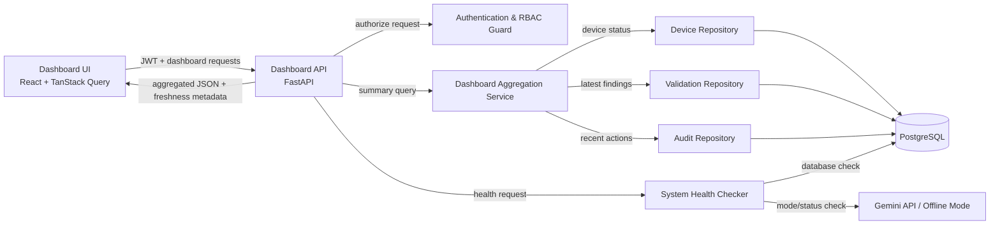

# MyNetMate Minimal MVP — Dashboard & Monitoring

> **ประเภทเอกสาร:** รายงานสังเคราะห์จาก Desk Research  
> **ขอบเขต:** Dashboard & Monitoring ระยะ P1  
> **Working Single Source of Truth:** `02_feature/MyNetMate Weight Feature List.md`  
> **ข้อควรระวัง:** ข้อความจาก Proposal เดิมถือเป็นข้อมูลอ้างอิงหรือสมมติฐานของโครงการ ไม่ใช่หลักฐานจากการสัมภาษณ์ เว้นแต่จะมีบันทึกผู้ให้ข้อมูลจริงรองรับ

---

## 1. บทสรุปผู้บริหาร

MyNetMate เป็นเว็บแอปพลิเคชันสำหรับจัดการเครือข่ายและสร้างคอนฟิกูเรชันอัตโนมัติ พัฒนาโดยทีม 4 คนภายในเวลาประมาณหนึ่งภาคการศึกษา 
ดังนั้น Dashboard ระยะ P1 ต้องมีขนาดเล็ก พัฒนาได้จริง และไม่ขยายตัวเป็นระบบ Network Monitoring เต็มรูปแบบ

Dashboard มีหน้าที่ตอบคำถามเชิงปฏิบัติการอย่างรวดเร็วว่า:

1. มีอุปกรณ์ใดขาดการเชื่อมต่อหรือไม่?
2. มีผลตรวจสอบความปลอดภัยระดับวิกฤตที่ต้องจัดการหรือไม่?
3. ใครเพิ่งดำเนินการอะไรในระบบ?
4. Backend, Database และบริการที่เกี่ยวข้องพร้อมใช้งานหรือไม่?
5. ข้อมูลที่กำลังแสดงได้รับการตรวจสอบครั้งล่าสุดเมื่อใด?

การประมวลผลต้องเป็นแบบ **Deterministic** และดึงข้อมูลจาก PostgreSQL โดยตรง ตามปรัชญา:

> “ใช้ AI เมื่อต้องการความเข้าใจ แต่ไม่ใช้ AI เมื่อต้องการความถูกต้อง”

### ข้อสรุป MVP

| ระดับ           | Feature                                                                                                               |
| --------------- | --------------------------------------------------------------------------------------------------------------------- |
| **Must**        | Device Availability, Critical Validation Failures, Recent Activity Feed, System Health, Data Freshness, Quick Actions |
| **Should**      | Device Status by Site                                                                                                 |
| **Could**       | Export Report หากมีเวลาเหลือ                                                                                          |
| **Won't ใน P1** | Historical Availability Graph, Interface Utilization, Topology Preview, SNMP Monitoring, Alert Pop-up/Email           |

Feature ที่ต้องพึ่ง Network Discovery, Topology, SNMP, LLDP/CDP หรือ Time-series data ให้เลื่อนไป P2 ตาม Scope ปัจจุบัน [1]

---

## 2. หลักการและหลักฐานที่ใช้

### 2.1 Situation Awareness และ Human Factors

ทฤษฎี Situation Awareness ของ Mica Endsley แบ่งการรับรู้เป็น 3 ระดับ [7][8]:

1. **Perception:** รับรู้ข้อมูลดิบ
2. **Comprehension:** เข้าใจความหมายและผลกระทบ
3. **Projection:** คาดการณ์สิ่งที่จะเกิดขึ้น

Dashboard P1 มุ่งสนับสนุนระดับ 1–2 โดยแปลงข้อมูลดิบเป็นสรุปที่ช่วยตัดสินใจ เช่น 
	จำนวนอุปกรณ์ Offline และ
	จำนวน Critical Validation Failures 
	ส่วนการคาดการณ์แนวโน้มจาก Historical Data เป็นงาน P2

### 2.2 การเทียบเคียงระบบอุตสาหกรรม

ระบบอย่าง Cisco Catalyst Center ใช้ Health Score, Streaming Telemetry, Latency, Packet Loss และข้อมูลเชิงลึกของแอปพลิเคชัน [9][11][12] ความสามารถเหล่านี้มีประโยชน์ในระดับองค์กร แต่เกินความจำเป็นสำหรับ P1 ของ MyNetMate

P1 จึงใช้สถานะล่าสุดจาก Periodic ICMP Check และข้อมูลที่มีอยู่แล้วใน Device Inventory, Security Validation และ Audit Trail โดยต้องแสดงเวลาตรวจสอบล่าสุดอย่างชัดเจน และไม่เรียกข้อมูลดังกล่าวว่า Real-time

### 2.3 Evidence Matrix

| Evidence ID | แหล่งข้อมูล                                                         | ประเภทหลักฐาน                     | ข้อสรุปสำหรับ MyNetMate P1                                                                         |
| ----------- | ------------------------------------------------------------------- | --------------------------------- | -------------------------------------------------------------------------------------------------- |
| **EV-01**   | Cisco Catalyst Center — Critical Issues และ Network Health [11][12] | Direct evidence                   | ระบบระดับองค์กรจัดลำดับปัญหารุนแรงก่อนข้อมูลทั่วไป จึงประยุกต์เป็น Critical Validation Failures    |
| **EV-02**   | SolarWinds/ICMP discussion [10]                                     | Inference                         | ICMP แบบกำหนดรอบเวลาเหมาะเป็นกลไก Availability ขั้นต่ำ โดยไม่ขยายไปสู่ SNMP Monitoring             |
| **EV-03**   | Zabbix Dashboard widgets [13][14]                                   | Recommendation                    | UI ต้องแสดง Data freshness และเวลาตรวจสอบล่าสุด เพื่อป้องกันการตีความ Stale Data ว่าเป็น Real-time |
| **EV-04**   | MyNetMate Problem Definition [4]                                    | Internal project hypothesis       | ปัญหาด้านการตรวจสอบย้อนหลังสนับสนุน Recent Activity Feed แต่ยังไม่ใช่หลักฐานสัมภาษณ์ที่ยืนยันแล้ว  |
| **EV-05**   | MyNetMate Weight Feature List [1]                                   | Working scope evidence            | Discovery, Topology, SNMP และข้อมูลเชิงประวัติอยู่ใน P2 หรืออยู่นอก P1                             |
| **EV-06**   | Offline Mode และ System API Status ใน Scope ปัจจุบัน [1]            | Internal architecture requirement | สถานะ AI แบบ Offline Mode ต้องแสดงเป็นข้อมูล ไม่ใช่ข้อผิดพลาด                                      |

---

## 3. Jobs to Be Done

| Job                                   | Trigger                             | ข้อมูลที่ต้องรู้                                           | การตัดสินใจ/การกระทำ                           | ผลลัพธ์ที่คาดหวัง                            |
| ------------------------------------- | ----------------------------------- | ---------------------------------------------------------- | ---------------------------------------------- | -------------------------------------------- |
| **JTBD-01: ตรวจ Availability**        | เปิด Dashboard หรือพบอุปกรณ์ผิดปกติ | จำนวน Online/Offline/Unknown/Maintenance และเวลาตรวจล่าสุด | เปิดรายการอุปกรณ์ที่ถูกกรองเป็น Offline        | เข้าสู่การ Troubleshoot ได้โดยไม่ค้นหลายหน้า |
| **JTBD-02: ตรวจ Security Compliance** | สแกน Config เสร็จหรือมี Config ใหม่ | จำนวน Critical Failures และอุปกรณ์ต้นเหตุ                  | Remediate หรือดำเนินการ Override ตามสิทธิ์     | เข้าถึงปัญหารุนแรงที่สุดก่อน                 |
| **JTBD-03: ตรวจ Activity**            | พบความผิดปกติหรือต้อง Audit         | ผู้กระทำ การกระทำ เป้าหมาย และเวลา                         | เปิดรายละเอียดกิจกรรมที่เกี่ยวข้อง             | เข้าใจบริบทการเปลี่ยนแปลงล่าสุด              |
| **JTBD-04: ตรวจ System Health**       | ก่อนใช้ Workflow สำคัญ              | Backend, Database และ AI mode/status                       | ใช้งานต่อ เปลี่ยน Offline Mode หรือแจ้งผู้ดูแล | ไม่ตีความความไม่พร้อมของระบบผิด              |

---

## 4. การจัดลำดับ Feature

### 4.1 Must-have

- จำนวนอุปกรณ์ทั้งหมดและสถานะ Online/Offline/Unknown/Maintenance
- Critical Validation Failures
- Recent Activity Feed
- Backend/Database/System API Status
- Data freshness หรือ `last_checked_at`
- Quick Actions ไปยัง Device Inventory, Config Builder และ Security Validation

### 4.2 Should-have

- Device Status by Site เพื่อจำกัดวงพื้นที่เกิดเหตุ

### 4.3 Could-have

- Export Report เฉพาะกรณี P1 หลักเสร็จสมบูรณ์แล้ว

### 4.4 Won't-have ใน P1

- Historical Availability Graph
- Interface/Bandwidth Utilization
- Topology Preview
- SNMP, LLDP และ CDP Monitoring
- Time-series analytics
- Alert Pop-up และ Email notification

---

## 5. ข้อกำหนด Dashboard P1

### 5.1 Widget Specification

| Widget                           | จุดประสงค์                                             | Source of Truth                                   | Refresh                                    | สิทธิ์                              | Empty/Error/Stale State                                                                        |
| -------------------------------- | ------------------------------------------------------ | ------------------------------------------------- | ------------------------------------------ | ----------------------------------- | ---------------------------------------------------------------------------------------------- |
| **Device Availability**          | แสดงจำนวนอุปกรณ์ตามสถานะ                               | `devices.status`, `devices.last_seen`             | Polling เช่น 60 วินาที หรือ Manual Refresh | Viewer ขึ้นไป                       | แสดง `--` เมื่อไม่มีข้อมูลที่เชื่อถือได้ และแสดง `last_checked_at`                             |
| **Critical Validation Failures** | แสดงผลสแกน Critical ที่ยังไม่ได้รับการยอมรับความเสี่ยง | `scan_results` และ `cis_overrides`                | หลัง Scan เสร็จหรือ Refresh Summary        | Viewer ดูได้; การ Override ตาม RBAC | หากไม่มี Failure ให้ระบุว่า “ไม่พบ Critical Failure ในผลสแกนล่าสุด” ไม่ใช้คำว่า “ปลอดภัย 100%” |
| **Recent Activity Feed**         | แสดง 10 กิจกรรมล่าสุด                                  | `audit_logs`                                      | Manual หรือ Periodic Refresh               | ตามนโยบาย RBAC                      | แสดง Empty state เมื่อยังไม่มีกิจกรรม                                                          |
| **System Health**                | แสดงสถานะ Backend, Database และ AI mode                | Health Checker และ `system_settings.offline_mode` | On load และ Periodic Refresh               | Viewer ขึ้นไป                       | Offline Mode แสดงสีเทา/Informational ไม่ใช่ Critical                                           |
| **Quick Actions**                | ลดจำนวนขั้นตอนเข้าสู่ Workflow หลัก                    | Static route configuration                        | ไม่ต้อง Refresh                            | แสดงตาม RBAC                        | ซ่อนหรือ Disable Action ที่ผู้ใช้ไม่มีสิทธิ์                                                   |

### 5.2 นิยามสถานะ

| สถานะ                 | ความหมาย                                                                                                   |
| --------------------- | ---------------------------------------------------------------------------------------------------------- |
| **Online**            | อุปกรณ์ตอบ ICMP ภายใน Timeout และเกณฑ์ที่กำหนด                                                             |
| **Offline**           | อุปกรณ์ไม่ตอบต่อเนื่องตามเกณฑ์ เช่น 3 ครั้งติดต่อกัน โดยตัวเลขจริงต้องกำหนดใน Implementation Specification |
| **Unknown**           | ยังไม่เคยตรวจ หรือผลล่าสุดไม่เพียงพอสำหรับสรุป Online/Offline                                              |
| **Maintenance**       | ผู้ดูแลตั้งใจระงับการตรวจสอบหรือการแจ้งสถานะชั่วคราว                                                       |
| **Stale**             | เวลาตั้งแต่การตรวจล่าสุดเกิน Freshness threshold ต้องแสดงพร้อม `last_checked_at`                           |
| **Healthy**           | Component ภายในตอบสนองตามเกณฑ์                                                                             |
| **Degraded**          | Component ยังทำงานได้ แต่บาง Dependency มีปัญหา                                                            |
| **Unavailable/Error** | Component ไม่พร้อมให้บริการ                                                                                |
| **Offline Mode**      | AI ถูกปิดโดยตั้งใจ ไม่ถือเป็น System Error                                                                 |

---

## 6. Component Architecture



### Component Responsibilities

| Component | หน้าที่ |
|---|---|
| **Dashboard UI** | แสดง Widget, Polling/Manual Refresh, Empty/Error/Stale state และ RBAC-aware actions |
| **Dashboard API** | รับ Request และคืน Response ที่เหมาะกับหน้า Dashboard |
| **Dashboard Aggregation Service** | รวม Device, Validation และ Audit data เป็น Response เดียว |
| **Authentication & RBAC Guard** | ตรวจ Session/JWT และสิทธิ์ของผู้ใช้ |
| **Repositories** | แยก Query ตาม Domain และป้องกัน Query logic กระจายใน Route |
| **System Health Checker** | ตรวจ Dependency แบบ Asynchronous และจำกัด Timeout |
| **PostgreSQL** | Source of Truth ของ Current state, Validation และ Audit |

สถาปัตยกรรม P1 ไม่ต้องมี Message Queue หรือ Streaming pipeline

---

## 7. Database Design

### 7.1 Minimal P1 Schema

Dashboard ไม่เป็นเจ้าของตารางแยก และไม่สร้างตารางชื่อ `dashboard` โดย Aggregate จากตารางต้นทาง

| ตาราง | Field ที่ Dashboard ใช้ | Query หลัก | Index ที่ควรพิจารณา |
|---|---|---|---|
| **devices** | `id`, `hostname`, `site`, `status`, `last_seen` | นับอุปกรณ์แยกตามสถานะ/ไซต์ | Index บน `status`; Partial index สำหรับ Offline เมื่อมีข้อมูลมากและ Query plan ยืนยันว่าจำเป็น |
| **scan_results** | `device_id`, `severity`, `passed`, `scanned_at` | ผล Critical ที่ไม่ผ่านจากผลสแกนล่าสุด | Composite/partial index สำหรับ `passed = false`, Severity และเวลาสแกน |
| **cis_overrides** | `scan_result_id`, สถานะ/เวลาของ Override | ตัดรายการที่มี Active Override ออกจาก Critical count | Index บน `scan_result_id` |
| **audit_logs** | `user_id`, `action`, `resource_type`, `resource_id`, `created_at` | 10 กิจกรรมล่าสุด | B-tree บน `created_at DESC` |
| **system_settings** | `offline_mode` | แสดง AI mode | Primary key ของ Singleton row |

> **หมายเหตุ:** การทำ Index ต้องยืนยันด้วยข้อมูลจำลองและ `EXPLAIN ANALYZE` ไม่ควรสร้าง Index ทุกตัวล่วงหน้าโดยไม่มี Query pattern รองรับ

### 7.2 Optional Historical/P2 Schema

หาก P2 ต้องแสดง Availability ย้อนหลัง ให้เพิ่ม:

```text
device_status_checks
- id
- device_id
- status
- response_time_ms
- checked_at
- error_code
```

เมื่อปริมาณข้อมูลเพิ่มขึ้นจึงค่อยพิจารณา Retention, Partitioning, Roll-up หรือ Time-series extension เช่น TimescaleDB โดยไม่รวมความซับซ้อนนี้ไว้ใน P1

---

## 8. API Contracts

| Endpoint                             | สิทธิ์                | Input                     | Output หลัก                                                    | Cache/Error behavior                                                              |
| ------------------------------------ | --------------------- | ------------------------- | -------------------------------------------------------------- | --------------------------------------------------------------------------------- |
| `GET /api/dashboard/summary`         | Viewer/Operator/Admin | `site_id` (optional)      | Device counts, Security summary, `last_checked_at`, `is_stale` | อาจ Cache ระยะสั้น เช่น 30 วินาที; หากใช้ค่าค้างต้องส่ง `is_stale: true`          |
| `GET /api/dashboard/recent-activity` | ตาม RBAC policy       | `limit` โดยจำกัดค่าสูงสุด | รายการกิจกรรมล่าสุดพร้อม User, Action, Target, Timestamp       | ไม่จำเป็นต้อง Cache สำหรับ 10 รายการล่าสุด หาก Index เหมาะสม                      |
| `GET /api/system/health`             | Viewer/Operator/Admin | ไม่มี                     | Backend, Database, AI mode/status                              | Dependency ภายนอกต้องมี Timeout และ Offline Mode ต้องไม่ถูกส่งเป็น Critical error |

### ตัวอย่าง Response: Dashboard Summary

```json
{
  "devices": {
    "total": 10,
    "online": 8,
    "offline": 1,
    "unknown": 0,
    "maintenance": 1
  },
  "security": {
    "critical_failures": 2
  },
  "last_checked_at": "2026-08-09T10:00:00+07:00",
  "is_stale": false
}
```

---

## 9. Acceptance Tests และ Success Metrics

### Acceptance Tests

| Test ID | Scenario | Expected Result |
|---|---|---|
| **AT-01** | มีอุปกรณ์ 10 รายการ: Online 8, Offline 2 | `/api/dashboard/summary` คืน Total 10, Online 8, Offline 2 ตรงกับฐานข้อมูล |
| **AT-02** | ผู้ใช้คลิก Critical Validation Failure | ระบบไปหน้า Security Validation พร้อม Pre-filter อุปกรณ์หรือผลสแกนที่เกี่ยวข้อง |
| **AT-03** | เปิด Offline Mode | AI indicator แสดงสถานะ Informational/สีเทา ไม่แสดง Critical error |
| **AT-04** | ข้อมูล Device เกิน Freshness threshold | UI แสดง Stale state และเวลาตรวจล่าสุด |
| **AT-05** | Viewer เปิด Dashboard | Viewer อ่านข้อมูลได้ แต่ Action ที่แก้ไขหรือ Override ถูกซ่อน/ปฏิเสธ |

### Success Metrics

- `GET /api/dashboard/summary` กับข้อมูลจำลอง 1,000 อุปกรณ์ ควรตอบภายใน 1.0 วินาทีตามเป้าหมายเบื้องต้นของรายงาน
- Dashboard API ต้องไม่เรียก Gemini เพื่อคำนวณ Metric
- ค่าบน Dashboard ต้องตรงกับ Source of Truth
- Error และ Stale data ต้องไม่ถูกแสดงเป็นข้อมูลปัจจุบันโดยไม่มีคำเตือน

> ตัวเลข Performance เป็นเป้าหมายสำหรับทดสอบ ไม่ใช่ข้อเท็จจริงที่ยืนยันแล้ว ต้องวัดบนสภาพแวดล้อมของโครงการ

---

## 10. Traceability Matrix

| Evidence     | User Job                  | Requirement             | P1 Feature                   | Component                     | Source of Truth                               | API/Route                        | Acceptance                |
| ------------ | ------------------------- | ----------------------- | ---------------------------- | ----------------------------- | --------------------------------------------- | -------------------------------- | ------------------------- |
| EV-01, EV-02 | ตรวจ Availability         | QR-9                    | Device Status Widget         | Aggregation Service           | `devices.status`, `devices.last_seen`         | `/api/dashboard/summary`         | AT-01, AT-04              |
| EV-01, EV-05 | ประเมินช่องโหว่รุนแรง     | QR-3                    | Critical Validation Failures | Validation Repository/Service | `scan_results`, `cis_overrides`               | `/api/dashboard/summary`         | AT-02                     |
| EV-04, EV-05 | ตรวจประวัติการทำงาน       | Audit requirement       | Recent Activity Feed         | Audit Repository/Service      | `audit_logs`                                  | `/api/dashboard/recent-activity` | ตรวจรายการล่าสุดตรงกับ DB |
| EV-05, EV-06 | ตรวจความพร้อมของระบบ      | Architecture constraint | System API Status            | Health Checker                | Health checks, `system_settings.offline_mode` | `/api/system/health`             | AT-03                     |
| EV-04        | เข้าสู่ Workflow เร็วขึ้น | Configuration workflow  | Quick Actions                | Static Frontend UI            | N/A                                           | Frontend routes                  | ตรวจ Route และ RBAC       |

---

## 11. ข้อขัดแย้งและแนวทางแก้ไข

| ประเด็นขัดแย้ง                            | ความเสี่ยง                                           | แนวทาง P1                                                                      |
| ----------------------------------------- | ---------------------------------------------------- | ------------------------------------------------------------------------------ |
| **Real-time vs Periodic Polling**         | ผู้ใช้อาจเชื่อว่าข้อมูลเป็นปัจจุบันทันที             | ใช้คำว่า “สถานะล่าสุดที่ตรวจสอบ” และแสดง `last_checked_at`/Stale state         |
| **Current State vs Historical Graph**     | การเก็บข้อมูลรายนาทีเพิ่มความซับซ้อนและขนาดฐานข้อมูล | P1 เก็บ Current state; History และ Trend graph ไป P2                           |
| **Dashboard P1 vs Topology/Discovery P2** | Dashboard อาจดึง Dependency ที่ยังไม่มีเข้ามา        | ตัด Topology, SNMP, LLDP/CDP และ Interface utilization ออกจาก P1               |
| **AI Unavailable vs Offline Mode**        | Offline Mode อาจถูกตีความเป็นระบบล่ม                 | แสดง Offline Mode เป็น Informational state                                     |
| **Commercial Feature vs Capstone Scope**  | เกิด Scope creep และ Over-engineering                | ใช้ผลิตภัณฑ์อุตสาหกรรมเป็น Evidence/Comparison ไม่ใช่รายการ Feature ที่ต้องลอก |
| **Proposal VoC vs Desk Research**         | อาจอ้างว่ามีความต้องการจากผู้ใช้จริงโดยไม่มีหลักฐาน  | ระบุว่าเป็น Internal hypothesis จนกว่าจะมีบันทึกการสัมภาษณ์จริง                |

---

## 12. บทสรุป

Dashboard P1 ของ MyNetMate ควรเป็น **Aggregated Operational Summary** ไม่ใช่ Enterprise Monitoring Dashboard โดยต้อง:

- แสดงสถานะอุปกรณ์ล่าสุดอย่างชัดเจน
- ชี้ Critical Validation Failures
- แสดง Recent Activity
- บอก System Health และ Offline Mode
- นำผู้ใช้เข้าสู่ Workflow ที่เกี่ยวข้องได้รวดเร็ว
- แสดง Data freshness ทุกครั้ง
- Query จาก PostgreSQL ต้นทางโดยไม่สร้างตาราง Dashboard

แนวทางนี้รักษา Scope ให้เหมาะกับทีมและระยะเวลา พร้อมรองรับการขยายไปสู่ Historical Monitoring, SNMP และ Topology ใน P2

---

## เอกสารอ้างอิง

1. `MyNetMate Weight Feature List.md`
2. [Mitigating Alert Fatigue in Cloud Monitoring Systems: A Machine Learning Perspective](https://www.researchgate.net/publication/380878127_Mitigating_Alert_Fatigue_in_Cloud_Monitoring_Systems_A_Machine_Learning_Perspective)
3. [Bio-Shield Wearable & Boundary Network: A Comprehensive Survey and Architecture for Intelligent Health Protection and Environmental Monitoring](https://www.ijert.org/bio-shield-wearable-boundary-network-a-comprehensive-survey-and-architecture-for-intelligent-health-protection-and-environmental-monitoring-ijertv15is080047)
4. `04_problem-definition-and-voc.md`
5. [Endsley's Levels of Situational Awareness—Clarity, Limits, and Proper Use](https://kravology.com/endsleys-levels-situational-awareness-clarity-limits-and-proper-use/)
6. [What Are the Three Levels of Situational Awareness? A Control Room Guide](https://www.primate-tech.com/resources/three-levels-situational-awareness)
7. [Measurement of Situation Awareness in Dynamic Systems](https://pages.uwf.edu/skass/documents/HF.37.1995-Endsley-Measure_003.pdf)
8. [Automation and Situation Awareness](https://maritimesafetyinnovationlab.org/wp-content/uploads/2019/12/Automation-and-Situation-Awareness-Endsley.pdf)
9. [Cisco Catalyst Assurance User Guide 2.3.7.x — Monitor Application Health](https://www.cisco.com/c/en/us/td/docs/cloud-systems-management/network-automation-and-management/catalyst-center-assurance/2-3-7/b_cisco_catalyst_assurance_2_3_7_ug/b_cisco_catalyst_assurance_2_3_6_ug_chapter_01000.html)
10. [ICMP (Ping) — Fastest or SNMP — SolarWinds THWACK](https://thwack.solarwinds.com/discussion/76740/icmp-ping-fastest-or-snmp)
11. [Cisco Catalyst Center User Guide 3.1.x](https://www.cisco.com/c/en/us/td/docs/cloud-systems-management/network-automation-and-management/catalyst-center/3-1-x/user_guide/b_cisco_catalyst_center_user_guide_3_1_x/b_cisco_catalyst_center_ug_3_1_x_chapter_01.html)
12. [Cisco Catalyst Center User Guide 3.2.x](https://www.cisco.com/c/en/us/td/docs/cloud-systems-management/network-automation-and-management/catalyst-center/3-2-x/user-guide/cisco-catalyst-center-user-guide-3-2-x.pdf)
13. [Zabbix 8.0 — Dashboard Widgets](https://www.zabbix.com/documentation/8.0/en/manual/web_interface/frontend_sections/dashboards/widgets_overview)
14. [Zabbix Current — Dashboard Widgets](https://www.zabbix.com/documentation/current/en/manual/web_interface/frontend_sections/dashboards/widgets)
15. [Cisco Catalyst Centre Telemetry — Community Discussion](https://community.cisco.com/t5/software-defined-access-sd-access/cisco-catalyst-centre-telemetry/m-p/5370404)
16. [How to Optimize GROUP BY Performance in PostgreSQL](https://oneuptime.com/blog/post/2026-01-25-postgresql-group-by-performance/view)
17. [How Indexing Can Supercharge COUNT and SUM Queries in PostgreSQL](https://medium.com/@lukmanfreedom/how-indexing-can-supercharge-your-count-and-sum-queries-in-postgresql-8ba3f8523f61)
18. [Efficient Query Optimization in PostgreSQL](https://blog.dataengineerthings.org/efficient-query-optimization-in-postgresql-leveraging-indexes-for-faster-sorting-grouping-and-2d3cc2817eab)
19. [PostgreSQL Slow Queries — Ways to Find and Fix Bottlenecks](https://dev.to/piteradyson/postgresql-slow-queries-7-ways-to-find-and-fix-performance-bottlenecks-2app)
20. [Best Practices for PostgreSQL Aggregation](https://www.tigerdata.com/learn/postgresql-aggregation-best-practices)
