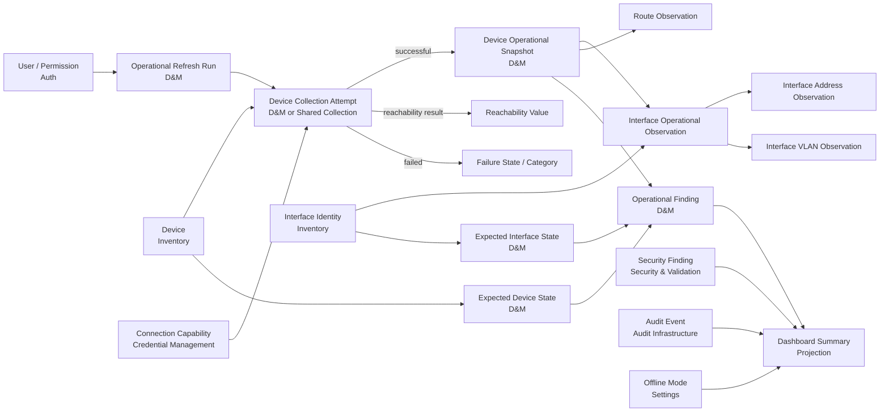

# Dashboard & Monitoring — Database Design

> **สถานะเอกสาร:** อยู่ระหว่างการออกแบบตามลำดับ Software Development
>
> **มติ Feature ล่าสุด:** [`MVP D&M.md`](MVP%20D%26M.md)
>
> **ขอบเขตโครงการรวม:** [`../MyNetMate Weight Feature List.md`](../../MyNetMate%20Weight%20Feature%20List%20(AI%20คิด).md)
> **กติกาสำคัญ:** ต้องผ่าน Scope, Ownership, Entity, Relationship และ Lifecycle ก่อนออกแบบ Logical Database Schema

---

# Step 1 — Scope, Evidence and Decision Audit

## 1. จุดประสงค์ของ Step

Step นี้มีจุดประสงค์เพื่อยืนยันว่า Dashboard & Monitoring (D&M) ต้องรองรับ Feature ใด ตรวจสอบหลักฐานและมติล่าสุด แยกเนื้อหาปัจจุบันออกจากแนวคิดเก่าที่ล้าสมัย และสร้างขอบเขตที่ชัดเจนก่อนเริ่มออกแบบข้อมูล

Step นี้ **ยังไม่ตัดสินชื่อตาราง, Column, Primary Key, Foreign Key หรือ Data Type** เพราะต้องกำหนด Database Ownership และ Dependency Contract ใน Step 3 ก่อน

## 2. ข้อมูลที่กำลังตัดสินใจ

1. Dashboard & Monitoring MVP มีเป้าหมายอะไร
2. Feature ใดอยู่ใน MVP ระดับ Feature
3. Feature ใดเป็น Backlog, Future Enhancement หรือ Won't Have
4. สถานะใดต้องแยกจากกันเพื่อไม่ให้ผู้ใช้ตีความผิด
5. ข้อมูลใดต้องมาจาก Feature อื่น
6. เอกสารเดิมส่วนใดขัดกับมติล่าสุด
7. ข้อสรุปใดพร้อมใช้เป็น Input ของ Database Ownership ใน Step 3

## 3. ลำดับความน่าเชื่อถือของหลักฐาน

หากเอกสารขัดกัน ให้ใช้ลำดับต่อไปนี้:

1. [`MVP D&M.md`](MVP%20D%26M.md) — มติ Feature และขอบเขต D&M ล่าสุด
2. [`../MyNetMate Weight Feature List.md`](../../MyNetMate%20Weight%20Feature%20List%20(AI%20คิด).md) — Single Source of Truth ของขอบเขตโครงการโดยรวม
3. [`Switch Opeational Visibility.md`](Switch%20Opeational%20Visibility.md) และ [`Router Operational Visibility.md`](Router%20Operational%20Visibility.md) — เหตุผลและหลักฐานเชิง Network Operations
4. [`MyNetMate Minimal MVP Dashboard & Monitoring Research Plan.md`](../Archive_Research/MyNetMate%20Minimal%20MVP%20Dashboard%20&%20Monitoring%20Research%20Plan.md), Schema, Component Diagram และ API Contracts เดิม — Historical Design ที่ยังใช้เป็นหลักฐานได้ แต่ต้องปรับตามมติล่าสุด
5. เอกสาร Schema ปัจจุบันของ Device Inventory — Pending confirmation from Feature Owner (Tee) — แนวคิดข้อมูลร่วมจาก Device Inventory ซึ่งยังต้องยืนยัน Ownership ใหม่

## 4. Evidence Audit

| Evidence ID | หลักฐาน | ข้อค้นพบ | ผลต่อการออกแบบ |
|---|---|---|---|
| **EV-DM-01** | Weight Feature List | Dashboard เดิมเป็น P1-INFRA มี Metrics, Activity, Quick Actions และ System API Status | Feature เดิมยังอยู่ใน MVP แต่ไม่เพียงพอต่อ Network Operations |
| **EV-DM-02** | MVP D&M — Feature Scope | มติล่าสุดกำหนด Feature MVP 14 รายการ | ใช้เป็น Feature Baseline ของการออกแบบข้อมูล |
| **EV-DM-03** | เหตุการณ์จำลอง 12 เหตุการณ์ใน MVP D&M | แสดงความจำเป็นของ Uplink, VLAN, WAN, Default Route, Stale, Collection Failure, Unknown, Err-disabled, Security, Audit และ Offline Mode | Schema ในอนาคตต้องตอบเหตุการณ์เหล่านี้ได้ครบ |
| **EV-DM-04** | Switch Operational Visibility | Device Reachable ไม่ได้แปลว่า Interface, Trunk หรือ VLAN ทำงานถูกต้อง | ต้องรองรับ Switch Actual State และ Interface Detail |
| **EV-DM-05** | Router Operational Visibility | Management IP Reachable ไม่ได้แปลว่า WAN หรือ Default Route ทำงาน | ต้องรองรับ Router Interface และ Default Route Visibility |
| **EV-DM-06** | Device Inventory Data Information | Device และ Interface เป็นข้อมูลร่วมหลาย Feature ส่วน Topology Link ต้องแยกจาก Interface | D&M ห้ามคัดลอก Device/Interface/Topology Link มาเป็นเจ้าของโดยไม่วิเคราะห์ Ownership |
| **EV-DM-07** | Research Plan, Schema, Component และ API เดิม | รองรับ Dashboard แบบ Aggregate จาก Device, Security, Audit และ Settings เท่านั้น | ถือเป็น Historical Baseline ที่ต้องขยายหรือแทนที่ |
| **EV-DM-08** | AGENTS.md และกติกาโครงการ | Cisco IOS เป็น Baseline, Read-only, Allowlist, Isolated Lab, AI ห้ามสั่งอุปกรณ์ | เป็นข้อจำกัดบังคับของ Collection และ Assessment |

## 5. ภาพรวม Dashboard เดิม

Dashboard เดิมเป็นหน้า **Aggregated Summary** หรือหน้ารวมค่าจากข้อมูลของ Feature อื่น โดยมี:

- Metrics Cards ของจำนวนอุปกรณ์และสถานะ Online/Offline/Unknown/Maintenance
- Critical Security Validation Failures
- Recent Activity Feed
- Quick Actions
- Backend, Database และ AI/Offline Mode Status
- `last_checked_at` และ Stale indicator
- Device Status by Site เป็น Should Have

จุดแข็งของแนวคิดเดิมคือทำง่าย ไม่สร้างตาราง `dashboard` และใช้ข้อมูลจาก Source of Truth ต้นทาง แต่ยังตอบไม่ได้ว่า Interface, Uplink, VLAN, WAN หรือ Routing จุดใดควรได้รับการตรวจสอบ

## 6. สิ่งที่ Operational Visibility เพิ่มเข้ามา

### 6.1 ความสามารถร่วม

- Current Operational Snapshot ที่ผู้ใช้สั่ง Refresh
- Manual Refresh แบบเลือกอุปกรณ์
- แยก Reachability, Collection Status, Operational State และ Data Freshness
- Collection Failed, Never Collected, Stale และ Last Known State
- Operational Problem Summary ที่คำนวณด้วยกฎแน่นอน
- Expected State and Criticality ที่ผู้ใช้กำหนด
- Drill-down จาก Summary ไปยัง Device/Interface/Route Detail
- บันทึก Refresh และ Action สำคัญลง Audit Trail

### 6.2 Switch Operational Visibility

- Interface Admin Status แยกจาก Operational Status
- Access/Trunk Mode
- Access VLAN, Native VLAN และ Allowed VLANs
- Interface Description, Interface Role และ Critical Flag
- Critical Uplink/Trunk Down
- Err-disabled Port
- Switch Operational Data ที่ Stale

Access Port Down ทั่วไปห้ามถูกสรุปเป็น Critical โดยอัตโนมัติ เพราะอุปกรณ์ปลายทางอาจปิดอยู่ตามปกติ

### 6.3 Router Operational Visibility

- Interface Admin/Protocol Status
- IP Address และ Prefix
- Interface Role เช่น WAN, LAN, Management และ Loopback
- Active Default Route
- Next Hop และ Outgoing Interface
- Critical WAN Down
- Missing Expected Default Route
- Routing Data ที่ Stale

Router ที่ Management IP ยัง Reachable อาจมี WAN Down หรือไม่มี Default Route ได้ ดังนั้น Reachability อย่างเดียวไม่สามารถแทน Operational State

## 7. User Decisions

มติต่อไปนี้ถือเป็นข้อยุติปัจจุบันของ D&M:

1. D&M MVP เป็น **Current Operational Snapshot** ไม่ใช่ Enterprise Monitoring System
2. Feature MVP ทั้ง 14 รายการใน Step 2 อยู่ในขอบเขตระดับ Feature ก่อน โดยยังไม่ลดความลึกใน Step นี้
3. ผู้ใช้เป็นผู้เริ่ม Manual Operational Refresh
4. Refresh เชื่อมต่อเฉพาะอุปกรณ์ที่ลงทะเบียนใน Device Inventory และอยู่ใน Allowlist
5. ใช้เฉพาะคำสั่ง Read-only และทดสอบใน Isolated Lab
6. Reachability, Collection Status, Operational State และ Data Freshness ต้องแยกจากกัน
7. Collection รอบใหม่ที่ล้มเหลวต้องไม่เขียนทับ Last Known State ที่สำเร็จ
8. ต้องแสดง `last_collected_at`, Latest Collection Attempt, Collection Failed, Stale และ Last Known State อย่างชัดเจน
9. Switch และ Router Operational Visibility อยู่ใน Final MVP
10. ระบบสรุป Expected-State Deviation ได้ต่อเมื่อผู้ใช้กำหนด Expected State ไว้ก่อน
11. Access Port Down ทั่วไปไม่เป็น Critical โดยอัตโนมัติ
12. Operational Problem Summary ใช้กฎที่ตรวจสอบย้อนหลังได้ ไม่ใช้ AI
13. AI ไม่มีสิทธิ์ Refresh, Assessment, แก้ปัญหา หรือสั่งอุปกรณ์
14. Cisco IOS เป็น Baseline ส่วน Huawei Router และ MikroTik Switch เป็น Candidate จนกว่าจะยืนยันรุ่น ระบบปฏิบัติการ คำสั่ง และผลทดสอบจริง
15. D&M ไม่สร้างตารางชื่อ `dashboard` เพื่อเก็บค่าที่ Aggregate จากข้อมูลต้นทางได้
16. D&M ต้องไม่คัดลอกตารางของ Feature อื่นมาเป็นเจ้าของเอง

## 8. Step 2 - Feature-Level MVP ที่ยืนยันแล้ว

| ID       | Feature                               | เหตุผลที่อยู่ใน MVP                                                     |
| -------- | ------------------------------------- | ----------------------------------------------------------------------- |
| **F-01** | Current Operational Snapshot          | เป็นข้อมูลหลักที่ Feature อื่นบน Dashboard ใช้อ้างอิง                   |
| **F-02** | Network Overview                      | ให้ผู้ใช้เห็นภาพรวมจากหน้าเดียว                                         |
| **F-03** | Manual Operational Refresh            | เป็นวิธีสร้าง Snapshot ใหม่โดยไม่ทำ Continuous Monitoring               |
| **F-04** | Operational State Separation          | ป้องกันการตีความ Reachability, Collection และ Operational State ปะปนกัน |
| **F-05** | Operational Problem Summary           | ช่วยจัดลำดับสิ่งที่ควรตรวจด้วยกฎแน่นอน                                  |
| **F-06** | Switch Operational Visibility         | แสดงปัญหาระดับ Interface, Uplink, Trunk และ VLAN                        |
| **F-07** | Router Operational Visibility         | แสดงปัญหา WAN, Layer 3 Interface และ Default Route                      |
| **F-08** | Expected State and Criticality        | ป้องกัน False Positive และทำให้ Assessment มีหลักฐาน                    |
| **F-09** | Data Freshness and Last Known State   | ป้องกันการแสดงข้อมูลเก่าเหมือนเป็นข้อมูลปัจจุบัน                        |
| **F-10** | Operational Drill-down                | ทำให้ Summary เชื่อมไปถึงหลักฐานและรายละเอียดได้                        |
| **F-11** | Security Summary                      | แสดง Critical Security Finding โดยแยกจาก Operational Problem            |
| **F-12** | Recent Activity and Audit Integration | แสดงลำดับเหตุการณ์และบันทึกการ Refresh                                  |
| **F-13** | System Health and Offline Mode Status | แยกความพร้อมของ MyNetMate ออกจากสถานะ Network                           |
| **F-14** | Quick Actions                         | เชื่อมผู้ใช้ไปยัง Workflow ที่เกี่ยวข้องตามสิทธิ์                       |

การยืนยัน Feature ทั้ง 14 รายการใน Step นี้หมายถึง **Feature ต้องอยู่ใน MVP** แต่ยังไม่ใช่ข้อสรุปว่าทุก Sub-feature หรือทุก Field ต้องทำเต็มความลึก การลดความลึกจะพิจารณาแยกภายหลังโดยต้องไม่ทำลาย Core Value ของ Feature

## 9. Derived Design Decisions

ข้อสรุปต่อไปนี้อนุมานจาก User Decisions และ Evidence แต่ยังไม่ใช่ Logical Schema:

1. Dashboard ต้องแยกอย่างน้อย 4 มิติ ได้แก่ Reachability, Collection, Operational State และ Freshness
2. Collection Attempt ล่าสุดและ Last Successful Collection เป็นคนละข้อเท็จจริง
3. Collection Failed ไม่ได้แปลว่า Device Unreachable และห้ามสร้าง Operational State ใหม่จากความล้มเหลวของ Collector
4. Actual State และ Expected State เป็นข้อมูลคนละประเภทและมีผู้สร้างต่างกัน
5. Operational Problem เป็นผลจากกฎที่ใช้ Actual State ร่วมกับ Expected State ไม่ใช่ผลจาก AI
6. Operational Problem, Security Finding และ System Health เป็นปัญหาคนละ Domain และต้องไม่รวมเป็นสถานะเดียว
7. Dashboard Summary เป็นค่าที่ Aggregate ได้ จึงไม่ควรมีตาราง `dashboard`
8. Device Identity, Credential, Security Finding, Audit Log, Settings และ Topology Link มี Feature เจ้าของอยู่แล้ว D&M ต้องใช้ Dependency Contract
9. D&M ต้องอ้าง Device และ Interface Identifier เดียวกับ Inventory/NTV เพื่อให้ Drill-down และการเชื่อมข้อมูลไม่คลาดเคลื่อน
10. Read-only Operational Collection เป็นคนละ Workflow กับ Configuration Deployment และไม่มีสิทธิ์เปลี่ยน Configuration
11. ขอบเขตการเก็บ Snapshot ปัจจุบันกับประวัติยังต้องตัดสินใน Lifecycle และ Schema Step
12. Ownership ของ Interface, Operational Snapshot และ Expected State ยังต้องตัดสินใน Step 3 ห้ามสรุปล่วงหน้าว่า D&M เป็นเจ้าของทั้งหมด

## 10. Project Constraints

- ทีมมี 4 คนและเวลาพัฒนาใช้งานจริงจำกัด
- Frontend, Backend และ Network Collection ต้องทำงานร่วมกัน
- Cisco IOS แต่ละรุ่นอาจให้ CLI Output ต่างกัน
- GNS3/Packet Tracer และอุปกรณ์จริงอาจมีพฤติกรรมต่างกัน
- ห้าม Ping Sweep หรือ Port Scan บนเครือข่ายมหาวิทยาลัย
- Operational Collection ต้องจำกัดเป้าหมายด้วย Inventory และ Allowlist
- Credential ต้องจัดเก็บอย่างปลอดภัยและห้ามแสดง Secret บน Dashboard
- Gemini Free Tier และ Offline Mode ต้องไม่เป็น Dependency ของ Operational Snapshot
- Full Multi-vendor Parser เกินขอบเขตจนกว่าจะทดสอบ Candidate Vendor จริง
- Schema ของ D&M ต้องไม่ผูกกับ Continuous Polling หรือ Time-series โดยไม่จำเป็น

## 11. สิ่งที่อยู่ใน Scope

### 11.1 MVP

- Feature F-01 ถึง F-14
- Current Snapshot และเวลาที่เก็บข้อมูล
- Manual Read-only Refresh
- Reachable, Unreachable และ Unknown
- Collection Success, Failed และ Never Collected
- Fresh, Stale และ Last Known State
- Switch Interface/VLAN Actual State ตาม MVP D&M
- Router Interface และ Default Route Actual State
- Expected State and Criticality
- Operational Problem Summary แบบ Rule-based
- Drill-down ไปยังข้อมูลที่เกี่ยวข้อง
- Security, Audit, System Health และ Quick Action Integration
- Cisco IOS Baseline ใน Isolated Lab

### 11.2 Backlog หลัง MVP

- Switch Port/VLAN Aggregate Summary
- Full Static Route Snapshot
- Uptime
- CPU/Memory ค่าปัจจุบัน
- Advanced Search and Filter
- Manual Next-hop Reachability Check
- Extended Expected VLAN Validation
- Last State Change
- Maintenance/Suppression
- Export Operational Report

Backlog กลุ่มนี้ยังไม่ถูกตัดถาวร แต่ไม่ควรเป็นตัวขวางการทำ Feature MVP ให้ครบ

## 12. สิ่งที่ไม่อยู่ใน Scope

### 12.1 Future Enhancement

- Periodic หรือ Continuous Monitoring
- Historical Availability, Bandwidth และ CPU/Memory Graph
- Time-series Monitoring
- Full SNMP Monitoring
- Email, LINE และ Alert Notification
- OSPF, EIGRP และ BGP Neighbor Monitoring
- Route Flap History
- NAT, VPN, QoS และ NetFlow Monitoring
- Streaming Telemetry
- Huawei/MikroTik Operational Parser ก่อนยืนยันผลทดสอบจริง

### 12.2 Won't Have

- Automatic Root-cause Analysis
- AI Refresh, AI Assessment หรือ AI แก้ปัญหาอุปกรณ์
- Automatic Configuration Change หรือ Restart Interface จาก Dashboard
- Network Scan นอก Isolated Lab หรือ Allowlist
- Complex Multi-vendor Policy
- การอ้างว่าเป็น Real-time โดยไม่มี Continuous Collection
- Full Enterprise Network Monitoring System
- การสรุปว่า VLAN, WAN หรือ Default Route “ผิด” โดยไม่มี Expected State

## 13. ข้อขัดแย้งที่ตรวจพบและมติแก้ไข

| ประเด็น | ข้อความเดิม | มติปัจจุบัน | สถานะเอกสารเดิม |
|---|---|---|---|
| ขอบเขต Dashboard | มีเพียง Metrics, Activity, Quick Actions และ System API Status | คง Feature เดิมและเพิ่ม Operational Visibility | **Superseded บางส่วน** |
| วิธี Refresh | Periodic ICMP/Polling เช่น 60 วินาที | ผู้ใช้สั่ง Manual Refresh | **Superseded สำหรับ MVP** |
| สถานะอุปกรณ์ | ใช้ `devices.status` หรือ Online/Offline เป็นหลัก | แยก Reachability, Collection, Operational และ Freshness | **ไม่เพียงพอสำหรับมติใหม่** |
| Interface Priority | Device Inventory เดิมระบุ Interface เป็น P2/Schema only | Interface Actual State จำเป็นต่อ D&M MVP | **ต้องทบทวน Ownership และ Priority** |
| Collection Failure | Schema เดิมไม่มี Collection Attempt และ Last Known State | ต้องแยก Attempt ล่าสุดออกจาก Snapshot ที่สำเร็จ | **ยังไม่รองรับ** |
| Expected State | Schema เดิมไม่มี Expected State | จำเป็นต่อ Critical Uplink/WAN และ Missing Default Route | **ยังไม่รองรับ** |
| Router Scope | Router Research เดิมให้ Full Static Route เป็น Must | Active Default Route อยู่ใน MVP; Full Static Route เป็น Backlog | **Scope Correction** |
| VLAN Assessment | เอกสาร Switch บางส่วนสรุป VLAN mismatch ได้ทันที | สรุปได้เฉพาะเมื่อมี Expected VLAN | **Scope Correction** |
| Component เดิม | มี Aggregation, Repositories และ Health Checker | ต้องประเมิน Collector, Parser, Refresh และ Assessment ใน Step Component | **Historical Baseline** |
| API เดิม | รองรับ Summary, Activity และ System Health | ยังขาด Refresh, Operational Detail, Collection/Freshness และ Drill-down Contract | **Historical Baseline** |
| Multi-vendor | บางเอกสารเดิมกล่าวถึง Basic Multi-vendor | D&M รับรอง Cisco IOS Baseline เท่านั้นจนกว่าจะทดสอบ Candidate | **Scope Correction** |

## 14. การตรวจความขัดแย้งกับ Feature อื่น

### 14.1 Device Inventory

- Device Inventory เป็นเจ้าของ Device Identity, Management Address, Enrollment และ Credential Reference
- D&M ขอใช้ข้อมูลเหล่านี้เพื่อ Refresh และแสดง Device Detail
- Interface Ownership ยังต้องตกลงใน Step 3 เพราะ Interface Identity เป็นข้อมูลร่วมของ Inventory, D&M และ NTV

### 14.2 Network Topology Visualization (NTV)

- NTV เป็นเจ้าของ Neighbor Observation, Current Topology Link และ Layout
- D&M ห้ามเพิ่ม `connected_to_*` หรือเก็บสำเนา Topology Link ใน Interface
- D&M และ NTV ควรอ้าง Device/Interface Identifier ชุดเดียวกัน
- Topology Preview ไม่อยู่ใน D&M MVP

### 14.3 Security & Validation

- Security & Validation เป็นเจ้าของ Scan Result, Severity, Evidence และ Override
- D&M อ่านเฉพาะ Security Summary และเชื่อมไปยังรายละเอียด
- Security Finding ต้องไม่ถูกรวมเป็น Operational Problem

### 14.4 Audit Trail

- Audit Trail เป็นเจ้าของ User, Action, Resource และ Timestamp
- D&M ส่งเหตุการณ์ Refresh และ Action สำคัญให้ Audit Trail บันทึก
- D&M อ่าน Recent Activity กลับมาแสดง แต่ไม่เป็นเจ้าของสำเนา Audit Log

### 14.5 Settings และ System Health

- Settings เป็นเจ้าของ Offline Mode
- D&M อ่าน Offline Mode เพื่อแสดง System Health
- Offline Mode ไม่ใช่ Network Error และไม่ขัดขวาง Rule-based Operational Snapshot

### 14.6 Configuration Deployment

- D&M ใช้ Read-only Collection เท่านั้น
- Deployment เป็นเจ้าของ Workflow ที่ส่งคำสั่งเปลี่ยน Configuration
- การมี SSH Connection ร่วมกันไม่ได้หมายความว่า D&M มีสิทธิ์ Deploy

## 15. Open Questions สำหรับ Step 3

1. Feature ใดเป็นเจ้าของ Interface Identity: Device Inventory หรือ Shared Network Inventory Domain
2. D&M เป็นเจ้าของ Operational Collection Run และ Operational Snapshot หรือควรมี Collection Domain กลาง
3. Expected State เป็นของ Device Inventory, D&M หรือ Operational Intent Domain
4. Operational Problem ควรคำนวณเมื่ออ่านข้อมูลหรือบันทึกเป็นผล Assessment ที่ตรวจสอบย้อนหลังได้
5. Viewer, Operator และ Admin มีสิทธิ์ Manual Refresh ต่างกันอย่างไร
6. MVP Refresh ได้ครั้งละหนึ่งอุปกรณ์ หลายอุปกรณ์ หรือทั้ง Site
7. Freshness Threshold ใช้ค่าเดียวหรือแยกตาม Device, Interface และ Routing Data
8. ถ้า ICMP ถูกปิดแต่ SSH Collection สำเร็จ Reachability ควรถูกแสดงอย่างไร
9. Snapshot MVP เก็บเฉพาะ Current + Last Known State หรือเก็บแต่ละ Successful Collection
10. Err-disabled เป็นค่า Operational Status หรือ Failure Reason แยกต่างหาก
11. Default Route หนึ่ง Device อาจมีหลาย Candidate Route หรือ Equal-Cost Route หรือไม่ในขอบเขต MVP
12. Cisco IOS รุ่นและชุดคำสั่งใดจะเป็น Parser Contract ที่รับรองจริง

## 16. ผลลัพธ์ที่ใช้เป็น Input ของ Step ถัดไป

Step 1 ยืนยัน Baseline ดังนี้:

> MyNetMate Dashboard & Monitoring MVP เป็น Current Operational Snapshot ที่ผู้ใช้สั่ง Refresh สำหรับอุปกรณ์ที่ลงทะเบียนและอยู่ใน Allowlist โดยใช้คำสั่ง Read-only แสดง Reachability, Collection Status, Switch/Router Operational State, Data Freshness และ Last Known State แยกจากกัน พร้อมใช้ Expected State และกฎตายตัวในการระบุปัญหาสำคัญ โดยไม่ทำ Continuous Monitoring, Root-cause Analysis หรือให้ AI สั่งงานอุปกรณ์

Feature F-01 ถึง F-14 ได้รับการยืนยันในระดับ Feature แล้ว ขั้นถัดไปคือ **Step 3 — Database Ownership and Dependency Contract** เพื่อระบุว่าใครเป็นเจ้าของข้อมูล ใครสร้างหรืออัปเดต D&M อ่านอย่างไร ใช้ FK/API/Event Contract แบบใด และจะใช้ Test Fixture อย่างไรเมื่อ Feature ต้นทางยังไม่เสร็จ

---

# Step 3 — Database Ownership and Dependency Contract

> **Working Decision:** ในช่วงที่ Schema ของสมาชิกทีมยังไม่ครบ ให้ D&M ออกแบบเฉพาะข้อมูลที่เกิดจาก Workflow ของ D&M เอง ส่วนข้อมูลที่ควรมี Feature อื่นเป็นเจ้าของให้ระบุเป็น Dependency Contract และ `Pending Dependency` แทนการสร้างตารางซ้ำ
>
> **คำศัพท์อ้างอิง:** [`00_Glossary.md`](../00_Glossary.md)

## จุดประสงค์ของ Step 3

Step นี้กำหนดขอบเขตความเป็นเจ้าของข้อมูลก่อนค้นหา Conceptual Entity โดยตอบให้ได้ว่า:

1. ข้อมูลใด D&M เป็น Source of Truth
2. ข้อมูลใด D&M เป็นเพียงผู้ใช้งาน
3. ใครเป็นผู้สร้างหรืออัปเดตข้อมูลแต่ละชุด
4. D&M อ่านหรือส่งข้อมูลผ่าน FK, Query/API หรือ Event Contract แบบใด
5. ถ้า Feature ต้นทางยังไม่เสร็จ จะใช้ Test Fixture หรือ Mock Data อย่างไร
6. ข้อมูลใดเป็นเพียงค่าคำนวณหรือ Runtime Data และไม่ควรสร้างตาราง

Step นี้ยังไม่ออกแบบชื่อตาราง, Column, Primary Key, Foreign Key หรือ Data Type ของ D&M

## ข้อมูลและหลักฐานที่ใช้ตัดสินใจ

- Feature F-01 ถึง F-14 จาก `MVP D&M.md`
- เหตุการณ์จำลอง 12 เหตุการณ์และ Feature Coverage Matrix
- กฎใน `00_Glossary.md` ที่แยก Reachability, Collection, Operational State และ Freshness
- แนวทาง Ownership ของ NTV ที่แยก Shared Inventory Data, Collection Evidence และ Feature-owned Interpretation
- เอกสาร Schema ปัจจุบันของ Device Inventory — Pending confirmation from Feature Owner (Tee) ซึ่งระบุว่า Device และ Interface เป็นข้อมูลร่วม
- หลัก Modular Monolith: ใช้ PostgreSQL ร่วมกันได้ แต่แต่ละตารางยังต้องมี Owner และ Migration Dependency ชัดเจน

## User Decisions ที่ใช้ใน Step นี้

1. ให้ D&M เริ่มออกแบบข้อมูลที่ตนเองเป็นเจ้าของก่อน
2. ถ้าข้อมูลมี Feature อื่นเป็นเจ้าของ ให้ระบุว่าขอข้อมูลอะไรแทนการสร้างตารางซ้ำ
3. ถ้า Schema ของเพื่อนยังไม่เสร็จ ให้ระบุ `Pending Dependency`
4. Dashboard ควรดึงและ Aggregate ข้อมูลจาก Feature อื่นเป็นส่วนใหญ่
5. D&M ยังต้องเป็นเจ้าของข้อมูลที่เกิดจาก Manual Operational Refresh, Operational Snapshot, Expected State และ Operational Assessment ของตนเอง
6. ข้อตกลงใน Step นี้เป็น Working Decision และแก้ได้เมื่อเจ้าของ Feature ต้นทางยืนยัน Contract ฉบับจริง

## 3.1 หลักการแบ่งเจ้าของข้อมูล

### หลักที่ 1 — ผู้เป็นเจ้าของต้องรับผิดชอบความหมายและ Lifecycle

Feature ที่เป็นเจ้าของข้อมูลต้องรับผิดชอบ:

- ความหมายของข้อมูล
- กฎการสร้างและแก้ไข
- Validation และ Constraint
- Lifecycle และ Soft-delete Behavior
- Migration ของ Schema
- Contract ที่ Feature อื่นใช้เข้าถึง

การที่ D&M แสดงข้อมูล ไม่ได้ทำให้ D&M กลายเป็นเจ้าของข้อมูลนั้น

### หลักที่ 2 — แยก Owner, Producer และ Consumer

สามบทบาทนี้อาจเป็นคนละ Component:

| บทบาท | ความหมาย |
|---|---|
| **Data Owner** | Feature ที่รับผิดชอบความหมายและ Lifecycle |
| **Data Producer** | Component ที่สร้างหรืออัปเดตข้อมูล |
| **Data Consumer** | Feature ที่อ่านข้อมูลเพื่อใช้งานหรือแสดงผล |

ตัวอย่าง: D&M เป็นเจ้าของ Operational Snapshot แต่ Read-only Collector เป็น Producer และ Dashboard Aggregation Service เป็น Consumer

### หลักที่ 3 — Dashboard เป็นทั้ง Consumer และ Owner บางส่วน

Dashboard มีสองบทบาท:

1. **Consumer/Aggregator:** อ่าน Device, Security, Audit, User และ Settings จาก Feature เจ้าของ
2. **Operational Data Owner:** รับผิดชอบข้อมูลที่เกิดจาก Manual Operational Refresh และกฎของ D&M

ดังนั้นคำว่า “Dashboard ดึงข้อมูลจาก Feature อื่น” ถูกต้อง แต่ไม่ครอบคลุม Operational Workflow ทั้งหมด

### หลักที่ 4 — Summary ที่คำนวณใหม่ได้ไม่ต้องมีตาราง

ค่าจำนวน เช่น Unreachable Device, Collection Failed หรือ Critical WAN Down ต้อง Aggregate จาก Source of Truth ไม่สร้างตาราง `dashboard`, `dashboard_metrics` หรือ Counter แยกโดยไม่มีเหตุผลด้าน Performance ที่วัดแล้ว

### หลักที่ 5 — ห้ามแก้ Schema ของเพื่อนเอง

- D&M ระบุ Field และความหมายที่ต้องการใน Contract
- Feature เจ้าของตัดสินชื่อ Field, Constraint และ Migration สุดท้าย
- ถ้าข้อมูลยังไม่มี ให้สร้าง Test Fixture ในขอบเขต Test ไม่เพิ่ม Column ลงตารางของเพื่อนเอง
- Cross-feature FK ใช้ได้เมื่อ ID มีเสถียรภาพและ Migration Dependency ได้รับการยืนยัน

### หลักที่ 6 — แยก Identity ออกจาก Time-bound State

- Device/Interface Identity เป็นข้อมูลระบุตัวตนที่เปลี่ยนไม่บ่อย
- Operational Snapshot เป็นข้อมูลตามเวลาและเปลี่ยนทุก Collection

Working Decision:

> Device Inventory เป็นเจ้าของ Device และ Interface Identity ส่วน D&M เป็นเจ้าของ Operational State ที่สังเกตได้ในแต่ละ Successful Collection

### หลักที่ 7 — Contract ต้องรองรับกรณี Dependency ยังไม่พร้อม

ทุก Contract ต้องระบุ:

- Key ที่ใช้อ้างอิง
- ข้อมูลขั้นต่ำที่ต้องการ
- Freshness ที่คาดหวัง
- Nullable/Unknown Behavior
- Soft-delete Behavior
- Permission
- Error Behavior
- Test Fixture หรือ Mock Data

## 3.2 ข้อมูลที่ D&M เป็นเจ้าของ

รายการต่อไปนี้เป็น **Conceptual Data Set** ไม่ใช่ชื่อตารางสุดท้าย

### DM-OWN-01 — Manual Operational Refresh

| หัวข้อ | ข้อกำหนด |
|---|---|
| ความหมาย | คำขอจากผู้ใช้ให้เก็บ Operational Status ใหม่จากอุปกรณ์ที่เลือก |
| Owner | D&M |
| Producer | Refresh Orchestrator หลังตรวจ RBAC, Inventory และ Allowlist |
| Consumer | Collector, Dashboard UI และ Audit Integration |
| ข้อมูลหลักระดับแนวคิด | ผู้เริ่ม, เป้าหมาย, เวลาขอ, สถานะการดำเนินงาน และเหตุผลล้มเหลว |
| ข้อจำกัด | Read-only, Human initiated และ Isolated Lab/Allowlist เท่านั้น |

### DM-OWN-02 — Operational Collection Attempt/Result

| หัวข้อ | ข้อกำหนด |
|---|---|
| ความหมาย | ผลการพยายามเชื่อมต่อ อ่านคำสั่ง และ Parse ข้อมูลของ Device หนึ่งตัวในหนึ่งรอบ |
| Owner ชั่วคราว | D&M จนกว่าจะมี Shared Collection Contract ที่ทีมยืนยัน |
| Producer | Read-only Collector และ Parser |
| Consumer | D&M Lifecycle, Freshness, Error UI และ Audit |
| สถานะหลัก | Never Collected, Requested, Running, Succeeded, Failed และ Partial ตามข้อสรุปใน Lifecycle Step |
| Failure Category | Connection, Authentication, Timeout, Permission, Unsupported Command และ Parser Failure |
| กฎสำคัญ | Collection Failed ไม่เปลี่ยน Last Successful Snapshot ให้กลายเป็น Down |

หาก Network Discovery สร้าง Generic Collection Infrastructure ที่รองรับ Operational Commands ได้จริง Ownership ชุดนี้ต้องประเมินใหม่และอาจเปลี่ยนเป็น External Dependency

### DM-OWN-03 — Reachability Observation

| หัวข้อ | ข้อกำหนด |
|---|---|
| ความหมาย | ผลการสังเกต Management Reachability ณ เวลาหนึ่ง |
| Owner | D&M สำหรับผลที่เกิดใน Operational Refresh |
| Producer | Reachability Checker หรือ Collector |
| Consumer | Network Overview และ Operational State Separation |
| กฎสำคัญ | Reachable, Unreachable และ Unknown แยกจาก Collection Status |

Device Inventory อาจแสดง Reachability ล่าสุดผ่าน Contract ได้ แต่ไม่ควรมี Owner สองรายแก้ค่าเดียวกันโดยไม่มี Projection Contract

### DM-OWN-04 — Switch Operational Snapshot

| หัวข้อ | ข้อกำหนด |
|---|---|
| ความหมาย | Actual State ของ Switch และ Interface ที่มาจาก Successful Collection หนึ่งครั้ง |
| Owner | D&M |
| Producer | Cisco IOS Read-only Collector และ Switch Parser |
| Consumer | Switch Detail, Operational Problem Summary และ Drill-down |
| ข้อมูลหลักระดับแนวคิด | Admin/Operational Status, Err-disabled, Access/Trunk Mode, Access VLAN, Native VLAN, Allowed VLANs, Description และ Collected Time |
| Reference | อ้าง Device ID และ Interface ID จาก Device Inventory |

### DM-OWN-05 — Router Operational Snapshot

| หัวข้อ | ข้อกำหนด |
|---|---|
| ความหมาย | Actual State ของ Router Interface และ Routing ที่มาจาก Successful Collection หนึ่งครั้ง |
| Owner | D&M |
| Producer | Cisco IOS Read-only Collector และ Router Parser |
| Consumer | Router Detail, Operational Problem Summary และ Drill-down |
| ข้อมูลหลักระดับแนวคิด | Admin/Protocol Status, IP/Prefix, Active Default Route, Next Hop, Outgoing Interface และ Collected Time |
| Reference | อ้าง Device ID และ Interface ID จาก Device Inventory |

### DM-OWN-06 — Expected State and Criticality

| หัวข้อ | ข้อกำหนด |
|---|---|
| ความหมาย | Operational Intent ที่ผู้ใช้กำหนดก่อน Assessment |
| Owner | D&M ตาม Working Decision |
| Producer | ผู้ใช้ที่มีสิทธิ์ผ่าน D&M UI/API |
| Consumer | Assessment Rule Engine และ Detail UI |
| ข้อมูลขั้นต่ำ | Interface Role, Critical Flag, Expected Admin State และ Edge Router Expectation/Requires Default Route |
| ข้อมูล Backlog | Expected Access VLAN, Native VLAN และ Allowed VLANs |
| กฎสำคัญ | ไม่มี Expected State ให้แสดง Actual State เท่านั้น ห้ามสรุป Deviation |

Device Role เช่น Core, Access หรือ Distribution ยังคงเป็นข้อมูลจาก Inventory ส่วน Role ที่ใช้ประเมิน Interface และ Default Route เป็น Operational Intent ของ D&M

### DM-OWN-07 — Operational Assessment/Finding

| หัวข้อ | ข้อกำหนด |
|---|---|
| ความหมาย | ผลการใช้กฎตายตัวกับ Actual State, Expected State และ Freshness |
| Owner | D&M |
| Producer | Assessment Rule Engine |
| Consumer | Problem Summary, Drill-down และ Audit/Acceptance Test |
| ตัวอย่าง | Critical Uplink Down, Err-disabled, Critical WAN Down, Missing Expected Default Route และ Stale Data |
| กฎสำคัญ | ไม่ใช่ Root Cause และไม่ใช้ AI |

การเก็บ Operational Finding เป็น Record หรือคำนวณขณะ Query ยังเป็น Open Question สำหรับ Step Lifecycle/Logical Schema แต่ความหมายและกฎเป็นของ D&M

### DM-OWN-08 — Freshness Policy

| หัวข้อ | ข้อกำหนด |
|---|---|
| ความหมาย | กฎที่กำหนดว่า Snapshot เก่าเกินไปเมื่อใด |
| Owner | D&M ในเชิง Domain Policy |
| Producer | ค่าเริ่มต้นจากระบบหรือ Admin ตาม Scope ที่ยืนยันภายหลัง |
| Consumer | Dashboard Aggregation และ Assessment Rule Engine |
| กฎสำคัญ | Fresh/Stale ควรคำนวณจาก Last Successful Collection กับเวลาปัจจุบัน ไม่เขียนทับ Snapshot |

ตำแหน่งจัดเก็บ Policy ยังต้องตกลงกับ Settings Feature หากทีมต้องการรวม Setting ทั้งระบบไว้ที่เดียว

## 3.3 ข้อมูลที่ D&M ขอจาก Feature อื่น

### ขอจาก Device Inventory

เอกสารปัจจุบันเสนอ `devices` และ `interfaces` เป็นข้อมูลร่วม แต่ชื่อ Field และ Constraint สุดท้ายต้องรอเจ้าของ Feature ยืนยัน

| ข้อมูลที่ขอ | ใช้ทำอะไร | สิทธิ์ของ D&M |
|---|---|---|
| Stable Device ID | FK/Reference ของ Refresh, Snapshot และ Finding | Read-only Reference |
| Hostname, Device Type, Vendor, Model, OS Version | แสดง Device และเลือก Parser ที่รับรอง | Read-only |
| Management Address, Protocol และ Port | ระบุเป้าหมาย Read-only Collection | อ่านผ่าน Service/Repository ที่ควบคุมสิทธิ์ |
| Site, Group และ Device Role | Filter, Grouping และบริบทการแสดงผล | Read-only |
| Active/Soft-delete State | ป้องกัน Refresh อุปกรณ์ที่ถูกนำออกจากการบริหาร | Read-only |
| Stable Interface ID, Device ID, Name และ IfIndex | ผูก Operational Snapshot กับ Interface Identity | Read-only Reference |
| Interface Description | แสดงบริบทบน Detail | Read-only หรือใช้ค่าที่สังเกตได้ตาม Contract |

D&M ไม่ขอใช้ `devices.status` เป็นสถานะรวม เพราะ Scope ใหม่ต้องแยก Reachability, Collection, Operational State และ Freshness

### ขอจาก Credential Management/Device Inventory

| ข้อมูลที่ขอ | ใช้ทำอะไร | ข้อจำกัด |
|---|---|---|
| Credential Reference/Profile ID | เลือกบัญชีสำหรับ Read-only Collection | ไม่เก็บ Password ซ้ำ |
| Secure Connection Capability | เปิด Connection ผ่าน Component ที่ได้รับสิทธิ์ | Dashboard UI ห้ามเห็น Secret |
| Credential Availability/Error | แสดง Collection Failure อย่างปลอดภัย | ห้ามส่ง Secret ใน Error Message |

### ขอจาก Auth/RBAC

| ข้อมูลที่ขอ | ใช้ทำอะไร |
|---|---|
| Current User ID | ผู้เริ่ม Refresh หรือแก้ Expected State |
| Active State | ป้องกันบัญชีที่ถูกปิดทำ Action |
| Role/Permission | ตรวจสิทธิ์ View, Refresh และแก้ Expected State |

D&M ไม่เก็บ Username, Password Hash หรือ Session ซ้ำ

### ขอจาก Security & Validation

| ข้อมูลที่ขอ | ใช้ทำอะไร |
|---|---|
| Finding/Scan Result ID | Drill-down ไปยัง Security Detail |
| Device ID | จับคู่ Finding กับ Device |
| Severity และ Pass/Fail | Aggregate Security Summary |
| Active Override State | ไม่นับ Finding ที่ถูกยอมรับตามกฎของ Security Feature |
| Scanned At | แสดงความใหม่ของ Security Data |

Security & Validation ยังคงเป็นเจ้าของกฎ CIS, Evidence, Remediation และ Override Lifecycle

### ขอจาก Audit Infrastructure

D&M ต้องส่ง Event อย่างน้อย:

- Operational Refresh Requested
- Operational Refresh Started
- Operational Refresh Succeeded
- Operational Refresh Failed
- Expected State Created/Updated
- Criticality Updated

D&M ขออ่าน Recent Activity ที่ผ่าน RBAC แล้ว โดยไม่สร้าง Audit Log แยก

### ขอจาก Settings

| ข้อมูลที่ขอ | ใช้ทำอะไร |
|---|---|
| Offline Mode | แสดงว่า AI ถูกปิดโดยตั้งใจ |
| D&M Policy Reference หากตกลงร่วมกัน | เก็บ Freshness Threshold หรือค่ากำหนดส่วนกลาง |

Offline Mode ไม่เป็น Dependency ของ Rule-based Operational Collection

### ขอจาก Network Discovery/Shared Collection — Pending

NTV Schema สมมติว่า Discovery/Collection เป็นเจ้าของ Collection Run และ Neighbor Observation แต่ยังไม่มี Contract ที่ยืนยันว่า Infrastructure ดังกล่าวรองรับคำสั่ง Operational ของ D&M

D&M ต้องสอบถามว่า Feature นี้จะให้บริการ:

- Generic Collection Run
- Per-device Collection Result
- Read-only Command Execution
- Parser Result/Failure
- Started/Finished Time
- Test Environment

หากรองรับครบ D&M อาจใช้ Shared Collection Contract หากไม่รองรับ D&M จะเป็นเจ้าของ Operational Collection Attempt ตาม DM-OWN-02

### ขอจาก NTV — ไม่เป็น Dependency ของ MVP

NTV เสนอข้อมูล Active Link, Stale Link, Conflict และ Last Reconciliation Time ให้ Dashboard ได้ แต่ Feature เหล่านี้ไม่อยู่ใน D&M MVP ปัจจุบัน

Working Decision:

- ไม่สร้าง FK หรือ Query Dependency จาก D&M MVP ไปยังตาราง `topology_*`
- เก็บ Contract นี้เป็น Future Dependency
- Recent NTV Activity ควรอ่านจาก Audit Infrastructure ไม่อ่านตาราง NTV โดยตรง

## 3.4 ข้อมูลที่คำนวณโดยไม่ต้องเก็บ

Dashboard Aggregation Service ควรคำนวณข้อมูลต่อไปนี้จาก Source of Truth:

| ค่าที่คำนวณ | แหล่งข้อมูล |
|---|---|
| Total Managed Devices | Device Inventory |
| Reachable/Unreachable/Unknown Count | Reachability Observation ล่าสุดของ D&M |
| Collection Failed/Never Collected Count | Operational Collection Result |
| Fresh/Stale/Unknown Count | Last Successful Collection + Freshness Policy |
| Critical Uplink/Trunk Down Count | Switch Snapshot + Expected State + Criticality |
| Err-disabled Port Count | Switch Snapshot |
| Critical WAN Down Count | Router Snapshot + Expected State + Criticality |
| Missing Expected Default Route Count | Router Snapshot + Edge Router Expectation |
| Critical Security Finding Count | Security & Validation Contract |
| Recent Activity Feed | Audit Contract |
| Last Refresh Display | Latest Attempt และ Last Successful Collection |

### Last Known State ไม่ใช่ข้อมูลสำเนาอีกชุด

Last Known State หมายถึงการเลือก Successful Snapshot ล่าสุดมาแสดงพร้อม Stale/Failure Metadata ไม่ควรคัดลอก Snapshot เดิมไปสร้าง Record ชื่อ Last Known State โดยไม่จำเป็น

### Fresh/Stale ควรคำนวณจากเวลา

โดยหลักการ:

```text
Freshness = current_time - last_successful_collection_at
```

ไม่ควรเก็บ Boolean `is_stale` เป็น Source of Truth เพราะเวลาผ่านไปค่าจะเปลี่ยนแม้ไม่มีการเขียน Database

### Summary และ Metric Card ไม่ใช่ Entity

ไม่สร้างตาราง:

```text
dashboard
dashboard_metrics
network_overview_counts
switch_problem_counts
router_problem_counts
```

เว้นแต่ภายหลังมีผลทดสอบ Performance ที่พิสูจน์ว่าต้องใช้ Materialized Projection และมี Owner/Lifecycle ชัดเจน

## 3.5 ข้อมูล Runtime ที่ไม่ต้องมีตาราง

| ข้อมูล Runtime | วิธีได้ข้อมูล | เหตุผลที่ไม่ต้องมีตาราง D&M |
|---|---|---|
| Backend Availability | Health Check ขณะ Request | เปลี่ยนตาม Runtime |
| Database Availability | Health Check พร้อม Timeout | Database ล่มอาจอ่านตารางไม่ได้อยู่แล้ว |
| Collector Availability | Component Health Check | ไม่ใช่ Network Operational State |
| Current Request Error | API/Error Response | ไม่ใช่ข้อมูลถาวร เว้นแต่ต้องส่ง Audit Event |
| Quick Action Route | Frontend Route Configuration | เป็น Navigation ไม่ใช่ Domain Data |
| UI Filter/Grouping/Sorting ชั่วคราว | Frontend State | ไม่ต้องเก็บจนกว่าจะมี Saved View Feature |
| Current Time | Application Clock | ใช้คำนวณ Freshness |

Offline Mode ไม่อยู่ในรายการนี้เพราะเป็นค่าตั้งใจของผู้ดูแลและต้องขอจาก Settings Source of Truth

## 3.6 Pending Dependencies จากงานเพื่อน

| Pending ID | Feature ที่ต้องคุย | สิ่งที่ต้องยืนยัน | ผลกระทบถ้ายังไม่พร้อม | วิธีไม่ให้ D&M ถูก Block |
|---|---|---|---|---|
| **PEND-DM-01** | Device Inventory | Final Contract ของ `devices`, Stable Device ID และ Soft-delete | ผูก Snapshot กับ Device จริงไม่ได้ | ใช้ Device Fixture ที่มี Stable UUID |
| **PEND-DM-02** | Device Inventory | Owner และ Contract ของ Interface Identity, `UNIQUE(device_id, name)` | Drill-down และ Snapshot อาจอ้าง Interface ไม่ตรงกัน | ใช้ Interface Fixture โดยไม่สร้าง Production Table ซ้ำ |
| **PEND-DM-03** | Credential Management | วิธีขอ Secure Read-only Connection โดยไม่เห็น Secret | Manual Refresh ใช้อุปกรณ์จริงไม่ได้ | ใช้ Fake Collector และ Test Credential Provider |
| **PEND-DM-04** | Network Discovery/Collection | มี Generic Collection Run/Result สำหรับ D&M หรือไม่ | Ownership ของ Collection Attempt ยังไม่สิ้นสุด | D&M ใช้ Operational Collection Abstraction และ In-memory/Fake Adapter ใน Test |
| **PEND-DM-05** | Auth/RBAC | Permission Matrix สำหรับ View/Refresh/Edit Expected State | ยังบังคับสิทธิ์จริงไม่ได้ | Fixture ผู้ใช้ Admin/Operator/Viewer |
| **PEND-DM-06** | Security & Validation | นิยาม “Latest Active Critical Finding” และ Override | Security Count อาจไม่ตรงกับ Feature เจ้าของ | Mock Contract Response พร้อมกรณี Override |
| **PEND-DM-07** | Audit Infrastructure | Event Schema และ Query Recent Activity | Activity/Audit Integration ยังไม่เชื่อมจริง | Fake Audit Sink และ Audit Fixture |
| **PEND-DM-08** | Settings | Source of Truth ของ Offline Mode และ D&M Policy | System Health/Policy ยังใช้ค่าจริงไม่ได้ | Settings Fixture สำหรับ Online/Offline Mode |
| **PEND-DM-09** | NTV | Future Dashboard Contract | ไม่มีผลต่อ MVP | ไม่สร้าง Mock/FK จนเปิด Future Scope |

### กติกาของ Pending Dependency

1. `Pending` ไม่แปลว่า D&M ต้องรอทุกงานก่อนพัฒนา
2. Test Fixture ต้องใช้โครงสร้างตาม Contract ที่ D&M ต้องการ ไม่ใช่สร้าง Schema Production แทนเพื่อน
3. เมื่อเพื่อนส่ง Contract จริง ต้องทำ Contract Compatibility Test
4. หาก Contract จริงต่างจาก Fixture ให้แก้ Adapter/Contract ก่อนแก้ Domain Logic ของ D&M
5. ห้าม Commit Password, SSH Key หรือ Secret ลง Fixture

## 3.7 Dependency Contract Catalog

### Contract Summary

| Contract ID | Owner Feature | ข้อมูลที่ D&M ขอ/ส่ง | วิธีเชื่อมต่อเบื้องต้น | เมื่อ Dependency ไม่มี |
|---|---|---|---|---|
| **DM-DEP-INV-01** | Device Inventory | Device Identity และ Metadata | Stable ID/FK + Repository Query | Device Fixture |
| **DM-DEP-INV-02** | Device Inventory | Management Target และ Active State | Service/Repository Query | Fake Managed Device Provider |
| **DM-DEP-INV-03** | Device Inventory | Interface Identity | Stable ID/FK + Repository Query | Interface Fixture |
| **DM-DEP-CRED-01** | Credential Management | Secure Read-only Connection Capability | Internal Service Contract | Fake Credential/Connection Provider |
| **DM-DEP-AUTH-01** | Auth/RBAC | User ID, Active State และ Permission | Auth Service/Request Context | Role Fixture |
| **DM-DEP-SEC-01** | Security & Validation | Latest Active Security Findings | Query Service/API | Mock Security Response |
| **DM-DEP-AUD-01** | Audit Infrastructure | D&M ส่ง Audit Event | Event/Application Service | Fake Audit Sink |
| **DM-DEP-AUD-02** | Audit Infrastructure | Recent Activity | Query Service/API | Audit Fixture |
| **DM-DEP-SET-01** | Settings | Offline Mode | Settings Service/Query | Settings Fixture |
| **DM-DEP-COL-01** | Discovery/Shared Collection | Generic Collection Run/Result | Pending Service/Event Contract | D&M Operational Collection Adapter |
| **DM-DEP-NTV-01** | NTV | Topology Metrics | Future Query Service/View | ไม่ใช้ใน MVP |

### DM-DEP-INV-01 — Device Identity Contract

```text
Consumer Feature: Dashboard & Monitoring
Owner Feature: Device Inventory

ข้อมูลที่ต้องการ:
- stable device_id
- hostname
- device_type
- vendor
- model
- os_version
- site/group/device_role
- active/soft-delete state

ใช้ทำอะไร:
- แสดง Device
- เลือก Parser/Capability ที่รองรับ
- Filter/Grouping
- อ้าง Snapshot และ Finding

ข้อกำหนด:
- device_id ต้องคงที่
- D&M อ่านอย่างเดียว
- Device ที่ inactive ห้ามเริ่ม Refresh ใหม่
- ประวัติ Snapshot เดิมต้องยังอ้าง Device ได้ตาม Retention Policy
```

### DM-DEP-INV-03 — Interface Identity Contract

```text
Consumer Feature: Dashboard & Monitoring
Owner Feature: Device Inventory

ข้อมูลที่ต้องการ:
- stable interface_id
- device_id
- interface_name
- if_index เมื่อมี
- description เมื่อมี
- active/soft-delete state

ใช้ทำอะไร:
- ผูก Switch/Router Snapshot
- Expected State
- Operational Finding
- Drill-down

ข้อกำหนด:
- UNIQUE(device_id, interface_name)
- Interface ต้องเป็นของ Device ที่อ้างถึง
- D&M ไม่เก็บ Topology Destination ใน Interface
- D&M ไม่แก้ Interface Identity โดยตรง
```

### DM-DEP-SEC-01 — Security Summary Contract

```text
Consumer Feature: Dashboard & Monitoring
Owner Feature: Security & Validation

ข้อมูลที่ต้องการ:
- finding/scan_result_id
- device_id
- severity
- pass/fail หรือ active finding state
- active override state
- scanned_at

ใช้ทำอะไร:
- Critical Security Finding Count
- Drill-down ไปยัง Security Detail

ข้อกำหนด:
- Security Feature เป็นผู้ตัดสินผลล่าสุดและ Override
- D&M ไม่สแกน CIS และไม่สร้าง Evidence ซ้ำ
- เมื่อ Security Feature ใช้งานไม่ได้ ให้แสดง Dependency Unavailable ไม่แสดง 0 Findings
```

### DM-DEP-AUD-01 — D&M Audit Event Contract

```text
Producer Feature: Dashboard & Monitoring
Owner Feature: Audit Infrastructure

ข้อมูลขั้นต่ำที่ส่ง:
- actor_user_id
- action
- resource_type
- resource_id
- occurred_at
- result
- safe error category เมื่อมี

ข้อกำหนด:
- ห้ามส่ง Credential Secret หรือ Raw Password
- Audit Event ไม่ถูกใช้ฟันธง Root Cause
- D&M ไม่เก็บ audit_event_id กลับในทุก Entity โดยอัตโนมัติ
```

### Template สำหรับ Contract ที่ยัง Pending

```text
Contract ID:
Consumer Feature:
Owner Feature:
Status: Proposed / Pending / Confirmed / Superseded

ข้อมูลที่ต้องการ:
- Entity/Field:
- ความหมาย:
- ใช้ทำอะไร:

Owner:
Producer/Updater:
Key ที่ใช้อ้างอิง:
Cardinality:
Nullable/Unknown Behavior:
Freshness:
Soft-delete Behavior:
Permission:
Error Behavior:
Test Fixture/Mock:
Migration Dependency:
```

## 3.8 ผลลัพธ์สำหรับ Step 4

### Ownership Baseline ที่ยืนยันใน Step นี้

D&M เป็นเจ้าของเชิงแนวคิด:

1. Manual Operational Refresh
2. Operational Collection Attempt/Result — ชั่วคราวจนกว่า Shared Collection Contract จะยืนยัน
3. Reachability Observation จาก Operational Refresh
4. Switch Operational Snapshot
5. Router Operational Snapshot
6. Expected State and Criticality
7. Operational Assessment/Finding
8. Freshness Policy

D&M ขอข้อมูลจาก:

1. Device Inventory — Device และ Interface Identity
2. Credential Management — Secure Read-only Connection
3. Auth/RBAC — User และ Permission
4. Security & Validation — Security Finding Summary
5. Audit Infrastructure — ส่ง Event และอ่าน Recent Activity
6. Settings — Offline Mode และ Policy ที่ตกลงร่วมกัน
7. Discovery/Shared Collection — Pending Contract
8. NTV — Future Dependency เท่านั้น

### Candidate Conceptual Entities สำหรับ Step 4

Step 4 ต้องวิเคราะห์ว่าสิ่งต่อไปนี้เป็น Entity, Value Object, State หรือ Calculated Projection:

- Operational Refresh Run
- Per-device Collection Attempt/Result
- Reachability Observation
- Switch Operational Snapshot
- Interface Operational Observation
- Router Operational Snapshot
- Interface IP Observation
- Default Route Observation
- Expected Device State
- Expected Interface State
- Operational Assessment/Finding
- Freshness Policy

External Entity ที่ D&M อ้างแต่ไม่เป็นเจ้าของ:

- Device
- Interface
- Credential Profile/Connection Capability
- User/Permission
- Security Finding
- Audit Event
- System Setting
- Topology Link — Future only

### Derived Design Decisions

1. Dashboard Summary เป็น Projection ไม่ใช่ Entity
2. Last Known State เป็นการเลือก Successful Snapshot ล่าสุด ไม่ใช่สำเนา Snapshot
3. Fresh/Stale เป็นผลคำนวณจากเวลาและ Policy
4. Device/Interface Identity แยกจาก Operational State ตามเวลา
5. Security Finding, Operational Finding และ System Health ต้องแยก Domain
6. D&M MVP ไม่มี Dependency โดยตรงกับ NTV
7. Production Schema ของเพื่อนห้ามถูกสร้างซ้ำเพื่อแก้ Pending Dependency

### Project Constraints ที่ส่งต่อไป Step 4

- Cisco IOS Baseline
- Manual Read-only Refresh
- Registered Device + Allowlist + Isolated Lab
- AI ไม่อยู่ใน Collection หรือ Assessment
- Collection Failure ต้องรักษา Last Successful Snapshot
- Feature F-01 ถึง F-14 ต้องได้รับการรองรับในระดับแนวคิด
- Backlog และ Future Feature ต้องไม่เพิ่ม Entity ใน MVP โดยไม่มี Use Case

### Open Questions ที่ยังไม่ขวางการเริ่ม Step 4

1. Shared Collection Infrastructure จะมีหรือไม่
2. Refresh Run หนึ่งรายการครอบคลุมหนึ่ง Device หรือหลาย Device
3. Operational Finding จะ Persist หรือคำนวณขณะ Query
4. Snapshot จะเก็บทุก Successful Collection หรือเฉพาะ Current/Previous
5. Freshness Policy อยู่ใน D&M หรือ Settings Schema
6. Interface Description ใช้ค่าจาก Inventory หรือค่าที่สังเกตใน Snapshot
7. Permission Matrix ของ Manual Refresh และ Expected State

### ตรวจความขัดแย้งกับ Feature อื่น

| Feature | ผลตรวจ |
|---|---|
| Device Inventory | สอดคล้องเมื่อ Inventory เป็นเจ้าของ Identity แต่ต้องยืนยันว่า Operational Fields เดิมใน `devices/interfaces` จะถูกใช้เป็น Projection หรือเลิกเป็น Source of Truth |
| NTV | สอดคล้องเรื่อง Device/Interface Reference; D&M ไม่ใช้ `topology_*` ใน MVP และไม่เพิ่ม Link ลง Interface |
| Network Discovery | ยัง Pending เพราะ NTV สมมติว่า Discovery เป็นเจ้าของ Collection Run แต่ยังไม่ยืนยันว่าใช้กับ D&M ได้ |
| Security & Validation | สอดคล้องเมื่อ D&M อ่าน Summary และไม่สร้าง Scan Result ซ้ำ |
| Audit Trail | สอดคล้องเมื่อ D&M ส่ง Event และอ่าน Feed ผ่าน Contract |
| Settings | Offline Mode เป็น External Dependency; Freshness Policy ต้องตกลงเพิ่มเติม |
| Deployment | ไม่ขัดกัน เพราะ D&M ใช้ Read-only Collection และไม่มี Configuration Command |

### Definition of Done ของ Step 3

Step 3 ถือว่าเสร็จในระดับ Working Design เมื่อ:

- แยก D&M-owned, External, Calculated และ Runtime Data แล้ว
- มี Pending Dependency และวิธีใช้ Fixture ครบ
- มี Contract ID สำหรับข้อมูลที่ขอจาก Feature อื่น
- ไม่มีการสร้างตารางของเพื่อนซ้ำ
- Open Question ที่เหลือถูกบันทึกและสามารถนำไปตรวจใน Step 4–7

ขั้นถัดไปคือ **Step 4 — Conceptual Entities** โดยยังไม่ออกแบบ Table/Column

---

# Step 4 — Conceptual Entities

> **เป้าหมาย:** ระบุสิ่งที่ระบบต้องรู้จักและติดตามตัวตนได้ โดยยังไม่กำหนด Table, Column, PK, FK, Data Type หรือ Cardinality
>
> **คำสำคัญ:** Entity คือสิ่งที่มีตัวตน ความหมาย และ Lifecycle ของตนเอง ส่วน State, Value Object และ Projection ไม่จำเป็นต้องกลายเป็นตารางแยก

## จุดประสงค์ของ Step 4

1. แปลงข้อมูลที่ D&M เป็นเจ้าของใน Step 3 ให้เป็น Candidate Conceptual Entity
2. แยก Entity ออกจาก State, Value Object, Policy และ Calculated Projection
3. ระบุ External Entity ที่ D&M อ้างแต่ไม่เป็นเจ้าของ
4. ตรวจว่า Entity รองรับ Feature F-01 ถึง F-14 และเหตุการณ์จำลองทั้ง 12 เหตุการณ์
5. ป้องกัน Entity ซ้ำกับ Device Inventory, NTV, Security, Audit, Auth และ Settings
6. สร้าง Input สำหรับ Step 5 — Relationships and Cardinality

## ข้อมูลที่กำลังตัดสินใจ

- Refresh หนึ่งครั้งต้องมีตัวตนแยกจากผลของอุปกรณ์แต่ละตัวหรือไม่
- Successful Collection ต้องสร้าง Snapshot ที่มีตัวตนหรือเป็นเพียง Field ล่าสุด
- Switch และ Router ควรใช้ Snapshot คนละชนิดหรือมี Snapshot กลางร่วมกัน
- Interface State, IP Address, VLAN และ Route ควรเป็น Entity หรือ Value ภายใน Snapshot
- Expected State ระดับ Device และ Interface ควรแยกกันหรือไม่
- Operational Finding มีตัวตนที่ตรวจสอบย้อนหลังได้หรือเป็นเพียงค่าคำนวณ
- Freshness, Last Known State และ Dashboard Summary เป็น Entity หรือ Projection

## Evidence และ User Decisions ที่ใช้

1. Manual Refresh ต้องบันทึกผู้เริ่ม เป้าหมาย เวลา และผลลัพธ์
2. Reachability, Collection, Operational State และ Freshness ต้องแยกกัน
3. Collection Failure ต้องไม่เขียนทับ Successful Snapshot ล่าสุด
4. Switch Detail ต้องอ้าง Interface จริงจาก Inventory
5. Router Detail ต้องรองรับ IP/Prefix, Active Default Route, Next Hop และ Outgoing Interface
6. Assessment ต้องใช้ Actual State ร่วมกับ Expected State
7. ไม่มี Expected State ให้แสดง Actual State โดยไม่สรุป Deviation
8. Summary, Metric Card และ Last Known State เป็นค่าที่ Query ได้ ไม่ควรสร้าง Entity ซ้ำ
9. D&M เป็นเจ้าของ Operational Data ส่วน Device/Interface Identity เป็นของ Inventory
10. Shared Collection Infrastructure ยังเป็น Pending Dependency จึงต้องรักษาขอบเขต Entity ให้ย้าย Owner ได้ในอนาคต

## 4.1 หลักในการหา Conceptual Entity

สิ่งหนึ่งควรเป็น Entity เมื่อมีคุณสมบัติหลายข้อดังนี้:

- ต้องระบุตัวตนหรืออ้างอิงแยกจากสิ่งอื่น
- มี Lifecycle หรือเวลาเกิดของตนเอง
- ถูกสร้าง อัปเดต หรือสิ้นสุดโดย Action ที่ชัดเจน
- ต้องรักษาหลักฐานหรืออ้างย้อนหลัง
- มีสิ่งอื่นมาอ้างถึง
- การรวมไว้ใน Entity อื่นทำให้ความหมายหรือประวัติสูญหาย

สิ่งหนึ่งยังไม่ควรเป็น Entity เมื่อ:

- เป็นเพียงสถานะของ Entity อื่น
- เป็นค่าคำนวณจากข้อมูลต้นทางได้
- เป็นค่าแบบกลุ่มที่ไม่มี Lifecycle ของตัวเอง
- เป็นองค์ประกอบ UI
- เป็นคำอธิบายหรือ Label
- มี Feature อื่นเป็นเจ้าของอยู่แล้ว

## 4.2 การแบ่ง Conceptual Data Object

| ประเภท | ความหมาย | ตัวอย่างใน D&M |
|---|---|---|
| **Owned Entity** | D&M เป็นเจ้าของตัวตนและ Lifecycle | Operational Refresh Run, Operational Snapshot |
| **External Entity** | Feature อื่นเป็นเจ้าของ D&M อ้างอิง | Device, Interface, User, Security Finding |
| **Value Object/Observation Value** | ค่าที่มีความหมายภายใน Entity อื่น | Reachability Result, Error Category, VLAN Set |
| **State** | สถานะของ Entity | Requested, Running, Succeeded, Failed |
| **Policy** | กฎหรือค่ากำหนดที่ใช้ประเมิน | Freshness Policy |
| **Projection** | ค่าที่คำนวณเพื่อแสดงผล | Network Overview, Last Known State, Metric Count |

## 4.3 Entity ที่ D&M เป็นเจ้าของ

ชื่อใน Step นี้เป็นชื่อเชิง Concept เท่านั้น ชื่อตารางจริงจะตัดสินใน Step 7

### E-DM-01 — Operational Refresh Run

**ความหมาย**

การดำเนินงานหนึ่งรอบที่เกิดจากผู้ใช้สั่ง `Refresh Operational Status` เพื่อเก็บสถานะจาก Device ที่เลือก

**เหตุผลที่เป็น Entity**

- มีผู้เริ่มและเวลาเริ่มของตนเอง
- มี Lifecycle ตั้งแต่ Requested ถึง Finished
- ต้องบันทึกผลรวมและ Audit
- อาจมีผลของอุปกรณ์หนึ่งหรือหลายตัวตาม Scope ที่ตัดสินภายหลัง
- ใช้ติดตาม Refresh ที่กำลังทำงานหรือล้มเหลว

**Owner/Producer/Consumer**

| บทบาท | ผู้รับผิดชอบ |
|---|---|
| Owner | D&M |
| Producer | Refresh Orchestrator |
| Consumer | Dashboard UI, Device Collection Workflow และ Audit Integration |

**ข้อมูลเชิงแนวคิด**

- ผู้เริ่ม Refresh
- ขอบเขตเป้าหมาย
- เวลาร้องขอ เริ่ม และสิ้นสุด
- สถานะรวมของรอบ
- สภาพแวดล้อมทดสอบ

**ไม่ควรปะปนกับ**

- Collection Result ของ Device รายตัว
- Operational Snapshot
- Audit Event

หาก MVP ตัดสินให้ Refresh ครั้งละหนึ่ง Device Entity นี้ยังมีประโยชน์ต่อ Lifecycle และ Audit แต่ Cardinality จะกำหนดใน Step 5

### E-DM-02 — Device Collection Attempt

**ความหมาย**

ความพยายามเชื่อมต่อ อ่านคำสั่ง และ Parse ข้อมูลของ Managed Device หนึ่งตัวภายใน Operational Refresh Run

**เหตุผลที่เป็น Entity**

- Device แต่ละตัวอาจสำเร็จหรือล้มเหลวต่างกัน
- มี Started/Finished Time และ Failure Category ของตนเอง
- Collection Attempt ที่ล้มเหลวต้องเก็บได้แม้ไม่มี Snapshot
- เป็นหลักฐานว่า Last Known State ยังไม่ได้รับการอัปเดตเพราะเหตุใด

**Owner/Producer/Consumer**

| บทบาท | ผู้รับผิดชอบ |
|---|---|
| Owner | D&M ชั่วคราวจนกว่า Shared Collection Contract จะยืนยัน |
| Producer | Read-only Collector และ Parser ผ่าน Refresh Orchestrator |
| Consumer | Dashboard Status, Freshness Logic, Audit และ Operational Snapshot Workflow |

**ข้อมูลเชิงแนวคิด**

- Refresh Run ที่เป็นต้นทาง
- Device เป้าหมาย
- Collection Status
- เวลาเริ่มและสิ้นสุด
- Failure Category/Safe Error Summary
- Parser/Command Capability Result

**ไม่ควรปะปนกับ**

- Device Reachability Result
- Device Operational Snapshot
- Device Inventory Management Status

ถ้า Shared Collection Infrastructure เกิดขึ้น Entity นี้อาจเปลี่ยน Owner แต่ D&M ยังต้องใช้ Concept และ Contract เดิม

### E-DM-03 — Device Operational Snapshot

**ความหมาย**

ชุด Actual Operational State ที่เก็บและ Parse สำเร็จจาก Device หนึ่งตัว ณ เวลาหนึ่ง

**เหตุผลที่เป็น Entity**

- Snapshot แต่ละชุดมีเวลาหลักฐานของตนเอง
- Collection รอบใหม่ที่ล้มเหลวต้องไม่แก้ Snapshot เดิม
- Interface และ Route Observation ต้องอ้างว่าเป็นข้อมูลจาก Snapshot ใด
- ใช้ตรวจสอบย้อนหลังและเลือก Last Known State

**Owner/Producer/Consumer**

| บทบาท | ผู้รับผิดชอบ |
|---|---|
| Owner | D&M |
| Producer | Snapshot Builder หลัง Device Collection Attempt สำเร็จตามเกณฑ์ |
| Consumer | Detail UI, Assessment Rule Engine และ Dashboard Aggregation |

**ข้อมูลเชิงแนวคิด**

- Device ที่ถูกสังเกต
- Collection Attempt ต้นทาง
- เวลาที่เก็บสำเร็จ
- Capability/ประเภทข้อมูลที่เก็บสำเร็จ
- ความสมบูรณ์ของ Snapshot

**Derived Design Decision**

ใช้ Entity กลาง `Device Operational Snapshot` ร่วมกันสำหรับ Switch และ Router แทนการสร้าง `Switch Snapshot` และ `Router Snapshot` ที่ซ้ำข้อมูล Device, Collection และเวลา

ข้อมูลเฉพาะ Switch/Router แยกเป็น Observation ลูกตาม Capability ของอุปกรณ์ วิธีลง Logical Schema จะตัดสินภายหลัง

### E-DM-04 — Interface Operational Observation

**ความหมาย**

Actual State ของ Interface จริงหนึ่งรายการภายใน Device Operational Snapshot หนึ่งชุด

**เหตุผลที่เป็น Entity**

- Device หนึ่งตัวรายงานหลาย Interface
- Interface เดิมมีสถานะต่างกันในแต่ละ Snapshot
- Finding และ Drill-down ต้องชี้ไปยัง Interface และ Snapshot ที่เป็นหลักฐาน
- Switch และ Router ใช้ Interface Identity ร่วมกันแต่มี Observation ต่างเวลา

**Owner/Producer/Consumer**

| บทบาท | ผู้รับผิดชอบ |
|---|---|
| Owner | D&M |
| Producer | Switch/Router Parser และ Snapshot Builder |
| Consumer | Interface Detail, Assessment และ Drill-down |

**ข้อมูลเชิงแนวคิดร่วม**

- Interface Identity จาก Inventory
- Admin Status
- Operational/Protocol Status
- Description ที่สังเกตได้
- Switchport Mode เมื่อรองรับ
- Err-disabled หรือ Operational Reason เมื่อมีหลักฐาน

**ไม่ควรปะปนกับ**

- Interface Identity ซึ่งเป็นของ Device Inventory
- Expected Interface State ซึ่งผู้ใช้กำหนด
- Topology Link ซึ่งเป็นของ NTV

### E-DM-05 — Interface Address Observation

**ความหมาย**

IP Address และ Prefix ที่สังเกตได้บน Interface ภายใน Snapshot

**เหตุผลที่เป็น Candidate Entity**

- Interface หนึ่งรายการอาจมี Address มากกว่าหนึ่งค่า
- Address มี Address Family, Prefix และ Primary/Secondary Meaning
- การยัด Address เดียวไว้ใน Interface Observation อาจสูญเสียข้อมูล

**Owner/Producer/Consumer**

| บทบาท | ผู้รับผิดชอบ |
|---|---|
| Owner | D&M สำหรับค่าที่สังเกตใน Operational Snapshot |
| Producer | Router/L3 Interface Parser |
| Consumer | Router Detail และ Route Context |

Step 5 ต้องยืนยันจำนวนความสัมพันธ์ และ Step 7 ต้องตัดสินว่าเป็น Table แยกหรือโครงสร้างค่าใน Scope MVP

### E-DM-06 — Interface VLAN Observation

**ความหมาย**

ข้อมูล VLAN ที่สังเกตได้สำหรับ Interface ใน Snapshot เช่น Access VLAN, Native VLAN และ Allowed VLANs

**เหตุผลที่เป็น Candidate Entity**

- Allowed VLANs มีได้หลายค่า
- VLAN Role เช่น Access, Native และ Allowed มีความหมายต่างกัน
- ต้องรักษาความสัมพันธ์กับ Interface Observation และ Snapshot

**Owner/Producer/Consumer**

| บทบาท | ผู้รับผิดชอบ |
|---|---|
| Owner | D&M สำหรับ VLAN State ที่สังเกตใน Operational Snapshot |
| Producer | Switch Parser |
| Consumer | Switch Detail และ Expected VLAN Assessment ใน Backlog |

D&M ไม่ได้เป็นเจ้าของ VLAN Master/Configuration ขององค์กร Entity นี้เป็นเพียง Observation ตามเวลา

Step 5–7 ต้องตัดสินว่า Access/Native VLAN เป็น Value บน Interface Observation และ Allowed VLAN เป็นความสัมพันธ์หลายค่า หรือใช้ Model กลางแบบเดียวกัน

### E-DM-07 — Route Observation

**ความหมาย**

Route ที่สังเกตได้ใน Routing Table ภายใน Device Operational Snapshot โดย MVP เน้น Active Default Route

**เหตุผลที่เป็น Entity**

- Router อาจรายงาน Route มากกว่าหนึ่งรายการที่เกี่ยวข้อง
- Route มี Destination Prefix, Next Hop, Outgoing Interface และ Active State
- Missing Expected Default Route ต้องตรวจจากชุด Route ใน Snapshot
- Finding ต้องอ้างหลักฐาน Route หรือการไม่พบ Route ตามเกณฑ์

**Owner/Producer/Consumer**

| บทบาท | ผู้รับผิดชอบ |
|---|---|
| Owner | D&M |
| Producer | Router Parser และ Snapshot Builder |
| Consumer | Router Detail และ Assessment Rule Engine |

Full Static Route Snapshot เป็น Backlog แต่ Concept ควรรองรับการจำกัด Query เฉพาะ Default Route ใน MVP โดยไม่สร้าง Entity ใหม่ภายหลัง

### E-DM-08 — Expected Device State

**ความหมาย**

Operational Intent ระดับ Device ที่ผู้ใช้กำหนดเพื่อใช้ Assessment เช่น Router นี้ต้องมี Active Default Route

**เหตุผลที่เป็น Entity**

- ถูกสร้างและแก้ไขโดยผู้ใช้ ไม่ได้มาจากอุปกรณ์
- มี Lifecycle และ Audit ของตนเอง
- ต้องแยกจาก Actual Snapshot
- Device หนึ่งตัวอาจยังไม่มี Expected State

**Owner/Producer/Consumer**

| บทบาท | ผู้รับผิดชอบ |
|---|---|
| Owner | D&M ตาม Working Decision |
| Producer | Admin/Operator ตาม Permission ที่จะยืนยัน |
| Consumer | Assessment Rule Engine และ Device Detail |

**ข้อมูลเชิงแนวคิด MVP**

- Device เป้าหมาย
- Requires Default Route/Edge Router Expectation
- Active/Effective State ของความคาดหวัง
- ผู้กำหนดและเวลาที่แก้ไข

Device Role ที่ใช้จัด Inventory ยังเป็นของ Device Inventory ไม่ควรคัดลอกมาเป็น Expected Device State โดยอัตโนมัติ

### E-DM-09 — Expected Interface State

**ความหมาย**

Operational Intent ระดับ Interface ที่ผู้ใช้กำหนดเพื่อให้ระบบประเมินความสำคัญและความต่างจาก Actual State

**เหตุผลที่เป็น Entity**

- ผูกกับ Interface จริง แต่เป็นข้อมูลจากมนุษย์ ไม่ใช่ข้อมูลจากอุปกรณ์
- มี Lifecycle และ Audit ของตนเอง
- Interface บางรายการตั้งใจไม่มี Expected State
- ใช้ลด False Positive ของ Access Port Down

**Owner/Producer/Consumer**

| บทบาท | ผู้รับผิดชอบ |
|---|---|
| Owner | D&M ตาม Working Decision |
| Producer | Admin/Operator ตาม Permission ที่จะยืนยัน |
| Consumer | Assessment Rule Engine และ Interface Detail |

**ข้อมูลเชิงแนวคิด MVP**

- Interface เป้าหมาย
- Interface Role
- Critical Flag
- Expected Admin State

Expected Access VLAN, Native VLAN และ Allowed VLANs เป็น Backlog แต่ยังอยู่ใน Domain เดียวกัน ไม่ต้องสร้าง Entity Expected VLAN แยกใน MVP

### E-DM-10 — Operational Finding

**ความหมาย**

ผลการประเมินด้วยกฎตายตัวที่ระบุ Subject, Rule, Severity, Evidence Context และเวลาประเมิน

**เหตุผลที่เป็น Conceptual Entity**

- Drill-down ต้องอธิบายว่าปัญหามาจากกฎและหลักฐานใด
- Finding อาจชี้ Device, Interface, Route หรือ Data Quality Context
- ต้องแยกจาก Security Finding และ Audit Event
- อาจต้องตรวจย้อนหลังว่าขณะนั้นใช้ Snapshot/Expected State ใด

**Owner/Producer/Consumer**

| บทบาท | ผู้รับผิดชอบ |
|---|---|
| Owner | D&M |
| Producer | Assessment Rule Engine |
| Consumer | Operational Problem Summary และ Drill-down |

**ตัวอย่าง Finding Type**

- Critical Uplink/Trunk Down
- Err-disabled Port
- Critical WAN Down
- Missing Expected Default Route
- Stale Operational Data
- Collection Failure/Unknown Data Quality ตามการออกแบบ Subject ใน Step 5

**Persistence Decision**

Operational Finding เป็น Conceptual Entity เพื่อรักษาความหมายของผล Assessment แต่ Step 6–7 ต้องตัดสินว่าจะ:

1. Persist เป็นผล Assessment ที่ตรวจสอบย้อนหลังได้ หรือ
2. คำนวณใหม่จาก Immutable Snapshot + Expected State + Rule Version

ห้ามสร้าง Finding History จำนวนมากโดยไม่มี Retention และ Use Case รองรับ

## 4.4 External Entity ที่ D&M ขอใช้

| External Entity | Owner Feature | D&M ใช้ทำอะไร | Contract |
|---|---|---|---|
| **Device** | Device Inventory | เป้าหมาย Refresh, แสดง Identity และอ้าง Snapshot | DM-DEP-INV-01/02 |
| **Interface** | Device Inventory | Identity ของ Port ที่ Snapshot/Expected State อ้าง | DM-DEP-INV-03 |
| **Credential Profile/Connection Capability** | Credential Management | เปิด Read-only Connection โดยไม่เห็น Secret | DM-DEP-CRED-01 |
| **User/Permission** | Auth/RBAC | ผู้เริ่ม Refresh, ผู้แก้ Expected State และตรวจสิทธิ์ | DM-DEP-AUTH-01 |
| **Security Finding** | Security & Validation | Security Summary และ Drill-down | DM-DEP-SEC-01 |
| **Audit Event** | Audit Infrastructure | บันทึก Action และแสดง Recent Activity | DM-DEP-AUD-01/02 |
| **System Setting** | Settings | Offline Mode และ Policy ที่ตกลงร่วมกัน | DM-DEP-SET-01 |
| **Shared Collection Run/Result** | Discovery/Collection — Pending | อาจแทน E-DM-01/02 บางส่วนหาก Contract รองรับ | DM-DEP-COL-01 |
| **Topology Link/Assessment** | NTV — Future | Future Topology Metrics เท่านั้น | DM-DEP-NTV-01 |

External Entity เหล่านี้ต้องไม่ถูกสร้างซ้ำใน D&M Schema

## 4.5 สิ่งที่เป็น Value Object หรือ State ไม่ใช่ Entity

### Reachability Result

เป็นผลการสังเกตภายใน Device Collection Attempt ประกอบด้วย:

- Reachable/Unreachable/Unknown
- วิธีตรวจ
- เวลาตรวจ
- Safe Failure Reason เมื่อมี

MVP ยังไม่ต้องสร้าง Reachability Entity แยก เว้นแต่ Step 5 พบว่าหนึ่ง Attempt ต้องรองรับหลาย Probe หรือเก็บ Evidence History แยก

### Collection Status

Requested, Running, Succeeded, Failed, Partial และ Never Collected เป็น State ของ Refresh/Attempt ไม่ใช่ Entity

`Never Collected` อาจเป็นผลจาก “ไม่พบ Successful Snapshot” ไม่จำเป็นต้องมี Record จำลอง

### Failure Category

Connection, Authentication, Timeout, Unsupported Command, Permission และ Parser Failure เป็น Value/Classification ของ Attempt ไม่ใช่ Entity

### Interface Role และ Critical Flag

เป็น Value ภายใน Expected Interface State ไม่ใช่ Entity แยก

### Expected Admin State

เป็น Value ภายใน Expected Interface State

### Edge Router Expectation

เป็น Value ภายใน Expected Device State ไม่สร้าง Entity `Edge Router` แยก

### VLAN Set

Allowed VLANs เป็นชุดค่าที่อยู่ใน Interface VLAN Observation ไม่ใช่ VLAN Master ของ D&M

### Severity

Critical, Warning และ Informational เป็น Classification ของ Finding ไม่ใช่ Entity

### Freshness Policy

เป็น Domain Policy/Configuration ไม่ใช่ Operational Evidence Entity อิสระ ตำแหน่งจัดเก็บจะตัดสินร่วมกับ Settings ใน Step 7

## 4.6 สิ่งที่เป็น Projection ไม่ใช่ Entity

| Projection | วิธีได้ข้อมูล |
|---|---|
| **Network Overview** | Aggregate Device, Reachability, Attempt, Snapshot และ Freshness |
| **Operational Problem Summary** | Aggregate Operational Finding/Assessment Result |
| **Switch Problems Summary** | Filter Finding และ Switch Snapshot |
| **Router Problems Summary** | Filter Finding และ Router Snapshot |
| **Security Summary** | Aggregate External Security Finding |
| **Recent Activity Feed** | Query External Audit Event |
| **System Health View** | Runtime Health Check + Offline Mode Setting |
| **Last Known State** | Successful Snapshot ล่าสุดของ Device |
| **Current Operational Snapshot** | Successful Snapshot ที่เลือกเป็น Current Projection |
| **Fresh/Stale State** | คำนวณจาก Snapshot Time + Freshness Policy + Current Time |
| **Drill-down List** | Query Subject และ Evidence ที่เป็นที่มาของ Summary |

Projection ไม่ควรมี Entity หรือตารางชื่อเดียวกันโดยอัตโนมัติ

## 4.7 สิ่งที่ไม่ควรสร้างเป็น Entity ของ D&M

| สิ่งที่ไม่ควรสร้าง | เหตุผล |
|---|---|
| Dashboard | เป็น UI/Projection |
| Metric Card | เป็น UI Component |
| Network Overview Count | Aggregate ใหม่ได้ |
| Last Known State Record | เป็นการเลือก Successful Snapshot ล่าสุด |
| Fresh/Stale Record | เปลี่ยนตามเวลาและคำนวณได้ |
| Switch Device สำเนา | Device Inventory เป็นเจ้าของ Device |
| Router Device สำเนา | Device Inventory เป็นเจ้าของ Device |
| Interface สำเนา | Device Inventory เป็นเจ้าของ Interface Identity |
| VLAN Master | D&M สังเกต VLAN State แต่ไม่เป็นเจ้าของ VLAN Configuration Catalog |
| Security Finding สำเนา | Security & Validation เป็นเจ้าของ |
| Recent Activity สำเนา | Audit Infrastructure เป็นเจ้าของ |
| System Health History | ไม่อยู่ใน MVP |
| Quick Action | เป็น Frontend Navigation |
| Topology Node/Link | NTV เป็นเจ้าของและไม่อยู่ใน D&M MVP |
| Root Cause | D&M MVP ไม่ทำ Root-cause Analysis |

## 4.8 ขอบเขตเวลาและความไม่เปลี่ยนแปลงของหลักฐาน

### Operational Refresh Run และ Device Collection Attempt

- มี Lifecycle ของการดำเนินงาน
- State อาจเปลี่ยนจนจบ Run/Attempt
- หลังสิ้นสุดแล้วผลและเวลาไม่ควรถูกแก้เพื่อปลอมประวัติ

### Device Operational Snapshot และ Observation ลูก

- เป็นหลักฐานของ Successful Collection ณ เวลาหนึ่ง
- ควรถือเป็น Immutable ในเชิง Concept
- Collection ครั้งใหม่สร้าง Snapshot ใหม่ ไม่เขียนทับความหมายของ Snapshot เดิม
- Physical Retention ว่าจะเก็บกี่ชุดยังไม่ตัดสินใน Step นี้

### Expected State

- เป็นข้อมูลที่มนุษย์แก้ได้
- การเปลี่ยน Expected State ไม่ควรย้อนกลับไปเปลี่ยนความหมายของ Snapshot เก่า
- วิธี Version Expected State หรือ Audit การเปลี่ยนแปลงจะตัดสินใน Step 5–7

### Operational Finding

- ต้องอธิบายได้ว่าใช้ Snapshot, Expected State และ Rule ใด
- หากคำนวณใหม่หลัง Expected State เปลี่ยน ต้องแยก Current Assessment ออกจาก Historical Assessment ตาม Persistence Decision

## 4.9 Conceptual Entity Catalog

| Entity ID | Conceptual Entity | Owner | แหล่งสร้าง | Feature หลักที่รองรับ |
|---|---|---|---|---|
| **E-DM-01** | Operational Refresh Run | D&M | Refresh Orchestrator | F-03, F-12 |
| **E-DM-02** | Device Collection Attempt | D&M/Pending Shared Collection | Collector/Parser | F-03, F-04, F-09 |
| **E-DM-03** | Device Operational Snapshot | D&M | Snapshot Builder | F-01, F-02, F-09 |
| **E-DM-04** | Interface Operational Observation | D&M | Switch/Router Parser | F-06, F-07, F-10 |
| **E-DM-05** | Interface Address Observation | D&M | Router Parser | F-07 |
| **E-DM-06** | Interface VLAN Observation | D&M | Switch Parser | F-06 |
| **E-DM-07** | Route Observation | D&M | Router Parser | F-07, F-08 |
| **E-DM-08** | Expected Device State | D&M | Authorized User | F-08 |
| **E-DM-09** | Expected Interface State | D&M | Authorized User | F-08 |
| **E-DM-10** | Operational Finding | D&M | Assessment Rule Engine | F-05, F-10 |

F-11 ถึง F-14 ใช้ External Entity, Projection หรือ Runtime Data จึงไม่ต้องเพิ่ม D&M-owned Entity ใหม่

## 4.10 Conceptual Diagram



ภาพนี้แสดงเพียงความเกี่ยวข้องเชิง Concept ยังไม่กำหนดจำนวนความสัมพันธ์ จำนวนขั้นต่ำ หรือ FK

## 4.11 ตรวจด้วยเหตุการณ์จำลอง 12 เหตุการณ์

| เหตุการณ์ | Entity/External Entity ที่ใช้ตอบ | ผลตรวจ |
|---|---|---|
| 1. Critical Uplink Down | Device, Interface, Snapshot, Interface Observation, Expected Interface State, Finding | ครบ |
| 2. Access VLAN ผิด | Interface Observation, VLAN Observation, Expected Interface State ใน Backlog, Finding | Concept รองรับ; Assessment VLAN เป็น Backlog |
| 3. WAN Down แต่ Router Reachable | Attempt/Reachability Value, Snapshot, Interface Observation, Expected Interface State, Finding | ครบ |
| 4. Missing Default Route | Snapshot, Route Observation, Expected Device State, Finding | ครบ |
| 5. Refresh ล้มเหลวและแสดง Last Known State | Refresh Run, Attempt, Successful Snapshot ล่าสุด, Freshness Projection | ครบ |
| 6. ตรวจ Recent Activity | External Audit Event | ครบโดยไม่สร้าง Entity ซ้ำ |
| 7. Reachable แต่ Authentication Failed | Attempt + Reachability Value + Failure Category + Last Successful Snapshot | ครบ |
| 8. Err-disabled | Interface Observation + Finding | ครบ |
| 9. Never Collected | Device + ไม่พบ Successful Snapshot + Refresh Run/Attempt เมื่อผู้ใช้เริ่ม | ครบโดยไม่สร้าง Record จำลอง |
| 10. Internal Router ไม่มี Default Route โดยตั้งใจ | Route Observation + Expected Device State | ครบ |
| 11. Network ปกติแต่มี Security Finding | External Security Finding + Operational Projection | ครบและแยก Domain |
| 12. Offline Mode | External System Setting + Runtime Health | ครบโดยไม่เพิ่ม D&M Entity |

## 4.12 ตรวจความสอดคล้องกับ Feature F-01 ถึง F-14

| Feature | Conceptual Support |
|---|---|
| F-01 Current Operational Snapshot | E-DM-03 ถึง E-DM-07 |
| F-02 Network Overview | Projection จาก Device, E-DM-02/03/10 |
| F-03 Manual Operational Refresh | E-DM-01/02 |
| F-04 Operational State Separation | Attempt State, Reachability Value, Snapshot และ Freshness Projection |
| F-05 Operational Problem Summary | E-DM-10 + Projection |
| F-06 Switch Operational Visibility | E-DM-03/04/06 |
| F-07 Router Operational Visibility | E-DM-03/04/05/07 |
| F-08 Expected State and Criticality | E-DM-08/09 |
| F-09 Data Freshness and Last Known State | E-DM-02/03 + Policy/Projection |
| F-10 Operational Drill-down | E-DM-10 อ้าง Subject และ Evidence Entity |
| F-11 Security Summary | External Security Finding + Projection |
| F-12 Recent Activity and Audit Integration | E-DM-01/02/08/09 ส่ง External Audit Event |
| F-13 System Health and Offline Mode | Runtime Health + External System Setting |
| F-14 Quick Actions | Frontend Route Configuration ไม่ต้องมี Entity |

## 4.13 Derived Design Decisions

1. ใช้ Device Operational Snapshot กลางร่วมกัน ไม่สร้าง Switch/Router Snapshot ซ้ำ
2. Device Collection Attempt แยกจาก Operational Snapshot เพื่อเก็บ Failure ได้โดยไม่ทำลาย Last Known State
3. Reachability เป็น Value ของ Attempt ใน MVP ไม่เป็น Entity แยก
4. Interface Identity เป็น External Entity ส่วน Interface Operational Observation เป็น D&M-owned Entity
5. IP, VLAN และ Route แยกเป็น Candidate Observation เพราะมีหลายค่าและมีความหมายของตนเอง
6. Expected Device State และ Expected Interface State แยกกันเพราะ Subject และกฎต่างกัน
7. Operational Finding เป็น Conceptual Entity แต่ Persistence ยังไม่ตัดสิน
8. Last Known State, Current Snapshot, Fresh/Stale และ Summary เป็น Projection
9. Security Finding, Audit Event และ System Setting ไม่ถูกคัดลอกเข้า D&M
10. NTV Entity ไม่อยู่ใน D&M MVP Conceptual Model

## 4.14 Project Constraints ที่มีผลต่อ Entity

- Snapshot มาจาก Cisco IOS Read-only Collection ที่ผ่าน Parser ตามชุดคำสั่งรับรอง
- Snapshot ต้องบอกเวลาหลักฐานและความสมบูรณ์
- Collection Failure ห้ามสร้าง Snapshot ปลอม
- D&M ไม่เก็บ Credential Secret
- Device และ Interface ต้องมาจาก Inventory/Contract
- ไม่มี Entity สำหรับ Continuous Poll, Time-series Metric หรือ Notification
- AI ไม่มี Entity หรือ Decision Record ใน Operational Assessment
- Backlog/Future Feature ต้องไม่ขยาย Entity โดยไม่มี Use Case

## 4.15 สิ่งที่อยู่และไม่อยู่ใน Scope ของ Step นี้

### อยู่ใน Scope

- ความหมายและขอบเขตของ Entity
- Owner, Producer และ Consumer
- เหตุผลที่ต้องแยก Entity
- External Entity และ Contract Reference
- State/Value/Projection ที่ไม่ควรเป็น Entity
- Conceptual Diagram
- Feature/Scenario Coverage

### ไม่อยู่ใน Scope

- ชื่อตารางหรือ Column
- Primary Key/Foreign Key
- Cardinality เช่น 1-to-many
- Enum และ Data Type
- Unique/Check Constraint
- Index และ Query Optimization
- Retention จำนวนวันหรือจำนวน Snapshot
- Endpoint/API Payload
- Component Diagram

## 4.16 Open Questions สำหรับ Step 5

คำถามต่อไปนี้ต้องตัดสินเมื่อออกแบบ Relationships and Cardinality:

1. Operational Refresh Run หนึ่งรอบมี Device Collection Attempt ได้กี่รายการใน MVP
2. Device Collection Attempt ที่สำเร็จสร้าง Snapshot ได้หนึ่งชุดหรือหลายชุดเมื่อ Parser สำเร็จบางส่วน
3. Snapshot หนึ่งชุดมี Interface Observation ได้กี่รายการ และ Interface เดิมปรากฏได้ไม่เกินหนึ่งครั้งต่อ Snapshot หรือไม่
4. Interface Observation หนึ่งรายการมี IP Address และ VLAN Observation ได้กี่รายการ
5. Default Route หลายรายการหรือ Equal-Cost Route อยู่ใน MVP Data Model หรือไม่
6. Expected Device/Interface State มี Current Record เดียวหรือเก็บ Version History
7. Operational Finding หนึ่งรายการอ้าง Subject ได้กี่ประเภทและควรหลีกเลี่ยง Polymorphic Reference อย่างไร
8. Finding ต้องอ้าง Rule Version, Snapshot และ Expected State Version หรือไม่
9. Partial Collection สร้าง Snapshot เฉพาะ Capability ที่สำเร็จได้หรือไม่
10. เมื่อ Interface ถูก Soft-delete Snapshot และ Expected State เดิมต้องอ้างต่ออย่างไร
11. Shared Collection Contract จะเปลี่ยน Owner ของ E-DM-01/02 ส่วนใด
12. Freshness Policy ใช้หนึ่งค่าทั้งระบบ หรือต่างกันตาม Device/Capability

## 4.17 ตรวจความขัดแย้งกับ Feature อื่น

| Feature | ผลตรวจและข้อควรระวัง |
|---|---|
| Device Inventory | ไม่สร้าง Device/Interface ซ้ำ แต่ต้องแยก Identity ออกจาก Operational Field เดิมในเอกสาร Inventory ให้ชัดใน Contract |
| NTV | ใช้ Interface Identity ร่วมกันได้ แต่ D&M ไม่สร้าง Link, Neighbor Observation หรือ Layout |
| Discovery/Collection | E-DM-02 ยังเป็น Working Owner; ถ้ามี Shared Collection ให้เปลี่ยน Owner/Adapter ไม่สร้าง Attempt ซ้ำสองชุด |
| Security & Validation | Security Finding เป็น External Entity และไม่รวมกับ E-DM-10 |
| Audit Trail | Audit Event เป็น External Entity ไม่เก็บ Audit FK กลับในทุก Entity โดยอัตโนมัติ |
| Auth/RBAC | User/Permission เป็น External Entity ส่วน D&M เก็บเพียง Reference ที่จำเป็นต่อ Domain Record |
| Settings | Offline Mode และอาจรวม Freshness Policy แต่ไม่เป็น Operational Snapshot |
| Deployment | ไม่มี Command/Deployment Entity ใน D&M Model |

## 4.18 ผลลัพธ์สำหรับ Step 5

Step 4 ยืนยัน Candidate D&M-owned Entity 10 รายการ:

1. Operational Refresh Run
2. Device Collection Attempt
3. Device Operational Snapshot
4. Interface Operational Observation
5. Interface Address Observation
6. Interface VLAN Observation
7. Route Observation
8. Expected Device State
9. Expected Interface State
10. Operational Finding

Step 5 ต้องกำหนด Relationship และ Cardinality ระหว่าง Entity เหล่านี้กับ External Device, Interface, User และ Security/Audit Contract โดยเฉพาะ:

- Refresh Run → Device Collection Attempt
- Device Collection Attempt → Operational Snapshot
- Snapshot → Interface/IP/VLAN/Route Observation
- Device/Interface → Expected State
- Snapshot + Expected State → Operational Finding
- Finding → Subject และ Evidence

ยังไม่ควรออกแบบ Logical Schema จนกว่า Relationship, Cardinality และ Lifecycle จะผ่านการตรวจจากเหตุการณ์จำลองครบ

---

# Historical/Superseded Baseline — Database Design เดิม

> เนื้อหาส่วนนี้เก็บไว้เป็นหลักฐานของ Dashboard แบบเดิม ห้ามนำไปใช้เป็น Logical Schema ฉบับปัจจุบันโดยตรง เพราะยังไม่รองรับ Operational Collection, Switch/Router Snapshot, Expected State, Collection Failure และ Last Known State

## Minimal P1 Schema เดิม

Dashboard ไม่เป็นเจ้าของตารางแยก และไม่สร้างตารางชื่อ `dashboard` โดย Aggregate จากตารางต้นทาง

| ตาราง               | Field ที่ Dashboard ใช้                                           | Query หลัก                                           | Index ที่ควรพิจารณา                                                                            |
| ------------------- | ----------------------------------------------------------------- | ---------------------------------------------------- | ---------------------------------------------------------------------------------------------- |
| **devices**         | `id`, `hostname`, `site`, `status`, `last_seen`                   | นับอุปกรณ์แยกตามสถานะ/ไซต์                           | Index บน `status`; Partial index สำหรับ Offline เมื่อมีข้อมูลมากและ Query plan ยืนยันว่าจำเป็น |
| **scan_results**    | `device_id`, `severity`, `passed`, `scanned_at`                   | ผล Critical ที่ไม่ผ่านจากผลสแกนล่าสุด                | Composite/partial index สำหรับ `passed = false`, Severity และเวลาสแกน                          |
| **cis_overrides**   | `scan_result_id`, สถานะ/เวลาของ Override                          | ตัดรายการที่มี Active Override ออกจาก Critical count | Index บน `scan_result_id`                                                                      |
| **audit_logs**      | `user_id`, `action`, `resource_type`, `resource_id`, `created_at` | 10 กิจกรรมล่าสุด                                     | B-tree บน `created_at DESC`                                                                    |
| **system_settings** | `offline_mode`                                                    | แสดง AI mode                                         | Primary key ของ Singleton row                                                                  |

> **หมายเหตุเดิม:** การทำ Index ต้องยืนยันด้วยข้อมูลจำลองและ `EXPLAIN ANALYZE` ไม่ควรสร้าง Index ทุกตัวล่วงหน้าโดยไม่มี Query pattern รองรับ

## Optional Historical/P2 Schema เดิม

หาก P2 ต้องแสดง Availability ย้อนหลัง เอกสารเดิมเสนอ:

```text
device_status_checks
- id
- device_id
- status
- response_time_ms
- checked_at
- error_code
```

เมื่อปริมาณข้อมูลเพิ่มขึ้นจึงค่อยพิจารณา Retention, Partitioning, Roll-up หรือ Time-series extension เช่น TimescaleDB โดยไม่รวมความซับซ้อนนี้ไว้ใน P1
