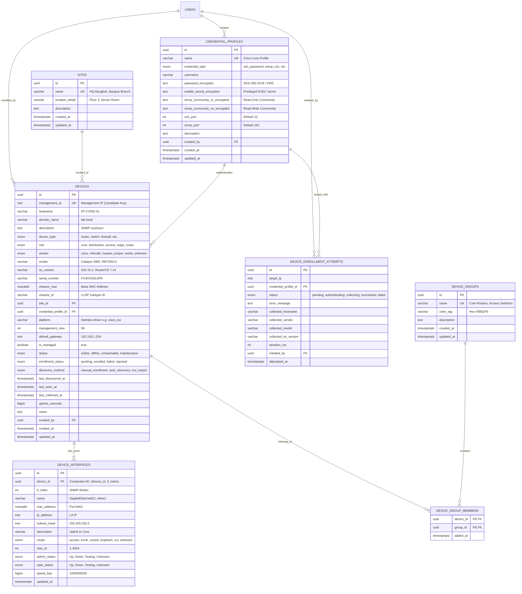

# 🗄️ Database Schema: 02_Device Inventory Management (3NF Normalized)

> **Path**: `Database Design/02_Device Inventory Management/`  
> **DBML**: [`device_inventory.dbml`](device_inventory.dbml)  
> **Master SQL**: [`device_inventory.sql`](device_inventory.sql)  
> **Feature Link**: [`Feature Design/02_Device Inventory Management(Tee)`](../../Feature%20Design/02_Device%20Inventory%20Management(Tee)/)  
>
> 📁 **Modular SQL Schemas (`sql/`)**:
> - [`00_enums.sql`](mynetmate/docs/Database%20Design/02_Device%20Inventory%20Management/sql/00_enums.sql) (Enums & Custom Types)
> - [`01_credentials.sql`](01_credentials.sql) (ตาราง credential_profiles)
> - [`02_sites_and_groups.sql`](02_sites_and_groups.sql) (ตาราง sites, device_groups, device_group_members)
> - [`03_devices.sql`](03_devices.sql) (ตาราง devices - Core System of Record)
> - [`04_device_interfaces.sql`](04_device_interfaces.sql) (ตาราง device_interfaces - Ports L2/L3)
> - [`05_device_enrollment_attempts.sql`](05_device_enrollment_attempts.sql) (ตาราง device_enrollment_attempts - Audit Log)
> - [`99_seed_data.sql`](mynetmate/docs/Database%20Design/02_Device%20Inventory%20Management/sql/99_seed_data.sql) (ข้อมูล Mock Test Data)

---

## 1. Entity-Relationship Diagram (ERD - 3NF)

---

## 2. การวิเคราะห์ความถูกต้องตามมาตรฐาน 3NF (Normalization Analysis)

| Table | 1NF (Atomic Data) | 2NF (No Partial Dependency) | 3NF (No Transitive Dependency) | Functional Dependencies ($X \to Y$) |
| :--- | :--- | :--- | :--- | :--- |
| **`credential_profiles`** | ผ่าน: ทุก Attribute เป็นค่าเดี่ยว | ผ่าน: PK คือ `id`, AK คือ `name` (Single-column keys) | ผ่าน: Non-prime attributes ทุกตัวขึ้นตรงกับ `id` โดยตรง | `id` $\to$ `name, credential_type, username, password_encrypted, ...` `name` $\to$ `id, ...` |
| **`sites`** | ผ่าน: Atomic strings | ผ่าน: PK คือ `id`, AK คือ `name` | ผ่าน: ทุก Attribute ขึ้นกับ `id` โดยตรง | `id` $\to$ `name, location_detail, description...` |
| **`device_groups`** | ผ่าน: Atomic strings | ผ่าน: PK คือ `id`, AK คือ `name` | ผ่าน: ทุก Attribute ขึ้นกับ `id` โดยตรง | `id` $\to$ `name, color_tag, description...` |
| **`device_group_members`** | ผ่าน: Atomic UUIDs | ผ่าน: PK เป็น Composite `(device_id, group_id)` และ `added_at` ขึ้นตรงกับทั้งสองค่าพร้อมกัน | ผ่าน: ไม่มี Non-key attribute อื่น | `(device_id, group_id)` $\to$ `added_at` |
| **`devices`** | ผ่าน: แตก Group เป็น Many-to-Many แยก | ผ่าน: PK คือ `id`, Candidate Key คือ `management_ip` (Single-column) | ผ่าน: ข้อมูล Site และ Credential ถูกอ้างผ่าน FK (`site_id`, `credential_profile_id`) ไม่เก็บ redundant attributes ซ้ำซ้อน | `id` $\to$ `management_ip, hostname, vendor, model, os_version, site_id, ...` `management_ip` $\to$ `id, ...` |
| **`device_interfaces`** | ผ่าน: ข้อมูลพอร์ตเป็นค่าเดี่ยว | ผ่าน: Composite Candidate Key คือ `(device_id, if_index)` | ผ่าน: `name`, `mac_address`, `admin_status`, `mode` ขึ้นตรงกับ `(device_id, if_index)` เท่านั้น | `id` $\to$ `device_id, if_index, name, mac_address, mode, ...` `(device_id, if_index)` $\to$ `id, ...` |
| **`device_enrollment_attempts`** | ผ่าน: ข้อมูล Log ของแต่ละการลองเชื่อมต่อ | ผ่าน: PK คือ `id` | ผ่าน: บันทึกข้อมูลเฉพาะของ Event แต่ละรอบ | `id` $\to$ `target_ip, status, error_message, duration_ms, ...` |

---

## 3. การแบ่งขอบเขตและเชื่อมโยงกับ `04_Network Discovery`

- **`04_Network Discovery`**: รับผิดชอบการสแกนอัตโนมัติ (Discovery Engine / Oxian) เพื่อค้นหา Topology Graph, Links ระหว่างพอร์ต, และตรวจพบเพื่อนบ้าน (Neighbor Discovery)
- **`02_Device Inventory Management`**: เป็น **Master Inventory Core** สำหรับการลงทะเบียนอุปกรณ์ด้วยมือ (Manual Enrollment), บริหารจัดการ Credential Profiles (Encrypted), จัดกลุ่มตาม Site และ Device Group, ตลอดจนเก็บ Audit Log ความพยายามนำเข้าอุปกรณ์
