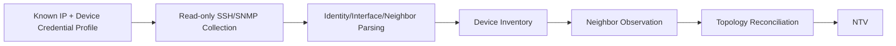
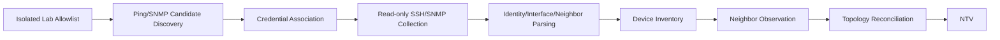
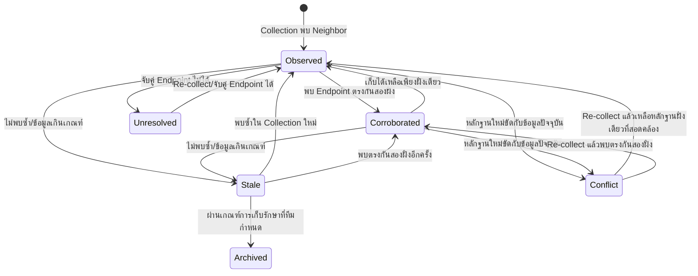

# Summary NTV MVP

> [!WARNING]
> **Delivery status:** NTV แบบ Full-stack ในเทอมนี้ยังมีสถานะ **Undecided — ยังไม่ยืนยัน** เอกสารนี้เป็น Design Baseline ของ MVP ไม่ใช่คำยืนยันการส่งมอบหรือแผน Implementation ของเทอมนี้
>
> **Protocol baseline:** Network Discovery/Collection ใช้ SNMP และ NTV ใช้ LLDP Neighbor Observation สำหรับสร้าง Physical/L2 Link โดย CDP ไม่อยู่ในขอบเขตปัจจุบัน

## แนวคิดหลักของ NTV

NTV คือ:

> “แผนที่เครือข่ายที่ระบบสร้างจากข้อมูลที่อ่านจาก Router และ Switch จริง พร้อมบอกว่าอุปกรณ์ต่อกันผ่าน Port ใด ข้อมูลมาจากไหน และตรวจล่าสุดเมื่อใด”

มันไม่ใช่โปรแกรมวาด Network Diagram แบบ Visio เพราะ Link ใน MVP ต้องมาจาก LLDP Observation ที่ระบบเก็บจากอุปกรณ์จริง ไม่ให้ผู้ใช้วาด Link หรือสร้าง Manual Override ใน MVP
## ปัญหาที่ NTV ต้องแก้
ปัจจุบันผู้ดูแลเครือข่ายอาจต้อง:

- จำว่าอุปกรณ์ตัวไหนต่อกับตัวไหน
- เดินไล่สายเพื่อหา Port
- เปิด CLI ของอุปกรณ์ทีละตัว
- ตรวจเอกสารเก่าที่อาจไม่ตรงกับเครือข่ายปัจจุบัน
- เสียเวลาหาสาเหตุเมื่ออุปกรณ์หรือ Link มีปัญหา

NTV จึงรวบรวมข้อมูลเหล่านี้ให้ดูจากหน้าจอเดียว
## Feature Concept ของ MVP

| Feature                             | ทำอะไรแบบง่าย ๆ                                                 | ทำไมต้องมี                                                                     |
| ----------------------------------- | --------------------------------------------------------------- | ------------------------------------------------------------------------------ |
| 1. แสดงอุปกรณ์จาก Device Inventory  | นำ Router และ Switch ที่ระบบเก็บข้อมูลสำเร็จแล้วมาแสดงเป็น Node | เพื่อให้แผนผังมีเฉพาะอุปกรณ์ที่ระบบรู้จักจริง ไม่สร้างอุปกรณ์สมมติ             |
| 2. สร้างเส้นเชื่อมอัตโนมัติ         | ใช้ข้อมูล LLDP ที่อ่านจากอุปกรณ์มาวาด Link                  | ลดการวาดแผนผังและกรอกข้อมูลด้วยมนุษย์                                          |
| 3. แสดง Port ทั้งสองฝั่ง            | บอกว่า Link เชื่อมจาก Interface ใดไป Interface ใด               | ผู้ใช้สามารถไปตรวจสายหรือ Configuration ได้ถูก Port                            |
| 4. แสดงที่มาและเวลาของข้อมูล        | บอกว่า Link มาจาก LLDP และพบล่าสุดเมื่อใด              | ป้องกันผู้ใช้เชื่อข้อมูลเก่าหรือข้อมูลที่ไม่มีหลักฐาน                          |
| 5. แสดงสถานะอุปกรณ์และคุณภาพข้อมูล  | แสดงว่าอุปกรณ์ติดต่อได้หรือไม่ เก็บข้อมูลสำเร็จหรือข้อมูลเก่า   | ช่วยให้รู้ว่าควรตรวจสอบอุปกรณ์หรือ Link ใดก่อน                                 |
| 6. จัดตำแหน่งแผนผัง                 | ลาก Node, Zoom และเลื่อนแผนผังได้                               | ทำให้แผนผังอ่านง่าย โดยไม่เปลี่ยนเครือข่ายจริง                                 |
| 7. สั่งเก็บข้อมูลใหม่               | ผู้ใช้กด Re-collect เพื่อให้ระบบอ่านข้อมูลจากอุปกรณ์อีกครั้ง    | ใช้ตรวจว่าเครือข่ายเปลี่ยนไปจากข้อมูลเดิมหรือไม่                               |
| 8. แสดงระดับหลักฐานของ Link         | แยก Link ที่พบฝั่งเดียว พบตรงกันสองฝั่ง และข้อมูลที่ยังระบุปลายทางไม่ได้ | ให้ผู้ใช้เห็นคุณภาพข้อมูลโดยไม่ต้อง Confirm Link ทีละเส้น                 |
| 9. แสดงข้อมูลขัดแย้งและข้อมูลเก่า   | แสดง Conflict หรือ Stale เป็นคำเตือนแทนการลบ Link ทันที         | ป้องกันข้อมูลหายเมื่อ Collection ล้มเหลวเพียงชั่วคราว                          |
| 10. เปิดรายละเอียดต่อได้            | กด Node หรือ Link เพื่อดู Device และ Interface Detail           | ช่วยให้ผู้ใช้ตรวจสอบปัญหาต่อได้โดยไม่ต้องค้นหาอุปกรณ์ใหม่                      |

## ทำไมต้องทำ MVP ชุดนี้

MVP ชุดนี้พิสูจน์คุณค่าหลักของ NTV ได้ครบตั้งแต่ต้นทางถึงปลายทาง:

1. ระบบเชื่อมต่อและเก็บข้อมูลจากอุปกรณ์จริง
2. ระบบรู้จัก Device และ Interface
3. ระบบอ่านข้อมูลการเชื่อมต่อ
4. ระบบวาดแผนผังพร้อม Port
5. ระบบแสดงระดับหลักฐานและคำเตือนเมื่อข้อมูลอัตโนมัติไม่ครบหรือขัดกัน
6. ผู้ใช้สั่ง Re-collect เพื่อตรวจข้อมูลล่าสุดได้

หากตัด Feature เหล่านี้ออกมากเกินไป สิ่งที่เหลืออาจกลายเป็นเพียง Canvas สำหรับลากรูปและเส้น ซึ่งทำงานเหมือนโปรแกรมวาด Diagram ทั่วไปและไม่ได้แสดงจุดเด่นของ MyNetMate

## ทำไมยังไม่ทำระบบเต็มรูปแบบ

MVP ยังไม่ต้องมี:

- Topology แบบ Real-time
- แผนผัง OSPF/BGP
- ระบบวิเคราะห์ผลกระทบข้ามอุปกรณ์
- AI ตัดสินใจเรื่อง Link
- การแก้ VLAN หรือ Configuration จากหน้า NTV
- การรองรับทุก Vendor และทุกรุ่น
- การลบ Link อัตโนมัติ
- ระบบจำลองเครือข่าย

เพราะสิ่งเหล่านี้เพิ่มความซับซ้อน แต่ไม่จำเป็นต่อการพิสูจน์ว่า NTV แก้ปัญหาการดูและตรวจสอบการเชื่อมต่อจริงได้
## ตัวอย่างการสาธิต MVP

1. นำ Huawei Router, Cisco Switch และ MikroTik Switch เข้าสู่ระบบ
2. ระบบเชื่อมต่อและเก็บข้อมูลของแต่ละอุปกรณ์
3. NTV แสดงอุปกรณ์ทั้งสามตัว
4. ระบบวาด Link จาก LLDP พร้อมชื่อ Port
5. ผู้ใช้ดูที่มาและเวลาตรวจล่าสุด
6. ระบบแสดง Link ปกติอัตโนมัติและระบุว่าเป็น One-sided หรือ Corroborated
7. หากอุปกรณ์หนึ่งไม่รายงาน LLDP ระบบแสดงว่าไม่มีข้อมูลหรือยังระบุปลายทางไม่ได้ โดยไม่สร้าง Link สมมติ
8. ทดลองย้ายสายจริงแล้วกด Re-collect
9. ระบบแสดง Link ใหม่และทำเครื่องหมาย Link เดิมว่า Stale/Conflict ตามข้อมูลที่ตรวจพบ
## ประโยคสั้น

> NTV ของเราไม่ใช่หน้าวาด Network Diagram แต่เป็นแผนผังที่สร้างอัตโนมัติจากข้อมูล Router และ Switch จริง ระบบบอกได้ว่าอุปกรณ์ตัวไหนต่อกันผ่าน Port อะไร ข้อมูลมาจากไหน และตรวจล่าสุดเมื่อใด หากข้อมูลไม่ครบหรือขัดกัน ระบบจะแสดงคำเตือนและให้ผู้ใช้ Re-collect โดยไม่สร้างหรือแก้ Link ด้วยมือใน MVP

## ข้อกำหนดร่วม

**ข้อกำหนดด้านสิทธิ์และการตรวจสอบย้อนหลัง:** NTV ใช้ระบบ RBAC และ Audit Trail ส่วนกลางของ MyNetMate เพื่อควบคุมการ Re-collect และการแก้ Shared Layout โดยไม่พัฒนาระบบสิทธิ์แยกเฉพาะสำหรับ NTV
# 01 — MVP: MyNetMate Network Topology Visualization

> **สถานะเอกสาร:** Design Baseline สำหรับออกแบบ Database Schema และ Component Diagram
> **สถานะการส่งมอบ:** Undecided — ยังไม่ยืนยันการพัฒนา NTV แบบ Full-stack ในเทอมนี้
>
> **ยืนยันมติหลัก:** 2026-08-11  
> **ปรับ Scope ล่าสุด:** 2026-08-12 — Manual Override และ Workflow การตรวจรับย้ายออกจาก MVP

เอกสารที่เกี่ยวข้อง:

- [คำอธิบายคำศัพท์ NTV.md](E:/CEPP Project/หลักศูตร/KMITL_Knowledge/Project/02_feature/03_Network Topology Visualization(Naphat)/คำอธิบายคำศัพท์ NTV.md) — คำอธิบายศัพท์ด้วยภาษาไทย
- [02_Database Schema.md](E:/CEPP Project/หลักศูตร/KMITL_Knowledge/Project/02_feature/03_Network Topology Visualization(Naphat)/02_Database Schema.md) — เอกสารถัดไปสำหรับออกแบบข้อมูล
- [03_Component Diagram.md](E:/CEPP Project/หลักศูตร/KMITL_Knowledge/Project/02_feature/03_Network Topology Visualization(Naphat)/03_Component Diagram.md) — เอกสารถัดไปสำหรับแบ่งส่วนประกอบระบบ
- [04_NTV - API.md](E:/CEPP Project/หลักศูตร/KMITL_Knowledge/Project/02_feature/03_Network Topology Visualization(Naphat)/04_NTV - API.md) — Candidate API
- [05_Acceptance Tests.md](E:/CEPP Project/หลักศูตร/KMITL_Knowledge/Project/02_feature/03_Network Topology Visualization(Naphat)/05_Acceptance Tests.md) — เกณฑ์ทดสอบปัจจุบัน

> [!IMPORTANT]
> เอกสารฉบับนี้เก็บเฉพาะมติล่าสุด: NTV MVP เป็น **Visualization-only, Observation-first Topology** ข้อมูล Device, Interface และ Link ต้องสืบกลับไปยังการเก็บข้อมูลจากอุปกรณ์เป้าหมายใน Isolated Lab ได้ ไม่ใช้แนวทาง `Manual-first`, ไม่ใช่ Freehand Network Diagram และไม่มี Manual Override/Verification Workflow ใน MVP โดย LLDP Link แสดงอัตโนมัติตามระดับหลักฐาน ไม่ต้องให้ผู้ใช้ Confirm/Reject ทุกเส้น

## 1. มติหลักและคำจำกัดความ

### 1.1 Manual Device Enrollment

Manual Input ใน Device Inventory **ไม่ได้หมายถึงการสร้างอุปกรณ์สมมติด้วยการกรอกข้อมูลทั้งหมดเอง** แต่หมายถึง:

1. ผู้ใช้ระบุอุปกรณ์เป้าหมายที่ทราบอยู่แล้ว เช่น Management IP Address
2. ผู้ใช้เลือก `Device Credential Profile` ที่ได้รับอนุญาตสำหรับอุปกรณ์นั้น
3. ระบบตรวจสอบการเข้าถึงและ Authentication
4. ระบบเชื่อมต่ออุปกรณ์แบบ Read-only โดยใช้ SSH เป็นวิธีหลักใน MVP และอาจใช้ SNMP ตามความสามารถของอุปกรณ์
5. ระบบดึงและ Parse ข้อมูลจริง เช่น Hostname, Vendor, Model, OS Version, Interface และ LLDP Neighbor
6. ระบบบันทึก Device, Interface และ Neighbor Observation ลงฐานข้อมูลพร้อมเวลาและผลการเก็บข้อมูล

`Device Credential Profile` หมายถึงข้อมูลรับรองสำหรับเข้าอุปกรณ์เครือข่ายที่ผู้ใช้มีสิทธิ์ใช้งาน **ไม่ใช่รหัสผ่านของบัญชีผู้ใช้ Web Application** และระบบต้องไม่ส่งข้อมูลรับรองนี้ไปยัง Frontend, Audit Log หรือ Gemini API

### 1.2 Network Discovery

Network Discovery หมายถึงระบบค้นหา Candidate Device ภายใน CIDR/Allowlist ของ Isolated Lab แล้วจึงผูก Candidate กับ Credential Profile ที่ได้รับอนุญาตเพื่อเก็บข้อมูลแบบ Read-only จากอุปกรณ์นั้น การตอบ Ping เพียงอย่างเดียวยังไม่เพียงพอให้ Candidate กลายเป็น Managed Device หรือ Topology Node ที่เชื่อถือได้

### 1.3 หลักร่วมของทั้งสองวิธี

- Manual Enrollment และ Discovery ต่างกันเฉพาะ **วิธีได้มาซึ่งอุปกรณ์เป้าหมาย**
- ทั้งสองเส้นทางต้องผ่าน Collector/Parser ชุดเดียวกันและต้องมี `collection_status`
- Device ที่ยังเชื่อมต่อหรือเก็บข้อมูลไม่สำเร็จอาจแสดงเป็น Enrollment/Discovery Candidate ได้ แต่ห้ามแสดงเป็น Verified Topology Node
- Topology ต้องอ้างอิง Device, Interface และ Neighbor ที่ระบบเก็บจากอุปกรณ์เป้าหมายใน Isolated Lab จริง ไม่สร้าง Node หรือ Port สมมติเพื่อให้ผังดูครบ
- การทดสอบรับรอง Vendor ต้องใช้อุปกรณ์จริงและรุ่น/OS จริง ส่วนการใช้ GNS3 หรือ Packet Tracer ระหว่างพัฒนายังต้องแยกสถานะออกจากผลรับรองอุปกรณ์จริง

## 2. มติและข้อจำกัดที่มีผลต่อการออกแบบ

| Decision ID | สถานะ                       | มติ/หลักฐาน                                                                                           | ผลต่อการออกแบบ                                                                         |
| ----------- | --------------------------- | ----------------------------------------------------------------------------------------------------- | -------------------------------------------------------------------------------------- |
| `D-NTV-01`  | **User-confirmed**          | Manual Input คือการระบุ IP/อุปกรณ์และ Credential แล้วให้ระบบเชื่อมต่อเพื่อดึงข้อมูลจากอุปกรณ์เป้าหมาย | ไม่สร้าง Device Record หรือ Node สมมติด้วยมือ                                          |
| `D-NTV-02`  | **User-confirmed**          | ทั้ง Manual Enrollment และ Discovery ต้องเชื่อมต่อและเก็บข้อมูลจากอุปกรณ์เป้าหมายก่อนนำไปใช้          | Ping-only Candidate ยังไม่ใช่ Verified Topology Node                                   |
| `D-NTV-03`  | **Derived design decision** | NTV เป็น Observation-first Topology ไม่ใช่ Freehand Network Diagram                                   | Link หลักมาจาก LLDP Observation และต้องรักษาหลักฐานเดิม                            |
| `D-NTV-04`  | **Derived safety decision** | การแก้ข้อมูลใน NTV ไม่สามารถเปลี่ยนสายหรือ Port ของเครือข่ายจริงได้                                   | แยก Layout, Topology Data และการเปลี่ยนแปลงทางกายภาพออกจากกัน                          |
| `D-NTV-05`  | **Project constraint**      | ทดสอบ Collection/Discovery เฉพาะ Isolated Lab และ Allowlist                                           | NTV ต้องไม่เปิดทางให้เริ่ม Scan เครือข่ายมหาวิทยาลัย                                   |
| `D-NTV-06`  | **Project constraint**      | Cisco IOS เป็น Baseline; Huawei Router และ MikroTik Switch เป็น Candidate ตามรุ่น/OS และผลทดสอบจริง   | Data Contract ต้องไม่ผูกกับ Cisco แต่ห้ามกล่าวอ้าง Full Multi-vendor Support ก่อนทดสอบ |
| `D-NTV-07`  | **Project safety rule**     | AI ไม่มีสิทธิ์สร้างหรือแก้ Link, สั่ง Collection หรือส่งคำสั่งไปยังอุปกรณ์โดยตรง                       | NTV ใช้ข้อมูล Deterministic จาก Collector/Reconciliation และ Action ต่ออุปกรณ์ผ่าน RBAC |
| `D-NTV-08`  | **User-confirmed correction** | Link ที่ได้จาก LLDP ไม่ต้องรอผู้ใช้ Confirm/Reject ทุกเส้น | ระบบแสดง Link อัตโนมัติตามระดับหลักฐาน และแสดงคำเตือนสำหรับ Unresolved/Conflict/Stale |
| `D-NTV-09`  | **User-confirmed scope correction** | NTV MVP มีหน้าที่แสดง Topology จากข้อมูลอัตโนมัติ; Manual Override และการ Verify/Reject ไม่ใช่ MVP | ย้าย Manual Override และ Workflow จัดการข้อยกเว้นเป็น Should Have/Future Enhancement; MVP ไม่สร้าง Link ด้วยมือ |
### ความหมายของแต่ละคอลัมน์

- `Decision ID` คือรหัสสำหรับอ้างอิงมติใน Schema, Component Diagram และ Acceptance Test
- `สถานะ` บอกว่ามตินั้นมาจากไหนและมีน้ำหนักระดับใด
- `มติ/หลักฐาน` คือสิ่งที่ทีมตกลงหรือข้อจำกัดที่ได้รับ
- `ผลต่อการออกแบบ` คือสิ่งที่ Schema, Component หรือ UI ต้องทำตาม
### ความหมายของสถานะ

- `User-confirmed` — ผู้ใช้ยืนยันความต้องการนี้โดยตรงแล้ว
- `User-confirmed correction` — ผู้ใช้ยืนยันการแก้มติเดิมโดยตรง และมติใหม่นี้มีผลเหนือข้อความเดิมที่ขัดกัน
- `Derived design decision` — ข้อสรุปการออกแบบที่อนุมานจากความต้องการของผู้ใช้ ยังแก้ได้ถ้าทีมมีเหตุผลใหม่
- `Derived safety decision` — ข้อสรุปที่เพิ่มขึ้นเพื่อป้องกันความเข้าใจผิดหรือความเสียหาย
- `Project constraint` — ข้อจำกัดจากขอบเขตโครงงาน อุปกรณ์ หรือสภาพแวดล้อม
- `Project safety rule` — กฎความปลอดภัยที่ระบบต้องปฏิบัติตาม

### อธิบายทีละมติ

#### D-NTV-01 — Manual Input ไม่ใช่การสร้างอุปกรณ์สมมติ

ผู้ใช้เป็นคนบอกระบบว่าอุปกรณ์อยู่ที่ IP ใด และให้ใช้ Credential Profile ใด จากนั้นระบบต้องเชื่อมต่อและดึงข้อมูลจากอุปกรณ์นั้น

ตัวอย่าง:

1. ผู้ใช้ใส่ `192.168.10.2`
2. เลือก Credential สำหรับ Cisco
3. ระบบเชื่อมต่อผ่าน SSH
4. ระบบอ่าน Hostname, Model, IOS Version และ Interface
5. เมื่อเก็บข้อมูลสำเร็จ จึงสร้างหรือยืนยันเป็น Managed Device

หากเชื่อมต่อไม่สำเร็จ ระบบอาจเก็บเป็น `Enrollment Candidate` หรือประวัติความพยายามได้ แต่ห้ามถือว่าเป็น Managed Device หรือ Verified Topology Node

#### D-NTV-02 — Ping ผ่านยังไม่แปลว่ารู้จักอุปกรณ์แล้ว

Ping บอกเพียงว่า IP ตอบสนอง ไม่สามารถยืนยันได้ว่าเป็น Router, Switch หรือเครื่องประเภทอื่น และยังไม่รู้ Hostname, Model หรือ Interface

ดังนั้นต้องผ่านอย่างน้อย:

- Authentication สำเร็จ
- Collection สำเร็จ
- Parse ข้อมูลระบุตัวอุปกรณ์ได้

ก่อนนำอุปกรณ์ไปแสดงเป็น Node ที่เชื่อถือได้ใน NTV

#### D-NTV-03 — แผนผังสร้างจากข้อมูลที่ตรวจพบ

NTV ต้องเริ่มจากข้อมูลที่ระบบอ่านจากอุปกรณ์ เช่น LLDP Neighbor ไม่ใช่ให้ผู้ใช้ลากเส้นตามความเข้าใจของตนเอง

ตัวอย่าง:

> Cisco Switch รายงานว่า `Gi0/1` พบ Huawei Router ที่ `GE0/0/1`

ระบบจึงนำข้อมูลนี้ไปแสดงเป็น Link พร้อมระบุว่าแหล่งข้อมูลคือ LLDP

Raw Observation ต้องไม่ถูกแก้ทับ ใน MVP หากข้อมูลไม่ครบหรือดูขัดแย้ง ระบบจะแสดงสถานะเตือนและให้ผู้ใช้สั่ง `Re-collect` หลังตรวจสอบอุปกรณ์หรือสายจริง โดยยังไม่มีคำสั่ง `Report Incorrect` และไม่มี Manual Override ส่วน Link ปกติไม่ต้องรอคนยืนยันก่อนแสดงผล

#### D-NTV-04 — แก้แผนผังไม่ได้แปลว่าแก้เครือข่ายจริง

ผู้ใช้สามารถ:

- ลากตำแหน่ง Node
- Zoom หรือ Pan
- เปิดดูรายละเอียด Link และหลักฐาน LLDP
- สั่ง Re-collect เมื่อพบข้อมูล `unresolved`, `conflict` หรือ `stale`

การแก้ Shared Layout เปลี่ยนเฉพาะตำแหน่งที่แสดงบนหน้าจอ ไม่สามารถเปลี่ยน Link สาย หรือ Port บนอุปกรณ์จริงได้ และ MVP ไม่มีคำสั่งแก้ Link โดยตรง

หากต้องการย้ายสายจาก `Gi0/1` ไป `Gi0/2` ผู้ดูแลต้องเปลี่ยนสายจริง แล้วสั่ง Re-collect เพื่อให้ NTV แสดงข้อมูลล่าสุด

#### D-NTV-05 — ทดสอบเฉพาะเครือข่ายปิด

ระบบต้องอนุญาต Collection และ Discovery เฉพาะ IP หรือ CIDR ใน Isolated Lab Allowlist

ตัวอย่าง:

- `192.168.50.0/24` เป็นวง Lab ที่อนุญาต
- IP เครือข่ายมหาวิทยาลัยอยู่นอก Allowlist
- หากผู้ใช้พยายาม Discovery นอก Allowlist ระบบต้องปฏิเสธและบันทึก Audit Log

ข้อจำกัดนี้ต้องตรวจที่ Backend ไม่ใช่อาศัยเพียงการซ่อนปุ่มในหน้าเว็บ

#### D-NTV-06 — ออกแบบให้รองรับหลาย Vendor แต่ยังไม่รับรองทั้งหมด

Cisco IOS เป็นอุปกรณ์หลักในการเริ่มพัฒนา ส่วน Huawei และ MikroTik ยังเป็น Candidate จนกว่าจะทราบ:

- รุ่นอุปกรณ์
- ระบบปฏิบัติการและ Version
- Protocol ที่รองรับ
- คำสั่งที่ใช้อ่านข้อมูล
- รูปแบบผลลัพธ์
- ผลทดสอบกับอุปกรณ์จริง

คำว่า Data Contract ไม่ผูกกับ Cisco หมายถึงข้อมูลกลางควรใช้ชื่อทั่วไป เช่น:

- `vendor`
- `model`
- `os_version`
- `interface_name`
- `neighbor_identity`

ไม่ควรออกแบบ Field อย่าง `cisco_ios_interface` เพราะจะทำให้ Huawei และ MikroTik ใช้โครงสร้างเดียวกันไม่ได้

อย่างไรก็ตาม การออกแบบฐานข้อมูลให้รองรับหลาย Vendor ไม่ได้แปลว่าระบบรองรับทุก Vendor เต็มรูปแบบแล้ว

#### D-NTV-07 — AI ไม่มีอำนาจตัดสินใจหรือสั่งอุปกรณ์

Gemini หรือ AI อาจช่วยอธิบายข้อมูลหรือเสนอคำแนะนำได้ แต่ห้าม:

- เปลี่ยนข้อสรุป Link หรือสถานะคำเตือนของระบบ
- สร้าง Link หรือ Manual Override เอง หากมีการพัฒนา Feature นี้ในอนาคต
- เริ่ม Collection เอง
- ส่งคำสั่งไปยังอุปกรณ์โดยตรง

ใน MVP การดำเนินการต้องเริ่มจากผู้ใช้ที่มีสิทธิ์ และ Backend ต้องตรวจ RBAC พร้อมบันทึก Audit Trail
### 2.1 Documentation Alignment Status

- **Resolved — Manual Device Enrollment:** [Device Inventory.md](E:/CEPP Project/หลักศูตร/KMITL_Knowledge/Project/02_feature/02_Device Inventory Management/Device Inventory.md) ระบุแล้วว่าผู้ใช้ให้ Management IP และ Credential Profile จากนั้นระบบต้องเก็บข้อมูลแบบ Read-only ก่อนเป็น Managed Device
- **Resolved — Feature SSOT:** [MyNetMate Weight Feature List.md](E:/CEPP Project/หลักศูตร/KMITL_Knowledge/Project/02_feature/MyNetMate Weight Feature List.md) แยก Ping เป็น Reachability, Collection เป็นเกณฑ์ยืนยัน Managed Device และระบุแล้วว่า MVP ไม่ทำ Freehand/Manual Link ส่วน Evidence-based Manual Override เป็น Future Enhancement
- **Resolved — Interface/Link Ownership:** [Data Information.md](E:/CEPP Project/หลักศูตร/KMITL_Knowledge/Project/02_feature/02_Device Inventory Management/Data Information.md) ให้ `interfaces` เก็บเฉพาะข้อมูลประจำ Port ส่วน Observation, Current Link และ Layout แยกออกจาก Interface; Override/Review Schema เป็น Future Extension

### 2.2 Evidence Sources

| Evidence ID | หลักฐาน                                                                                                | แหล่งข้อมูล                                                                                                                                                         | ผลที่นำมาใช้                                                               |
| ----------- | ------------------------------------------------------------------------------------------------------ | ------------------------------------------------------------------------------------------------------------------------------------------------------------------- | -------------------------------------------------------------------------- |
| `E-NTV-01`  | ผู้ใช้ยืนยันความหมาย Manual Input และเงื่อนไขว่าทั้ง Manual/Discovery ต้องเก็บข้อมูลจากอุปกรณ์เป้าหมาย | User Decision วันที่ 2026-08-11                                                                                                                                     | เป็นฐานของ `D-NTV-01` และ `D-NTV-02`                                       |
| `E-NTV-02`  | Topology ถูกจัดไว้ P2 เพราะพึ่งข้อมูล LLDP จาก Discovery                                           | [MyNetMate Weight Feature List.md](E:/CEPP Project/หลักศูตร/KMITL_Knowledge/Project/02_feature/MyNetMate Weight Feature List.md)                                    | NTV ต้องรับข้อมูลจาก Collection/Discovery ไม่เป็น Canvas เปล่า             |
| `E-NTV-03`  | อาจารย์ต้องการ Interactive Topology, Drag & Drop และระบุ Port Connection                               | [คำแนะนำของอาจารย์ครั้งที่ 2](E:/CEPP Project/หลักศูตร/KMITL_Knowledge/Project/04_project_management/Advisor Teacher/คำแนะนำของอาจารย์ ณ ครั้งที่ 2 ปี 3 เทอม 1.md) | MVP รองรับ Layout Editing และแสดง Port Connection จาก Observation; Manual Connection รอ Future Scope |
| `E-NTV-04`  | มี Huawei Router, MikroTik Switch และ Cisco Switch สำหรับทดสอบจริงหลังกลางภาค                          | [AGENTS.md](E:/CEPP Project/หลักศูตร/KMITL_Knowledge/Project/AGENTS.md)                                                                                             | ออกแบบข้อมูลแบบ Vendor-neutral แต่รอรุ่น/OS ก่อนรับรอง Vendor รอง          |
| `E-NTV-05`  | ห้าม Scan เครือข่ายมหาวิทยาลัยและต้องใช้ Isolated Lab                                                  | [AGENTS.md](E:/CEPP Project/หลักศูตร/KMITL_Knowledge/Project/AGENTS.md)                                                                                             | บังคับ Allowlist, RBAC และ Audit ใน Collection/Discovery                   |
| `E-NTV-06`  | ผู้ใช้ตั้งคำถามเรื่องภาระการ Confirm/Reject และยืนยันให้แก้เป็นการเชื่อระบบตามระดับหลักฐาน | User Decision วันที่ 2026-08-12 | เป็นฐานของ `D-NTV-08`; Link ปกติแสดงอัตโนมัติ |
| `E-NTV-07`  | ผู้ใช้กำหนดให้ NTV MVP เน้นการแสดง Topology และย้าย Manual Override/Verification ออกไป | User Decision วันที่ 2026-08-12 | เป็นฐานของ `D-NTV-09`; ลด Schema, Component, API และ Acceptance Test ของ MVP |

## 3. User Decisions ที่ NTV ต้องช่วยตอบ

User Decisions คือสิ่งที่ Admin หรือ Operator ตัดสินใจหลังอ่านข้อมูลบนหน้า NTV เช่น จะเปิดรายละเอียด ตรวจสายจริง หรือสั่ง Re-collect หรือไม่ โดย MVP แสดง Link และคำเตือนจาก LLDP อัตโนมัติ แต่ไม่มี Workflow ให้ผู้ใช้ Confirm, Override หรือแก้ข้อสรุปของ Link ภายในระบบ

| User Decision ID | คำถามที่ผู้ใช้ต้องตอบ                                   | ข้อมูลที่ NTV ต้องแสดง                                                       | การกระทำถัดไป                                |
| ---------------- | ------------------------------------------------------- | ---------------------------------------------------------------------------- | -------------------------------------------- |
| `UD-NTV-01`      | อุปกรณ์ใดเชื่อมต่อกับอุปกรณ์ใด                          | Device Node และ Link ที่สืบกลับไปยังหลักฐานได้                               | เปิดรายละเอียด Link หรือ Device              |
| `UD-NTV-02`      | Link นี้เชื่อมผ่าน Interface ใดทั้งสองฝั่ง              | Local/Remote Interface Label; ถ้ายังไม่ทราบต้องแสดงว่า Unknown               | ตรวจสายหรือเปิด Interface Detail             |
| `UD-NTV-03`      | ข้อมูลนี้มีหลักฐานระดับใด                               | Source, Collection Run, Last Observed และ One-sided/Corroborated | ใช้งานข้อมูลต่อ หรือ Re-collect หากต้องการหลักฐานเพิ่ม |
| `UD-NTV-04`      | อุปกรณ์หรือ Link ใดควรตรวจสอบก่อน                       | Reachability, Collection Health, Stale และ Conflict Indicator                | Re-collect หรือเปิดรายละเอียดข้อผิดพลาด      |
| `UD-NTV-05`      | สภาพการเชื่อมต่อเปลี่ยนจากข้อมูลเดิมหรือไม่             | Observation ล่าสุดเทียบกับ Link ปัจจุบันและประวัติก่อนหน้า                   | ตรวจสายจริงและ Re-collect                     |
| `UD-NTV-06`      | เมื่อ LLDP ใช้ไม่ได้ควรทำอย่างไร                    | Collection/Parser Status และ Unresolved/Pending Message                        | ตรวจการตั้งค่า/สายจริง; MVP ไม่เติม Link ด้วยมือ |
| `UD-NTV-07`      | ข้อมูลที่เห็นเป็นสภาพเครือข่ายหรือเป็นเพียงการจัดหน้าจอ | สัญลักษณ์แยก Link Data ออกจาก Layout/View State                              | ขยับ Node โดยไม่เข้าใจผิดว่าเปลี่ยนเครือข่าย |
### คำอธิบาย

“User Decisions ที่ NTV ต้องช่วยตอบ” หมายถึง การตัดสินใจที่ Admin หรือ Operator ต้องทำระหว่างดูแลเครือข่าย โดยใช้ข้อมูลจากหน้าแผนผังเป็นหลักฐานประกอบ

ไม่ใช่การตัดสินใจของทีมว่าจะออกแบบระบบอย่างไร แต่เป็นคำถามว่า:

> เมื่อผู้ดูแลเปิดหน้า NTV แล้ว เขาต้องรู้อะไร ตัดสินใจเรื่องใด และดำเนินการอะไรต่อ?

กระบวนการจะเป็น:

`ข้อมูลจากอุปกรณ์` → `NTV แสดงผล` → `ผู้ใช้ประเมินข้อมูล` → `ผู้ใช้ตัดสินใจ` → `ดำเนินการต่อ`

ตัวอย่างเช่น NTV แสดงว่า Cisco Switch เชื่อมกับ Huawei Router ผ่าน Port ใด พร้อมเวลาที่ตรวจล่าสุดและระบุว่าพบจากฝั่งเดียวหรือพบตรงกันทั้งสองฝั่ง ผู้ใช้จึงตัดสินใจได้ว่าจะใช้ข้อมูลต่อ สั่งเก็บข้อมูลใหม่ หรือไปตรวจสายจริงเมื่อระบบแจ้งความผิดปกติ

### การตัดสินใจแต่ละข้อ

#### UD-NTV-01 — อุปกรณ์ใดเชื่อมต่อกับอุปกรณ์ใด
ผู้ใช้ต้องดูให้ออกว่า Router หรือ Switch ตัวใดเชื่อมต่อกันจริง
NTV จึงต้องแสดง:
- Device Node
- Link ระหว่างอุปกรณ์
- ชื่ออุปกรณ์และประเภทอุปกรณ์
หลังจากนั้นผู้ใช้อาจเปิดรายละเอียด Device หรือ Link ที่สงสัย

#### UD-NTV-02 — เชื่อมต่อผ่าน Interface ใด
การรู้เพียงว่าอุปกรณ์สองตัวเชื่อมกันยังไม่พอ ผู้ใช้ต้องรู้ Port ของทั้งสองฝั่งด้วย
ตัวอย่าง:
> Cisco `Gi0/1` ↔ Huawei `GE0/0/1`

ข้อมูลนี้ช่วยให้ผู้ใช้ตรวจสาย ตรวจสถานะ Interface หรือตรวจ Configuration ของ Port ได้ถูกต้อง
หากระบบทราบ Port เพียงฝั่งเดียว ต้องแสดงว่าอีกฝั่งยังไม่ทราบ ไม่ควรเดาข้อมูลขึ้นมาเอง

#### UD-NTV-03 — ข้อมูล Link เชื่อถือได้หรือไม่
ผู้ใช้ต้องตัดสินใจว่าข้อมูลที่เห็นมีหลักฐานเพียงพอหรือไม่
NTV จึงต้องแสดง:
- ข้อมูลมาจาก LLDP
- ตรวจพบล่าสุดเมื่อใด
- พบจากอุปกรณ์ฝั่งเดียวหรือทั้งสองฝั่ง
- พบจากฝั่งเดียว (`Observed`) หรือพบตรงกันสองฝั่ง (`Corroborated`)
- Collection สำเร็จหรือไม่
Link ทั้งสองแบบแสดงอัตโนมัติ ผู้ใช้ไม่ต้อง Confirm ทุกเส้น หากต้องการข้อมูลใหม่ให้สั่ง Re-collect ส่วน Needs Review/Conflict เป็นคำเตือนสำหรับการตรวจสอบนอกระบบใน MVP

#### UD-NTV-04 — ควรตรวจอุปกรณ์หรือ Link ใดก่อน
เมื่อแผนผังมีหลายอุปกรณ์ ผู้ใช้ต้องเลือกว่าจุดใดควรได้รับการตรวจสอบก่อน
NTV ควรแสดงสัญลักษณ์ของ:
- อุปกรณ์ติดต่อไม่ได้
- Collection ล้มเหลว
- ข้อมูล Link เก่า
- ข้อมูลจากสองแหล่งขัดแย้งกัน
- Interface มีสถานะผิดปกติ
ผู้ใช้อาจเลือก Re-collect หรือเปิดรายละเอียดข้อผิดพลาด

#### UD-NTV-05 — การเชื่อมต่อเปลี่ยนไปจากเดิมหรือไม่
ผู้ใช้ต้องประเมินว่า Link ใหม่เป็นการเปลี่ยนแปลงจริง หรือเกิดจากข้อมูลผิดพลาดชั่วคราว
ตัวอย่าง:
- รอบก่อน Cisco `Gi0/1` เชื่อมกับ Huawei
- รอบล่าสุด Cisco `Gi0/1` รายงานว่าเชื่อมกับ MikroTik
ระบบต้องแสดง Conflict และประวัติเดิม เพื่อให้ผู้ใช้ไปตรวจสายจริงและ Re-collect ไม่ควรเขียนทับ Link เดิมทันที

#### UD-NTV-06 — เมื่อ LLDP ใช้ไม่ได้ควรทำอย่างไร
หากอุปกรณ์ไม่รายงานข้อมูลเพื่อนบ้าน MVP ต้องแสดง Collection/Parser Status และข้อความว่าไม่มีข้อมูลหรือยังระบุปลายทางไม่ได้ ผู้ใช้สามารถตรวจการตั้งค่า Protocol, ตรวจสายจริง และสั่ง Re-collect แต่ยังไม่สามารถบันทึก Link ด้วยมือใน NTV

Manual Override เป็น **Should Have/Future Enhancement** หากทีมพบภายหลังว่าอุปกรณ์จริงไม่สามารถให้ Neighbor Data ที่เพียงพอ

#### UD-NTV-07 — สิ่งที่เปลี่ยนเป็นเพียงหน้าจอหรือเครือข่ายจริง
ผู้ใช้ต้องแยกให้ออกระหว่าง:
- การลาก Node ซึ่งเปลี่ยนเฉพาะ Layout
- การแสดง Warning/Conflict ซึ่งเป็นข้อสรุปจากข้อมูลที่ระบบเก็บ
- การเปลี่ยนสายหรือ Port ซึ่งต้องทำกับอุปกรณ์จริง
การลาก Node หรือ Link บนหน้าจอไม่ควรทำให้ผู้ใช้เข้าใจว่าเครือข่ายจริงถูกเปลี่ยนแล้ว

### 3.1 ผู้ใช้และสิทธิ์ที่เกี่ยวข้อง
ผู้ใช้แต่ละบทบาทสามารถทำอะไรในหน้า NTV ได้บ้าง เพื่อป้องกันผู้ใช้ที่มีสิทธิ์อ่านอย่างเดียวเข้าไปเปลี่ยนข้อมูลหรือสั่งเชื่อมต่ออุปกรณ์

| Role     | อ่าน Topology/Warning | เปลี่ยน Shared Layout | Re-collect |
| -------- | --------------------- | -------------------- | ---------- |
| Admin    | ได้                   | ได้                  | ได้        |
| Operator | ได้                   | ได้                  | ได้        |
| Viewer   | ได้                   | ไม่ได้               | ไม่ได้     |

#### ความหมายของแต่ละคอลัมน์

##### อ่าน Topology
อนุญาตให้เปิดหน้าแผนผังและดู:
- อุปกรณ์และ Link
- Interface ของแต่ละฝั่ง
- สถานะและเวลาตรวจล่าสุด
- แหล่งที่มาของข้อมูล
- Collection Status และ Freshness
ทุก Role สามารถอ่านได้

##### เปลี่ยน Shared Layout
หมายถึงลาก Node, Pin, Hide หรือจัดตำแหน่งใหม่ในแผนผังที่ผู้ใช้ทุกคนใช้ร่วมกัน
การเปลี่ยน Shared Layout:
- เปลี่ยนเฉพาะตำแหน่งบนหน้าจอ
- ไม่เปลี่ยนสายจริง
- ไม่แก้ Device, Interface หรือ Link
- ผู้ใช้คนอื่นจะเห็น Layout ใหม่ด้วย
Viewer จึงยังแก้ไม่ได้ใน MVP เพื่อป้องกันการจัดหน้าจอร่วมกันเปลี่ยนโดยไม่ตั้งใจ
##### Re-collect
สั่งให้ระบบเชื่อมต่ออุปกรณ์อีกครั้งแบบอ่านอย่างเดียว เพื่อเก็บข้อมูลล่าสุด เช่น:
- Hostname และรุ่นอุปกรณ์
- Interface Status
- LLDP Neighbor
- Collection Health
แม้เป็น Read-only แต่ยังเป็นการติดต่ออุปกรณ์จริง ใช้ Credential และสร้างภาระให้อุปกรณ์ จึงไม่อนุญาตให้ Viewer สั่งได้
##### Warning และ Unresolved Data

ทุก Role อ่านคำเตือน `unresolved`, `conflict` และ `stale` ได้ แต่ MVP ยังไม่มีคำสั่ง Report Incorrect, Resolve Conflict หรือ Manual Override ภายใน NTV ผู้ใช้ต้องตรวจสาย/Protocol/Parser และสั่ง Re-collect เพื่อให้ระบบประเมินข้อมูลใหม่
#### ความหมายของแต่ละ Role
##### Admin
ผู้ดูแลระบบระดับสูง สามารถ:
- ดู Topology
- จัด Shared Layout
- สั่ง Re-collect
- จัดการ Policy, Credential Profile และสิทธิ์ผู้ใช้จาก Feature อื่น
ทุกการดำเนินการสำคัญยังต้องบันทึก Audit Trail
##### Operator
ผู้ปฏิบัติงานดูแลเครือข่ายประจำวัน สามารถ:
- ดูและจัดแผนผัง
- สั่งเก็บข้อมูลล่าสุด
- เปิดรายละเอียด Warning และสั่ง Re-collect

##### Viewer
ผู้ใช้สำหรับดูข้อมูลเท่านั้น สามารถ:
- เปิดแผนผัง
- ดู Device, Link และสถานะ
- Zoom, Pan หรือ Filter ชั่วคราวได้ หากไม่บันทึก Shared Layout
แต่ไม่สามารถ:
- เปลี่ยนข้อมูลร่วมกัน
- สั่งเชื่อมต่ออุปกรณ์
- สร้างหรือแก้ Link ด้วยมือ

สิทธิ์ของ Manual Override/Verification จะออกแบบเมื่อ Feature นี้ถูกนำเข้าสู่ Future Scope เท่านั้น ไม่ใช่ข้อกำหนดของ MVP

## 4. Data Flow ที่ถูกต้อง

### เส้นทาง Manual Enrollment

### เส้นทาง Network Discovery

ทั้งสองเส้นทางต้องมาบรรจบกันก่อน NTV เพื่อไม่ให้หน้าผังมีความหมายของ Device และ Link สองมาตรฐาน

### 4.1 ขอบเขตความรับผิดชอบระหว่าง Feature

| ส่วนของระบบ           | เป็นเจ้าของข้อมูล/หน้าที่                                                 | NTV ใช้งานอย่างไร                                           | สิ่งที่ NTV ห้ามทำแทน                                      |
| --------------------- | ------------------------------------------------------------------------- | ----------------------------------------------------------- | ---------------------------------------------------------- |
| Device Inventory      | Device Identity, Management IP, Interface และ Credential Reference        | อ่าน Device/Interface ที่ผ่าน Collection                    | สร้าง Device หรือแก้ Credential เอง                        |
| Discovery             | ค้นหา Candidate ภายใน Allowlist                                           | รับ Candidate/Discovery Result เพื่อแสดงสถานะที่เกี่ยวข้อง  | ขยายช่วง Scan หรือรับรอง Candidate เป็น Managed Device เอง |
| Collection และ Parser | เชื่อมต่อแบบ Read-only, เก็บ Raw Output และสร้าง Parsed Observation       | ขอ Re-collect และอ่านผล Collection Run/Neighbor Observation | ส่งคำสั่งแก้ Configuration หรือแก้ Raw Observation         |
| NTV                   | Topology View, Node Position และ Current Link Projection                  | แสดงความสัมพันธ์และคุณภาพข้อมูล                             | สร้าง/แก้ Link ด้วยมือ หรือเปลี่ยนสาย/Configuration       |
| Audit/RBAC            | ตรวจสิทธิ์และบันทึกกิจกรรม                                                | เรียกใช้ทุก Action ที่ต้องตรวจย้อนหลัง                      | เก็บ Secret ลง Audit Log                                   |

การกด `Re-collect` จากหน้า NTV เป็นเพียงการเรียกใช้ Collection Service ไม่ได้ทำให้ NTV เป็นเจ้าของ SSH/SNMP Logic

## 5. NTV สามารถแก้ไข Link ได้หรือไม่

**คำตอบสั้น:** ใน MVP ผู้ใช้แก้ Link ไม่ได้ Link จาก LLDP แสดงอัตโนมัติ ผู้ใช้แก้ได้เฉพาะ Layout และสั่ง Re-collect เพื่อให้ระบบอ่านข้อมูลใหม่

| สิ่งที่ผู้ใช้ทำ                                                   | อนุญาตหรือไม่               | ความหมายและวิธีทำ                                                                                                  |
| ----------------------------------------------------------------- | --------------------------- | ------------------------------------------------------------------------------------------------------------------ |
| ลาก Node เปลี่ยนตำแหน่ง                                           | อนุญาต                      | แก้เฉพาะ Layout ของ Topology View ไม่เปลี่ยน Device หรือสายจริง                                                    |
| Zoom, Pan, Pin, Hide, Filter                                      | อนุญาต                      | เปลี่ยนเฉพาะการแสดงผลของผู้ใช้/View                                                                                |
| ใช้ Link ที่ระบบพบตามปกติ                                         | อัตโนมัติ                   | ระบบแสดง One-sided Observation หรือ Corroborated Link โดยไม่รอผู้ใช้ยืนยัน                                         |
| รายงานหรือ Resolve Link ภายในระบบ                                 | ยังไม่อยู่ใน MVP            | MVP แสดง Warning/Conflict และให้ผู้ใช้ตรวจสายหรือ Re-collect                                                       |
| เปลี่ยน Source/Destination Interface ของ Raw LLDP Observation | ไม่อนุญาต                   | Raw Observation เป็นหลักฐานจากอุปกรณ์และต้องเป็น Immutable                                                         |
| ลากเส้นใหม่อย่างอิสระระหว่าง Node                                 | ไม่อนุญาต                   | จะทำให้ผู้ใช้เข้าใจว่าเป็นการเชื่อมต่อจริงโดยไม่มีหลักฐาน                                                          |
| บันทึก Link ที่ตรวจสายจริงแล้วแต่ LLDP ใช้ไม่ได้              | ยังไม่อยู่ใน MVP            | Manual Override เป็น Should Have/Future Enhancement                                                                        |
| เปลี่ยนการเชื่อมต่อจริง                                           | ทำใน NTV ไม่ได้             | ผู้ดูแลต้องต่อสาย/เปลี่ยน Port ที่อุปกรณ์จริง แล้วสั่ง Re-collect เพื่อให้ NTV สะท้อนสภาพใหม่                      |

ดังนั้น MVP ไม่มีคำสั่ง `Edit Link`, `Confirm`, `Reject`, `Report Incorrect`, `Resolve Conflict` หรือ `Create Manual Override` มีเพียงการเปิดรายละเอียดและ `Re-collect`

### 5.1 Manual Override — Future Extension

Manual Override ไม่อยู่ใน MVP หากนำกลับมาทำในอนาคตจะใช้เมื่อ LLDP ถูกปิด อุปกรณ์ไม่รองรับ หรือ Parser ยังไม่รองรับรุ่นนั้น และต้องไม่เป็นช่องทางสร้างผังตามสมมติฐาน โดยมีเงื่อนไขขั้นต่ำดังนี้:

1. เลือกได้เฉพาะ Device ที่ Collection สำเร็จและ Interface ที่มีอยู่ใน Inventory
2. ต้องระบุ `reason` และ `evidence_note` เช่น ตรวจสายจริงที่ Rack/Lab
3. เก็บ `source=manual_override`, `created_by`, `created_at` และ Override Lifecycle แยกจาก Exception Review
4. ถ้าเป็น Verified ต้องมี `verified_by` และ `verified_at`; ผู้สร้างไม่ควรยืนยันรายการของตนเองหากทีมต้องการหลัก Four-eyes
5. ห้ามแก้หรือลบ Raw LLDP Observation เพื่อให้ตรงกับ Override
6. หาก Collection รอบใหม่ขัดกับ Override ให้แสดง Conflict เพื่อให้ผู้ใช้ Reconcile ไม่เขียนทับอัตโนมัติ

## 6. แบบจำลองสถานะ Link

เพื่อไม่ให้ Database Schema ใช้สถานะหนึ่ง Field ปนกัน ต้องแยกข้อมูล 3 ชั้นดังนี้ โดย Link ที่ระบบพบไม่ต้องรอ Review ก่อนแสดง:

| ชั้นข้อมูล         | ตอบคำถาม                                      | ตัวอย่างสถานะ/ค่า                                     | กฎสำคัญ                                  |
| ------------------ | --------------------------------------------- | ----------------------------------------------------- | ---------------------------------------- |
| Raw Observation    | อุปกรณ์รายงานอะไรใน Collection Run นั้น       | LLDP, Local Port, Remote Identity, Observed Time | Append-only และแก้ทับไม่ได้              |
| Evidence Assessment | ระบบมีหลักฐานระดับใด                          | One-sided, Corroborated, Unresolved                    | ระบบคำนวณจาก Observation โดยไม่ต้องให้คน Confirm |
| Warning Assessment | ระบบพบข้อมูลที่ควรเตือนหรือไม่                | Unresolved, Conflict, Stale                              | ระบบคำนวณเพื่อแสดงผล ไม่มี Human Review Workflow ใน MVP |
| Current Link State | ตอนนี้ NTV ควรแสดง Link อย่างไร               | Active, Stale, Conflict, Archived                        | คำนวณหรือ Reconcile จาก Observation |

`source` หรือ Provenance เป็นคนละเรื่องกับ Status เช่น Link หนึ่งรายการอาจมี `source=lldp` และ `current_state=stale` พร้อมกันได้

### 6.1 วงจรของ Observation

Diagram นี้เป็น **Logical State Model** สำหรับออกแบบต่อ ไม่ได้บังคับว่าต้องเก็บทุกสถานะในตารางเดียว

### 6.2 วงจรของ Manual Override — ไม่ใช้ใน MVP

วงจรนี้เก็บไว้เป็นแนวคิด Future Extension เท่านั้น:

`Pending Override` → `Verified Override` → `Stale/Conflict` → `Archived`

- Pending เกิดเมื่อผู้ใช้บันทึก Endpoint และหลักฐาน
- Verified เกิดเมื่อผ่าน Policy การยืนยัน
- Stale/Conflict เกิดเมื่อ Observation ใหม่ไม่สอดคล้องหรือ Interface เปลี่ยนไป
- Archived ใช้เก็บประวัติ ห้าม Hard-delete หลักฐานโดยไม่มีนโยบาย

## 7. Source of Truth และ Data Ownership

1. `devices` — ตัวตนอุปกรณ์ที่เก็บข้อมูลจากอุปกรณ์เป้าหมายสำเร็จ
2. `interfaces` — Interface ที่ Collector ดึงและ Parse จากอุปกรณ์
3. `neighbor_observations` — Raw LLDP Result แบบ Append-only พร้อม Source, Collection Run และเวลา
4. `topology_links` — Link ปัจจุบันที่ผ่าน Reconciliation โดยอ้างกลับไปยัง Neighbor Observation
5. `topology_views` และ `topology_node_placements` — Layout/Filter/ตำแหน่งการแสดงผล ซึ่งไม่ใช่หลักฐานสภาพเครือข่าย

ห้ามเก็บเฉพาะ `connected_to_*` แล้วเขียนทับค่าเดิมใน `interfaces` เพราะจะสูญเสียที่มา ประวัติ ความขัดแย้ง และกรณีที่ Link หายชั่วคราว

### 7.1 หลักความสัมพันธ์ที่ Schema ต้องรองรับ

1. Device หนึ่งตัวมีหลาย Interface
2. Collection Run หนึ่งรอบสร้าง Neighbor Observation ได้หลายรายการ
3. Observation ต้องอ้าง Local Device/Interface ที่ระบบรู้จัก ส่วน Remote Endpoint อาจยังจับคู่กับ Managed Device ไม่ได้
4. Device เดียวปรากฏในหลาย Topology View ได้ และแต่ละ View มีตำแหน่ง Node ต่างกันได้
5. อุปกรณ์คู่เดียวกันมี Parallel Link ผ่าน Interface คนละคู่ได้
6. Current Link ต้องสืบกลับไปยัง Neighbor Observation อย่างน้อยหนึ่งรายการได้

### 7.2 กรณี Remote Neighbor ยังไม่อยู่ใน Inventory

LLDP อาจรายงานเพื่อนบ้านจริง แต่ระบบยังเชื่อมต่อเพื่อนบ้านนั้นไม่สำเร็จ ใน MVP ให้เก็บเป็น **Unresolved Neighbor Observation** และแสดงในรายการรอตรวจสอบก่อน ไม่แสดงเป็น Verified Device Node

หากภายหลัง Enrollment/Collection สำเร็จ ระบบจึงจับคู่ Raw Neighbor Identity กับ `device_id`/`interface_id` โดยต้องเก็บค่าดิบเดิมไว้ตรวจย้อนหลัง

## 8. Business Rules และข้อกำหนดที่ห้ามละเมิด

| Rule ID | กฎ |
|---|---|
| `BR-NTV-01` | Verified Topology Node ต้องอ้าง Managed Device ที่ Collection สำเร็จ |
| `BR-NTV-02` | Ping Success อย่างเดียวห้ามเปลี่ยน Candidate เป็น Verified Node |
| `BR-NTV-03` | Raw Neighbor Observation ต้อง Append-only และ NTV ห้ามแก้ Endpoint ของหลักฐานเดิม |
| `BR-NTV-04` | MVP ห้ามสร้างหรือแก้ Link ด้วยมือ; Manual Override เป็น Future Extension |
| `BR-NTV-05` | Observation ใหม่ที่ขัดกับ Current Link ต้องแสดง Conflict และเก็บประวัติ ไม่เขียนทับแบบเงียบ ๆ |
| `BR-NTV-06` | Collection ไม่พบ Link เพียงครั้งเดียวห้าม Auto-delete; ต้องเปลี่ยนเป็น Stale/Needs Review ตาม Policy |
| `BR-NTV-07` | Node Position และ View State ห้ามเปลี่ยน Device, Interface หรือ Link Evidence |
| `BR-NTV-08` | NTV ห้ามส่งคำสั่งแก้ Configuration และ AI ห้ามเริ่มหรืออนุมัติ Action แทนผู้ใช้ |
| `BR-NTV-09` | Re-collect/Discovery ต้องผ่าน RBAC, Allowlist และ Audit Trail |
| `BR-NTV-10` | Credential/Secret ห้ามปรากฏใน NTV Response, Raw Evidence ที่แสดง, URL หรือ Audit Log |
| `BR-NTV-11` | Interface คู่ต่างกันต้องเก็บเป็นคนละ Link เพื่อรองรับ Parallel Links |
| `BR-NTV-12` | Remote Neighbor ที่ยังจับคู่ไม่ได้ห้ามสร้าง Device สมมติเป็น Verified Node |
| `BR-NTV-13` | One-sided Observation และ Corroborated Link ต้องแสดงอัตโนมัติโดยไม่รอผู้ใช้ Confirm |
| `BR-NTV-14` | Unresolved, Conflict และ Stale เป็น Warning ที่ระบบคำนวณเพื่อแสดงผล ไม่มี Human Review Workflow ใน MVP |

## 9. ขอบเขต MVP

> **ปัญหาที่ MVP ต้องแก้:** ผู้ใช้ต้องตอบได้ว่า “อุปกรณ์ที่ระบบเข้าถึงได้จริงตัวใดต่อกับตัวใด ผ่าน Port อะไร ข้อมูลมาจากไหน และตรวจล่าสุดเมื่อใด” โดยไม่ทำให้ Diagram ที่ผู้ใช้วาดเองถูกเข้าใจผิดว่าเป็นสภาพเครือข่ายจริง

### Must Have

1. รับเฉพาะ Managed Device จาก Inventory ที่มี Collection สำเร็จเป็น Topology Node
2. แสดง Hostname, Vendor, Device Type, Reachability และ `last_collected_at` บน Node หรือ Detail Panel
3. แสดง Physical/L2 Link จาก LLDP Neighbor Observation พร้อม Port ทั้งสองฝั่งเมื่อทราบ
4. แสดง Provenance/Source, `last_observed_at`, Evidence Assessment, Current Link State และ Collection Health โดยไม่รวมความหมายทั้งหมดไว้ใน Status เดียว
5. รองรับ Drag & Drop, Zoom, Pan และบันทึกตำแหน่ง Node โดยระบุชัดว่าเป็นการแก้ Layout เท่านั้น
6. แสดง One-sided และ Corroborated Link อัตโนมัติ พร้อม Unresolved/Conflict/Stale Warning โดยไม่มีขั้นตอน Confirm/Reject
7. มีคำสั่ง Re-collect แบบ Read-only เพื่อดึงข้อมูลล่าสุดจากอุปกรณ์ ไม่แก้ Configuration และไม่ให้ AI ส่งคำสั่ง
8. เปิด Device Detail และ Interface Detail จาก Node/Link ได้
9. เมื่อ Link ไม่ถูกพบตาม Policy ให้แสดง Stale แทนการลบทันที
10. จำกัด Collection และ Discovery ด้วย Isolated Lab Allowlist พร้อม Audit Log

### Should Have

1. Auto-layout จาก Current Link ที่ระบบ Reconcile จาก Observation แล้ว
2. แสดง Conflict ระหว่าง Observation ใหม่กับ Observation เดิม
3. แสดง One-sided Observation และ Two-sided Corroboration แยกกัน
4. Filter ตาม Vendor, Device Type, Current Link State, Collection Health และ Evidence Assessment
5. รองรับ Parallel Physical Links โดยใช้คู่ `local_interface_id` และ `remote_interface_id` เป็นเอกลักษณ์ของ Endpoint

### Could Have

1. Search Device/Interface บน Canvas
2. Right-click Context Menu สำหรับเปิดรายละเอียดและ Re-collect
3. Change Timeline สำหรับดูว่า Link เปลี่ยนเมื่อใด
4. หลาย Topology View ตาม Site หรือ Device Group หลังยืนยันรูปแบบ Shared Layout

### Future Enhancement หลัง MVP

1. Manual Override พร้อม Evidence, Lifecycle, RBAC และ Audit Trail หากผลทดสอบอุปกรณ์จริงพิสูจน์ว่าจำเป็น
2. Verify/Reject Override และ Four-eyes Policy
3. Report Incorrect/Resolve Conflict Workflow หากต้องการให้ผู้ใช้แก้ข้อสรุปภายในระบบ

### Won't Have ใน MVP

1. Freehand Device/Port Creation บน Canvas
2. Arbitrary Link Endpoint Editing ที่แก้ Raw Observation
3. การเปลี่ยนสาย, VLAN หรือ Configuration ของอุปกรณ์จากหน้า NTV
4. Real-time Topology/Continuous Polling ระดับ Enterprise
5. Logical OSPF/BGP Topology, Cross-device Impact Analysis หรือ Network Simulation
6. Auto-delete Link หลัง Collection พลาดเพียงครั้งเดียว
7. AI สร้าง ยืนยัน หรือแก้ Link โดยอัตโนมัติ
8. Manual Override, Verify/Reject Override และ Human Conflict Resolution Workflow ซึ่งบันทึกไว้เป็น Future Enhancement

## 10. Non-functional Requirements

| NFR ID | ด้าน | ข้อกำหนดสำหรับ MVP |
|---|---|---|
| `NFR-NTV-01` | Safety | NTV และ AI ห้ามส่งคำสั่งเปลี่ยน Configuration; Re-collect ต้องเรียกเฉพาะ Read-only Command ที่อนุญาต |
| `NFR-NTV-02` | Security | ตรวจ RBAC ทุก Action, ไม่เปิดเผย Secret และจำกัดเป้าหมายด้วย Isolated Lab Allowlist |
| `NFR-NTV-03` | Traceability | Link ต้องสืบกลับไปยัง Neighbor Observation, Collection Run และเวลาได้ |
| `NFR-NTV-04` | Data Integrity | Raw Observation ห้ามถูกแก้ทับ และความล้มเหลวชั่วคราวห้ามทำลายประวัติ Link |
| `NFR-NTV-05` | Explainability | UI ต้องแสดง Source, Freshness และ Status ด้วยข้อความ/สัญลักษณ์ที่แยกกัน ไม่ใช้สีอย่างเดียว |
| `NFR-NTV-06` | Responsiveness | การลาก/Zoom/Pan ต้องไม่รอ Network Collection; Re-collect ทำเป็นงานแยกและแสดงสถานะให้ผู้ใช้ทราบ |
| `NFR-NTV-07` | Vendor Extensibility | Parsed Data Contract ใช้รูปแบบกลาง แต่ Collector/Parser แยกตาม Vendor/Platform |
| `NFR-NTV-08` | Failure Handling | Collection บางอุปกรณ์ล้มเหลวต้องไม่ทำให้โหลด Topology ทั้ง View ล้มเหลว |
| `NFR-NTV-09` | Scope Honesty | UI ต้องระบุว่าเป็น Snapshot และแสดงเวลาตรวจล่าสุด ห้ามสื่อว่าเป็น Real-time ถ้าไม่มี Continuous Collection |

Performance Target เช่นจำนวน Node/Link สูงสุดและเวลาโหลด ยังเป็น Open Question ห้ามกำหนดตัวเลขโดยไม่มี Test Environment รองรับ

## 11. Requirement Traceability

| User Decision | MVP Capability | Business Rule | Acceptance Test |
|---|---|---|---|
| `UD-NTV-01`, `UD-NTV-02` | แสดง Node, Link และ Port จากข้อมูลจริง | `BR-NTV-01`, `BR-NTV-02`, `BR-NTV-12` | `AT-NTV-R01`–`R04`, `R13`–`R15` |
| `UD-NTV-03` | แสดง Source, Freshness และ Evidence Assessment อัตโนมัติ | `BR-NTV-03`, `BR-NTV-13`, `BR-NTV-14` | `AT-NTV-R04`, `R06`, `R09`, `R10` |
| `UD-NTV-04` | แสดง Collection Health, Stale และ Conflict Warning | `BR-NTV-05`, `BR-NTV-06`, `BR-NTV-14` | `AT-NTV-R07`, `R08`, `R11` |
| `UD-NTV-05` | เก็บประวัติ Observation และ Reconcile การเปลี่ยนแปลง | `BR-NTV-03`, `BR-NTV-05`, `BR-NTV-06` | `AT-NTV-R06`, `R08` |
| `UD-NTV-06` | แสดงกรณีไม่มี Neighbor Data โดยไม่สร้าง Link สมมติ | `BR-NTV-04`, `BR-NTV-12` | `AT-NTV-R11` |
| `UD-NTV-07` | Layout แยกจาก Network Data | `BR-NTV-07` | `AT-NTV-R05` |

รายละเอียด Test อยู่ใน [05_Acceptance Tests.md](E:/CEPP Project/หลักศูตร/KMITL_Knowledge/Project/02_feature/03_Network Topology Visualization(Naphat)/05_Acceptance Tests.md)

## 12. ข้อมูลนำเข้าสำหรับออกแบบ Database Schema

หัวข้อนี้ระบุ **Conceptual Data Requirements** เท่านั้น รายละเอียด Table/Field/Index/Constraint ให้ตัดสินใน [02_Database Schema.md](E:/CEPP Project/หลักศูตร/KMITL_Knowledge/Project/02_feature/03_Network Topology Visualization(Naphat)/02_Database Schema.md)

### 12.1 Entity ที่ต้องพิจารณา

| Conceptual Entity | เจ้าของหลัก | เหตุผลที่ NTV ต้องใช้ |
|---|---|---|
| Device | Inventory | ตัวตนของ Node |
| Interface | Inventory | Endpoint ของ Link |
| Collection Run | Collection/Discovery | ระบุว่าหลักฐานมาจากการเก็บข้อมูลรอบใด |
| Neighbor Observation | Collection/Discovery | หลักฐาน LLDP แบบรักษาประวัติ |
| Topology View | NTV | ขอบเขตและชื่อมุมมองแผนผัง |
| Node Placement | NTV | ตำแหน่ง/Pin/Hide ของ Device ในแต่ละ View |
| Current Topology Link | NTV/Reconciliation | Projection ที่เหมาะสำหรับแสดงผลปัจจุบัน |
| Audit Event | Audit Infrastructure | ตรวจการกระทำสำคัญย้อนหลัง |

`Exception Review` และ `Manual Override` เป็น Candidate Entity สำหรับ Future Enhancement ไม่ใช่ Logical Schema ของ MVP

### 12.2 ข้อกำหนดที่ Schema ต้องรักษา

1. แยก Raw Observation, Evidence Assessment และ Current Link Projection ออกจากกัน
2. แยก Node Placement ออกจาก Device เพื่อรองรับหลาย View และไม่ทำให้การลาก Node แก้ข้อมูลอุปกรณ์
3. รองรับ Remote Endpoint ที่ยัง Resolve เป็น `device_id`/`interface_id` ไม่ได้ โดยเก็บ Raw Neighbor Identity ไว้
4. รองรับ Parallel Links โดยห้ามใช้เพียงคู่ Device เป็น Unique Key
5. เก็บเวลาอย่างน้อยระดับ Collection, Observation, Reconciliation และ Update โดยกำหนด Timezone Policy เดียวกัน
6. ห้ามเก็บ Credential Secret ใน Entity ของ NTV
7. กำหนด Soft-delete/Archive Policy สำหรับ View และ Link Projection โดยไม่ทำลายหลักฐาน
8. ป้องกัน Interface Endpoint ข้าม Device ผิดตัว
9. เตรียม Vendor-neutral Raw/Normalized Fields โดยไม่สร้างคอลัมน์เฉพาะ Cisco หากไม่จำเป็น

### 12.3 ประเด็นที่ต้องตัดสินใน Schema

- Current Topology Link จะ Materialize ลงตารางหรือ Query/คำนวณจาก Observation ทุกครั้ง
- การ Normalize Link สองฝั่งเพื่อไม่ให้ LLDP จากทั้งสองอุปกรณ์กลายเป็น Link ซ้ำ
- วิธีระบุตัวตน Interface เมื่อ Vendor เปลี่ยนชื่อย่อ/ชื่อเต็มหรือ Interface ถูก Replace
- Status ใดเป็น Stored State และ Status ใดเป็น Derived State
- Raw CLI Output จะเก็บที่ใด นานเท่าใด และ Mask อย่างไร

## 13. ข้อมูลนำเข้าสำหรับออกแบบ Component Diagram

หัวข้อนี้ระบุความรับผิดชอบ ไม่ได้บังคับว่าทุกชื่อจะต้องเป็น Microservice แยก Process ใน MVP สามารถเป็น Module ภายใน FastAPI Application เดียวได้

| Candidate Component | ความรับผิดชอบ | รับข้อมูลจาก | ส่งผลให้ |
|---|---|---|---|
| NTV Web UI | Canvas, Filter, Detail Panel, Warning/Pending List และ Collection Status | NTV API | ผู้ใช้ |
| NTV API/Controller | ตรวจ Request, RBAC และเรียก Use Case | Web UI/Auth | Query, Reconciliation, Audit |
| Topology Query Service | รวม Device, Interface, Current Link และ Layout เป็น View Model | Inventory/NTV Repository | NTV API |
| Link Reconciliation Service | จับคู่ Observation, คำนวณ One-sided/Corroborated, ตรวจ Conflict/Stale และสร้าง Current Link Projection | Neighbor Observation | NTV Repository |
| Inventory Interface | ให้ Device/Interface ที่ Collection สำเร็จ | Inventory Module | Query/Reconciliation |
| Collection Interface | เริ่ม Re-collect และอ่าน Collection Run/Observation | Collector/Parser/Job Runner | NTV API/Reconciliation |
| Layout Repository | เก็บ View และ Node Placement | NTV API | Query Service |
| Topology Repository | เก็บ Observation Reference, Current Projection และ Layout | Collection/Reconciliation | Query Service |
| Authorization/Audit Interface | ตรวจ Role และบันทึกกิจกรรม | Auth/Audit Infrastructure | ทุก Action สำคัญ |

### 13.1 Component Rules

1. Frontend ห้ามติดต่ออุปกรณ์เครือข่ายโดยตรง
2. NTV Controller ห้ามมี Vendor CLI Command; งานนี้อยู่ใน Collector/Parser
3. Reconciliation ต้องไม่แก้ Raw Observation
4. Query Service ต้องโหลด Topology ได้แม้ Collection Service บางส่วนไม่พร้อม โดยใช้ Snapshot ล่าสุดและแจ้ง Freshness
5. Collection ควรทำแบบ Background Job เพื่อไม่ให้ HTTP Request รอ SSH/SNMP จนหมดเวลา
6. Auth/Audit เป็น Cross-cutting Infrastructure ไม่ควรเขียน Logic ซ้ำในทุก Component
7. API Contract ต้องแยก Device/Link Data, Evidence Status และ Layout State ให้ Frontend ไม่ตีความปนกัน

### 13.2 Sequence สำคัญที่ Component Diagram/Sequence Diagram ควรรองรับ

1. Load Topology View
2. Trigger Re-collect และติดตาม Collection Status
3. Ingest Observation แล้ว Reconcile Current Links
4. แสดง Unresolved/Conflict/Stale Warning และ Re-collect
5. Save Node Position โดยไม่แก้ Network Data

Candidate Endpoint ปัจจุบันอยู่ใน [04_NTV - API.md](E:/CEPP Project/หลักศูตร/KMITL_Knowledge/Project/02_feature/03_Network Topology Visualization(Naphat)/04_NTV - API.md)

## 14. Open Questions ที่ยังต้องยืนยัน

| Question ID | คำถาม                                                                                 | กระทบ                   | Default เพื่อออกแบบต่อ                                                                   |
| ----------- | ------------------------------------------------------------------------------------- | ----------------------- | ---------------------------------------------------------------------------------------- |
| `Q-NTV-01`  | Manual Enrollment ใช้ SSH เท่านั้นหรือยอมให้ SNMP Read-only เป็นวิธีหลักสำหรับบางรุ่น | Component/Data Contract | SSH เป็น Baseline; เปิด SNMP ตาม Vendor Capability                                       |
| `Q-NTV-02`  | ระบบเก็บ Device Credential แบบใดและใครสร้าง Profile ได้                               | Security/Component      | Admin จัดการ Encrypted Credential Reference; NTV ไม่อ่าน Secret                          |
| `Q-NTV-05`  | ไม่พบ Link กี่ Collection Run จึงเปลี่ยนจาก Stale เป็น Archived                       | Schema/Reconciliation   | ไม่ Hard-delete; ให้ผู้ใช้ตรวจจนได้ผลทดสอบจริงสำหรับกำหนด Threshold                      |
| `Q-NTV-06`  | GNS3/Packet Tracer มีสถานะหลักฐานอย่างไร                                              | Schema/Test             | แยก `emulated` และ `physical`; Vendor Acceptance ใช้ Physical Lab                        |
| `Q-NTV-07`  | อุปกรณ์ Huawei/MikroTik/Cisco รุ่นจริงรองรับ SNMP/LLDP/SSH และคำสั่งใด            | Collector/Parser        | รอ Device Test Sheet และ Raw Output หลังกลางภาค                                          |
| `Q-NTV-08`  | ใช้ Shared Layout เดียวหรือ Layout แยกผู้ใช้                                          | Schema/UX               | MVP ใช้ Shared View; Admin/Operator แก้, Viewer อ่านอย่างเดียว                           |
| `Q-NTV-09`  | จะแสดง Unresolved Neighbor บน Canvas หรือเฉพาะรายการรอตรวจ                            | Schema/UX               | MVP แสดงใน Pending List ไม่สร้าง Verified Node สมมติ                                     |
| `Q-NTV-10`  | Current Link จะเก็บเป็น Materialized Projection หรือคำนวณทุกครั้ง                     | Schema/Component        | แนะนำ Materialized Projection เพื่อ Query ง่าย โดยต้องอ้าง Evidence ได้                  |
| `Q-NTV-11`  | เก็บ Raw CLI Output หรือเฉพาะ Parsed Observation และ Error                            | Storage/Security        | เก็บ Parsed Observation เป็นหลัก; Raw Output จำกัดเวลาและ Mask ถ้าจำเป็นต่อ Parser Test  |
| `Q-NTV-12`  | Target Scale ของ MVP กี่ Node/Link และเวลาโหลดเท่าใด                                  | Performance/Test        | วัดจาก Physical/Emulated Lab ก่อนกำหนดตัวเลข                                             |
| `Q-NTV-13`  | Manual Override ควรถูกนำกลับมาหลัง MVP หรือไม่                                        | Future Scope            | **Resolved สำหรับ MVP:** ไม่ทำ; ประเมินใหม่หลังทดสอบ Neighbor Data ของอุปกรณ์จริง       |

Open Question ไม่ได้ขวางการเริ่มออกแบบทั้งหมด สามารถใช้ค่า Default ในตารางและบันทึก Assumption ใน Schema/Component Diagram ก่อน แล้วแก้เมื่อมีหลักฐานจริง

## 15. Definition of Ready สำหรับงานถัดไป

### ก่อนเริ่ม `02_Database Schema.md`

- [ ] ใช้ Entity และ Data Ownership จากหัวข้อ 7 และ 12 เป็นฐาน
- [ ] แยก Observation, Evidence Assessment, Current Link State และ Layout ออกจากกัน
- [ ] ระบุ Assumption สำหรับ `Q-NTV-05` และ `Q-NTV-08` ถึง `Q-NTV-11`
- [ ] ตรวจ Schema เดิมของ `devices`, `interfaces`, `users` และ `audit_logs` เพื่อไม่สร้างข้อมูลซ้ำ
- [ ] Trace ทุก Entity กลับไปยัง Business Rule หรือ Acceptance Test อย่างน้อยหนึ่งข้อ

### ก่อนเริ่ม `03_Component Diagram.md`

- [ ] ใช้ Feature Boundary จากหัวข้อ 4.1 และ Candidate Component จากหัวข้อ 13
- [ ] ระบุว่า Collection เป็น Background Job และใครเป็นเจ้าของ Job Status
- [ ] ระบุ Interface ระหว่าง Inventory, Collection/Parser, NTV และ Audit/RBAC
- [ ] แสดงให้ชัดว่า Frontend/AI ไม่เชื่อมต่ออุปกรณ์โดยตรง
- [ ] เลือก Sequence สำคัญอย่างน้อย Load Topology, Re-collect และ Save Layout เพื่อทดสอบ Boundary

## 16. Definition of Done สำหรับ NTV MVP

NTV MVP ถือว่าแก้ปัญหาได้เมื่อทีมสาธิตใน Isolated Lab แล้วผู้ใช้สามารถ:

1. นำอุปกรณ์เข้าสู่ระบบผ่าน Manual Enrollment หรือ Discovery
2. เห็นชัดว่าอุปกรณ์ใด Collection สำเร็จ/ล้มเหลว
3. เห็นแผนผังจากข้อมูล Neighbor ที่เก็บจากอุปกรณ์ พร้อม Port, Source และ Freshness
4. แยกได้ว่า Link ใดเป็น One-sided, Corroborated, Conflict หรือ Stale และเห็น Unresolved Neighbor ใน Pending List
5. เห็น Link อัตโนมัติโดยไม่ต้อง Confirm และไม่สามารถสร้างหรือแก้ Link ด้วยมือใน MVP
6. เปลี่ยน Layout ได้โดยไม่ทำให้ผู้ใช้เข้าใจว่าได้เปลี่ยนเครือข่ายจริง
7. ต่อสายใหม่บนอุปกรณ์จริง สั่ง Re-collect และเห็นการเปลี่ยนแปลงพร้อมประวัติย้อนหลัง

---
