เราจะออกแบบทีละขั้น และจะยังไม่รีบกำหนด Column หรือเขียน SQL จนกว่าภาพรวมและความสัมพันธ์จะนิ่ง

> [!WARNING]
> **สถานะเอกสาร:** Draft Design สำหรับ NTV ซึ่งยังไม่ได้รับการยืนยันว่าจะพัฒนาแบบ Full-stack ในเทอมนี้ ชื่อตารางและ Constraint ต้องผ่าน Step 7 ก่อนนำไปเขียน Migration จริง
>
> **ขอบเขตการอ่านสำหรับ MVP:** ให้ใช้ Logical Schema เฉพาะหัวข้อ 6.1–6.9 หัวข้อ 3.6–3.7, 4.7, 4.9–4.10, 5.4–5.6 และ 6.10–6.12 เป็น Future Extension Design เท่านั้น AI ต้องไม่เสนอสร้างตารางหรือ Workflow จากหัวข้อเหล่านี้ใน MVP

> [!IMPORTANT]
> **Scope correction — 2026-08-12:** NTV MVP เป็น Visualization-only จาก LLDP Observation ไม่มี Manual Override, Verify/Reject, Report Incorrect หรือ Human Conflict Resolution Workflow ตารางและความสัมพันธ์ของความสามารถเหล่านั้นที่เคยศึกษาไว้ให้ถือเป็น **Future Extension Design** ไม่ใช่ MVP Logical Schema

## ลำดับการออกแบบ

1. ภาพรวมและขอบเขตข้อมูล
2. Use Cases และ Query ที่ Schema ต้องตอบ
3. Conceptual Entities
4. ความสัมพันธ์และ Cardinality
5. วงจรชีวิตของ Observation และ Link
6. Logical Schema — Table, Field, PK และ FK
7. Constraint และกฎรักษาความถูกต้อง
8. Index และประสิทธิภาพ
9. การเก็บประวัติ ความปลอดภัย และ Retention
10. Physical PostgreSQL Schema และ Alembic Migration
11. ทดสอบ Schema กับ Acceptance Tests

เราจะจบทีละขั้น แล้วค่อยนำผลของขั้นนั้นไปใช้ในขั้นถัดไป

# Step 1 — ภาพรวมและขอบเขตข้อมูล

## 1.1 เป้าหมายของฐานข้อมูล NTV

ฐานข้อมูลต้องช่วยตอบว่า:

> อุปกรณ์ที่ระบบเก็บข้อมูลสำเร็จแล้วตัวใดเชื่อมต่อกันผ่าน Interface ใด ข้อมูล Link มาจากไหน ตรวจพบเมื่อใด มีหลักฐานระดับใด และตอนนี้ควรแสดงอย่างไรบนแผนผัง

ฐานข้อมูลนี้ไม่ใช่ฐานข้อมูลสำหรับวาดเส้นอย่างเดียว แต่ต้องเก็บทั้ง:

- หลักฐานจาก LLDP
- Link ปัจจุบันที่ NTV แสดง
- Warning จากข้อมูล Unresolved, Conflict หรือ Stale
- ตำแหน่ง Node บนแผนผัง
- ประวัติการดำเนินงานของผู้ใช้

## 1.2 แบ่งข้อมูลออกเป็น 5 กลุ่ม


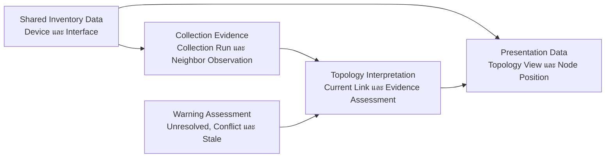


### กลุ่มที่ 1 — ข้อมูลร่วมจาก Device Inventory

NTV ต้องใช้ แต่ไม่ควรสร้างซ้ำ:

- `devices`
- `interfaces`
- Credential Reference ไม่ใช่ Credential Secret

หน้าที่:

- `devices` เป็นตัวตนของ Node
- `interfaces` เป็น Endpoint ของ Link

NTV ต้องไม่เพิ่ม `connected_to_device_id` หรือ `connected_to_interface` กลับเข้า `interfaces`

### กลุ่มที่ 2 — หลักฐานจากการเก็บข้อมูล

ใช้บันทึกว่าอุปกรณ์รายงานอะไรในแต่ละรอบ:

- Collection Run
- Neighbor Observation
- LLDP Source
- Local Interface
- Remote Identity/Interface
- เวลาที่ตรวจพบ
- Raw หรือ Parsed Evidence Reference

ข้อมูลนี้ควรรักษาประวัติและไม่แก้ทับ

### กลุ่มที่ 3 — ข้อสรุปสำหรับแสดงใน NTV

ใช้ตอบว่า NTV ควรวาด Link ใดในขณะนี้:

- Current Topology Link
- One-sided
- Corroborated
- Active
- Stale
- Needs Review
- Conflict

ส่วนนี้เป็นผลจากการเปรียบเทียบ Observation หลายรายการ ไม่ใช่ Raw Data จากอุปกรณ์โดยตรง

### กลุ่มที่ 4 — Warning สำหรับข้อมูลที่ผิดปกติ

ใช้แสดงผลเมื่อระบบอัตโนมัติให้ข้อสรุปไม่ครบหรือข้อมูลขัดกัน:

- Unresolved Neighbor
- Parser/Collection Warning
- Conflict ระหว่าง Observation
- Stale Link

MVP คำนวณ Warning เพื่อแสดงผล ไม่มี Human Review Record หรือ Manual Override Table

### กลุ่มที่ 5 — ข้อมูลการแสดงผล

เก็บเฉพาะสิ่งที่เกี่ยวกับ Canvas:

- Topology View
- Device ที่อยู่ใน View
- ตำแหน่ง `x/y`
- Pin/Hide
- Layout Settings

การลาก Node ต้องไม่เปลี่ยน Device, Interface หรือ Link Evidence

## 1.3 เจ้าของข้อมูล

|ข้อมูล|เจ้าของหลัก|NTV ทำอะไรได้|
|---|---|---|
|Device|Device Inventory|อ่านและอ้างอิง|
|Interface|Device Inventory|อ่านและใช้เป็น Endpoint|
|Credential|Credential Management|ไม่อ่าน Secret|
|Collection Run|Collection/Discovery|อ่านสถานะและอ้างอิง|
|Neighbor Observation|Collection/Discovery|อ่านและนำไป Reconcile|
|Current Topology Link|NTV|สร้าง/ปรับจากหลักฐาน|
|Evidence Assessment|NTV/Reconciliation|คำนวณอัตโนมัติ|
|Topology View/Layout|NTV|จัดการได้|
|User|Auth/RBAC|อ้างผู้ดำเนินการ|
|Audit Log|Audit Infrastructure|ส่งเหตุการณ์ไปบันทึก|

`Manual Override` และ `Exception Review` เป็น Future Extension และไม่สร้างตารางใน MVP

## 1.4 สิ่งที่ไม่เก็บใน Schema ของ NTV

- Password, SSH Key หรือ SNMP Community
- Running Configuration
- Device Identity ซ้ำจาก `devices`
- Interface Detail ซ้ำจาก `interfaces`
- Link แบบ Freehand ที่ไม่มีหลักฐาน
- Real-time Metrics แบบ Time-series
- OSPF/BGP Logical Topology
- AI Decision
- การเปลี่ยน VLAN หรือ Configuration

## 1.5 ขอบเขตเวลา

NTV เป็น Snapshot-based Topology:

- Observation มีเวลาที่ตรวจพบ
- Current Link แสดงข้อสรุปล่าสุด
- ข้อมูลเก่าเปลี่ยนเป็น Stale
- Collection ล้มเหลวหนึ่งครั้งไม่ลบ Link
- ประวัติต้องยังตรวจย้อนหลังได้

## ผลลัพธ์ของ Step 1

ฐานข้อมูล NTV จะแยกอย่างชัดเจนระหว่าง:

1. ข้อมูลอุปกรณ์
2. หลักฐานจากอุปกรณ์
3. ข้อสรุป Link ปัจจุบัน
4. ข้อมูลข้อยกเว้นจากมนุษย์
5. ตำแหน่งการแสดงผล

แนวคิดที่คุณบอกเพื่อนไปถือว่าถูกทางครับ แต่แนะนำให้เปลี่ยนคำจาก

> “Feature ของฉันขอข้อมูลจาก Database ของเพื่อน”

เป็น

> “Feature ของฉันขอ Data Contract จาก Feature ที่เป็นเจ้าของข้อมูล”

เพราะตอนรวมระบบอาจใช้ PostgreSQL ฐานเดียวกัน แต่แต่ละตารางยังต้องมีเจ้าของชัดเจน ไม่เช่นนั้นสมาชิกหลายคนอาจสร้าง `devices`, `users` หรือ `interfaces` ซ้ำกัน

## กติกาแนะนำสำหรับทีม

1. แต่ละคนออกแบบเฉพาะตารางที่ Feature ตนเองเป็นเจ้าของ
2. เมื่อต้องใช้ข้อมูลของ Feature อื่น ให้ระบุเป็น External Dependency
3. ห้ามเพิ่ม Column ลงตารางของเพื่อนเองโดยไม่ตกลงกัน
4. ระบุ Field และความหมายที่ต้องการ ไม่ขอทั้งตารางแบบกว้าง ๆ
5. ผู้เป็นเจ้าของข้อมูลเป็นคนตัดสินชื่อ Field และข้อจำกัดสุดท้าย
6. ตอนรวม Schema ให้สร้าง Central ERD และ Data Dictionary อีกครั้ง
7. Cross-feature FK ใช้ได้ เพราะ MyNetMate เป็น Modular Monolith และใช้ PostgreSQL ร่วมกัน แต่ต้องระบุ Migration Dependency

ตัวอย่าง:

> NTV ต้องการ `devices.id`, `devices.hostname` และ `devices.device_type` จาก Device Inventory เพื่อใช้แสดง Node โดย NTV ไม่สร้างหรือแก้ข้อมูลเหล่านี้เอง

# Step 2 — Use Cases และ Query ที่ Schema ต้องตอบ

ขั้นนี้ยังไม่ออกแบบ Table เราจะกำหนดก่อนว่า Database ต้องตอบคำถามอะไรได้บ้าง เพราะแต่ละ Query จะย้อนกลับมาบอกว่าเราต้องมี Entity และความสัมพันธ์ใด

## 2.1 ผู้ใช้งานหลัก

### Admin

- ดู Topology
- จัด Shared Layout
- สั่ง Re-collect

### Operator

- ดูและจัด Topology
- สั่ง Re-collect
- เปิดรายละเอียด Warning/Unresolved Data

### Viewer

- ดู Topology
- Zoom, Pan และ Filter ชั่วคราว
- ไม่เปลี่ยนข้อมูลร่วม
- ไม่สั่งติดต่ออุปกรณ์

## 2.2 Use Cases หลักของ NTV

### UC-NTV-01 — โหลดแผนผัง

ผู้ใช้เปิด Topology View แล้วระบบต้องโหลด:

- Device Node
- ตำแหน่งของแต่ละ Node
- Current Link
- Port ทั้งสองฝั่ง
- Source และเวลาตรวจล่าสุด
- Evidence Assessment
- Current Link State

คำถามที่ฐานข้อมูลต้องตอบ:

> ใน View นี้มี Device อะไรบ้าง อยู่ตำแหน่งใด และมี Link ปัจจุบันอะไรเชื่อมกันอยู่?

### UC-NTV-02 — แสดงรายละเอียด Link

เมื่อผู้ใช้กด Link ต้องเห็น:

- Device และ Interface ทั้งสองฝั่ง
- LLDP
- ตรวจพบครั้งแรกและล่าสุดเมื่อใด
- พบจากฝั่งเดียวหรือทั้งสองฝั่ง
- Collection Run ที่เกี่ยวข้อง
- Current State
- Conflict/Stale Warning ที่เกี่ยวข้อง

คำถาม:

> Link นี้เกิดจากหลักฐานใด และเชื่อถือได้ระดับใด?

### UC-NTV-03 — แสดง One-sided Link

หากอุปกรณ์ฝั่งหนึ่งรายงาน Neighbor และระบบจับคู่ Endpoint ได้ แต่ยังไม่มีข้อมูลจากอีกฝั่ง:

- แสดง Link อัตโนมัติ
- ระบุ `one_sided`
- ไม่สร้าง Human Review Record
- ไม่ต้องให้ผู้ใช้ Confirm

คำถาม:

> มี Observation ฝั่งเดียวใดบ้างที่จับคู่กับ Device และ Interface ได้สำเร็จ?

### UC-NTV-04 — รวม Observation สองฝั่ง

หากอุปกรณ์ทั้งสองฝั่งรายงาน Port คู่เดียวกัน:

- รวม Observation เป็น Current Link เดียว
- ระบุ `corroborated`
- อ้างหลักฐานจากทั้งสอง Observation
- ไม่สร้าง Link ซ้ำ

คำถาม:

> Observation สองรายการใดกล่าวถึง Physical Link เดียวกัน?

### UC-NTV-05 — แสดงรายการที่ต้องตรวจสอบ

ผู้ใช้เปิดรายการ Warning/Pending แล้วเห็น:

- Unresolved Neighbor
- Conflict
- Parser Error
- Stale Link ตาม Policy

คำถาม:

> มีข้อมูลใดที่ระบบยัง Resolve ไม่ได้ ขัดกัน หรือเก่าเกิน Policy?

### UC-NTV-06 — แสดง Warning โดยไม่แก้หลักฐาน

เมื่อระบบพบ Unresolved, Parser Error, Conflict หรือ Stale:

- แสดงชนิด Warning และหลักฐานที่เกี่ยวข้อง
- ผู้ใช้เปิดรายละเอียดหรือตรวจสายจริงได้
- ผู้ใช้สั่ง Re-collect ได้ตามสิทธิ์
- NTV ไม่แก้ Raw Observation และไม่มี Human Resolution Workflow ใน MVP

คำถาม:

> Warning นี้เกิดจาก Observation/Collection ใด และตรวจพบล่าสุดเมื่อใด?

### UC-NTV-07 — แสดง Conflict

เมื่อหลักฐานขัดกัน ผู้ใช้ต้องดู:

- Observation ใหม่
- Current Link เดิม
- Observation ที่เกี่ยวข้อง
- เวลาของแต่ละหลักฐาน

ผู้ใช้สามารถตรวจสายหรือสั่ง Re-collect แต่ไม่เลือกหรือ Override ข้อสรุปภายใน MVP

คำถาม:

> Conflict นี้เกิดจากหลักฐานใด และ Collection ใหม่ทำให้ข้อขัดแย้งหายหรือไม่?

### UC-NTV-08 — Manual Override (Future Extension)

Use Case นี้ไม่อยู่ใน MVP หากเปิด Future Scope จึงค่อยรองรับการเลือก Interface จริง เหตุผล Evidence Note ผู้สร้าง และ Lifecycle

ห้ามนำ Use Case นี้ไปสร้าง Table, API หรือ Acceptance Criteria ของ MVP

### UC-NTV-09 — สั่ง Re-collect

ผู้ใช้กด Re-collect จาก Device หรือ Link:

- ตรวจ RBAC
- เริ่ม Collection Job
- แสดงสถานะ Running/Success/Partial/Failed
- เมื่อเสร็จแล้ว Reconcile Topology ใหม่

คำถาม:

> Collection ล่าสุดของ Device นี้อยู่ในสถานะใด และสร้าง Observation อะไรบ้าง?

NTV ไม่เป็นเจ้าของ Collection Table แต่ต้องขอ Contract จาก Discovery/Collection Feature

### UC-NTV-10 — จัดตำแหน่ง Node

ผู้ใช้ลาก Node แล้วระบบต้อง:

- บันทึก `x/y`
- อ้าง Device และ Topology View
- ไม่แก้ Device หรือ Link
- โหลดตำแหน่งเดิมเมื่อเปิดใหม่

คำถาม:

> Device นี้อยู่ตำแหน่งใดใน Topology View นี้?

### UC-NTV-11 — ตรวจ Link ที่เปลี่ยนหรือเก่า

หลัง Collection รอบใหม่ ระบบต้องหา:

- Link ใหม่
- Link ที่พบซ้ำ
- Link ที่ไม่พบรอบล่าสุด
- Link ที่ Endpoint เปลี่ยน
- Link ที่ขัดกับ Observation เดิม

คำถาม:

> Current Link ใดเปลี่ยนไปจาก Collection ก่อนหน้า และควรเป็น Active, Stale หรือ Conflict?

### UC-NTV-12 — Filter และค้นหา

ผู้ใช้ Filter ตาม:

- Site หรือ Device Group
- Vendor
- Device Type
- Reachability
- Collection Health
- Evidence Assessment
- Current Link State

คำถาม:

> Node และ Link ใดตรงกับเงื่อนไขของ View/Filter ปัจจุบัน?

## 2.3 Query Catalog

| Query ID     | Query                                            | ผู้ใช้/ระบบ    |
| ------------ | ------------------------------------------------ | -------------- |
| `QRY-NTV-01` | โหลด Node, Position และ Current Link ของ View    | ทุก Role       |
| `QRY-NTV-02` | โหลดรายละเอียดและหลักฐานของ Link                 | ทุก Role       |
| `QRY-NTV-03` | หา One-sided Observation                         | Reconciliation |
| `QRY-NTV-04` | จับ Observation สองฝั่งเป็น Corroborated Link    | Reconciliation |
| `QRY-NTV-05` | โหลด Unresolved, Conflict และ Stale Warning       | ทุก Role       |
| `QRY-NTV-06` | โหลด Collection ล่าสุดของ Device                 | ทุก Role       |
| `QRY-NTV-07` | หา Link ที่ไม่พบใน Collection ล่าสุด             | Reconciliation |
| `QRY-NTV-10` | โหลด Node/Link ตาม Filter                        | ทุก Role       |
| `QRY-NTV-11` | ตรวจ Parallel Links ระหว่าง Device คู่เดียวกัน   | Reconciliation |
| `QRY-NTV-12` | โหลดประวัติการเปลี่ยน Link                       | Admin/Operator |

## 2.4 ข้อมูลที่ NTV ขอจาก Feature ของเพื่อน

## ขอจาก Device Inventory

| Contract ID      | ข้อมูลที่ขอ                                     | ใช้ทำอะไร                              |
| ---------------- | ----------------------------------------------- | -------------------------------------- |
| `NTV-DEP-INV-01` | `device_id`                                     | ตัวตนของ Node และ FK                   |
| `NTV-DEP-INV-02` | Hostname, Vendor, Model, Device Type            | แสดง Node                              |
| `NTV-DEP-INV-03` | Site, Group, Role                               | Filter และกำหนด View                   |
| `NTV-DEP-INV-04` | Reachability, Collection Status, Last Collected | แสดงสถานะและ Freshness                 |
| `NTV-DEP-INV-05` | `interface_id`, `device_id`, Name, IfIndex      | ใช้เป็น Link Endpoint                  |
| `NTV-DEP-INV-06` | Admin/Oper Status, Speed, Description           | แสดงรายละเอียด Port                    |
| `NTV-DEP-INV-07` | Soft-delete/Active State                        | ไม่แสดง Device ที่ถูกนำออกจากการบริหาร |

เงื่อนไขสำคัญ:

- `device_id` และ `interface_id` ต้องมีความเสถียร
- NTV อ่านข้อมูลเหล่านี้ แต่ไม่แก้เอง
- Inventory ต้องแจ้งความหมายของ Soft Delete
- Interface ต้องมี `UNIQUE(device_id, name)`

## ขอจาก Discovery/Collection

| Contract ID      | ข้อมูลที่ขอ                             | ใช้ทำอะไร                        |
| ---------------- | --------------------------------------- | -------------------------------- |
| `NTV-DEP-DIS-01` | Collection Run ID, Device ID และ Status | ผูก Observation กับรอบเก็บข้อมูล |
| `NTV-DEP-DIS-02` | Started/Finished Time และ Error         | แสดง Collection Health           |
| `NTV-DEP-DIS-03` | Local Device/Interface                  | ระบุฝั่งที่รายงาน Neighbor       |
| `NTV-DEP-DIS-04` | Protocol — LLDP                     | ระบุ Source                      |
| `NTV-DEP-DIS-05` | Remote Chassis/System/Port Identity     | จับคู่ Remote Endpoint           |
| `NTV-DEP-DIS-06` | Observed Time และ Parse Status          | Freshness และ Needs Review       |
| `NTV-DEP-DIS-07` | Test Environment                        | แยก Emulated กับ Physical Lab    |

Discovery ควรส่ง Parsed Observation พร้อม Raw Identity แต่ไม่จำเป็นต้องสรุป Current Topology Link เพราะเป็นหน้าที่ของ NTV Reconciliation

## ขอจาก Auth/RBAC

|Contract ID|ข้อมูลที่ขอ|ใช้ทำอะไร|
|---|---|---|
|`NTV-DEP-AUTH-01`|`user_id`|ผู้สร้าง/แก้/Resolve|
|`NTV-DEP-AUTH-02`|Role หรือ Permission|ตรวจสิทธิ์|
|`NTV-DEP-AUTH-03`|Active State|ป้องกันบัญชีที่ถูกปิดทำรายการ|

NTV ไม่ควรเก็บ Username/Password ซ้ำ

## ขอจาก Audit Infrastructure

NTV ส่ง Event ให้ Audit เช่น:

- Re-collect requested
- Incorrect report created
- Conflict resolved
- Override created/verified/archived
- Shared Layout changed

NTV ไม่ต้องสร้างระบบ Audit แยกเอง

## 2.5 ข้อมูลที่ Feature อื่นอาจขอจาก NTV

## Dashboard ขอจาก NTV

เนื่องจากคุณรับผิดชอบทั้งสองส่วน ควรกำหนด Contract แยกไว้:

|Contract ID|ข้อมูลที่ Dashboard ขอ|ใช้แสดง|
|---|---|---|
|`DASH-DEP-NTV-01`|จำนวน Active Links|Metrics Card|
|`DASH-DEP-NTV-02`|จำนวน Stale Links|Warning Metric|
|`DASH-DEP-NTV-03`|จำนวน Needs Review/Conflict|Attention Metric|
|`DASH-DEP-NTV-04`|Last Reconciliation Time|ความใหม่ของข้อมูล|
|`DASH-DEP-NTV-05`|Recent NTV Audit Events|Activity Feed|
Dashboard ควรอ่านผ่าน Query Service หรือ Database View ไม่สร้างตารางสำเนาของ Link

## Security & Validation ขอจาก NTV

สำหรับ MVP ยังไม่จำเป็นต้องมี Dependency โดยตรง หากกด Node แล้วเปิดผล CIS Scan ให้ส่งเพียง `device_id` ไปยัง Security & Validation Feature

ไม่ควรให้ NTV เก็บ Scan Result ซ้ำ

## 2.6 Template สำหรับคุยกับเพื่อน

ใช้รูปแบบนี้ได้เลย:

```
Contract ID:
Consumer Feature:
Owner Feature:

ข้อมูลที่ต้องการ:
- Entity/Field:
- ความหมาย:
- ใช้ทำอะไร:

Key ที่ใช้อ้างอิง:
Cardinality:
Nullable ได้หรือไม่:
Freshness ที่ต้องการ:
Soft-delete behavior:
สิทธิ์ในการเข้าถึง:
กรณีข้อมูลไม่มี/Feature ล้มเหลว:
```

ตัวอย่าง:

```
Contract ID: NTV-DEP-INV-05
Consumer Feature: Network Topology Visualization
Owner Feature: Device Inventory

ข้อมูลที่ต้องการ:
- interface_id
- device_id
- interface_name
- if_index
- admin_status
- oper_status
- last_collected_at

ใช้ทำอะไร:
ใช้ Interface เป็น Endpoint ของ Topology Link

สิทธิ์:
NTV อ่านอย่างเดียว

ข้อกำหนด:
interface_id ต้องคงที่
ต้องมี UNIQUE(device_id, interface_name)
ถ้า Interface ถูก Soft-delete ต้องยังอ้างประวัติ Observation เดิมได้
```

## ผลลัพธ์ของ Step 2

ตอนนี้เราทราบแล้วว่า Schema ต้องรองรับ Query ใด และ NTV เป็นเจ้าของข้อมูลใดหรือเพียงขอจาก Feature อื่น


# Step 3 — Conceptual Entities

ขั้นนี้เราจะตอบคำถามว่า:

> “NTV ต้องรู้จักข้อมูลประเภทใดบ้าง และข้อมูลแต่ละประเภทเป็นความรับผิดชอบของฟีเจอร์ใด”

ยังไม่ต้องกำหนดชื่อ Table, Column, Data Type, PK หรือ FK เพราะจะทำใน Step 6

### 3.1 หลักในการหา Entity

ข้อมูลหนึ่งควรเป็น Conceptual Entity เมื่อ:

- มีตัวตนหรือความหมายแยกจากข้อมูลอื่น
- ต้องมีวงจรชีวิตของตัวเอง เช่น สร้าง ตรวจสอบ หมดอายุ หรือเก็บประวัติ
- ผู้ใช้หรือระบบต้องอ้างถึงข้อมูลนั้นโดยตรง
- ไม่ควรฝังรวมกับ Entity อื่นจนทำลายประวัติ

ตัวอย่างเช่น `Device` และ `Interface` เป็นคนละ Entity เพราะอุปกรณ์หนึ่งมีหลาย Interface และแต่ละ Interface เป็นจุดปลายของ Link ได้

---

## 3.2 Entity ที่ NTV ขอจากฟีเจอร์อื่น

Entity เหล่านี้ NTV ใช้งาน แต่ไม่ควรสร้างตารางซ้ำ

|Conceptual Entity|เจ้าของข้อมูล|ความหมาย|NTV ใช้ทำอะไร|
|---|---|---|---|
|**Device**|Device Inventory|อุปกรณ์จริงที่ระบบเชื่อมต่อและเก็บข้อมูลสำเร็จแล้ว|ใช้เป็น Node บนแผนผัง|
|**Interface**|Device Inventory|Port จริงที่เก็บมาจากอุปกรณ์|ใช้เป็นจุดปลายของ Link|
|**Collection Run**|Discovery/Collection|การเก็บข้อมูลจากอุปกรณ์หนึ่งรอบ|บอกว่าหลักฐานมาจากการเก็บข้อมูลรอบใด|
|**Neighbor Observation**|Discovery/Collection|ผล LLDP ที่พบในเวลาหนึ่ง|เป็นหลักฐานสำหรับสร้าง Link|
|**User**|Auth/RBAC|ผู้ใช้ที่ดำเนินการในระบบ|ระบุผู้สั่ง Re-collect หรือผู้แก้ Shared Layout|
|**Audit Event**|Audit Infrastructure|ประวัติการกระทำสำคัญ|ตรวจสอบย้อนหลังว่าใครทำอะไรและเมื่อใด|

ความแตกต่างสำคัญคือ:

- `Collection Run` คือรอบที่ระบบไปเก็บข้อมูลจากอุปกรณ์
- `Reconciliation Run` คือรอบที่ NTV นำข้อมูลซึ่งเก็บมาแล้วมาวิเคราะห์และสร้างแผนผัง

สองอย่างนี้ไม่ใช่ข้อมูลเดียวกัน

### Data Contract ที่ NTV ต้องขอจากเพื่อน

- จาก Device Inventory: `Device` และ `Interface`
- จาก Discovery/Collection: `Collection Run` และ `Neighbor Observation`
- จาก Auth/RBAC: ตัวตนผู้ใช้และผลการตรวจสอบสิทธิ์
- จาก Audit: ช่องทางสำหรับบันทึกเหตุการณ์สำคัญ

NTV ไม่ควรแก้ไข Raw Neighbor Observation ของฟีเจอร์ Discovery

---

## 3.3 Entity ที่ NTV เป็นเจ้าของ

### 1. Topology View

หมายถึงมุมมองแผนผังที่ผู้ใช้เปิดดู เช่น:

- แผนผังทั้งหมด
- แผนผังเฉพาะ Site
- แผนผังสำหรับห้อง Lab

Entity นี้เก็บความหมายของ “มุมมอง” ไม่ได้เก็บข้อมูลอุปกรณ์ซ้ำ

เหตุผลที่ต้องมีคืออุปกรณ์ชุดเดียวกันอาจถูกแสดงในหลายมุมมองและมีการจัดวางตำแหน่งต่างกันได้

---

### 2. Node Placement

หมายถึงตำแหน่งการแสดง Device ภายใน Topology View เช่น:

- ตำแหน่งบนแกน X/Y
- ถูก Pin ไว้หรือไม่
- ถูกซ่อนเฉพาะใน View นี้หรือไม่

`Node Placement` ต้องแยกจาก `Device` เพราะการลาก Node เป็นเพียงการจัดหน้าจอ ไม่ได้เปลี่ยนข้อมูลหรือที่ตั้งจริงของอุปกรณ์

> NTV ไม่ต้องมี Entity ชื่อ `Topology Node` แยกอีก เพราะ Node บนแผนผังคือการนำ `Device` มาแสดงผ่าน `Node Placement`

---

### 3. Reconciliation Run

หมายถึงการประมวลผลหนึ่งรอบของ NTV ซึ่งนำข้อมูลจาก:

- Neighbor Observation

มาจับคู่และสร้างสถานะของแผนผังปัจจุบัน

เหตุผลที่ควรมี Entity นี้:

- ทราบว่าแผนผังถูกคำนวณล่าสุดเมื่อใด
- ตรวจสอบได้ว่าใช้ Observation ชุดใด
- แยกความล้มเหลวในการเก็บข้อมูลออกจากความล้มเหลวในการประมวลผล
- Dashboard สามารถแสดงเวลาประมวลผลล่าสุดได้

---

### 4. Current Topology Link

หมายถึงข้อสรุปของ NTV ว่า Interface สองฝั่งเชื่อมต่อกันอยู่ในแผนผังปัจจุบัน

ตัวอย่าง:

> Huawei `GE0/0/1` เชื่อมต่อกับ Cisco `Gi0/1`

Entity นี้เป็น “ผลลัพธ์สำหรับแสดงผล” ไม่ใช่หลักฐานดิบ

Link ต้องอ้างถึง Interface จริงที่เก็บจากอุปกรณ์แล้ว และต้องรองรับ:

- Link ที่พบจากฝั่งเดียว
- Link ที่พบตรงกันทั้งสองฝั่ง
- Parallel Links หรือหลายสายระหว่าง Device คู่เดียวกัน
- สถานะ Conflict และ Stale

ดังนั้นห้ามระบุเอกลักษณ์ของ Link ด้วยคู่ Device เพียงอย่างเดียว ต้องพิจารณาคู่ Interface ด้วยใน Step 4–6

---

### 5. Topology Link Evidence

หมายถึงความสัมพันธ์ระหว่าง `Current Topology Link` กับหลักฐานที่ใช้สร้าง Link นั้น

ตัวอย่าง:

- Current Link A อ้าง Neighbor Observation จาก Cisco หนึ่งรายการ → One-sided
- Current Link B อ้าง Observation จาก Cisco และ Huawei ที่ตรงกัน → Corroborated

Entity นี้จำเป็นเพราะ Link หนึ่งเส้นสามารถมีหลักฐานมากกว่าหนึ่งรายการได้ และ Observation หนึ่งรายการไม่ควรถูกคัดลอกหรือแก้ทับลงใน Current Link

ใน MVP ใช้ตารางเชื่อม Current Link Evaluation กับ Neighbor Observation เท่านั้น

---

### 6. Manual Override — Future Concept

หมายถึงหลักฐานจากมนุษย์เมื่อ LLDP ใช้ไม่ได้หรือ Parser ยังไม่รองรับอุปกรณ์

ตัวอย่าง:

> ตรวจสายจริงใน Lab แล้วพบว่า Huawei `GE0/0/1` ต่อกับ Cisco `Gi0/1`

Concept นี้ไม่อยู่ใน MVP หากเปิด Future Scope จึงค่อยออกแบบให้:

- เลือก Device และ Interface ที่ระบบเก็บจากอุปกรณ์จริงแล้ว
- ระบุเหตุผล
- ระบุหลักฐานหรือวิธีตรวจสอบ
- ระบุผู้สร้างและเวลา
- มีสถานะการใช้งาน เช่น รอตรวจสอบ ใช้งานอยู่ หรือถูกเก็บถาวร

Manual Override ไม่ใช่การวาด Link อย่างอิสระ และไม่สามารถเปลี่ยนสายจริงได้

---

### 7. Exception Review — Future Concept

Concept นี้ไม่อยู่ใน MVP หมายถึงข้อมูลสำหรับจัดการกรณีผิดปกติในอนาคต เช่น:

- ผู้ใช้กด Report Incorrect
- ระบบพบ Conflict
- Observation ระบุปลายทางไม่ได้
- ผู้ใช้ Resolve Conflict
- ผู้ใช้ตรวจสอบ Manual Override

Entity นี้ต้องรักษา:

- สิ่งที่กำลังถูกตรวจสอบ
- ประเภทปัญหา
- เหตุผลหรือคำอธิบาย
- ผู้ดำเนินการ
- เวลา
- ผลการตัดสินใจ
- สถานะว่าจัดการแล้วหรือยัง

ยังไม่สร้าง `Exception Review`, `Topology Issue` หรือ `Review Action` Table ใน MVP

---

## 3.4 สิ่งที่ไม่ควรสร้างเป็น Entity ของ NTV

|สิ่งที่ไม่ควรสร้าง|เหตุผล|
|---|---|
|Device หรือ Interface สมมติ|ขัดกับมติที่กำหนดว่าต้องเก็บข้อมูลจากอุปกรณ์จริง|
|Freehand Link|ทำให้ NTV กลายเป็นโปรแกรมวาด Diagram|
|Credential หรือ Password|เป็นความรับผิดชอบของระบบ Credential Management|
|Vendor-specific Link|Link ควรเป็นกลาง ไม่ผูกกับ Cisco, Huawei หรือ MikroTik|
|Dashboard Metric|ควรคำนวณจาก NTV ไม่ต้องสร้างข้อมูลซ้ำใน MVP|
|AI Decision|AI ไม่มีสิทธิ์สรุปหรือแก้ไข Link|
|Topology Node แยกจาก Device|Node เป็นการแสดงผลของ Device ไม่ใช่อุปกรณ์อีกชุดหนึ่ง|

---

## 3.5 ข้อมูลที่เป็น “สถานะ” ไม่ใช่ Entity

ควรแยกสถานะของ Link ออกเป็นสองมิติ:

### ระดับของหลักฐาน

- `One-sided`
- `Corroborated`

### สภาพปัจจุบันของข้อมูล

- `Active`
- `Unresolved` (ใช้กับ Observation/Warning ไม่ใช่ Verified Current Link)
- `Conflict`
- `Stale`
- `Archived`

ตัวอย่างเช่น Link หนึ่งอาจเป็น:

> `One-sided` และ `Active`

ต่อมาเมื่อไม่พบในการเก็บข้อมูลรอบใหม่ อาจกลายเป็น:

> `One-sided` และ `Stale`

ดังนั้น `One-sided` กับ `Stale` ไม่ใช่สถานะประเภทเดียวกัน และไม่ควรรวมเป็นรายการสถานะชุดเดียว

---

## 3.6 ภาพรวมความสัมพันธ์ในระดับ Concept

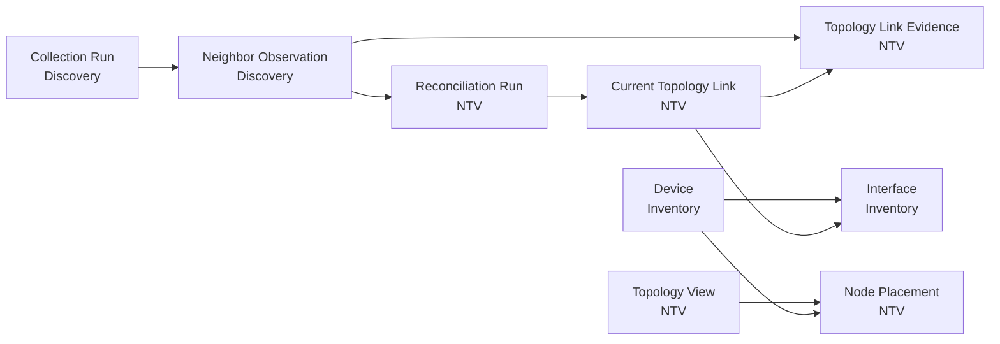

เส้นในภาพนี้แสดงเพียงว่า Entity เกี่ยวข้องกันอย่างไร ส่วนจำนวนความสัมพันธ์ เช่น One-to-Many หรือ Many-to-Many จะกำหนดใน **Step 4 — Relationships and Cardinality**

## ผลลัพธ์ของ Step 3

NTV MVP มี Entity ที่เป็นเจ้าของ 5 รายการ:

1. Topology View
2. Node Placement
3. Reconciliation Run
4. Current Topology Link
5. Topology Link Evidence

และขอใช้ Entity จากฟีเจอร์อื่น 6 รายการ:

1. Device
2. Interface
3. Collection Run
4. Neighbor Observation
5. User
6. Audit Event

Manual Override และ Exception Review เก็บเป็น Future Concepts นอก MVP โมเดลปัจจุบันยังคงหลักสำคัญว่า **Raw Observation ไม่ถูกแก้ทับ, ไม่มี Node/Link สมมติ และ NTV ไม่จัดเก็บข้อมูลซ้ำจากฟีเจอร์เพื่อน**


# Step 4 — Relationships and Cardinality

ขั้นนี้ตอบว่า:

> Entity ใดสัมพันธ์กับ Entity ใด และข้อมูลหนึ่งรายการเชื่อมโยงได้กี่รายการ

ยังไม่กำหนดชื่อคอลัมน์หรือชนิดข้อมูล แต่ผลของ Step นี้จะนำไปสร้าง ERD และกำหนด FK ใน Step 6

## 4.1 สัญลักษณ์ Cardinality

|สัญลักษณ์|ความหมาย|
|---|---|
|`1`|ต้องมีหนึ่งรายการ|
|`0..1`|ไม่มีหรือมีได้หนึ่งรายการ|
|`0..*`|ไม่มีหรือมีหลายรายการ|
|`1..*`|ต้องมีอย่างน้อยหนึ่งรายการ|

---

## 4.2 Device และ Interface

### R-NTV-01 — Device มี Interface

```
Device 1 ─── 0..* Interface
```

- Device หนึ่งเครื่องมี Interface ได้หลายช่อง
- Interface หนึ่งรายการต้องเป็นของ Device เพียงเครื่องเดียว
- Device ที่เพิ่ง Enrollment อาจยังไม่มี Interface หากยังเก็บข้อมูลไม่สำเร็จ

ตัวอย่าง:

```
Cisco-SW01
├── Gi0/1
├── Gi0/2
└── Gi0/3
```

NTV ใช้ `Device` เป็น Node และใช้ `Interface` เป็นจุดปลายของ Link

---

## 4.3 Collection และ Neighbor Observation

### R-NTV-02 — Collection Run มี Observation

```
Collection Run 1 ─── 0..* Neighbor Observation
```

- Collection หนึ่งรอบอาจพบ Neighbor หลายรายการ
- อาจไม่พบเลยก็ได้
- Observation หนึ่งรายการต้องมาจาก Collection Run เดียว

การไม่พบ Observation ไม่ได้แปลว่าไม่มีสายเสมอไป เพราะอาจเกิดจาก:

- LLDP ถูกปิด
- อุปกรณ์ไม่รองรับ
- Parser ทำงานไม่สำเร็จ
- Collection ล้มเหลว

---

### R-NTV-03 — Local Endpoint ของ Observation

```
Device 1 ─── 0..* Neighbor Observation
Interface 1 ─── 0..* Neighbor Observation
```

Neighbor Observation ที่ NTV นำมาใช้ต้องมี:

- Local Device หนึ่งเครื่อง
- Local Interface หนึ่งช่อง
- Local Interface ต้องเป็นของ Local Device ดังกล่าว

ตัวอย่าง:

```
Cisco-SW01 Gi0/1 รายงานว่าเห็น Huawei-R01 GE0/0/1
```

Cisco คืออุปกรณ์ที่รายงานข้อมูล จึงเป็น Local Device

---

### R-NTV-04 — Remote Endpoint ของ Observation

```
Neighbor Observation ─── 0..1 Remote Device
Neighbor Observation ─── 0..1 Remote Interface
```

ปลายทางเป็น Optional เพราะข้อมูล LLDP อาจยังจับคู่กับ Inventory ไม่ได้

### กรณี Resolve ได้

```
Remote Device    = Huawei-R01
Remote Interface = GE0/0/1
```

ระบบสามารถนำ Observation ไปสร้าง One-sided Link ได้

### กรณี Resolve ไม่ได้

```
Raw Remote Chassis ID = 00:11:22:33:44:55
Raw Remote Port       = GigabitEthernet0/1
Remote Device         = ไม่ทราบ
Remote Interface      = ไม่ทราบ
```

ระบบต้อง:

- รักษา Raw Identity ไว้
- ไม่สร้าง Device หรือ Interface สมมติ
- แสดงรายการ `unresolved` ใน Warning/Pending Query โดยไม่สร้าง Human Review Record

---

## 4.4 Topology View และ Node Placement

### R-NTV-05 — ตำแหน่ง Device ใน View

```
Topology View 1 ─── 0..* Node Placement
Device 1 ─── 0..* Node Placement
```

`Node Placement` หนึ่งรายการต้องอ้างถึง:

- Topology View หนึ่งรายการ
- Device หนึ่งเครื่อง

คู่ของ View และ Device ต้องมี Node Placement ได้ไม่เกินหนึ่งรายการ:

```
หนึ่ง View + หนึ่ง Device = ไม่เกินหนึ่งตำแหน่งที่บันทึกไว้
```

หากไม่มี Node Placement ระบบสามารถใช้ตำแหน่งจาก Auto-layout ชั่วคราวได้

สำหรับ MVP ให้มี **Default Shared View หนึ่งมุมมอง** ก่อน ส่วนหลาย Named Views สามารถขยายภายหลังได้

ไม่มีความสัมพันธ์โดยตรงระหว่าง `Topology View` กับ `Current Topology Link` เพราะ Link ที่ต้องแสดงคำนวณจาก Device ที่อยู่ในขอบเขตหรือ Filter ของ View

---

## 4.5 Current Topology Link และ Interface

### R-NTV-06 — Link มีสอง Endpoint

```
Current Topology Link
├── Endpoint A → Interface 1 รายการ
└── Endpoint B → Interface 1 รายการ
```

Current Link หนึ่งเส้นต้องเชื่อม Interface จริงสองรายการ

```
Interface A 1 ─── 0..* Current Topology Link
Interface B 1 ─── 0..* Current Topology Link
```

Interface หนึ่งรายการอาจปรากฏใน Link หลายรายการเมื่อพิจารณาประวัติทั้งหมด เช่น:

- เคยต่อกับอุปกรณ์ A
- ต่อมาถูกย้ายไปอุปกรณ์ B
- Link เดิมกลายเป็น Stale หรือ Archived

แต่สำหรับ Physical Topology ใน MVP:

> Interface หนึ่งช่องควรอยู่ใน Active Link ได้ไม่เกินหนึ่งเส้นพร้อมกัน

หากระบบพบ Active Link หลายเส้นที่อ้าง Interface เดียวกัน ให้สร้าง Conflict แทนการเลือกเส้นใดเส้นหนึ่งโดยอัตโนมัติ

---

### Parallel Links

Device สองเครื่องเชื่อมกันหลายสายได้:

```
Cisco Gi0/1  ─── Huawei GE0/0/1
Cisco Gi0/2  ─── Huawei GE0/0/2
```

ดังนั้น:

- Device คู่เดียวกันมี Current Link ได้หลายเส้น
- Link ต้องแยกด้วยคู่ Interface
- ห้ามใช้เพียง `Device A + Device B` เป็นเอกลักษณ์ของ Link

---

## 4.6 Current Link และหลักฐาน

#### R-NTV-07 — Link มีหลักฐานอย่างน้อยหนึ่งรายการ

```
Current Topology Link 1 ─── 1..* Topology Link Evidence
```

- Current Link หนึ่งเส้นต้องมีหลักฐานอย่างน้อยหนึ่งรายการ
- `Topology Link Evidence` หนึ่งรายการต้องเป็นของ Current Link หนึ่งเส้น

หลักฐานหนึ่งรายการใน MVP ต้องอ้างถึง Neighbor Observation หนึ่งรายการ และ Current Link หนึ่งเส้นสามารถมี Evidence หลายรายการได้

#### One-sided

```
Current Link
└── Observation จาก Cisco 1 รายการ
```

#### Corroborated

```
Current Link
├── Observation จาก Cisco
└── Observation จาก Huawei
```

### Cardinality ของแหล่งหลักฐาน

```
Neighbor Observation 1 ─── 0..* Topology Link Evidence
```

เหตุผลที่ใช้ `0..*`:

- Observation ที่ยัง Resolve ไม่ได้อาจยังไม่สนับสนุน Link ใด
- หลักฐานเดิมอาจเคยใช้กับ Link ที่ภายหลังถูกแก้ข้อสรุปหรือ Archived

สำหรับแผนผังปัจจุบัน Observation หนึ่งรายการไม่ควรสนับสนุน Active Link ที่ขัดกันหลายเส้นพร้อมกัน

---

## 4.7 Manual Override — Future Relationship Design

> ส่วนนี้เก็บไว้สำหรับ Future Extension เท่านั้น ไม่สร้างความสัมพันธ์หรือตารางใน MVP

### R-NTV-08 — Manual Override มีสอง Endpoint

```
Manual Override
├── Endpoint A → Interface 1 รายการ
└── Endpoint B → Interface 1 รายการ
```

Manual Override หนึ่งรายการต้อง:

- อ้าง Interface จริงสองรายการ
- Interface ทั้งสองต้องไม่ใช่รายการเดียวกัน
- อ้างถึง Device ได้ผ่าน Interface โดยไม่ต้องเก็บ Device ซ้ำ
- มีผู้สร้างหนึ่งคน

```
User 1 ─── 0..* Manual Override
Manual Override ─── Creator 1 User
```

Manual Override สามารถมีได้โดยยังไม่สร้าง Current Link เช่น เมื่อมีสถานะ Pending

มีเพียง Override ที่ผ่านนโยบายการตรวจสอบแล้วเท่านั้นที่ควรถูกใช้เป็นหลักฐานของ Active Link

---

## 4.8 Collection Run และ Reconciliation Run

สอง Entity นี้มีความสัมพันธ์แบบ Many-to-Many:

```
Collection Run 0..* ─── 0..* Reconciliation Run
```

เหตุผล:

- Reconciliation หนึ่งรอบอาจใช้ข้อมูลล่าสุดจาก Collection หลายรอบและหลายอุปกรณ์
- Collection Run เดิมอาจถูกนำมาประมวลผลใหม่ เมื่อแก้กฎจับคู่หรือ Parser

ใน Step 6 ความสัมพันธ์นี้อาจต้องมีตารางเชื่อม เช่นแนวคิด `Reconciliation Input`

---

### R-NTV-09 — Reconciliation ประเมิน Link

```
Reconciliation Run 0..* ─── 0..* Current Topology Link
```

- Reconciliation หนึ่งรอบตรวจ Link ได้หลายเส้น
- Current Link เดิมอาจถูกตรวจซ้ำในหลาย Reconciliation Run
- Run อาจไม่สร้าง Link เลย หากไม่มีหลักฐานที่ Resolve ได้

ความสัมพันธ์นี้ช่วยตอบว่า:

- Link ถูกพบครั้งแรกเมื่อใด
- ถูกพบล่าสุดในรอบใด
- ไม่พบติดต่อกันกี่รอบ
- เมื่อใดควรเปลี่ยนเป็น Stale

ใน Step 6 ต้องเลือกว่าจะ:

1. เก็บประวัติทุกครั้งด้วย `Link Reconciliation Result` หรือ
2. เก็บเฉพาะ `first_seen`, `last_seen` และจำนวนรอบที่ไม่พบใน Current Link

สำหรับ MVP วิธีที่ 2 เบากว่า แต่ต้องรักษา Raw Observation ไว้สำหรับตรวจย้อนหลัง

---

## 4.9 Topology Issue และ Subject — Future Relationship Design

> ส่วนนี้ไม่อยู่ใน MVP ซึ่งใช้ Warning ที่คำนวณจาก Observation/Reconciliation โดยไม่สร้าง Human Review Workflow

## R-NTV-10 — Issue ต้องมีสิ่งที่กำลังถูกรายงาน

`Topology Issue` หนึ่งรายการต้องมี Primary Subject เพียงหนึ่งประเภท:

```
Current Topology Link
        XOR
Neighbor Observation
        XOR
Manual Override
```

ตัวอย่าง:

|ประเภท Issue|Primary Subject|
|---|---|
|ผู้ใช้รายงาน Link ผิด|Current Topology Link|
|Neighbor ระบุปลายทางไม่ได้|Neighbor Observation|
|Observation สองฝั่งขัดกัน|Current Topology Link|
|รอตรวจ Manual Override|Manual Override|
|Observation ใหม่ขัดกับ Override|Manual Override หรือ Current Link ตามกฎที่เลือก|

Subject แต่ละรายการมี Issue ได้หลายครั้งตลอดอายุการใช้งาน:

```
Subject 1 ─── 0..* Topology Issue
```

การใช้ Primary Subject เพียงหนึ่งรายการช่วยไม่ให้ฐานข้อมูลมีความหมายกำกวม ส่วนหลักฐานอื่นที่เกี่ยวข้องสามารถเข้าถึงผ่าน `Topology Link Evidence`

---

## 4.10 Issue และ Review/Resolution Action — Future Relationship Design

## R-NTV-11 — Issue มีการดำเนินการได้หลายครั้ง

```
Topology Issue 1 ─── 0..* Review/Resolution Action
```

Issue ที่ระบบเพิ่งตรวจพบอาจยังไม่มี Action จึงเป็น `0..*`

ตัวอย่างลำดับ:

```
Issue: Link ขัดแย้ง
├── Action 1: Operator ขอให้ Re-collect
├── Action 2: Admin ตรวจหลักฐาน
└── Action 3: Admin Resolve Conflict
```

Review Action หนึ่งรายการต้อง:

- อยู่ภายใต้ Issue หนึ่งรายการ
- ดำเนินการโดย User หนึ่งคน
- เก็บเหตุผลและเวลา
- ไม่แก้ไข Raw Observation

```
User 1 ─── 0..* Review/Resolution Action
Review/Resolution Action ─── Actor 1 User
```

การแยก Action ออกจาก Issue ทำให้ Issue เดียวมีประวัติการตรวจสอบหลายขั้นตอนได้

---

## 4.11 Audit Event

`Audit Event` เป็นของระบบกลาง ไม่ควรนำมาผูกเป็น FK หลักของทุกตาราง NTV

ใช้ความสัมพันธ์เชิงระบบว่า:

```
NTV Action สำคัญ 1 ครั้ง
        ↓
สร้าง Audit Event อย่างน้อย 1 รายการ
```

ตัวอย่าง Action ที่ต้องมี Audit:

- เปลี่ยน Shared Layout
- สั่ง Re-collect

Audit Event ควรอ้างชนิดและรหัสของ Entity ที่เกี่ยวข้อง แต่ NTV Entity ไม่จำเป็นต้องเก็บ `audit_event_id` กลับมาในทุกแถว

---

## 4.12 ภาพรวม Relationships

````
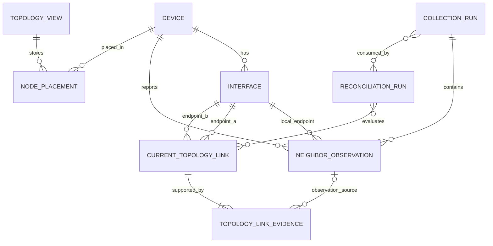
````

## ผลลัพธ์ของ Step 4

Relationship สำคัญที่ต้องนำไป Step 6 ได้แก่:

1. Device–Interface เป็น One-to-Many
2. Collection Run–Observation เป็น One-to-Many
3. View–Device เป็นความสัมพันธ์ผ่าน Node Placement
4. Current Link มี Interface Endpoint สองฝั่ง
5. Current Link–Evidence เป็น One-to-Many
6. Evidence อ้าง Neighbor Observation
7. Collection Run–Reconciliation Run เป็น Many-to-Many
8. Reconciliation Run–Current Link เป็น Many-to-Many ตามประวัติการประเมิน
9. Parallel Link รองรับด้วยคู่ Interface ไม่ใช่เพียงคู่ Device

จุดต่อไปใน **Step 5 — Lifecycle and State Model** คือกำหนดว่า `Current Link` และ `Reconciliation Run` เปลี่ยนสถานะอย่างไร โดยไม่ผสมสถานะจากคนละมิติเข้าด้วยกัน


# Step 5 — Lifecycle and State Model

ขั้นนี้ตอบว่า:

> Entity แต่ละชนิดเริ่มต้นอย่างไร เปลี่ยนสถานะเมื่อเกิดเหตุการณ์อะไร และสิ้นสุดอย่างไร

หลักสำคัญคือ **ห้ามสร้าง Status ช่องเดียวแล้วนำทุกความหมายมารวมกัน** เช่น `one_sided`, `conflict` และ `stale` เพราะเป็นคนละมิติ

---

## 5.1 หลักการร่วม

1. Raw Neighbor Observation เป็นหลักฐานแบบ Append-only ห้ามแก้ทับ
2. การเปลี่ยนข้อสรุปต้องสร้างผล Reconciliation ใหม่
3. Collection ล้มเหลวไม่ควรทำให้ Link กลายเป็น Stale
4. Link จะ Stale ได้เมื่อ Collection ที่เกี่ยวข้องสำเร็จ แต่ไม่พบ Link ซ้ำตามเกณฑ์
5. Conflict ไม่ได้แปลว่า Link หายไป แปลว่าหลักฐานกำลังขัดกัน
6. ข้อมูล Archived ไม่ถูก Hard-delete
7. การ Re-collect และเปลี่ยน Shared Layout ต้องบันทึก Audit Event ตามนโยบายส่วนกลาง

---

## 5.2 Reconciliation Run Lifecycle

`Reconciliation Run` คือรอบที่ NTV นำ Neighbor Observation มาวิเคราะห์

````
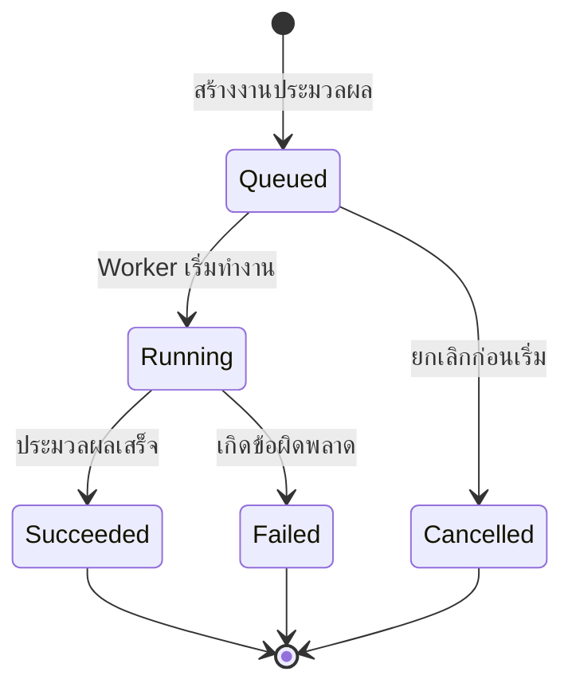
````

|สถานะ|ความหมาย|
|---|---|
|`queued`|งานรอประมวลผล|
|`running`|กำลังจับคู่ Observation และประเมิน Link|
|`succeeded`|ประมวลผลเสร็จและอัปเดต Current Projection แล้ว|
|`failed`|Reconciliation ทำงานไม่สำเร็จ|
|`cancelled`|งานถูกยกเลิกก่อนเสร็จ|

ข้อสำคัญ:

- การพบ `Conflict` หรือ `Unresolved Neighbor` ไม่ได้ทำให้ Run เป็น `failed`
- หากระบบตรวจพบปัญหาและสร้าง Issue ได้สำเร็จ Run ยังเป็น `succeeded`
- การ Retry ควรสร้าง Reconciliation Run ใหม่ ไม่เปลี่ยน Run เดิมกลับเป็น `queued`

---

## 5.3 Current Topology Link State Model

Current Link ต้องแยกอย่างน้อย 3 มิติ

### มิติที่ 1: ระดับหลักฐานจาก Protocol

|ค่า|ความหมาย|
|---|---|
|`one_sided`|พบ Observation จากอุปกรณ์เพียงฝั่งเดียว แต่ Resolve Endpoint ได้ครบ|
|`corroborated`|พบ Observation จากทั้งสองฝั่งและข้อมูลตรงกัน|

`Unresolved` ไม่ควรเป็นสถานะของ Current Link เพราะถ้าระบุ Endpoint ไม่ได้ ระบบยังไม่ควรสร้าง Current Link แต่แสดง Neighbor Observation นั้นใน Warning/Pending List

#### การเปลี่ยนระดับหลักฐาน

````
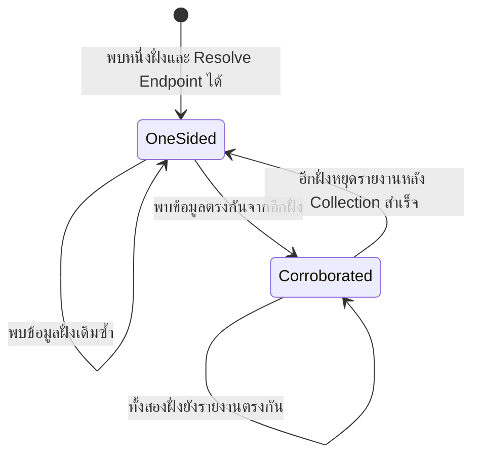
````

ห้ามลดจาก Corroborated เป็น One-sided เพราะอีกฝั่ง Collection ล้มเหลว ต้องลดเมื่อเก็บข้อมูลจากฝั่งนั้นสำเร็จแล้วแต่ไม่พบ Observation เท่านั้น

---

### มิติที่ 2: สถานะคำเตือนจากระบบ

|ค่า|ความหมาย|
|---|---|
|`normal`|ไม่พบความผิดปกติจากกฎ Reconciliation|
|`conflict`|มีหลักฐานที่ให้ข้อสรุปขัดกัน|

````
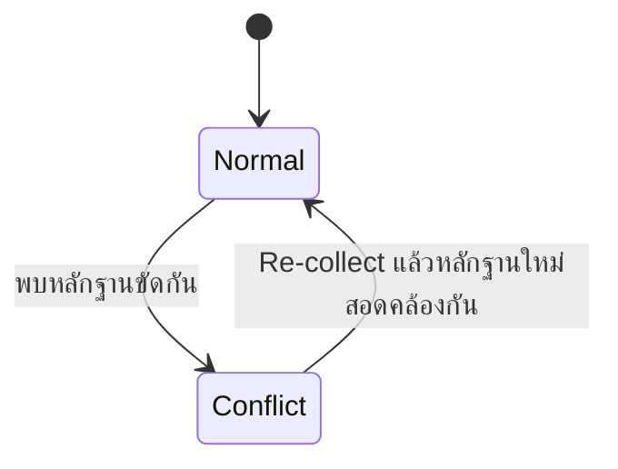
````

MVP ไม่มี Human Resolution Action การเปลี่ยนจาก Conflict กลับเป็น Normal เกิดจาก Reconciliation เมื่อข้อมูลรอบใหม่สอดคล้องกัน

---

### มิติที่ 3: วงจรชีวิตของ Link

|ค่า|ความหมาย|
|---|---|
|`active`|Link ยังมีหลักฐานปัจจุบันรองรับ|
|`stale`|ไม่พบซ้ำตามเกณฑ์ แต่ยังไม่สรุปว่าหายถาวร|
|`archived`|ไม่ใช่ Link ปัจจุบันแล้ว แต่เก็บไว้เป็นประวัติ|

````
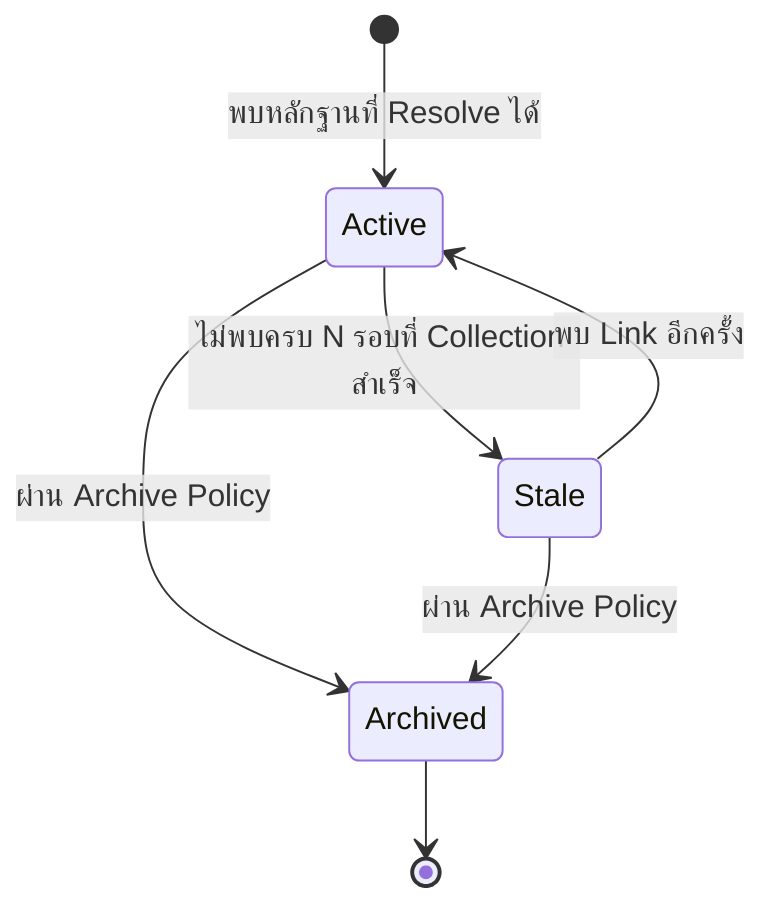
````

`N` ยังเป็น Open Question ไม่ควรกำหนดเป็นตัวเลขโดยไม่มีผลทดสอบจริง

กฎสำคัญ:

- Collection Failed → ไม่เพิ่มจำนวนรอบที่ไม่พบ
- Collection Succeeded และไม่พบ → เพิ่มจำนวนรอบที่ไม่พบ
- พบอีกครั้ง → กลับเป็น Active และรีเซ็ตจำนวนรอบที่ไม่พบ
- Archived เป็นสถานะปลายทาง
- ถ้าคู่ Interface เดิมกลับมาเชื่อมกันหลัง Archived แนะนำให้สร้าง Current Link รายการใหม่ เพื่อแยกช่วงเวลาการเชื่อมต่อ

---

### ตัวอย่าง Link ที่มีหลายสถานะพร้อมกัน

```
source               = protocol_observation
protocol_assessment  = one_sided
warning_state        = conflict
lifecycle_state      = active
```

หมายความว่า:

> Link ยังถูกแสดงอยู่ พบหลักฐานจากฝั่งเดียว และระบบแสดงคำเตือนว่ามีหลักฐานบางอย่างขัดกัน ผู้ใช้สามารถตรวจอุปกรณ์หรือสายจริงแล้วสั่ง Re-collect

ดังนั้น `Conflict` ไม่ควรบังคับให้ Link กลายเป็น `Stale`

---

## 5.4 Manual Override State Model — Future Extension

> State Model ตั้งแต่หัวข้อนี้ถึง Review/Resolution Action เก็บไว้เพื่อศึกษาในอนาคต ไม่ใช่ State หรือ Table ของ MVP

Manual Override ต้องแยก “ผลการตรวจรับ” ออกจาก “ความเป็นปัจจุบัน”

### มิติที่ 1: Verification State

|ค่า|ความหมาย|
|---|---|
|`pending_review`|สร้างแล้ว แต่ยังไม่ผ่านนโยบายตรวจรับ|
|`verified`|ผ่านการตรวจรับและสามารถใช้เป็นหลักฐานได้|
|`rejected`|หลักฐานหรือข้อมูลไม่เพียงพอ จึงไม่อนุญาตให้นำไปสร้าง Link|

````
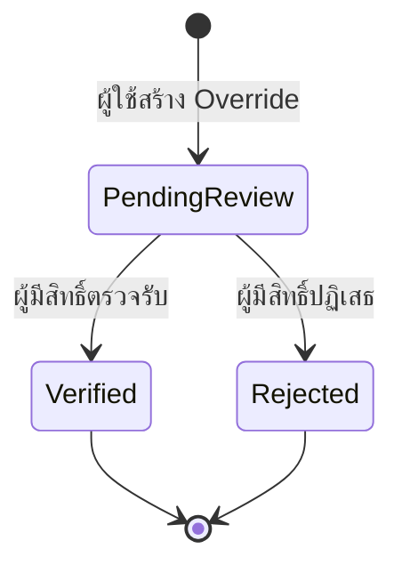
````

เฉพาะ `verified` เท่านั้นที่นำไปสนับสนุน Active Current Link ได้ตามปกติ

เรื่องผู้สร้างยืนยันรายการตัวเองได้หรือไม่ยังเป็น Open Question ของ RBAC แต่ Schema ต้องเก็บผู้สร้าง ผู้ตรวจ และเวลาให้รองรับทั้งสองนโยบาย

---

### มิติที่ 2: Validity Lifecycle

| ค่า        | ความหมาย                                                |
| ---------- | ------------------------------------------------------- |
| `current`  | Endpoint และหลักฐานยังถือว่าใช้ได้                      |
| `stale`    | หลักฐานจากการตรวจสายเก่า หรือข้อมูล Interface เปลี่ยนไป |
| `archived` | Override ไม่ถูกใช้งานแล้ว แต่เก็บเป็นประวัติ            |

````
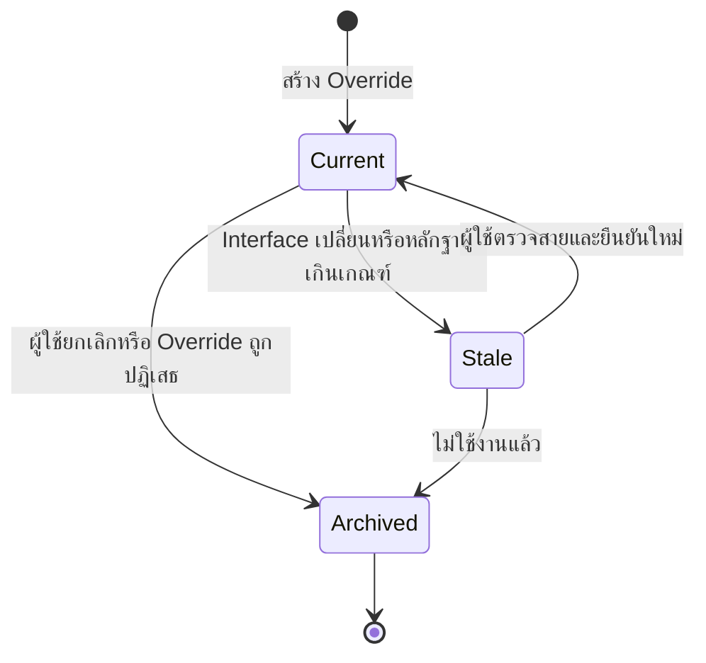
````

ตัวอย่าง Manual Override ที่ยังเคย Verified แต่ปัจจุบันเก่า:

```
verification_state = verified
validity_state     = stale
```

---

### เมื่อ Observation ขัดกับ Override

ห้ามเปลี่ยน Override เป็น Rejected หรือเขียนทับโดยอัตโนมัติ

ระบบควร:

1. รักษา Observation ไว้
2. รักษา Manual Override ไว้
3. สร้าง Topology Issue ประเภท Conflict
4. เปลี่ยน Current Link เป็น `review_state=conflict`
5. ให้ผู้ใช้ตรวจสายหรือสั่ง Re-collect
6. บันทึกผลด้วย Review Action

---

## 5.5 Topology Issue Lifecycle — Future Extension

`Topology Issue` คือกรณีผิดปกติ ไม่ใช่ตัวหลักฐาน

````
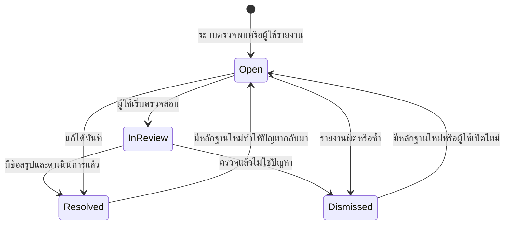
````

|สถานะ|ความหมาย|
|---|---|
|`open`|มีปัญหาและยังไม่มีผู้เริ่มจัดการ|
|`in_review`|กำลังตรวจสอบ|
|`resolved`|มีข้อสรุปและปัญหาได้รับการจัดการแล้ว|
|`dismissed`|ตรวจแล้วไม่ใช่ปัญหาหรือเป็นรายงานซ้ำ|

การ Reopen ต้องสร้าง Review Action ใหม่และเก็บประวัติเดิมไว้

---

## 5.6 Review/Resolution Action — Future Extension

Review Action เป็น Event แบบ Append-only จึงไม่จำเป็นต้องมี Lifecycle ของตัวเอง

ประเภท Action ตัวอย่าง:

- `report_incorrect`
- `start_review`
- `request_recollection`
- `verify_override`
- `reject_override`
- `resolve_conflict`
- `dismiss_issue`
- `reopen_issue`
- `archive_link`
- `archive_override`

ทุก Action ต้องเก็บ:

- ผู้ดำเนินการ
- เวลา
- เหตุผล
- สถานะก่อนดำเนินการ
- สถานะหลังดำเนินการ
- Entity ที่เกี่ยวข้อง

หาก Action ถูกบันทึกผิด ไม่ควรแก้ทับ แต่ให้เพิ่ม Correction Action หรือบันทึก Audit เพิ่ม

---

## 5.7 Topology View และ Node Placement

## Topology View

สำหรับ MVP ใช้ Default Shared View เป็นหลัก

````
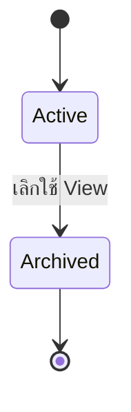
````

Default Shared View อาจกำหนดว่าห้าม Archive

## Node Placement

ไม่จำเป็นต้องมี State Machine เพราะเป็นข้อมูลแสดงผลที่เปลี่ยนตำแหน่งได้โดยตรง

เมื่อผู้ใช้ลาก Node:

- แก้เฉพาะตำแหน่ง
- ไม่แก้ Device
- ไม่แก้ Interface
- ไม่แก้ Current Link
- บันทึก Audit ตามนโยบาย

---

## 5.8 ตัวอย่างวงจรจริงตั้งแต่ต้นจนจบ

## เหตุการณ์ที่ 1 — พบ Link ฝั่งเดียว

Cisco รายงานว่า `Gi0/1` ต่อกับ Huawei `GE0/0/1`

```
protocol_assessment = one_sided
warning_state       = normal
lifecycle_state     = active
```

ระบบแสดง Link ทันที ไม่ต้องรอผู้ใช้ยืนยัน

## เหตุการณ์ที่ 2 — Huawei รายงานตรงกัน

```
protocol_assessment = corroborated
warning_state       = normal
lifecycle_state     = active
```

## เหตุการณ์ที่ 3 — Observation ใหม่ระบุ Port ไม่ตรงกัน

```
protocol_assessment = one_sided หรือ corroborated ตามหลักฐานที่ยังใช้ได้
warning_state       = conflict
lifecycle_state     = active
```

พร้อมแสดง Conflict Warning จาก Query/Reconciliation Result โดยไม่สร้าง `Topology Issue` ใน MVP

## เหตุการณ์ที่ 4 — ผู้ใช้สั่ง Re-collect และข้อมูลกลับมาตรงกัน

```
warning_state = normal
```

Issue เปลี่ยนเป็น `resolved`

## เหตุการณ์ที่ 5 — ไม่พบ Link ใน Collection ที่สำเร็จครบ N รอบ

```
lifecycle_state = stale
```

## เหตุการณ์ที่ 6 — ตรวจสายแล้วพบว่าถอดออกจริง

```
lifecycle_state = archived
```

Raw Neighbor Observations เดิมยังคงอยู่ทั้งหมด

---

## ผลลัพธ์ของ Step 5

ก่อนเข้าสู่ Step 6 เราได้ State Model หลักดังนี้:

|Entity|State ที่ต้องรองรับ|
|---|---|
|Reconciliation Run|queued, running, succeeded, failed, cancelled|
|Current Link – Protocol Assessment|one-sided, corroborated|
|Current Link – Warning State|normal, conflict|
|Current Link – Lifecycle|active, stale, archived|
|Topology View|active, archived|
|Node Placement|ไม่มี Lifecycle|

จุดที่ยังไม่ต้องตัดสินใจทันทีมีเรื่องเดียว:

- ไม่พบกี่ Collection Run จึงเปลี่ยนเป็น Stale
เรื่องนี้บันทึกเป็น Open Question แล้วออกแบบ Schema ให้ปรับ Policy ภายหลังได้ โดยไม่ต้องเปลี่ยนโครงสร้างหลัก


# Step 6 — Logical Schema: Tables, Fields, PK และ FK

ขั้นนี้จะแปลง Entity และความสัมพันธ์จาก Step 3–5 ให้เป็นโครงสร้างตารางจริง แต่ยังไม่ลงรายละเอียด PostgreSQL เช่น `VARCHAR(255)`, Index หรือ `ON DELETE`

โครงการกำหนดให้ใช้ `UUID` เป็น Primary Key เหมือน Schema ส่วนกลาง

---
## 6.1 ตารางที่ NTV ขอใช้จาก Feature อื่น

NTV ไม่สร้างตารางเหล่านี้ซ้ำ

|ตารางภายนอก|เจ้าของ|ข้อมูลขั้นต่ำที่ NTV ขอ|
|---|---|---|
|`devices`|Device Inventory|`id`, identity, type, vendor, site, collection status, active state|
|`interfaces`|Device Inventory|`id`, `device_id`, `name`, `if_index`, status, collected time|
|`collection_runs`|Discovery/Collection|`id`, `device_id`, status, start/finish time, environment|
|`neighbor_observations`|Discovery/Collection|`id`, collection run, local endpoint, protocol, raw remote identity, observed time|
|`users`|Auth/RBAC|`id`, active state และ Permission ผ่าน Auth Service|
|`audit_logs`|Audit Infrastructure|NTV ส่ง Event เข้าไป ไม่สร้าง FK กลับทุกตาราง|

สมมติฐานสำหรับ MVP:

> `Collection Run` หนึ่งรายการเป็นผลการเก็บข้อมูลจาก Device หนึ่งเครื่องหนึ่งรอบ

ถ้าเพื่อนออกแบบ Collection Run แบบ Batch หลาย Device ต้องมี `Collection Device Result ID` เพิ่มใน Data Contract

---

## 6.2 ตารางของ NTV

Logical Schema ของ NTV MVP แนะนำ 7 ตาราง

| ตาราง                            | หน้าที่                                    |
| -------------------------------- | ------------------------------------------ |
| `topology_views`                 | มุมมองแผนผัง                               |
| `topology_node_placements`       | ตำแหน่ง Device ใน View                     |
| `topology_reconciliation_runs`   | รอบประมวลผล NTV                            |
| `topology_reconciliation_inputs` | Collection Run ที่แต่ละ Reconciliation ใช้ |
| `topology_links`                 | Current Link Projection                    |
| `topology_link_evaluations`      | ผลประเมิน Link ในแต่ละ Reconciliation Run  |
| `topology_link_evidence`         | หลักฐานที่ใช้ในการประเมิน Link             |
`topology_manual_overrides`, `topology_issues` และ `topology_issue_actions` ถูกย้ายออกจาก MVP และเก็บเป็น Candidate Schema สำหรับ Future Extension เท่านั้น

---

## 6.3 `topology_views`

เก็บข้อมูลของมุมมองแผนผัง ไม่เก็บ Device หรือ Link ซ้ำ

|Field|Key/Null|ความหมาย|
|---|---|---|
|`id`|PK, NOT NULL|รหัส View|
|`name`|NOT NULL|ชื่อ View|
|`is_default`|NOT NULL|เป็น Default Shared View หรือไม่|
|`filter_definition`|NULLABLE|เงื่อนไข Saved Filter ถ้ามี|
|`lifecycle_state`|NOT NULL|`active`, `archived`|
|`created_by`|FK → `users.id`, NULLABLE|NULL หากระบบสร้าง Default View|
|`created_at`|NOT NULL|เวลาสร้าง|
|`updated_at`|NOT NULL|เวลาแก้ล่าสุด|
|`archived_at`|NULLABLE|เวลา Archive|

สำหรับ MVP มี Default Shared View หนึ่งรายการก็เพียงพอ ส่วน `filter_definition` สามารถปล่อยว่างและใช้ Filter ชั่วคราวจาก UI ได้

---

## 6.4 `topology_node_placements`

เก็บตำแหน่ง Device บน Canvas แยกจากข้อมูลเครือข่ายจริง

|Field|Key/Null|ความหมาย|
|---|---|---|
|`id`|PK, NOT NULL|รหัส Placement|
|`topology_view_id`|FK → `topology_views.id`, NOT NULL|อยู่ใน View ใด|
|`device_id`|FK → `devices.id`, NOT NULL|Device ที่นำมาแสดง|
|`position_x`|NOT NULL|ตำแหน่งแกน X|
|`position_y`|NOT NULL|ตำแหน่งแกน Y|
|`is_pinned`|NOT NULL|ล็อกตำแหน่งหรือไม่|
|`is_hidden`|NOT NULL|ซ่อนใน View นี้หรือไม่|
|`updated_by`|FK → `users.id`, NULLABLE|ผู้เปลี่ยนตำแหน่งล่าสุด|
|`created_at`|NOT NULL|เวลาสร้าง|
|`updated_at`|NOT NULL|เวลาแก้ล่าสุด|

Logical Unique Key:

```
UNIQUE(topology_view_id, device_id)
```

Device หนึ่งเครื่องจึงมีตำแหน่งที่บันทึกได้ไม่เกินหนึ่งตำแหน่งต่อ View

---

## 6.5 `topology_reconciliation_runs`

เก็บรอบที่ NTV นำหลักฐานมาประมวลผล

|Field|Key/Null|ความหมาย|
|---|---|---|
|`id`|PK, NOT NULL|รหัส Reconciliation Run|
|`status`|NOT NULL|`queued`, `running`, `succeeded`, `failed`, `cancelled`|
|`trigger_type`|NOT NULL|เหตุที่เริ่ม Run|
|`triggered_by`|FK → `users.id`, NULLABLE|NULL หากระบบเริ่มอัตโนมัติ|
|`input_cutoff_at`|NOT NULL|ใช้หลักฐานที่เกิดไม่เกินเวลานี้|
|`started_at`|NULLABLE|เวลาเริ่มทำงาน|
|`finished_at`|NULLABLE|เวลาสิ้นสุด|
|`error_code`|NULLABLE|รหัสข้อผิดพลาด|
|`error_message`|NULLABLE|รายละเอียดข้อผิดพลาดที่ปลอดภัย|
|`created_at`|NOT NULL|เวลาสร้างงาน|

ตัวอย่าง `trigger_type`:

- `collection_completed`
- `manual_rebuild`
- `scheduled`

ห้ามเก็บ Credential, Raw Password หรือ CLI Secret ใน Error Message

---

## 6.6 `topology_reconciliation_inputs`

เป็นตารางเชื่อมระหว่าง Reconciliation Run กับ Collection Run

|Field|Key/Null|ความหมาย|
|---|---|---|
|`reconciliation_run_id`|PK/FK → `topology_reconciliation_runs.id`|Reconciliation ที่ใช้ข้อมูล|
|`collection_run_id`|PK/FK → `collection_runs.id`|Collection ที่ถูกนำมาใช้|
|`added_at`|NOT NULL|เวลาที่เลือก Collection เป็น Input|

Composite Primary Key:

```
PRIMARY KEY(reconciliation_run_id, collection_run_id)
```

ตารางนี้ทำให้ตอบได้ว่า:

> แผนผังรอบนี้ใช้ผล Collection รอบใดบ้าง

---

## 6.7 `topology_links`

เป็น Current Projection สำหรับโหลดหน้า NTV ได้รวดเร็ว ไม่ใช่ Raw Evidence

|Field|Key/Null|ความหมาย|
|---|---|---|
|`id`|PK, NOT NULL|รหัส Link|
|`endpoint_a_interface_id`|FK → `interfaces.id`, NOT NULL|Interface ฝั่ง A|
|`endpoint_b_interface_id`|FK → `interfaces.id`, NOT NULL|Interface ฝั่ง B|
|`protocol_assessment`|NOT NULL|`one_sided`, `corroborated`|
|`warning_state`|NOT NULL|`normal`, `conflict`|
|`lifecycle_state`|NOT NULL|`active`, `stale`, `archived`|
|`first_seen_at`|NOT NULL|พบ Link ครั้งแรก|
|`last_seen_at`|NOT NULL|พบหลักฐานสนับสนุนล่าสุด|
|`consecutive_missed_runs`|NOT NULL|จำนวน Collection ที่สำเร็จแต่ไม่พบติดต่อกัน|
|`stale_since`|NULLABLE|เริ่ม Stale เมื่อใด|
|`created_reconciliation_run_id`|FK → `topology_reconciliation_runs.id`, NOT NULL|Run ที่สร้าง Link|
|`last_reconciliation_run_id`|FK → `topology_reconciliation_runs.id`, NOT NULL|Run ที่ประเมินล่าสุด|
|`created_at`|NOT NULL|เวลาสร้าง Record|
|`updated_at`|NOT NULL|เวลาอัปเดต Current Projection|
|`archived_at`|NULLABLE|เวลา Archive|

ไม่เก็บ `device_a_id` และ `device_b_id` เพราะสามารถหา Device ได้จาก Interface

Logical rules:

```
endpoint_a_interface_id != endpoint_b_interface_id
```

```
Active Link คู่เดียวกันต้องไม่ซ้ำ แม้สลับ A/B
```

การจัดลำดับ Endpoint แบบ Canonical และ Partial Unique Constraint จะลงรายละเอียดใน Step 7

---

## 6.8 `topology_link_evaluations`

เป็นตารางเชื่อม Many-to-Many ระหว่าง Reconciliation Run กับ Current Link และเก็บผลการประเมินแต่ละรอบ

|Field|Key/Null|ความหมาย|
|---|---|---|
|`id`|PK, NOT NULL|รหัส Evaluation|
|`reconciliation_run_id`|FK → `topology_reconciliation_runs.id`, NOT NULL|Run ที่ประเมิน|
|`topology_link_id`|FK → `topology_links.id`, NOT NULL|Link ที่ถูกประเมิน|
|`presence_result`|NOT NULL|`observed`, `not_observed`, `not_evaluable`|
|`protocol_assessment_result`|NOT NULL|`one_sided`, `corroborated`|
|`warning_state_result`|NOT NULL|ผล Warning State หลังประเมิน|
|`lifecycle_state_result`|NOT NULL|ผล Lifecycle หลังประเมิน|
|`missed_runs_after`|NOT NULL|จำนวนรอบที่ไม่พบหลังประเมิน|
|`evaluated_at`|NOT NULL|เวลาประเมิน|

Logical Unique Key:

```
UNIQUE(reconciliation_run_id, topology_link_id)
```

ความหมายของ `not_evaluable`:

> ระบบไม่มีข้อมูลเพียงพอ เช่น Collection ของ Device ฝั่งที่เกี่ยวข้องล้มเหลว จึงห้ามเพิ่มจำนวนรอบที่ไม่พบ

ตารางนี้ช่วยเก็บประวัติโดยไม่ต้องเขียนทับผล Evaluation รอบก่อน

---

## 6.9 `topology_link_evidence`

เก็บว่าผล Evaluation ใช้หลักฐานรายการใด

|Field|Key/Null|ความหมาย|
|---|---|---|
|`id`|PK, NOT NULL|รหัส Evidence Association|
|`link_evaluation_id`|FK → `topology_link_evaluations.id`, NOT NULL|Evaluation ที่ใช้หลักฐาน|
|`neighbor_observation_id`|FK → `neighbor_observations.id`, NOT NULL|หลักฐานจาก LLDP|
|`evidence_relation`|NOT NULL|`supports`, `contradicts`|
|`local_endpoint_role`|NULLABLE|Observation นี้รายงานจากฝั่ง `A` หรือ `B`|
|`created_at`|NOT NULL|เวลาสร้าง Association|

Evidence ทุกแถวใน MVP ต้องอ้าง Neighbor Observation หนึ่งรายการ

ตัวอย่าง Corroborated:

```
Evaluation 001
├── Evidence: Cisco Observation, endpoint_role=A, supports
└── Evidence: Huawei Observation, endpoint_role=B, supports
```

ตัวอย่าง Conflict:

```
Evaluation 002
├── Evidence: Current Observation, supports
└── Evidence: New Observation, contradicts
```

Raw Observation ยังคงอยู่ใน Discovery/Collection และไม่ถูกแก้ไข

---

## 6.10 `topology_manual_overrides` — Future Extension Schema

> ไม่สร้าง Migration, Model, Repository หรือ API สำหรับตารางนี้ใน MVP

เก็บหลักฐานการตรวจสายจริงจากผู้ใช้

|Field|Key/Null|ความหมาย|
|---|---|---|
|`id`|PK, NOT NULL|รหัส Override|
|`endpoint_a_interface_id`|FK → `interfaces.id`, NOT NULL|Interface ฝั่ง A|
|`endpoint_b_interface_id`|FK → `interfaces.id`, NOT NULL|Interface ฝั่ง B|
|`reason`|NOT NULL|เหตุผลที่ต้องใช้ Override|
|`evidence_note`|NOT NULL|รายละเอียดวิธีตรวจสอบสายจริง|
|`evidence_environment`|NOT NULL|`physical_lab`, `emulated_lab`|
|`evidence_observed_at`|NOT NULL|เวลาที่ตรวจสอบ|
|`verification_state`|NOT NULL|`pending_review`, `verified`, `rejected`|
|`validity_state`|NOT NULL|`current`, `stale`, `archived`|
|`created_by`|FK → `users.id`, NOT NULL|ผู้สร้าง|
|`decision_by`|FK → `users.id`, NULLABLE|ผู้ Verify หรือ Reject|
|`decision_at`|NULLABLE|เวลาตัดสินใจ|
|`stale_since`|NULLABLE|เริ่มถือว่าหลักฐานเก่าเมื่อใด|
|`archived_by`|FK → `users.id`, NULLABLE|ผู้ Archive|
|`archived_at`|NULLABLE|เวลา Archive|
|`created_at`|NOT NULL|เวลาสร้าง|
|`updated_at`|NOT NULL|เวลาอัปเดต Current Summary|

ใช้ `decision_by` ช่องเดียวแทนการมีทั้ง `verified_by` และ `rejected_by` เพราะ `verification_state` ระบุผลอยู่แล้ว

ประวัติการตรวจทุกครั้งยังต้องอยู่ใน `topology_issue_actions` และ Audit Trail

---

## 6.11 `topology_issues` — Future Extension Schema

> ไม่สร้างตารางนี้ใน MVP; Unresolved/Conflict/Stale แสดงจาก Query/Reconciliation Result

เก็บปัญหาที่ระบบตรวจพบหรือผู้ใช้รายงาน

|Field|Key/Null|ความหมาย|
|---|---|---|
|`id`|PK, NOT NULL|รหัส Issue|
|`issue_type`|NOT NULL|ประเภทของปัญหา|
|`status`|NOT NULL|`open`, `in_review`, `resolved`, `dismissed`|
|`subject_type`|NOT NULL|`topology_link`, `neighbor_observation`, `manual_override`|
|`topology_link_id`|FK → `topology_links.id`, NULLABLE|Subject เป็น Link|
|`neighbor_observation_id`|FK → `neighbor_observations.id`, NULLABLE|Subject เป็น Observation|
|`manual_override_id`|FK → `topology_manual_overrides.id`, NULLABLE|Subject เป็น Override|
|`summary`|NOT NULL|ข้อความสั้นสำหรับ Pending List|
|`description`|NULLABLE|รายละเอียดเพิ่มเติม|
|`detected_reconciliation_run_id`|FK → `topology_reconciliation_runs.id`, NULLABLE|Run ที่ตรวจพบปัญหา|
|`opened_by`|FK → `users.id`, NULLABLE|NULL หากระบบสร้าง Issue|
|`opened_at`|NOT NULL|เวลาเปิด Issue|
|`updated_at`|NOT NULL|เวลาแก้ล่าสุด|
|`closed_at`|NULLABLE|เวลา Resolve หรือ Dismiss|

ตัวอย่าง `issue_type`:

- `unresolved_endpoint`
- `reported_incorrect`
- `conflicting_evidence`
- `override_verification`
- `stale_link`
- `duplicate_active_endpoint`

ต้องอ้าง Primary Subject เพียงหนึ่งประเภท:

```
topology_link_id
XOR neighbor_observation_id
XOR manual_override_id
```

นี่คือการแยก `Exception Review` เดิมออกเป็น:

- `topology_issues` — ตัวปัญหา
- `topology_issue_actions` — การดำเนินการของผู้ใช้

---

## 6.12 `topology_issue_actions` — Future Extension Schema

> ไม่สร้างตารางนี้ใน MVP เพราะยังไม่มี Human Review/Resolution Workflow

เก็บประวัติการตรวจสอบและการตัดสินใจแบบ Append-only

|Field|Key/Null|ความหมาย|
|---|---|---|
|`id`|PK, NOT NULL|รหัส Action|
|`topology_issue_id`|FK → `topology_issues.id`, NOT NULL|Issue ที่ดำเนินการ|
|`action_type`|NOT NULL|การกระทำของผู้ใช้|
|`outcome_code`|NULLABLE|ผลการตัดสินใจ|
|`reason`|NOT NULL|เหตุผลหรือคำอธิบาย|
|`from_status`|NOT NULL|Issue Status ก่อน Action|
|`to_status`|NOT NULL|Issue Status หลัง Action|
|`actor_user_id`|FK → `users.id`, NOT NULL|ผู้ดำเนินการ|
|`selected_neighbor_observation_id`|FK → `neighbor_observations.id`, NULLABLE|Observation ที่เลือกใช้|
|`selected_manual_override_id`|FK → `topology_manual_overrides.id`, NULLABLE|Override ที่เลือกใช้|
|`related_collection_run_id`|FK → `collection_runs.id`, NULLABLE|Collection ที่สั่งหรือนำมาตรวจ|
|`related_reconciliation_run_id`|FK → `topology_reconciliation_runs.id`, NULLABLE|Reconciliation ที่เกิดตาม Action|
|`created_at`|NOT NULL|เวลาดำเนินการ|

ตัวอย่าง `action_type`:

- `report_incorrect`
- `start_review`
- `request_recollection`
- `verify_override`
- `reject_override`
- `resolve_conflict`
- `dismiss_issue`
- `reopen_issue`
- `archive_link`
- `archive_override`

ตัวอย่าง `outcome_code`:

- `keep_current_link`
- `accept_observation`
- `accept_manual_override`
- `archive_current_link`
- `request_more_evidence`
- `no_issue_found`

Action ห้ามแก้หรือลบตามปกติ หากข้อมูลผิดให้สร้าง Correction Action เพิ่ม

---

## 6.13 Logical ERD

````
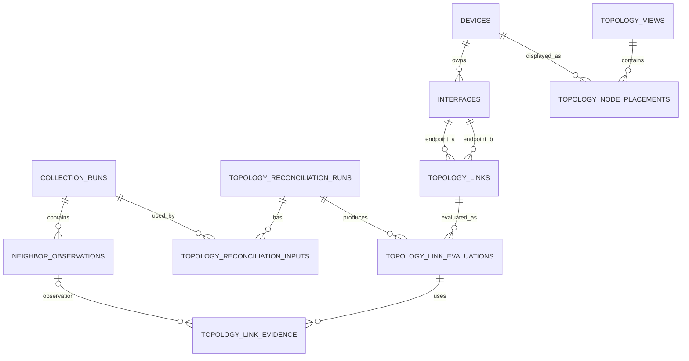
````

---

## 6.14 ตาราง Ownership สำหรับรวมงานกับเพื่อน

|ตาราง|Owner|NTV ทำอะไร|
|---|---|---|
|`devices`|Device Inventory|Read-only|
|`interfaces`|Device Inventory|Read-only และใช้เป็น FK Endpoint|
|`collection_runs`|Discovery/Collection|Read-only|
|`neighbor_observations`|Discovery/Collection|Read-only|
|`users`|Auth/RBAC|Read-only Reference|
|`audit_logs`|Audit Infrastructure|ส่ง Audit Event|
|ตาราง `topology_*` ทั้งหมด|NTV|Read/Write ตาม RBAC|

เพราะโครงการใช้ PostgreSQL ฐานเดียว สามารถใช้ Cross-feature FK ได้ แต่ Migration ของ NTV ต้องรอ Migration ของ:

```
users
→ devices
→ interfaces
→ collection_runs
→ neighbor_observations
→ topology_* tables
```

ห้ามให้ NTV Migration เพิ่มคอลัมน์ Link ลงใน `interfaces`

---

## 6.15 จุดที่ต้องยืนยันใน Step 7 ก่อนเขียน Migration

ก่อนเขียน SQL จริงยังต้องปิดรายละเอียดเหล่านี้:

1. วิธีทำ Canonical Endpoint Pair เพื่อกัน Link A–B ซ้ำกับ B–A
2. Partial Unique Constraint สำหรับ Active Link
3. จำนวน Successful Collection Runs ก่อนเป็น Stale
4. Delete/Archive Policy ของ FK ภายนอก
5. Index สำหรับโหลด Topology, Warning/Pending List และ Evidence History
6. วิธีป้องกัน Reconciliation สอง Run แก้ Current Projection พร้อมกัน

หลัง Step 6 นี้ ข้อมูลเพียงพอสำหรับเริ่ม **Component Diagram** แล้ว เพราะเรารู้ว่า:

- Component ใดอ่านข้อมูลจากเพื่อน
- Component ใดเขียนตาราง NTV
- Reconciliation Service ต้องใช้ Repository ใด
- Query Service ต้องรวมตารางใด
- Warning/Pending List ควรได้ข้อมูลจาก Query/Reconciliation อย่างไร

ส่วน Step 7–10 สามารถกลับมาทำหลังร่าง Component Diagram รอบแรกได้ครับ
