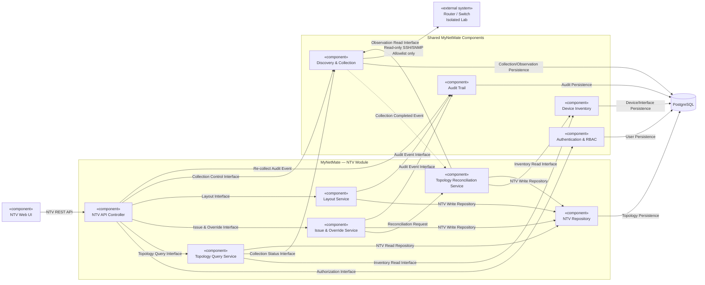

# สิ่งที่ต้องเสร็จก่อนเริ่ม Component Diagram

| Step                              | ต้องทำก่อนหรือไม่   | เหตุผล                                                       |
| --------------------------------- | ------------------- | ------------------------------------------------------------ |
| 1. Overview และขอบเขตข้อมูล       | ต้อง                | ต้องรู้ว่า NTV รับผิดชอบอะไร                                 |
| 2. Use Cases และ Data Contract    | ต้อง                | ทำให้รู้ว่า Component ต้องให้บริการงานใดและติดต่อ Feature ใด |
| 3. Conceptual Entities            | ต้อง                | ทำให้รู้ว่าต้องมี Repository หรือ Data Access ส่วนใด         |
| 4. Relationships และ Cardinality  | ต้อง                | ทำให้เห็นทิศทางการอ้างอิงข้อมูล                              |
| 5. Lifecycle และ State Model      | ต้อง                | ทำให้รู้ว่า Reconciliation Component ต้องทำอะไร              |
| 6. Logical Schema — Table, PK, FK | แนะนำให้เสร็จ       | ทำให้ Interface ระหว่าง Component ชัดเจน                     |
| 7. Constraints                    | ยังไม่จำเป็นทั้งหมด | กลับมาทำหลัง Component Diagram ได้                           |
| 8. Index และ Performance          | ยังไม่จำเป็น        | เป็นรายละเอียดระดับ Physical Database                        |
| 9. Retention/Security             | กำหนดหลักการไว้ก่อน | รายละเอียดทำภายหลังได้                                       |
| 10. PostgreSQL/Alembic            | ไม่ต้อง             | ควรทำหลัง Component Diagram                                  |
| 11. Schema Tests                  | ทำภายหลัง           | ใช้ตรวจแบบออกแบบฉบับสมบูรณ์                                  |

## ทำไมควรถึง Step 6

Component Diagram ต้องตอบว่า:

- Component ใดเป็นเจ้าของข้อมูล
- Component ใดอ่านหรือเขียน Table ใด
- NTV ขอข้อมูลอะไรจาก Inventory และ Discovery
- ใครสร้าง Observation
- ใครคำนวณ One-sided และ Corroborated
- ใครสร้าง Current Link
- ใครจัดการ Manual Override และ Conflict
- ใครเก็บ Layout
- Re-collect เริ่มจาก Component ใด
- Audit และ RBAC ถูกเรียกตรงไหน

ถ้ายังไม่รู้ Entity, ความสัมพันธ์ และเจ้าของข้อมูล การแบ่ง Component จะเป็นเพียงการคาดเดา

## Workflow ที่แนะนำ

```
Schema Step 1–2
   ↓
Schema Step 3: Conceptual Entities
   ↓
Schema Step 4: Relationships
   ↓
Schema Step 5: Lifecycle/State
   ↓
Schema Step 6: Logical Tables + PK/FK
   ↓
Component Diagram
   ↓
ตรวจว่า Component Boundary ตรงกับ Data Ownership หรือไม่
   ↓
กลับมาทำ Schema Step 7–10
   ↓
API + Sequence Diagram + Acceptance Tests
```

Component Diagram อาจทำให้เราพบว่า Table บางตัวอยู่ผิดเจ้าของ เช่น `neighbor_observations` ควรเป็นของ Collection/Discovery ไม่ใช่ NTV จากนั้นจึงย้อนกลับมาแก้ Logical Schema ก่อนเขียน PostgreSQL จริง

## จุดหยุดที่เหมาะสม

ก่อนย้ายไป Component Diagram คุณควรมีผลลัพธ์เหล่านี้:

- รายการ Entity ที่ NTV เป็นเจ้าของ
- รายการ Entity ที่ขอจาก Feature อื่น
- ER Diagram ระดับ Logical
- Cardinality เช่น 1:N และ M:N
- PK และ FK
- State Model ของ Observation, Current Link และ Override
- Data Ownership Matrix
- External Data Contract
- Assumption/Open Question ที่ยังไม่ปิด

ไม่จำเป็นต้องมี:

- SQL `CREATE TABLE`
- Alembic Migration
- Index ครบทุกตัว
- PostgreSQL ENUM
- Retention Policy ฉบับสมบูรณ์
- Performance Benchmark

**สถานะปัจจุบัน: Resolved** — Database Schema ผ่าน Step 1–6 แล้ว จึงมีข้อมูลเพียงพอสำหรับกำหนด Component, Interface และ Dependency ของ NTV

---

# Component Diagram — Network Topology Visualization

## 1. หลักการที่ใช้ในการออกแบบ

อ้างอิง [Component based Diagram - UML.md](E:/CEPP Project/หลักศูตร/KMITL_Knowledge/Project/05_knowledge_base/UML/Component based Diagram - UML.md) โดยใช้หลักต่อไปนี้:

1. **High-level** — แสดงโมดูลหลัก ไม่แตกเป็น Class หรือ Method
2. **Clear Responsibility** — หนึ่ง Component มีหน้าที่หลักที่ชัดเจน
3. **Clear Interface** — ระบุชื่อบริการหรือ Contract ที่ใช้ติดต่อกัน
4. **Clear Dependency** — ลูกศรชี้จาก Component ที่ต้องใช้บริการ ไปยัง Component ที่ให้บริการ
5. **Show External Components** — แยก Inventory, Collection, Auth, Audit และอุปกรณ์ Lab ออกจากขอบเขต NTV
6. **Keep it Simple** — ไม่ใส่รายละเอียด Deployment, Container, Library หรือ Vendor Command ในภาพนี้

Component ในเอกสารนี้หมายถึง **โมดูลเชิงตรรกะ** ไม่ได้บังคับว่าต้องเป็น Microservice แยก Process ใน MVP สามารถพัฒนาเป็นโมดูลภายใน React Application และ FastAPI Application เดียวกันได้

## 2. System Boundary

### ภายในขอบเขต NTV

- NTV Web UI
- NTV API Controller
- Topology Query Service
- Topology Reconciliation Service
- Issue & Override Service
- Layout Service
- NTV Repository

### Component ภายนอกที่ NTV ต้องใช้

- Authentication & RBAC
- Device Inventory
- Discovery & Collection
- Audit Trail
- PostgreSQL Database
- Router/Switch ใน Isolated Lab

## 3. UML-style Component Diagram

> สัญลักษณ์ในภาพฉบับ Markdown ใช้ลูกศร `A → B` หมายถึง **A ต้องการใช้ Interface ที่ B ให้บริการ** ส่วนเส้นประหมายถึง Event แบบ Asynchronous



## 4. หน้าที่ของแต่ละ Component

| Component                           | หน้าที่หลัก                                                                                            | ไม่รับผิดชอบ                                                     |
| ----------------------------------- | ------------------------------------------------------------------------------------------------------ | ---------------------------------------------------------------- |
| **NTV Web UI**                      | แสดง Canvas, Node, Link, Filter, Detail, Issue และ Override Form                                       | ไม่ติดต่ออุปกรณ์หรือ Database โดยตรง และไม่คำนวณข้อสรุป Link     |
| **NTV API Controller**              | รับ REST Request, ตรวจรูปแบบข้อมูล, เรียก Authorization และส่งงานให้ Application Service               | ไม่เขียน Vendor Command, ไม่ Parse LLDP/CDP และไม่แก้ตารางโดยตรง |
| **Topology Query Service**          | รวม Device, Interface, Current Link, Evidence, Issue, Layout และ Freshness เป็น View Model             | ไม่เริ่ม Collection และไม่เปลี่ยนข้อสรุป Link                    |
| **Topology Reconciliation Service** | จับคู่ Endpoint, ประเมิน One-sided/Corroborated, ตรวจ Conflict/Stale และอัปเดต Current Link Projection | ไม่แก้ Raw Neighbor Observation และไม่ติดต่ออุปกรณ์โดยตรง        |
| **Issue & Override Service**        | Report Incorrect, Resolve Conflict และจัดการวงจร Manual Override                                       | ไม่สร้าง Freehand Link และไม่เขียนทับ Observation                |
| **Layout Service**                  | บันทึก Shared View, ตำแหน่ง, Pin และ Hide                                                              | ไม่แก้ Device, Interface หรือ Topology Link                      |
| **NTV Repository**                  | ให้ Interface สำหรับอ่าน/เขียนตาราง `topology_*`                                                       | ไม่มีกฎธุรกิจและไม่อ่าน Credential Secret                        |
| **Device Inventory**                | ให้ข้อมูล Managed Device และ Interface ที่เก็บจากอุปกรณ์จริง                                           | ไม่สรุป Topology Link                                            |
| **Discovery & Collection**          | ทำ Read-only Collection, Parse และเก็บ Collection Run/Neighbor Observation                             | ไม่ยืนยัน Current Link และไม่แก้ Manual Override                 |
| **Authentication & RBAC**           | ยืนยันตัวตนและตรวจ Permission                                                                          | ไม่เก็บกฎธุรกิจ NTV                                              |
| **Audit Trail**                     | บันทึกกิจกรรมสำคัญจาก NTV                                                                              | ไม่ใช้เป็นฐานสำหรับ Reconciliation                               |

## 5. Provided และ Required Interfaces

| Interface ID                                | Provided by                     | Required by                                   | Contract ระดับสูง                                                   |
| ------------------------------------------- | ------------------------------- | --------------------------------------------- | ------------------------------------------------------------------- |
| `I-NTV-01` NTV REST API                     | NTV API Controller              | NTV Web UI                                    | โหลด Topology, Save Layout, Re-collect, Issue และ Override Commands |
| `I-NTV-02` Topology Query Interface         | Topology Query Service          | NTV API Controller                            | คืน Node, Link, Evidence Assessment, Issue, Layout และ Freshness    |
| `I-NTV-03` Reconciliation Interface         | Topology Reconciliation Service | Collection Event, Issue & Override Service    | ประมวลผลหลักฐานและสร้าง Current Link Projection                     |
| `I-NTV-04` Issue & Override Interface       | Issue & Override Service        | NTV API Controller                            | Report Incorrect, Resolve Conflict, Create/Verify/Archive Override  |
| `I-NTV-05` Layout Interface                 | Layout Service                  | NTV API Controller                            | อ่านและบันทึก View/Node Placement                                   |
| `I-NTV-06` NTV Repository Interface         | NTV Repository                  | Query, Reconciliation, Issue/Override, Layout | อ่าน/เขียนข้อมูล `topology_*` ตามขอบเขตของแต่ละ Service             |
| `I-EXT-INV-01` Inventory Read Interface     | Device Inventory                | Query, Reconciliation                         | Managed Device และ Interface แบบ Read-only                          |
| `I-EXT-COL-01` Collection Control Interface | Discovery & Collection          | NTV API Controller                            | เริ่ม Re-collect และคืน Job ID                                      |
| `I-EXT-COL-02` Observation Interface/Event  | Discovery & Collection          | Query, Reconciliation                         | Collection Status, Collection Run และ Neighbor Observation          |
| `I-EXT-AUTH-01` Authorization Interface     | Authentication & RBAC           | NTV API Controller                            | ตรวจ User, Role และ Permission                                      |
| `I-EXT-AUD-01` Audit Event Interface        | Audit Trail                     | API, Issue/Override, Layout                   | บันทึกผู้ใช้ การกระทำ Target เวลา และผลลัพธ์                        |

## 6. Data Ownership ตาม Component

| Component | อ่าน | เขียน |
|---|---|---|
| Topology Query Service | ข้อมูลผ่าน Inventory/Collection Interface และ NTV Repository | ไม่มี |
| Topology Reconciliation Service | Observation, Interface, Override, Issue Action และ Reconciliation State | `topology_reconciliation_*`, `topology_links`, `topology_link_evaluations`, `topology_link_evidence` |
| Issue & Override Service | Link, Observation, User Permission | `topology_manual_overrides`, `topology_issues`, `topology_issue_actions` |
| Layout Service | Device Reference และ View | `topology_views`, `topology_node_placements` |
| Discovery & Collection | Device Target และ Credential Reference ตามสิทธิ์ | `collection_runs`, `neighbor_observations` |
| Device Inventory | ผล Collection ของตัวตนอุปกรณ์และ Interface | `devices`, `interfaces` |
| Audit Trail | Audit Event จาก Component อื่น | `audit_logs` |

`NTV API Controller` และ `NTV Web UI` ไม่มีสิทธิ์เขียนตารางโดยตรง

## 7. Dependency Rules

1. NTV Web UI ติดต่อ Backend ผ่าน NTV REST API เท่านั้น
2. เฉพาะ Discovery & Collection เท่านั้นที่เชื่อมต่อ Router/Switch และต้องเป็น Read-only ภายใน Isolated Lab Allowlist
3. Topology Reconciliation Service อ่าน Observation แต่ห้ามแก้หรือลบ Raw Observation
4. Current Link สร้างและเปลี่ยนโดย Reconciliation Service ไม่ใช่ API Controller หรือผู้ใช้โดยตรง
5. Issue & Override Service บันทึกการตัดสินใจ แล้วร้องขอ Reconciliation แทนการแก้ Current Link เอง
6. Layout Service เปลี่ยนเฉพาะ View/Placement และต้องไม่กระทบข้อมูลเครือข่าย
7. Query Service ต้องใช้ Current Projection ล่าสุดได้ แม้ Collection Service ไม่พร้อมชั่วคราว พร้อมแสดง Freshness
8. Component ภายใน NTV ใช้ NTV Repository แทนการเข้าถึง PostgreSQL โดยตรง
9. Cross-feature Data ใช้ Interface/Data Contract ของเจ้าของข้อมูล ไม่สร้าง Device, Interface, User หรือ Observation ซ้ำใน NTV
10. AI ไม่อยู่ในเส้นทางของ NTV Reconciliation และไม่มีสิทธิ์สร้าง Resolve หรือเปลี่ยน Link

## 8. ตรวจสอบกับ Flow สำคัญของ MVP

| Flow | เส้นทาง Component | ผลลัพธ์ |
|---|---|---|
| Load Topology | UI → API → Query → Inventory/Collection/NTV Repository | ได้ Node, Current Link, Evidence, Layout และ Freshness |
| Re-collect | UI → API → Collection → Background Job → Collection Completed Event → Reconciliation | UI ไม่รอ SSH/SNMP ใน HTTP Request เดียว |
| Reconcile Link | Collection Event → Reconciliation → Inventory/Observation Interface → NTV Repository | สร้าง One-sided/Corroborated และตรวจ Conflict/Stale |
| Report/Resolve | UI → API → Issue & Override Service → NTV Repository/Audit → Reconciliation | รักษา Raw Evidence และอัปเดต Projection ผ่าน Reconciliation |
| Manual Override | UI → API → Issue & Override Service → Audit → Reconciliation | ใช้ได้เฉพาะ Interface จริงและผ่าน Lifecycle ที่กำหนด |
| Save Node Position | UI → API → Layout Service → NTV Repository/Audit | เปลี่ยนเฉพาะ Shared Layout |

## 9. ขอบเขตของ Diagram นี้

Diagram นี้ตั้งใจแสดง **Software Architecture View** ตามหลัก UML Component Diagram จึงไม่แสดง:

- Class, Attribute หรือ Method
- SQL Column และ Constraint รายช่อง
- React Component รายตัว
- FastAPI Router/Function ราย Endpoint
- Netmiko/TextFSM Driver ราย Vendor
- Container, Server หรือ Deployment Node
- ลำดับ Message ตามเวลา ซึ่งควรแยกเป็น Sequence Diagram

## 10. ข้อสรุปการออกแบบ

NTV ใช้โครงสร้างแบบ **Modular Monolith** ภายใน MyNetMate โดยแยกความรับผิดชอบเชิงตรรกะออกเป็น Query, Reconciliation, Issue/Override, Layout และ Repository ขณะที่ Device Inventory, Discovery/Collection, Authentication และ Audit เป็น Component ภายนอกที่ติดต่อผ่าน Interface ชัดเจน

จุดควบคุมสำคัญที่สุดคือ **มีเพียง Discovery & Collection ที่ติดต่ออุปกรณ์จริง และมีเพียง Topology Reconciliation Service ที่เปลี่ยน Current Link Projection** ทำให้ UI, ผู้ใช้ และ AI ไม่สามารถแก้ข้อสรุปของแผนผังหรืออุปกรณ์จริงโดยตรง
