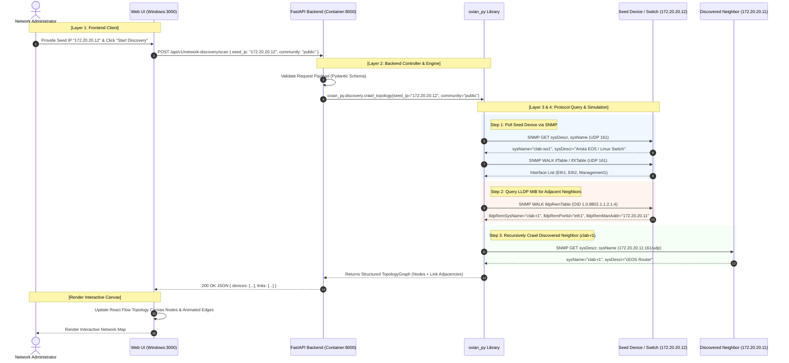

# Dev Environment Network Discovery: Architecture & UML Specification

This document provides the complete **UML Deployment, Component, and Sequence Architecture** for the local development environment of the **MyNetMate Network Discovery** subsystem.

> **Key Architectural Principles:**
> 1. **Strict Component Decoupling:** Isolates **Web Frontend**, **Backend API Gateway**, **`oxian_py` Discovery Engine**, and **Containerlab Simulation Nodes** so that developers can pinpoint and troubleshoot failures across well-defined boundaries.
> 2. **Pure SNMP & LLDP MIB Discovery:** The discovery process relies exclusively on **SNMP (UDP 161)** and **LLDP MIB (`IEEE 802.1AB` / `OID 1.0.8802.1.1.2`)** to query device info and crawl neighbor adjacencies **(No ICMP ping sweeps are performed)**.

---

## 1. Workspace & Repository Structure (`mynetmate`)

On the developer's Windows machine, the repositories and Git submodules are structured as follows:

```
mynetmate/ (Meta Workspace: https://github.com/Mynetmate/mynetmate)
├── .gitmodules
├── website/   --> Submodule: https://github.com/Mynetmate/website (React 19, Vite 8, Bun SPA)
├── backend/   --> Submodule: https://github.com/Mynetmate/backend (FastAPI, Python 3.12+)
├── docs/      --> Submodule: https://github.com/Mynetmate/docs (UML & Specification Docs)
└── [oxian]    --> Core Library: https://github.com/Mynetmate/oxian (oxian_py Python package)
```

---

## 2. 4-Tier Decoupled Architecture Overview

```
┌─────────────────────────────────────────────────────────────────────────────┐
│ [Zone 1] Windows 11 Host (Dev Client)                                       │
│   Web UI: mynetmate/website (React 19 + React Flow)  --> http://localhost:3000
└──────────────────────────────────────┬──────────────────────────────────────┘
                                       │ [Boundary 1] HTTP REST API (POST /scan)
                                       │ Port Forwarding / WSL_IP:8000
┌──────────────────────────────────────▼──────────────────────────────────────┐
│ [Zone 2] WSL2 Linux Environment (Containerlab Engine)                       │
│                                                                             │
│  ┌───────────────────────────────────────────────────────────────────────┐  │
│  │ [Container 1] Backend Server Container (172.20.20.2:8000)             │  │
│  │   FastAPI Router (app.features.network_device_discovery)              │  │
│  │     │                                                                 │  │
│  │     ▼ [Boundary 2] In-Process Python Import                           │  │
│  │   oxian_py Core Library (Discovery Engine)                            │  │
│  │     ├── 1. Async SNMP Poller (sysInfo / IF-MIB - UDP 161)             │  │
│  │     └── 2. Async LLDP Neighbor Crawler (LLDP-MIB 1.0.8802 Walk)       │  │
│  └───────────────────────────────────┬───────────────────────────────────┘  │
│                                      │ [Boundary 3] SNMP Protocols (UDP:161)│
│                                      │ (GET, GETNEXT, WALK)                 │
│  ┌───────────────────────────────────▼───────────────────────────────────┐  │
│  │ [Boundary 4] Containerlab Bridge Network (clab-mgmt: 172.20.20.0/24) │  │
│  │                                                                       │  │
│  │   ├── [Container] clab-r1 (Router: cEOS / FRR)       - 172.20.20.11   │  │
│  │   ├── [Container] clab-sw1 (Switch: LLDP MIB)        - 172.20.20.12   │  │
│  │   └── [Container] snmpsim-lab (SNMP Mock Daemon)     - 172.20.20.13   │  │
│  └───────────────────────────────────────────────────────────────────────┘  │
└─────────────────────────────────────────────────────────────────────────────┘
```

---

## 3. UML Diagrams

### 3.1 UML Deployment Diagram (Execution Environments & Ports)

```mermaid
deploymentDiagram
    classDef hostNode fill:#f5f5f5,stroke:#2d3142,stroke-width:1.5px;
    classDef containerNode fill:#ffffff,stroke:#2d3142,stroke-width:1px;
    classDef accentNode fill:#fff3ee,stroke:#eb6c36,stroke-width:1.5px;

    node "Windows 11 (Host OS)" as WinHost <<device>> {
        node "Node.js / Bun Runtime" as BunEnv <<executionEnvironment>> {
            artifact "mynetmate-website\n(React 19 + Vite SPA)" as WebArtifact
        }
    }

    node "WSL2 Subsystem (Ubuntu Linux)" as WSLHost <<executionEnvironment>> {
        node "Docker / Containerlab Engine" as ClabRuntime <<executionEnvironment>> {
            
            node "mynetmate-backend (Container)" as BackendNode <<container>> {
                artifact "FastAPI Application\n(Port 8000)" as ApiArtifact
                artifact "oxian_py (Python Package)\nSNMP & LLDP Discovery Engine" as OxianArtifact
            }

            node "Containerlab Network Bridge\n(clab-mgmt: 172.20.20.0/24)" as ClabBridge <<network>> {
                node "clab-r1 (Container)" as RouterNode <<device>> {
                    artifact "cEOS / FRR Router\n(172.20.20.11:161/udp)" as R1Artifact
                }
                node "clab-sw1 (Container)" as SwitchNode <<device>> {
                    artifact "Switch + LLDP MIB\n(172.20.20.12:161/udp)" as SW1Artifact
                }
                node "snmpsim (Container)" as SnmpSimNode <<device>> {
                    artifact "SNMP Mock Daemon\n(172.20.20.13:161/udp)" as SimArtifact
                }
            }
        }
    }

    WebArtifact --> ApiArtifact : "HTTP REST (POST /api/v1/network-discovery/scan)\n[Boundary 1: Web ↔ API]"
    ApiArtifact --> OxianArtifact : "Python In-Process Module Call\n[Boundary 2: API ↔ oxian_py]"
    OxianArtifact --> R1Artifact : "SNMP GET sysInfo / IF-MIB (161/udp)\n[Boundary 3: Engine ↔ Network]"
    OxianArtifact --> SW1Artifact : "SNMP WALK lldpRemTable (161/udp)\n[Boundary 3: Engine ↔ Network]"
    OxianArtifact --> SimArtifact : "SNMP Mock Data (161/udp)\n[Boundary 3: Engine ↔ Network]"
```

---

### 3.2 UML Component Diagram (Decoupled Interfaces & Contracts)

```mermaid
classDiagram
    direction LR

    class WebFrontend {
        <<component>>
        +DashboardView
        +TopologyCanvas (React Flow)
        +triggerDiscovery(seedIP: string)
    }

    class DiscoveryAPI {
        <<component>>
        +post_scan(seed_ip: str, community: str)
        +get_job_status(job_id: str)
    }

    class OxianPyEngine {
        <<component>>
        +snmp_get_sysinfo(ip: str, community: str) DeviceInfo
        +snmp_walk_interfaces(ip: str) list~Interface~
        +snmp_walk_lldp_neighbors(ip: str) list~LLDPNeighbor~
        +crawl_topology(seed_ip: str) TopologyGraph
    }

    class ContainerlabDevices {
        <<component>>
        +SNMP_Agent (Port 161/udp)
        +LLDP_MIB_Provider (OID 1.0.8802.1.1.2)
        +System_MIB_Provider (OID 1.3.6.1.2.1.1)
    }

    WebFrontend ..> DiscoveryAPI : <<required>>\nHTTP / JSON REST API\n(No Python / No SNMP knowledge)
    DiscoveryAPI ..> OxianPyEngine : <<required>>\nPython Package API\n(No Containerlab knowledge)
    OxianPyEngine ..> ContainerlabDevices : <<required>>\nSNMP UDP 161\n(Standard GET / WALK Protocol)
```



---

### 3.3 UML Sequence Diagram (Pure SNMP & LLDP Discovery Flow)



---

## 4. Decoupled Failure Isolation Matrix

Use this matrix to rapidly diagnose which component is failing when running the development stack:

| Inspection Point | Interface Boundary | Protocol / Transport | Failure Symptoms | Root-Cause Verification & Fix |
|:---:|---|---|---|---|
| **Point 1** | **Web UI (Windows) ↔ FastAPI (WSL2)** | HTTP REST on port `8000` | Browser displays `Network Error`, CORS errors, or request timeout | 1. Check if backend is running: `curl http://localhost:8000/health`<br>2. Verify WSL2 IP address or Windows port forwarding.<br>3. Verify CORS middleware configuration in `backend/app/main.py`. |
| **Point 2** | **FastAPI ↔ `oxian_py` Library** | In-process Python function calls | Endpoint returns `500 Internal Server Error` or `ModuleNotFoundError` | 1. Check container stdout: `docker logs clab-mynetmate-backend`<br>2. Ensure package is installed in editable mode: `pip install -e /oxian`<br>3. Check Pydantic validation logs in `router.py`. |
| **Point 3** | **`oxian_py` ↔ Virtual Network** | SNMP UDP 161 (GET/WALK) | Scan succeeds with 0 devices discovered or missing neighbors | 1. Test SNMP from backend container: `snmpwalk -v2c -c public 172.20.20.12 1.3.6.1.2.1.1`<br>2. Verify LLDP MIB access: `snmpwalk -v2c -c public 172.20.20.12 1.0.8802.1.1.2`<br>3. Verify community string (`public`) and UDP port 161 accessibility. |
| **Point 4** | **Containerlab Device Nodes** | Virtual L2/L3 Bridge & Docker Engine | Node containers offline or LLDP daemon not sending frames | 1. Check topology status: `sudo containerlab inspect`<br>2. Review topology configuration in `topology.clab.yml`<br>3. Verify LLDP daemon on the device: `lldpctl` or `show lldp neighbors`. |

---

## 5. Development Stack Startup Procedure

1. **Deploy Containerlab Topology (in WSL2):**
   ```bash
   cd ~/mynetmate-lab
   sudo containerlab deploy -t topology.clab.yml
   ```

2. **Start Backend Container with `oxian_py` Mounted:**
   ```bash
   cd ~/mynetmate/backend
   uvicorn app.main:app --host 0.0.0.0 --port 8000 --reload
   ```

3. **Start Frontend Web Application (in Windows Host):**
   ```bash
   cd C:\Users\zenle\Documents\GitHub\mynetmate\website
   bun run dev
   ```

4. **Access Web Application:**
   Open `http://localhost:3000` in your browser, enter the seed IP (e.g., `172.20.20.12`), and initiate discovery.
