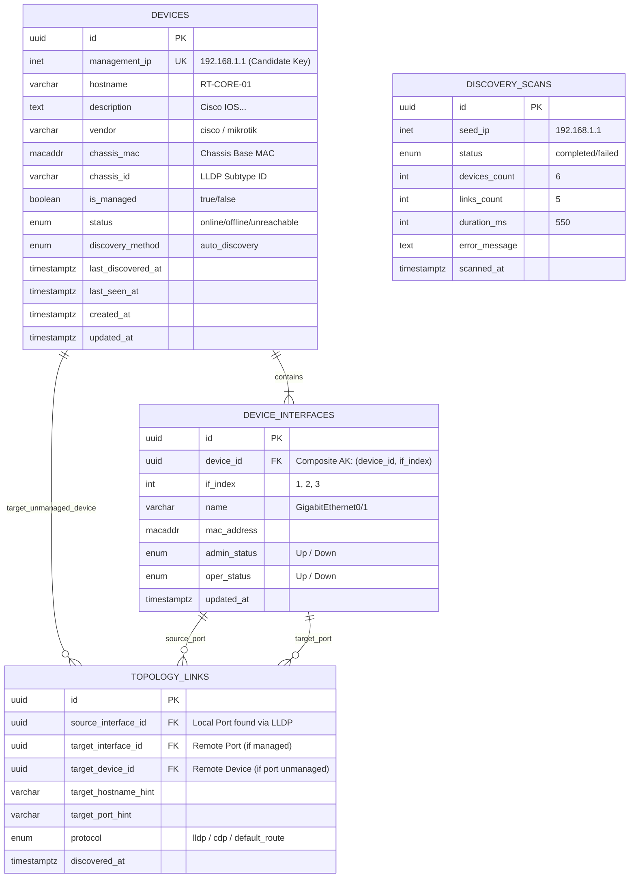

# 📡 Database Schema: 04_Network Discovery (3NF Normalized)

> **Path**: `Database Design/04_Network Discovery/`  
> **DBML**: [`network_discovery.dbml`](network_discovery.dbml)  
> **Master Device Schema**: [`Database Design/02_Device Inventory Management/`](../02_Device%20Inventory%20Management/)  
> **Feature Link**: [`Feature Design/04_Network Discrovery(Tee)`](../../Feature%20Design/04_Network%20Discrovery(Tee)/)  
>
> 📁 **SQL Schemas (`sql/`)**:
> - [`00_enums.sql`](mynetmate/docs/Database%20Design/04_Network%20Discovery/sql/00_enums.sql) (Enums & Extensions)
> - [`01_devices.sql`](01_devices.sql) (ตาราง devices - Reconciled กับ Master Inventory)
> - [`02_device_interfaces.sql`](02_device_interfaces.sql) (ตาราง device_interfaces)
> - [`03_topology_links.sql`](03_topology_links.sql) (ตาราง topology_links)
> - [`04_discovery_scans.sql`](04_discovery_scans.sql) (ตาราง discovery_scans)
> - [`99_seed_data.sql`](mynetmate/docs/Database%20Design/04_Network%20Discovery/sql/99_seed_data.sql) (ข้อมูล Mock Test Data)

---

## 1. Entity-Relationship Diagram (ERD - 3NF)

---

## 2. การวิเคราะห์ Normalization 3NF (Third Normal Form Verification)

| Entity / Table | 1NF (Atomic Data) | 2NF (No Partial Dependency) | 3NF (No Transitive Dependency) | Functional Dependencies ($X \to Y$) |
| :--- | :--- | :--- | :--- | :--- |
| **`devices`** | ผ่าน: ทุก Attribute เป็นค่าเดี่ยว ไม่มีการเก็บ Nested JSON หรือ Multi-value list | ผ่าน: Candidate Key คือ `id` (PK) และ `management_ip` (AK) เป็น Single-column key | ผ่าน: Non-prime attributes ทุกตัวขึ้นตรงกับ Primary Key โดยตรง ไม่ขึ้นกับ Non-key อื่น ($id \to \text{all}$) | `id` $\to$ `management_ip, hostname, description, vendor, chassis_mac, status...` `management_ip` $\to$ `id, hostname, ...` |
| **`device_interfaces`** | ผ่าน: `if_index`, `name`, `mac_address`, `status` เป็นค่า Atomic | ผ่าน: Composite Candidate Key คือ `(device_id, if_index)` ทุก attribute ต้องใช้ทั้งสองค่าร่วมกันเพื่อระบุ ไม่ขึ้นกับส่วนใดส่วนหนึ่ง | ผ่าน: `admin_status`, `oper_status`, `name` ขึ้นตรงกับ `(device_id, if_index)` เท่านั้น ไม่มีการพึ่งพิงแบบ Transitive | `id` $\to$ `device_id, if_index, name, mac_address, ...` `(device_id, if_index)` $\to$ `id, name, mac_address, ...` |
| **`topology_links`** | ผ่าน: ทุกคอลัมน์เก็บค่าระบุพิกัดปลายทางแบบเดี่ยว | ผ่าน: PK คือ `id` | ผ่าน (3NF): อ้างอิงจุดเริ่มต้นผ่าน `source_interface_id` โดยตรง ไม่เก็บ `source_device_id` ซ้ำซ้อน (ป้องกัน Transitive Dependency: $PK \to \text{interface} \to \text{device}$) | `id` $\to$ `source_interface_id, target_interface_id, target_device_id, protocol...` |
| **`discovery_scans`** | ผ่าน: เก็บสถิติและสถานะของการ Scan 1 ครั้ง | ผ่าน: PK คือ `id` | ผ่าน: บันทึกข้อมูลเฉพาะของ Scan Event แต่ละรอบ ($id \to \text{all metrics}$) | `id` $\to$ `seed_ip, status, devices_count, duration_ms...` |

---

## 3. การจับคู่ 1:1 กับ Output ของ Oxian Engine

| Database Table & Column | Oxian Python Model | คำอธิบาย |
| :--- | :--- | :--- |
| **`devices.management_ip`** | `Device.ip` | IP Address ของอุปกรณ์ (Unique Candidate Key) |
| **`devices.hostname`** | `Device.hostname` | ชื่อ Hostname จาก SNMP `sysName` |
| **`devices.description`** | `Device.description` | ข้อมูล OS และ Firmware จาก `sysDescr` |
| **`devices.vendor`** | `Device.vendor` | ยี่ห้อที่ Detect อัตโนมัติ (`cisco`, `mikrotik`, `juniper`, `unknown`) |
| **`devices.chassis_mac`** | `Device.chassis_id` | Chassis MAC จาก LLDP |
| **`devices.is_managed`** | `Device.is_managed` | `true` (SNMP Managed) / `false` (Inferred Neighbor หรือ Default Gateway) |
| **`device_interfaces.if_index`** | `Interface.index` | หมายเลข Index พอร์ต (`ifIndex`) |
| **`device_interfaces.name`** | `Interface.description` | ชื่อพอร์ต (เช่น `GigabitEthernet0/1`, `ether1`) |
| **`device_interfaces.mac_address`** | `Interface.mac_address` | MAC Address ของพอร์ต |
| **`device_interfaces.admin_status`** | `Interface.admin_status` | สถานะพอร์ต (`Up`, `Down`, `Testing`, `Unknown`) |
| **`topology_links.source_interface_id`** | `Link.source_interface` (FK resolved) | พอร์ตต้นทาง (3NF Resolved) |
| **`topology_links.target_interface_id`** | `Link.target_port_id` (FK resolved) | พอร์ตปลายทาง (ถ้าเป็น Managed) |
| **`topology_links.target_device_id`** | `Link.target_ip` (FK resolved) | อุปกรณ์ปลายทาง (กรณี Unmanaged) |
| **`topology_links.target_hostname_hint`**| `Link.target_hostname` | ชื่อ Hostname ปลายทาง (สำหรับ Unmanaged) |
| **`topology_links.target_port_hint`** | `Link.target_port_description` | ชื่อพอร์ตปลายทาง |
| **`topology_links.protocol`** | `Link.target_port_id` hint | โปรโตคอลที่พบ (`lldp`, `cdp`, `default_route`) |
