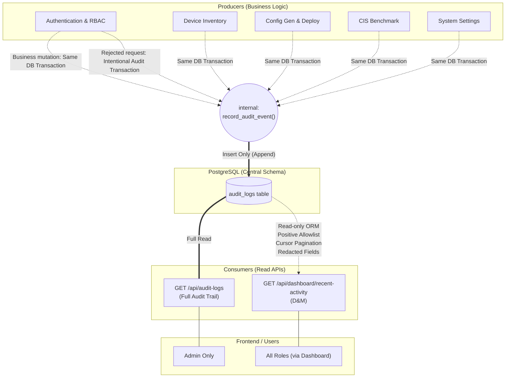

# Component Diagram

แผนภาพนี้แสดงปฏิสัมพันธ์ระหว่าง Feature ต่างๆ (Producers), ตาราง Audit Logs, และ Consumers (Admin API & Dashboard)

## สาระสำคัญของ Architecture
1. **Internal Contract (`record_audit_event`)**: ทุก Producer ต้องเรียกผ่านฟังก์ชันนี้ในระดับ Application Layer เพื่อให้มั่นใจว่าจะไม่มีการเขียนตรงๆ ที่ผิดมาตรฐาน (เช่น ลืมทำ Redaction) Event ที่ผูกกับ Business Mutation ใช้ Database Session/Transaction เดียวกัน ส่วน Intentional Failure/Denial Event ใช้ Audit Transaction แยกที่ Commit ได้แม้ Request ถูกปฏิเสธ
2. **D&M Direct Read**: Dashboard & Monitoring สามารถใช้ SQLAlchemy Query จากตาราง `audit_logs` ได้โดยตรง ไม่ต้องผ่าน Full Audit API เพื่อความสะดวก แต่ต้องทำตาม Contract การ Redaction ข้อมูลและการใช้ Cursor Pagination อย่างเคร่งครัด
