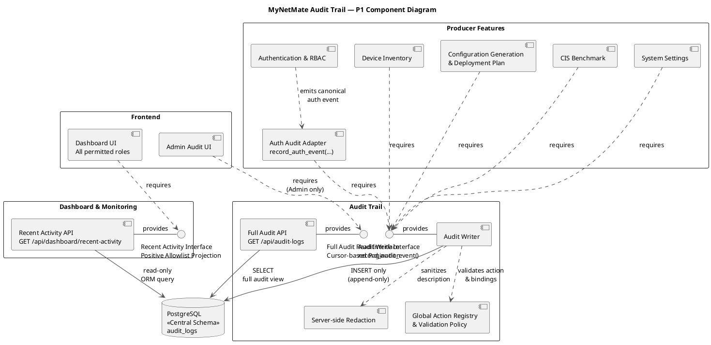

# Audit Trail — UML Component Diagram
แผนภาพนี้เป็น **Target Architecture สำหรับ P1** แสดง Component, Responsibility, Interface, Dependency และ External Component ของ Audit Trail โดยไม่ใช่หลักฐานว่าได้ Implement แล้ว



## Component และหน้าที่

| Component                                  | Responsibility                                                                      | Interface ที่เกี่ยวข้อง                           |
| ------------------------------------------ | ----------------------------------------------------------------------------------- | ------------------------------------------------- |
| Producer Features                          | สร้างเหตุการณ์จาก Business Action ของแต่ละ Feature                                  | ต้องใช้ `Audit Write Interface`                   |
| Auth Audit Adapter                         | แปลงเหตุการณ์ Auth เป็น Canonical Event และส่งเฉพาะ Business Arguments ตาม Contract | ต้องใช้ `record_audit_event()`                    |
| Audit Writer                               | ตรวจ Registry, ทำ Redaction และ Insert แบบ Append-only                              | ให้บริการ `record_audit_event()`                  |
| Global Action Registry & Validation Policy | กำหนดคู่ที่อนุญาตของ Action, Resource, Result, Safe Error Category และ Binding      | ถูกใช้โดย Audit Writer ก่อน Insert                |
| Server-side Redaction                      | กรอง Password, Token, Secret และ Raw Identifier ก่อนเขียนฐานข้อมูล                  | ถูกใช้ภายใน Audit Writer                          |
| Full Audit API                             | อ่าน Audit Trail แบบเต็มด้วย Cursor Pagination                                      | ให้บริการ Full Audit Read Interface แก่ Admin     |
| Recent Activity API                        | อ่าน Projection เฉพาะ Positive Allowlist จาก `audit_logs` แบบ Read-only             | ให้บริการ Recent Activity Interface แก่ Dashboard |
| `audit_logs`                               | ตารางกลางเพียงตารางเดียวสำหรับเก็บ Immutable Audit Event                            | รับ Insert จาก Audit Writer และรองรับ Read Query  |

## ความหมายของ Interface และ Dependency

1. `Authentication & RBAC → Auth Audit Adapter` หมายถึง Auth ส่งเหตุการณ์ที่เกิดขึ้นให้ Adapter ของตนเอง โดยไม่เขียน `audit_logs` โดยตรง
2. `Auth Audit Adapter → Audit Write Interface` หมายถึง Adapter ต้องใช้ Contract กลาง `record_audit_event()` และส่งเฉพาะ Canonical Event ที่ Registry อนุญาต
3. `Device / Config / CIS / Settings → Audit Write Interface` หมายถึง Producer อื่นต้องใช้ Writer กลางเช่นกัน ห้ามสร้าง Audit Writer หรือ Audit Schema ของตัวเอง
4. `Audit Write Interface — Audit Writer` เป็น Assembly ระหว่าง Required Interface ของ Producer กับ Provided Interface ของ Audit Writer
5. `Audit Writer → Global Action Registry` หมายถึง Writer ตรวจ Action, Resource, Result, Error Category และ Actor/Resource Binding ก่อนบันทึก หากไม่ตรงต้อง Reject
6. `Audit Writer → Server-side Redaction` หมายถึง `description` ต้องถูกกรองก่อน Write ไม่ใช่รอกรองตอนส่ง API
7. `Audit Writer → audit_logs` เป็นเส้นทางเขียนแบบ `INSERT` เท่านั้น ไม่มี Update/Delete API
8. `Full Audit API → audit_logs` เป็นเส้นทางอ่านข้อมูลสำหรับ Full Audit และ `Admin Audit UI → Full Audit Read Interface` แสดงว่าผู้ใช้ระดับ Admin เท่านั้นที่เรียกดูได้
9. `Recent Activity API → audit_logs` เป็นการอ่านแบบ Read-only ผ่าน ORM โดยใช้ Positive Allowlist, Redaction และ Cursor Pagination
10. `Dashboard UI → Recent Activity Interface` หมายถึง Dashboard รับเฉพาะ Projection ที่ปลอดภัย ไม่ได้รับ `description`, `safe_error_category` หรือ Client IP

## Transaction Boundary

- เหตุการณ์ที่เกิดจาก Business Mutation ต้องใช้ Database Session/Transaction เดียวกับการกระทำหลัก เพื่อ Commit หรือ Rollback พร้อมกัน
- `user.login_failed` และ `auth.permission_denied` เป็น Intentional Security Event จึงใช้ Audit Transaction แยก เพื่อให้บันทึกได้แม้ Request หลักถูกปฏิเสธ
- หาก Mandatory Audit Write ล้มเหลว ระบบต้อง Fail Closed และห้าม Commit Business Mutation หรือออก Session

## Note
**หมายเหตุประกอบภาพ**

**1. Auth Event Handling (Auth Audit Adapter)**
- Business mutation events ใช้ DB transaction เดียวกันกับ action หลัก
- `login_failed` และ `permission_denied` ใช้ audit transaction แยกต่างหากโดยตั้งใจ เพื่อให้ยังบันทึกได้แม้ request จะถูกปฏิเสธ
- Adapter จะไม่ส่ง client IP หรือ raw identifiers ใด ๆ

**2. Write Guarantees (Audit Writer)**
- ปฏิเสธ event ที่ไม่อยู่ใน Global Action Registry
- Fail closed หากการเขียน audit log ที่จำเป็นล้มเหลว
- ไม่มี path สำหรับ update หรือ delete
- หมายเหตุ: Registry เป็นเพียง policy/contract เชิงตรรกะใน P1 เท่านั้น ไม่ใช่ตาราง audit database คู่ขนาน

**3. Recent Activity Contract (Recent Activity API)**
- ใช้ positive allowlist เท่านั้น
- เรียงลำดับด้วย `ORDER BY created_at DESC, id DESC`
- Cursor ใช้ค่า `created_at` ร่วมกับ `id`
- Response ไม่รวมฟิลด์ `description` และ `safe_error_category`

**4. Audit Database (PostgreSQL)**
- Central Schema เป็นแหล่งจัดเก็บ audit เพียงแหล่งเดียว
- ตาราง `audit_logs` ใน P1 ไม่มีการจัดเก็บ client IP

## ขอบเขตของแผนภาพ

- แผนภาพนี้แสดง Architecture และ Contract ระดับ Component ไม่แสดงลำดับ Message ภายในแต่ละ Use Case
- Global Action Registry ในภาพเป็น Logical Policy ของ P1 ไม่ได้ประกาศเพิ่มตาราง Registry ใหม่ใน Central Schema
- `audit_logs` ใน Central Schema เป็น Audit Storage เพียงแห่งเดียว และ P1 ไม่เก็บ Client IP


##  ตัวอย่าง

### 0. `Authentication & RBAC → Auth Audit Adapter`

ตัวอย่าง: ผู้ใช้ Login สำเร็จ Auth รู้ว่าเกิดเหตุการณ์ `user.login_success` จึงเรียก Adapter ของตัวเอง เช่น

```
record_auth_event(
    action="user.login_success",
    resource_type="auth",
    resource_id=None,
    actor_id=current_user.id
)
```

Auth ไม่เขียน SQL เช่น `INSERT INTO audit_logs ...` เอง เพราะถ้าแต่ละ Feature เขียนเอง กติกา Redaction และ Registry อาจไม่เหมือนกัน

### 1. `Auth Audit Adapter → Audit Write Interface`

ตัวอย่าง: Adapter รับ 4 ค่า Business Arguments จาก Auth แล้วแปลงเป็นข้อมูล Audit ที่ครบตาม Registry

```
record_audit_event(
    db=db,
    action="user.login_success",
    resource_type="auth",
    result="success",
    user_id=current_user.id,
    resource_id=None,
    safe_error_category=None,
    description=None
)
```

กรณี Login ผิด Adapter จะกำหนดเองเป็น `result="failure"` และ `safe_error_category="authentication_error"` โดยไม่ให้ Auth ส่งค่า Password, Token, Client IP หรือ username ที่พิมพ์ผิดเข้ามา

### 2. `Device / Config / CIS / Settings → Audit Write Interface`

ตัวอย่าง: Admin เพิ่ม Device ใหม่ ระบบทำสองเรื่องใน Transaction เดียวกัน:

```
สร้างข้อมูล Device
       +
บันทึก device.create ผ่าน Audit Writer
       ↓
Commit พร้อมกัน
```

ดังนั้น Device Feature ไม่สร้างตาราง `device_audit_logs` ของตัวเอง และ CIS ก็ไม่สร้าง `cis_audit_logs` ของตัวเอง ทุก Feature ใช้ Writer กลางและ `audit_logs` ตารางเดียว

### 3. `Audit Write Interface — Audit Writer`

ตัวอย่าง: Device Feature รู้เพียงว่าต้องเรียก `record_audit_event()` แต่ไม่ต้องรู้ว่า Writer ตรวจ Registry อย่างไร หรือใช้ PostgreSQL อย่างไร

เปรียบเหมือน Feature เรียก “ช่องรับงานกลาง” ส่วน Audit Writer เป็นผู้ให้บริการหลังช่องนั้น หากวันหลังเปลี่ยนวิธีเก็บ Log ภายใน Producer ก็ไม่ต้องแก้ตาม ตราบใดที่ Contract เดิมยังอยู่

### 4. `Audit Writer → Global Action Registry`

ตัวอย่างที่ผ่าน:

```
action = user.login_failed
resource_type = auth
result = failure
safe_error_category = authentication_error
actor_user_id = null
resource_id = null
```

ชุดนี้ผ่าน เพราะตรง Registry ของกรณี “ไม่พบบัญชี”

ตัวอย่างที่ต้อง Reject:

```
action = user.login_success
result = failure
safe_error_category = authentication_error
```

เพราะ `user.login_success` ต้องมี `result=success` และ `safe_error_category=null` เท่านั้น

5. `Audit Writer → Server-side Redaction`

ตัวอย่าง: มีคนเผลอส่ง Description นี้มา:

```
Changed password to MySecret123
```

ก่อนบันทึก Writer ต้องตัดหรือปฏิเสธข้อมูลลับนั้น แล้วเก็บได้เพียงข้อความปลอดภัย เช่น

```
Password changed
```

หรือเก็บ `description=null` ห้ามรอไปซ่อนเฉพาะตอนส่ง API เพราะข้อมูลลับจะถูกเก็บอยู่ในฐานข้อมูลไปแล้ว

6. `Audit Writer → audit_logs`

ตัวอย่าง: เมื่อเพิ่ม Device สำเร็จ Writer บันทึก Audit Event ใหม่หนึ่งแถว เช่น

```
action = device.create
resource_type = device
resource_id = <device UUID>
result = success
```

หลังบันทึกแล้ว ไม่มี Endpoint แบบนี้:

```
PATCH /api/audit-logs/{id}
DELETE /api/audit-logs/{id}
```

จึงรักษาหลักฐานเดิมไว้ได้ตาม Append-only Policy

### 7. `Full Audit API → audit_logs` และ `Admin Audit UI → Full Audit Read Interface`

ตัวอย่าง: Admin เปิดหน้า Full Audit แล้วเรียก

```
GET /api/audit-logs?limit=20&cursor=...
```

Full Audit API อ่านข้อมูลจาก `audit_logs` และส่งผลกลับให้เฉพาะ Admin หาก Viewer เรียก Endpoint เดียวกัน ต้องถูกปฏิเสธด้วย `403 Forbidden`

Admin เห็นรายละเอียด Audit ที่อนุญาต เช่น Action, Actor, Resource, Result, เวลา และ Description ที่ผ่าน Redaction แล้ว

### 8. `Recent Activity API → audit_logs`

ตัวอย่าง: Dashboard ขอ Recent Activity จะอ่านเฉพาะ Positive Allowlist เช่น

```
user.login_success
user.logout
user.password_changed
user.created
user.updated
```

Query เรียงจากใหม่ไปเก่าโดยใช้:

```
ORDER BY created_at DESC, id DESC
```

และใช้ Cursor จากคู่ `created_at + id` เพื่อโหลดหน้าถัดไปโดยไม่เกิดข้อมูลซ้ำหรือข้ามรายการ

### 9. `Dashboard UI → Recent Activity Interface`

ตัวอย่าง Response ที่ Dashboard ควรได้รับ:

```
{
  "data": [
    {
      "action": "user.login_success",
      "actor_display_name": "Naphat",
      "resource_display": "Authentication",
      "occurred_at": "2026-09-04T10:30:00Z"
    }
  ],
  "next_cursor": "..."
}
```

Dashboard ได้เฉพาะข้อมูลที่ใช้แสดง Activity Feed เท่านั้น ห้ามได้รับ `description`, `safe_error_category`, Client IP, Password, Token หรือรายละเอียด Error ดิบ แม้ผู้ใช้ที่กำลังดู Dashboard จะเป็น Admin ก็ตาม