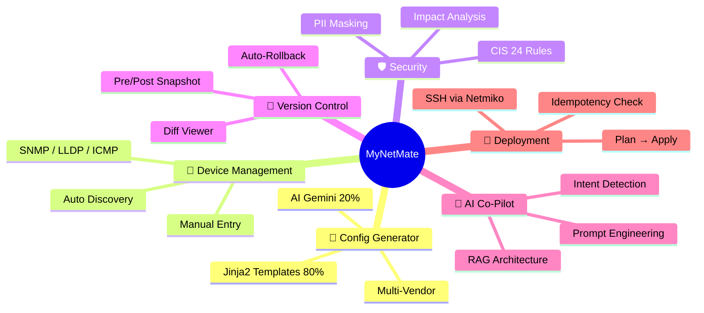
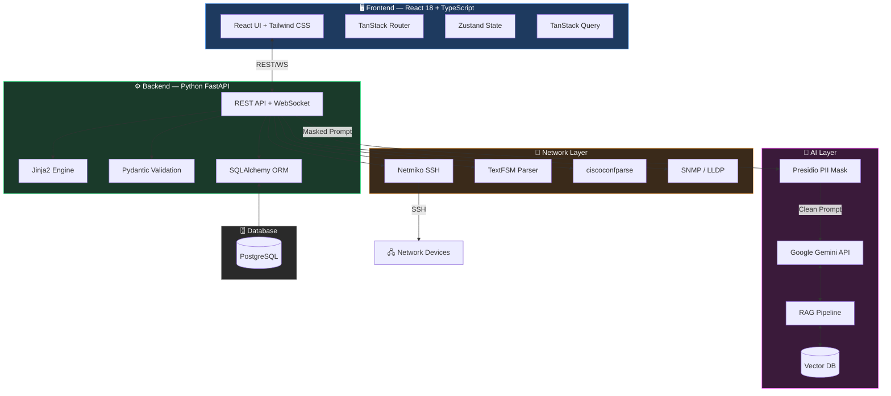
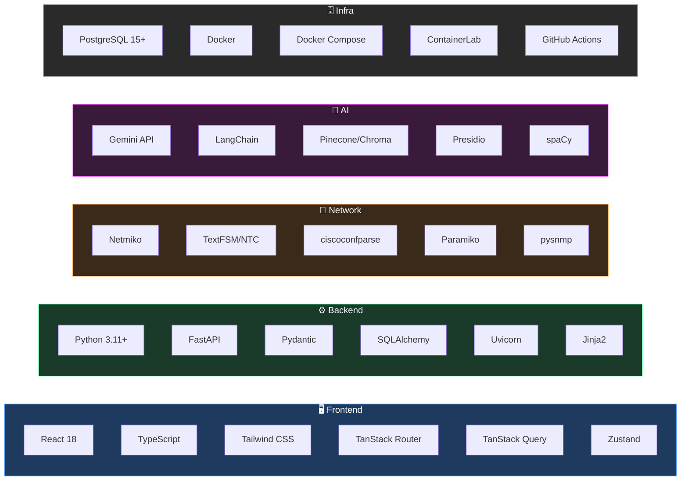
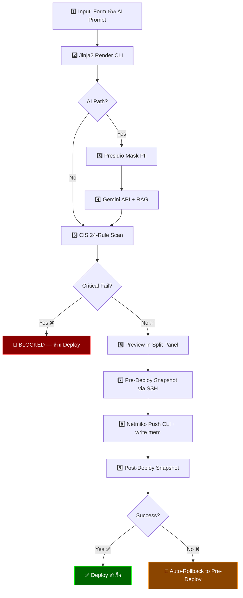
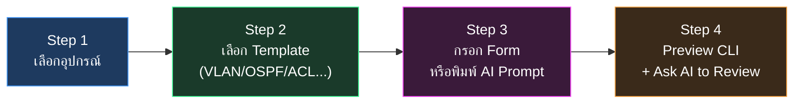
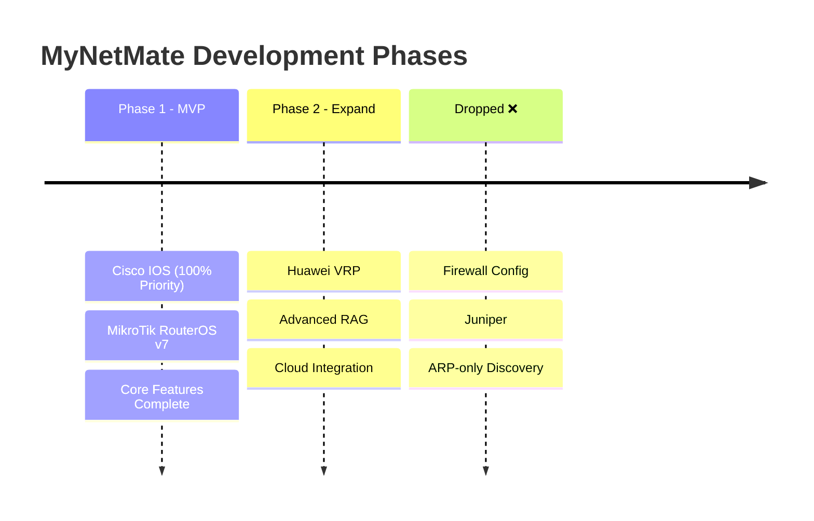

# 🌐 MyNetMate — Project Infographic
> **CEPP68-33** | KMITL — King Mongkut's Institute of Technology Ladkrabang  
> ระบบจัดการเครือข่ายและสร้างคอนฟิกอัตโนมัติ พร้อม AI Co-Pilot  

---

## 🧭 MyNetMate คืออะไร?



> [!IMPORTANT]
> **ปรัชญาหลัก:** "ใช้ AI เมื่อต้องการ **ความเข้าใจ** — ไม่ใช้ AI เมื่อต้องการ **ความถูกต้อง**"

---

## 🏗️ System Architecture



---

## 📊 กฎทอง: 80/20 Hybrid Architecture

> [!SUCCESS] 🟢 80% — Template-Based (Non-AI)
> | สิ่งที่ทำ | วิธีทำ |
> |----------|--------|
> | สร้าง VLAN Config | Jinja2 Loop |
> | ตั้งค่า Interface IP | Jinja2 Template |
> | Static/OSPF Routing | Jinja2 Conditional |
> | ACL Rules | Jinja2 Template |
> | Services (SSH/NTP) | CIS Default + Jinja2 |
> | Port Security | Jinja2 Template |
> | STP Configuration | Jinja2 Template |
> 
> **✅ ข้อดี:** 100% Accuracy, ไม่มี Hallucination, ไม่ต้องรอ API, ฟรี

---

> [!INFO] 🔵 20% — AI-Powered (Gemini + RAG)
> | สิ่งที่ทำ | วิธีทำ |
> |----------|--------|
> | NL Config Gen | Gemini API + Context Injection |
> | Security Audit (Holistic) | Gemini + Config Context |
> | Vendor Docs Lookup | RAG + Vector DB |
> | Impact Analysis | Gemini + Topology Context |
> | Auto-Documentation | Gemini Summarization |
> | MOP Generation | Gemini Structured Output |
> | Legacy Device Fallback | Gemini Pro + RAG |
> 
> **⚠️ หมายเหตุ:** ทุก AI Output ติด Flag `AI-generated, review required`

---

## 🧩 12 Core Features

> [!EXAMPLE] 1. 🔧 Hybrid Config Generation
> **Template Path (Non-AI):**
> ```
> User กรอก Form (React) → FastAPI รับ JSON → Jinja2 Render CLI → Real-time Preview ⚡ (ไม่ต้องรอ AI)
> ```
> **Tools:** Jinja2, React, FastAPI, Pydantic
> 
> ---
> **AI Path:**
> ```
> User พิมพ์ภาษาธรรมชาติ → Intent Detection → Presidio Mask PII 🔒 → Inject Device Context → Gemini API → Config → ⚠️ "AI-generated"
> ```
> **Tools:** Gemini API, Presidio, LangChain, PostgreSQL

---

> [!NOTE] 2. 📡 Device Inventory & Discovery
> **Manual Mode:**
> - กรอก Hostname, IP, Vendor, Model
> - อัปโหลด Running-Config
> - จัดกลุ่มตาม Site/Function
> 
> **Discovery Mode (Auto):**
> - IP Range Ping Sweep (ICMP)
> - SNMP `sysDescr` Polling
> - LLDP/CDP Neighbor Discovery
> - OS Fingerprinting
> 
> **Tools:** Netmiko, pysnmp, TextFSM, asyncio, PostgreSQL

---

> [!ABSTRACT] 3. 🗺️ Network Topology
> - Interactive Canvas (Drag & Drop)
> - Router/Switch/AP Icons
> - Manual Link + Port Labels
> - Right-Click Context Menu
> - PNG Export
> - Auto-Layout จาก Discovery Data
> 
> **Tools:** React Canvas/SVG, Tabler Icons, LLDP Data

---

> [!CHECK] 4. 🛡️ CIS Security Compliance
> **24 กฎ Deterministic (Non-AI):**
> 
> | Severity | ตัวอย่าง |
> |----------|---------|
> | 🔴 Critical | enable secret, SSH v2, block Telnet |
> | 🟡 Warning | SNMP default, HTTP server, VTY ACL |
> | 🔵 Info | Banner, Logging config |
> 
> - Critical = **บล็อก Deploy** ทันที
> - Warning = Dismiss ได้ + **ต้องกรอกเหตุผล**
> 
> **Tools:** ciscoconfparse, Python Regex

---

> [!LOCK] 5. 🔒 PII Masking (100% Local)
> ```
> Config ดิบ → Presidio + spaCy NLP (Local) + Custom Regex → [IP_ADDRESS], [MASKED_PWD], [SNMP_COMM] → ส่งไป Gemini API ✅
> ```
> **การรับประกัน:** 100% Local Processing — Zero External Leakage

---

> [!HISTORY] 6. 📜 Version Control & Rollback
> | Event | Trigger | Source Tag |
> |-------|---------|-----------|
> | ก่อน Deploy | อัตโนมัติ | `pre_deploy` |
> | หลัง Deploy | อัตโนมัติ | `post_deploy` |
> | Admin ดึงเอง | กดปุ่ม Manual | `manual` |
> 
> **Diff Viewer:** Side-by-Side + Unified  
> **Rollback:** One-Click หรือ Auto (on Error)  
> **Audit Trail:** Who / When / What ทุกการเปลี่ยนแปลง  
> **Tools:** Myers Diff, Netmiko, PostgreSQL

---

> [!LAUNCH] 7. 🚀 SSH Deployment
> ```
> Review & Approve (Human ✅) → Pre-Deploy Snapshot → Netmiko SSH Push → write memory → Post-Deploy Snapshot → ❌ Error? → Auto-Rollback
> ```
> **Safety:** Plan → Apply Workflow, Idempotency Check

---

> [!BOT] 8. 🤖 AI Co-Pilot (RAG)
> ```mermaid
> graph LR
>     Q[User Query] --> ID[Intent Detection]
>     ID --> CTX[Device Context from DB]
>     CTX --> PM[PII Masking]
>     PM --> RAG[RAG: Vector DB Search]
>     RAG --> GEM[Gemini API]
>     GEM --> VAL[Pydantic Validate]
>     VAL --> UI[Display in React]
> ```
> **Key:** AI ไม่ Execute เอง → แนะนำให้ Engineer ตัดสินใจ

---

> [!SUMMARY] 9. 📊 Dashboard
> - **Metrics Cards:** Total Devices, Online/Offline, Changes Today, CIS Failures
> - **Activity Feed:** 10 รายการล่าสุด
> - **Quick Actions:** ไปหน้า Config, Add Device, AI Chat
> - **System Status:** API / DB Health Dot

---

## ⚙️ 10–12. Settings, Auth & Business Model

> [!SETTINGS] 10. ⚙️ Settings
> | Section | รายละเอียด |
> |---------|-----------|
> | **API Config** | Gemini Key, Model (Flash/Pro), Token Budget, Offline Mode |
> | **User Mgmt** | Admin / Operator / Viewer (RBAC) |
> | **Security** | PII Regex Editor, CIS Rule Toggles |
> | **Templates** | Jinja2 Template Manager (CRUD) |

---

> [!KEY] 11. 🔐 Authentication
> - JWT Token (httpOnly Cookie, 8h Expiration)
> - 3 Roles: **Admin** (Full) / **Operator** (Deploy) / **Viewer** (Read-only)
> - Login Page with Inline Error Handling

---

> [!QUOTE] 12. 💰 Subscription Model (Open Core)
> | Feature | Standard (Free) | Professional (Paid) |
> |---|---|---|
> | Inventory | ✅ Unlimited | ✅ Unlimited |
> | Jinja2 Templates | ✅ Full | ✅ Full |
> | AI (Gemini) | ⚠️ Trial/BYOK | ✅ Full + Cloud RAG |
> | CIS Security | ⚠️ Basic | ✅ Full 24-Rule |
> | Version Control | ✅ Local | ✅ Server-side |
> | SSH Deploy | ✅ Full | ✅ Full |
> | AI Audit Reports | ❌ | ✅ |
> | Support | Community | Priority |

---

## 🛠️ Tech Stack — ทั้งระบบ



---

## ⚖️ AI vs Non-AI — ตัดสินใจอย่างไร?

> [!TIP]
> **กฎทอง:** "มีคำตอบถูกต้องเพียง 1 คำตอบหรือไม่?"
> — **ใช่** → ใช้ Rule/Template (Non-AI)
> — **ไม่ใช่** → ใช้ AI

| ฟังก์ชัน | AI? | เหตุผล |
|---------|-----|--------|
| Form → CLI Config | ❌ | คำตอบเดียว (Deterministic) |
| NL → CLI Config | ✅ | ต้องตีความภาษาธรรมชาติ |
| CIS 24-Rule Check | ❌ | กฎตายตัว ต้อง 100% |
| Holistic Security Audit | ✅ | วิเคราะห์ภาพรวม ไม่มีกฎตายตัว |
| PII Masking | ❌ | ต้อง 100% Local ไม่รั่ว |
| Config Diff | ❌ | Algorithm (Myers Diff) |
| Network Discovery | ❌ | Protocol (SNMP/LLDP/ICMP) |
| SSH Deployment | ❌ | ส่ง CLI ตรงๆ |
| Vendor Docs Search | ✅ | ค้นหาจาก Knowledge Base |
| Auto-Documentation | ✅ | สรุปเป็นภาษามนุษย์ |
| Impact Analysis | ✅ | วิเคราะห์ Topology + ผลกระทบ |
| Intent Detection | ✅ | จำแนกเจตนาผู้ใช้ |

---

## 🔄 Execution Pipeline — 9 ขั้นตอน



---

## 🖥️ UI Pages — 8 หน้าจอ

| Page | ชื่อ | ฟีเจอร์หลัก |
|------|------|------------|
| **P0** | 🔐 Login | JWT Auth, httpOnly Cookie 8h |
| **P1** | 📊 Dashboard | Metrics, Activity Feed, Quick Actions |
| **P2** | 📡 Device Mgmt | Device List + Add/Discovery Scanner |
| **P3** | 🗺️ Topology | Canvas, Drag-Drop, Links, Export PNG |
| **P4** | 🔧 Config Builder | 4-Step Wizard: Select → Template → Form/AI → Preview |
| **P5** | ✅ Review & Deploy | Split Panel: CLI Preview + CIS Checklist + Deploy |
| **P6** | 📜 Version Control | History, Diff Viewer, Rollback, Audit Trail |
| **P7** | ⚙️ Settings | API Key, Users, PII, CIS, Templates |

### Config Builder (P4) — 4-Step Wizard:



---

## 📏 เป้าหมายคุณภาพ (QR Metrics)

| Metric | Target | หมายเหตุ |
|--------|--------|----------|
| ⚡ API Response | **< 500ms** | ไม่รวม LLM |
| 🤖 LLM Generation | **< 30s** | Gemini API |
| 🗄️ DB Query | **< 100ms** | PostgreSQL |
| 🖥️ Frontend Load | **< 2s** | React CSR |
| 🎯 Template Accuracy | **≥ 98%** | Jinja2 |
| 🤖 AI Accuracy (w/ RAG) | **≥ 85-95%** | Gemini + RAG |
| 🔒 PII Detection | **≥ 95%** | Presidio |
| 🛡️ CIS Rule Accuracy | **100%** | Deterministic |
| 👥 Concurrent Users | **≥ 10** | Uvicorn Workers |

---

## 🎯 Vendor Scope & Phase Plan



> [!WARNING]
> **คำเตือนจากอาจารย์ปริญญา:** เขียน Parser สำหรับ 4 Vendor ใน 5 เดือน กับ 4 คน เป็นไปไม่ได้ → **Focus Cisco ก่อน แล้วค่อย MikroTik**

---

## 🔑 Key Takeaways สำหรับทีม

> [!CAUTION]
> **สิ่งที่ห้ามทำ:**
> - ❌ ห้ามให้ AI Execute Config โดยตรง (ต้อง Human-in-the-Loop)
> - ❌ ห้ามส่งข้อมูลอ่อนไหวไป Gemini API โดยไม่ผ่าน Presidio
> - ❌ ห้ามใช้ AI สำหรับงานที่ต้องการ 100% Accuracy (ใช้ Jinja2 แทน)
> - ❌ ห้ามพยายาม Support ทุก Vendor พร้อมกัน

> [!TIP]
> **สิ่งที่ควรจำ:**
> - ✅ **80/20 Rule** — Template ทำงานหลัก, AI ช่วยเสริม
> - ✅ **Inventory มาก่อน AI** — ไม่มี Device DB = AI ทำงานไม่ได้
> - ✅ **CIS Security Gate** — ทุก Config ต้องผ่านก่อน Deploy ไม่ว่ามาจากไหน
> - ✅ **Pre/Post Snapshot** — ทุกครั้งที่ Deploy ต้องถ่ายรูปก่อน-หลังเสมอ
> - ✅ **Offline Mode** — ปิด AI ได้ทุกเมื่อ ระบบยังทำงาน 100% ด้วย Template

---

*สร้างโดย Antigravity AI สำหรับทีม CEPP68-33 | 2026-07-22*  
*รองรับ Obsidian Native Callouts 100%*
