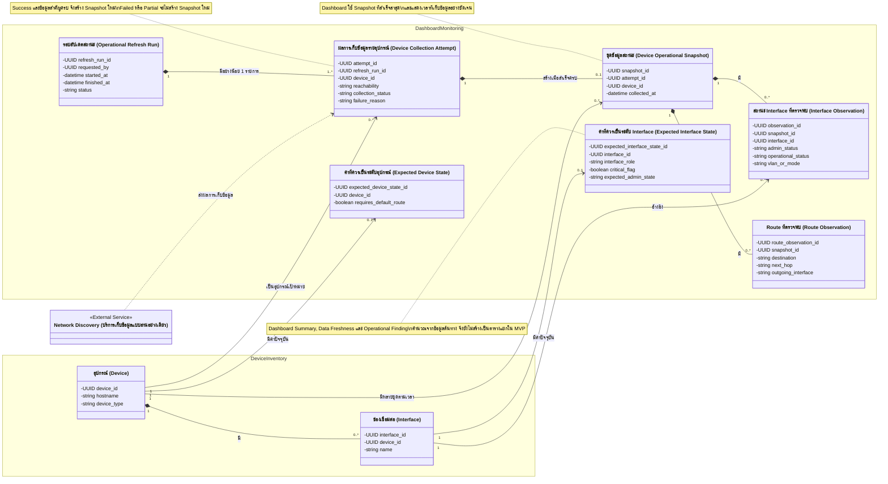
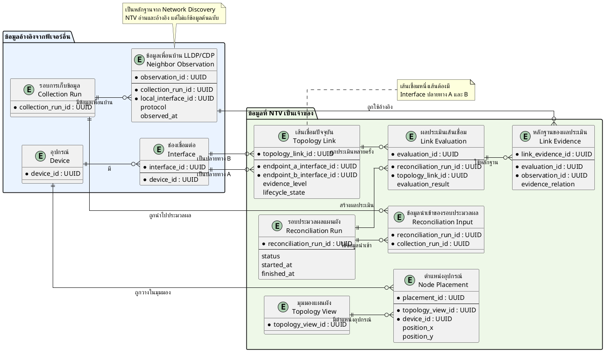

# รายงานความคืบหน้า รายวิชา Project 1 ครั้งที่ 1

**ชื่อโครงงาน:** MyNetMate — ระบบบริหารจัดการและตั้งค่าอุปกรณ์เครือข่าย

**กำหนดส่ง:** 7 สิงหาคม 2569

## สรุปความคืบหน้า

### 1. ศึกษาข้อมูลด้าน Network Automation

ทีมได้ศึกษาแนวคิดและเทคโนโลยีด้าน Network Automation จากหนังสือจำนวน 2 เล่ม ได้แก่ *Network Programmability and Automation, 2nd Edition* และ *AI for Networking Cookbook* โดยคัดเลือกอ่านหัวข้อที่เกี่ยวข้องกับโครงงานโดยตรง ไม่ได้ศึกษาทุกบทเท่ากัน

หัวข้อสำคัญจาก *Network Programmability and Automation, 2nd Edition* ที่นำมาศึกษา ได้แก่:

- แนวคิดและประเภทของ Network Automation เช่น การเก็บข้อมูล การจัดการคอนฟิก การตรวจสอบความสอดคล้อง และการตรวจสอบสถานะ
- Data Formats และ Data Models เพื่อใช้พิจารณารูปแบบข้อมูลระหว่างระบบและการออกแบบ Schema
- Jinja2 Template สำหรับสร้างคอนฟิกจากข้อมูลที่มีโครงสร้างและให้ผลลัพธ์ที่คาดการณ์ได้
- การเชื่อมต่ออุปกรณ์ผ่าน Network API และ Netmiko สำหรับงานที่ต้องสื่อสารผ่าน SSH
- การเปรียบเทียบเครื่องมือ Automation เช่น Ansible และ Nornir
- แนวคิด Network Automation Architecture โดยเฉพาะ Source of Truth ซึ่งนำมาประยุกต์กับ Device Inventory ให้เป็นแหล่งข้อมูลอุปกรณ์กลางของระบบ

หัวข้อจาก *AI for Networking Cookbook* ที่นำมาศึกษา ได้แก่ Prompt Engineering, การวิเคราะห์ Network Configuration, การสร้าง Backend API สำหรับแอปพลิเคชัน AI และแนวคิด Network Co-Pilot การศึกษาส่วนนี้ทำให้ทีมเห็นทั้งประโยชน์และข้อจำกัดของโมเดลภาษา เช่น ความสามารถในการอธิบายหรือช่วยร่างคำสั่ง และความเสี่ยงด้านคำตอบที่คลาดเคลื่อน ข้อมูลสำคัญรั่วไหล และข้อจำกัดของ External API

ผลจากการศึกษาทั้งสองเล่มทำให้ทีมกำหนดหลักการเบื้องต้นว่า งานที่มีคำตอบแน่นอน เช่น การสร้างคอนฟิกพื้นฐานและการตรวจสอบกฎ ควรใช้ Template หรือกฎแบบตายตัวเป็นหลัก ส่วน AI ควรใช้กับงานที่ต้องการการอธิบาย การสรุป หรือข้อเสนอแนะ และต้องมีการตรวจสอบโดยผู้ใช้ก่อนนำไปใช้กับอุปกรณ์จริง

### 2. วิเคราะห์และคัดเลือกฟีเจอร์

ทีมได้รวบรวมฟีเจอร์ที่เกี่ยวข้องกับการทำงานของผู้ดูแลระบบเครือข่าย ได้แก่ Dashboard & Monitoring, Device Inventory, Network Discovery, Network Topology, Configuration Generation, Configuration Deployment, Security Validation, Version Control, Audit Trail, Authentication และ Settings

จากนั้นจึงประเมินแต่ละฟีเจอร์โดยใช้ปัจจัยต่อไปนี้:

- ความสอดคล้องกับปัญหาของผู้ดูแลระบบเครือข่าย
- ความจำเป็นต่อการสาธิตการทำงานแบบต้นจนจบ
- ระยะเวลาและจำนวนสมาชิกของทีม
- ความพร้อมของอุปกรณ์จริงและระบบจำลอง
- ความแตกต่างของคำสั่งระหว่างผู้ผลิต รุ่น และระบบปฏิบัติการ
- ความเสี่ยงจากการเปลี่ยนคอนฟิกบนอุปกรณ์จริง
- ความซับซ้อนในการพัฒนา ทดสอบ และอธิบายผลลัพธ์

ทีมจึงแบ่งแนวทางพัฒนาออกเป็นกลุ่มหลัก ได้แก่ ความสามารถที่ต้องมีในรุ่นแรก โครงสร้างพื้นฐานที่ต้องเตรียมไว้ ความสามารถที่ทำภายหลัง และความสามารถที่ตัดออก ตัวอย่างผลการพิจารณา ได้แก่:

- ใช้ Jinja2 Template เป็นแกนหลักของการสร้างคอนฟิกพื้นฐาน เพราะผลลัพธ์ตรวจสอบและทดสอบซ้ำได้
- ให้การสร้างคอนฟิกด้วย AI และการสั่ง Deploy ผ่าน SSH เป็นความสามารถระยะถัดไป หลังจากส่วนพื้นฐานและมาตรการความปลอดภัยพร้อมแล้ว
- ลดจำนวนกฎ CIS ให้เหลือชุดพื้นฐานที่สามารถพัฒนาและทดสอบได้จริงในเวลาที่กำหนด
- ตัดความสามารถที่มีความเสี่ยงหรือซับซ้อนเกินขอบเขต เช่น Auto-Rollback, Cross-Device Impact Analysis และนโยบาย Multi-vendor ที่ซับซ้อน
- จำกัด Cisco IOS เป็น Baseline หลัก ส่วนอุปกรณ์ยี่ห้ออื่นต้องยืนยันรุ่น ระบบปฏิบัติการ ชุดคำสั่ง และผลทดสอบก่อนกล่าวว่ารองรับ

การตัดฟีเจอร์จึงไม่ใช่เพียงการลดปริมาณงาน แต่เป็นการรักษาให้ระบบรุ่นแรกสามารถทำงานและสาธิตได้จริงภายใต้ข้อจำกัดของโครงงาน

### 3. ปรึกษาอาจารย์ที่ปรึกษา

ทีมได้เข้าพบอาจารย์ที่ปรึกษาอย่างต่อเนื่องเพื่อทบทวนว่าฟีเจอร์ที่เลือกยังตอบโจทย์ผู้ดูแลระบบเครือข่ายหรือไม่ รวมถึงขอคำแนะนำเกี่ยวกับขอบเขต การจัดลำดับฟีเจอร์ การแบ่งงาน และแนวทางออกแบบระบบ

คำแนะนำสำคัญที่ทีมได้รับ ได้แก่:

- หลังจากรวบรวมฟีเจอร์แล้ว ต้องลงรายละเอียดและประเมินว่าส่วนใดควรทำก่อนหรือหลัง ไม่ควรพยายามทำทุกฟีเจอร์พร้อมกัน
- ควรออกแบบ Device Inventory ฝั่ง Backend ให้เป็นข้อมูลกลาง แล้วให้ Discovery นำข้อมูลเข้า ขณะที่ Dashboard, Topology และ Configuration Management ขอใช้ข้อมูลจากส่วนกลางนี้
- แต่ละระบบย่อยควรระบุหน้าที่ ข้อมูลที่รับ ข้อมูลที่ส่ง และ Dependency ให้ชัดเจน เพื่อให้สมาชิกสามารถพัฒนางานคู่ขนานกันโดยใช้ข้อมูลจำลองได้
- ควรจัดทำภาพสถาปัตยกรรมแบบ Component Diagram หรือภาพกล่องและลูกศร เพื่อแสดงองค์ประกอบ การเชื่อมต่อ และผู้รับผิดชอบแต่ละส่วน
- SNMP แบบ Read-only สามารถใช้สำหรับค้นหาและอ่านข้อมูลอุปกรณ์ได้ แต่ควรมี Manual Entry รองรับอุปกรณ์ที่ไม่ได้เปิด SNMP และไม่ควรใช้ SNMP เป็นวิธีหลักในการแก้ไขคอนฟิกหลายรายการ
- ระบบจำลองช่วยทดสอบกรณีพื้นฐานได้ แต่ไม่สามารถแทนพฤติกรรมของอุปกรณ์จริงได้ทั้งหมด จึงต้องวางแผนทดสอบกับอุปกรณ์จริงเมื่อมีความพร้อม
- ต้องระบุว่าข้อมูลใดควรแสดงบน Dashboard เช่น VLAN, โหมดพอร์ต สถานะพอร์ต และสถานะลิงก์ พร้อมแยกข้อมูลสรุปออกจากข้อมูลรายละเอียด
- การเลือกใช้ Relational Database หรือ NoSQL ต้องพิจารณาจากลักษณะข้อมูลและการใช้งาน ไม่ควรเลือกจากชื่อเทคโนโลยีเพียงอย่างเดียว

คำแนะนำดังกล่าวถูกนำมาใช้ปรับวิธีทำงานของทีม จากเดิมที่มีเพียงรายการฟีเจอร์ ให้เริ่มกำหนด MVP, เจ้าของข้อมูล, Dependency และ Schema ของแต่ละส่วนอย่างเป็นระบบ

### 4. แบ่งหน้าที่ภายในทีม

ทีมได้เริ่มแบ่งงานตามฟีเจอร์หรือระบบย่อย แทนการแบ่งเฉพาะ Frontend และ Backend เพื่อให้สมาชิกแต่ละคนรับผิดชอบงานของตนตั้งแต่การศึกษาปัญหา กำหนดขอบเขต ออกแบบข้อมูล ไปจนถึงการระบุวิธีเชื่อมต่อกับฟีเจอร์อื่น

เจ้าของแต่ละฟีเจอร์มีหน้าที่หลักดังนี้:

1. อธิบายปัญหาและผู้ใช้เป้าหมายของฟีเจอร์
2. กำหนดความสามารถที่จำเป็นและสิ่งที่ไม่อยู่ในขอบเขต
3. จัดทำ MVP ของฟีเจอร์
4. ระบุข้อมูลที่ฟีเจอร์เป็นเจ้าของและข้อมูลที่ต้องขอจากฟีเจอร์อื่น
5. ออกแบบ Schema และความสัมพันธ์ของข้อมูลเบื้องต้น
6. ระบุ Dependency, ข้อจำกัด และประเด็นที่ต้องปรึกษาสมาชิกคนอื่น
7. อัปเดตเอกสารกลางเพื่อให้สมาชิกตรวจสอบความคืบหน้าได้

ส่วนที่ต้องตกลงร่วมกันทั้งทีม ได้แก่ Device Identity, Interface Identity, Credential, User และ Audit Event รวมถึงมาตรฐาน API, รูปแบบข้อผิดพลาด และหลักการตั้งชื่อข้อมูล เพื่อป้องกันการสร้างข้อมูลหรือตารางซ้ำกัน

### 5. กำหนดผลิตภัณฑ์ขั้นต่ำที่ใช้งานได้ของแต่ละฟีเจอร์

สมาชิกแต่ละคนเริ่มกำหนดผลิตภัณฑ์ขั้นต่ำที่ใช้งานได้ (Minimum Viable Product: MVP) ของฟีเจอร์ที่รับผิดชอบ เพื่อให้ขอบเขตเหมาะสมกับเวลาและทรัพยากรของทีม โดยการกำหนด MVP ไม่ได้พิจารณาเพียงจำนวนหน้าจอ แต่พิจารณาว่าผู้ใช้สามารถทำงานหลักของฟีเจอร์ได้สำเร็จหรือไม่

เอกสาร MVP ของแต่ละฟีเจอร์ควรระบุอย่างน้อย:

- เป้าหมายและปัญหาที่ต้องการแก้
- ผู้ใช้งานและเหตุการณ์ที่ต้องรองรับ
- ความสามารถที่ต้องมีในรุ่นแรก
- ข้อมูลนำเข้า ผลลัพธ์ และข้อมูลที่ต้องขอจากฟีเจอร์อื่น
- ความสามารถที่เลื่อนไปพัฒนาภายหลัง
- ความสามารถที่ไม่ทำ พร้อมเหตุผล
- เกณฑ์ที่ใช้ตรวจว่าฟีเจอร์ทำงานสำเร็จ

ตัวอย่างการลดขอบเขตที่ได้จากการศึกษา ได้แก่ Dashboard รุ่นแรกเน้นสถานะปัจจุบันและข้อมูลที่นำไปตรวจสอบต่อได้ก่อน ยังไม่เน้นกราฟย้อนหลังหรือการวิเคราะห์เชิงพยากรณ์ ส่วน Configuration Generation เริ่มจากคอนฟิกพื้นฐานที่สร้างด้วย Template ขณะที่คำสั่งขั้นสูงและการสร้างคอนฟิกด้วย AI ถูกเลื่อนไปภายหลัง

แนวทางนี้ช่วยให้ทีมแยกได้ชัดเจนระหว่าง “โครงสร้างที่ควรรองรับในอนาคต” กับ “หน้าจอและความสามารถที่ต้องพัฒนาให้เสร็จในรุ่นแรก” เช่น ฐานข้อมูลอาจรองรับการอัปเดตหลายอุปกรณ์ในหนึ่งรอบ แต่หน้าเว็บรุ่นแรกเริ่มจากการอัปเดตครั้งละหนึ่งอุปกรณ์ได้

#### 5.1 ความคืบหน้าของฟีเจอร์ Dashboard & Monitoring

สำหรับฟีเจอร์ Dashboard & Monitoring ได้กำหนดเป้าหมายให้ระบบแสดง **สถานะการทำงานล่าสุดที่เก็บจากอุปกรณ์ ณ ช่วงเวลาหนึ่ง** เพื่อช่วยให้วิศวกรเครือข่ายเห็นภาพรวม ตรวจพบปัญหาสำคัญ และเปิดดูหลักฐานที่เกี่ยวข้องได้ โดยระบบต้องแสดงเวลาที่เก็บข้อมูลอย่างชัดเจนและไม่กล่าวอ้างว่าเป็นข้อมูลแบบเวลาจริง (Real-time)
Dashboard & Monitoring

ระบบแสดงภาพสถานะการทำงานล่าสุดที่เก็บจากอุปกรณ์ ณ ช่วงเวลาหนึ่ง ช่วยให้วิศวกรตอบได้ว่า

- มีอุปกรณ์ใดเข้าถึงไม่ได้?
    
- การเก็บข้อมูลจากอุปกรณ์สำเร็จหรือไม่?
    
- ปัญหาอยู่ที่ Switch Uplink หรือ Access Port?
    
- Port อยู่ VLAN ใด?
    
- Router มีทางออกสำหรับ WAN ไหม?
    
- ข้อมูลยังเชื่อถือได้หรือไม่?
    
- ก่อนเกิดเหตุมีการดำเนินการอะไร?
    
- อุปกรณ์ ping ได้แต่ละระบบอ่านข้อมูลไม่ได้?
    
- ยังไม่มีข้อมูลหรือเก็บข้อมูลผิดพลาด?
    
- Port ใดถูกอุปกรณ์ปิด เพราะความผิดปกติ?
    
- การไม่มี Default Route เป็นความผิดปกติจริงหรือไม่?
    
- Network ทำงานแต่ยังมีความเสี่ยง Security หรือไม่?
    
- ระบบแอพพลิเคชันของเรา ส่วนใดพร้อมใช้งาน?
    

ขอบเขต MVP ระดับฟีเจอร์แบ่งออกเป็น 5 กลุ่มหลัก ได้แก่:

- สถานะล่าสุดและภาพรวมเครือข่าย: 
    

- แสดงชุดข้อมูลสถานะล่าสุด (Operational Snapshot) และสรุปจำนวนอุปกรณ์ที่ติดต่อได้ ติดต่อไม่ได้ ยังไม่ทราบสถานะ เก็บข้อมูลล้มเหลว หรือมีข้อมูลเก่าเกินกำหนด
    

- การเก็บและตีความสถานะ: 
    

- ให้ผู้ใช้สั่งอัปเดตข้อมูลของอุปกรณ์ที่ลงทะเบียน และแยกสถานะการเข้าถึงอุปกรณ์ (Reachability), ผลการเก็บข้อมูล (Collection Status), สถานะการทำงาน (Operational State) และความใหม่ของข้อมูล (Data Freshness) ออกจากกัน
    

- การตรวจหาปัญหาจากสถานะที่คาดหวัง: 
    

- เปรียบเทียบสถานะจริงกับค่าที่ผู้ใช้กำหนดว่าควรเป็นด้วยกฎแบบตายตัว เพื่อค้นหาปัญหา เช่น อุปกรณ์ติดต่อไม่ได้ การเก็บข้อมูลล้มเหลว Uplink หรือ WAN สำคัญไม่ทำงาน พอร์ตเป็น Err-disabled และ Edge Router ไม่มี Default Route ตามที่กำหนด
    

- รายละเอียดของ Switch และ Router: 
    

- แสดงสถานะ Interface, Access/Trunk, VLAN, Uplink, Layer 3 Interface, WAN และ Default Route โดยพิจารณาบทบาทและความสำคัญของ Interface เพื่อลดการแจ้งเตือนเกินจริงจาก Access Port ที่ปิดตามปกติ
    

- การตรวจสอบต่อและการเชื่อมโยงฟีเจอร์อื่น: 
    

- รองรับการกดจากข้อมูลสรุปไปยัง Device, Interface หรือ Route ที่เกี่ยวข้อง พร้อมแสดง Security Summary, Recent Activity, ความพร้อมของ Backend และ Database, Offline Mode และทางลัดไปยัง Workflow สำคัญตามสิทธิ์ของผู้ใช้
    

MVP  (Minimum Viable Product):

- DF-01 : Current Operational Snapshot
    

- แสดงภาพสถานะล่าสุดของอุปกรณ์เครือข่าย(Operational Snapshot)ที่ลงทะเบียนใน Device Inventory โดยระบุเวลาที่ข้อมูลถูกเก็บอย่างชัดเจน และไม่อ้างว่าเป็นข้อมูล Real-time
    

- DF-02 : Network Overview
    

- สรุปภาพรวมของอุปกรณ์และข้อมูลปฏิบัติการ เช่น Reachable, Unreachable, Unknown, Collection Failed และ Stale เพื่อให้ผู้ใช้เห็นสถานการณ์เบื้องต้นจากหน้าเดียว
    

- DF-03 : Manual Operational Refresh
    

- ให้ผู้ใช้เป็นผู้สั่ง Refresh ข้อมูล สำหรับอุปกรณ์ที่ต้องการตรวจ โดยเชื่อมต่อเฉพาะอุปกรณ์ที่ลงทะเบียน
    

- DF-04 : Operational State Separation
    

- สร้าง State ที่แยกสถานะออกจากกัน ได้แก่ : 
    

- Reachability บอกว่า   ติดต่ออุปกรณ์ได้หรือไม่
    
- Collection Status บอกว่า  เก็บและแปลงข้อมูลสำเร็จหรือไม่
    
- Operational State บอกว่า Interface, WAN หรือ Routing ทำงานอย่างไร
    
- Data Freshness บอกว่า ข้อมูลยังใหม่หรือเก่าแล้ว
    

- DF-05 : Operational Problem Summary
    

- สรุปรายการปัญหาสำคัญที่ตรวจพบจาก สถานะการทำงานที่เก็บจากอุปกรณ์ กับ สิ่งที่คาดจะให้สถานะของอุปกรณ์มันเป็น ด้วยกฏที่แน่นอน
    

- ครอบคลุมปัญหาหลักในระดับ Feature ได้แก่:
    

- ไม่สามารถติดต่ออุปกรณ์ได้
    
- การเก็บข้อมูลจากอุปกรณ์ล้มเหลว
    
- ข้อมูลสถานะการทำงานเก่า (Stale Operational Data) เกินกำหนด
    
- Interface สำคัญของ Swtich มีปัญหา
    
- พอร์ตถูกปิดใช้งานเนื่องจากตรวจพบข้อผิดพลาด
    
- ขา WAN ที่สำคัญมีปัญหา
    
- ไม่พบ Default Route ที่กำหนดไว้ว่าต้องมี
    

- DF-06 : Switch Operational Visibility
    

- แสดงสถานะการทำงานของ Switch ทั้งในหน้า Dashboard Summary และหน้า Switch Detail เพื่อให้ผู้ใช้ตรวจสอบ Interface, Access/Trunk, VLAN และปัญหาของ Uplink ได้
    

- ระบบต้องพิจารณาทั้งบทบาทของพอร์ต ระดับความสำคัญ และสาเหตุที่พอร์ตไม่ทำงาน เพื่อหลีกเลี่ยงการแจ้งเตือนพอร์ตปกติจำนวนมากจนบดบังปัญหาที่ต้องรีบแก้ไขจริง ๆ
    

- Access Port Down ทั่วไป: พอร์ตที่ต่อกับคอมพิวเตอร์หรือเครื่องพิมพ์ อาจ Down เพราะปิดเครื่องหรือถอดสาย จึงอาจเป็นเรื่องปกติ
    
- Critical Uplink Down: พอร์ตสำคัญที่เชื่อมต่อ Switch, Router หรือเครือข่ายส่วนอื่น หาก Down อาจทำให้ผู้ใช้หลายคนใช้งานไม่ได้ จึงต้องแจ้งเตือน
    
- Err-disabled Port: อุปกรณ์ปิดพอร์ตอัตโนมัติเนื่องจากพบความผิดปกติ เช่น Port Security หรือ BPDU Guard จึงควรแจ้งให้ผู้ดูแลตรวจสอบ
    

- DF-07 : Router Operational Visibility
    

- แสดงสถานะการทำงานของ Router ทั้งในหน้า Dashboard Summary และหน้า Router Detail เพื่อให้ผู้ใช้ตรวจสอบ Layer 3 Interface, WAN และ Default Route ได้
    

- DF-08 : Expected State and Criticality
    

- ให้ผู้ใช้กำหนดความคาดหวังของอุปกรณ์และ Interface ก่อนที่ระบบจะสรุปว่า สถานะในปัจจุบัน ผิดปกติ
    
- Feature นี้ครอบคลุมแนวคิดระดับ Feature ได้แก่: 
    

- Interface Role : ระบุว่าช่องเชื่อมต่อมีหน้าที่อะไร เพื่อช่วยตีความสถานะได้ถูกต้อง 
    

- Access, Uplink หรือ WAN 
    

- Critical Flag  : ระบุว่าช่องเชื่อมต่อนี้มีความสำคัญต่อระบบหรือไม่ หากมีปัญหาจะได้รับระดับการแจ้งเตือนสูงขึ้น
    

- Uplink ที่เชื่อมต่อ Core Switch ถูกกำหนดเป็นช่องเชื่อมต่อสำคัญ
    

- Expected Interface State  : ระบุสถานะที่ผู้ใช้คาดหวังให้ช่องเชื่อมต่อมี เช่น ควรทำงานหรือยอมให้ปิดได้ 
    

- Gi0/1 ควรอยู่ในสถานะ Up
    

- Edge Router Expectation : ระบุว่า Router ตัวใดทำหน้าที่เป็นทางออกของเครือข่ายและควรมีสิ่งใดอยู่
    

- Router ทางออกควรมี Default Route อย่างน้อยหนึ่งเส้น
    

- Expected Network State  : ภาพรวมของเงื่อนไขทั้งหมดที่ผู้ใช้กำหนดว่าเครือข่ายควรมีหรือควรทำงานอย่างไร 
    

- Uplink ต้อง Up, WAN ต้องทำงาน และ Edge Router ต้องมี Default Route
    

- DF-09 :  Data Freshness and Last Known State
    

- แสดงเวลาที่เก็บข้อมูลสำเร็จล่าสุด ความใหม่ของข้อมูลเมื่อเทียบกับเวลาปัจจุบัน และผลของความพยายาม Collection ล่าสุด
    

- DF-10 : Operational Drill-down
    

- ให้ผู้ใช้กดจาก Summary หรือจำนวนปัญหาไปยังรายการ Device, Interface หรือ Route ที่เกี่ยวข้อง เพื่อเปิดดูหลักฐานและรายละเอียดต่อได้ทันที
    

- DF-11 : Security Summary
    

- แสดงจำนวน ระดับปัญหาจาก Security & Validation Feature โดย Dashboard อ่านและสรุปข้อมูลจากเจ้าของข้อมูล ไม่สร้างผลการตรวจความปลอดภัยเอง
    

- DF-12 : Recent Activity and Audit Integration
    

- แสดงกิจกรรมล่าสุดจาก Audit Trail และบันทึกการ Refresh
    

- DF-13 : System Health and Offline Mode Status
    

- แสดงความพร้อมของ Backend, Database และสถานะ Offline Mode เพื่อให้ผู้ใช้ทราบว่าระบบ MyNetMate พร้อมทำงานหรือไม่
    

- DF-14 : Quick Actions 
    

- มีทางลัดไปยัง Workflow สำคัญ เช่น Device Inventory, Configuration Generation , Security Validation และ Audit Trail โดยแสดงตามสิทธิ์ของผู้ใช้
    

ข้อสรุปการออกแบบเบื้องต้นของฟีเจอร์นี้ ได้แก่:

- หน้าเว็บ MVP เริ่มจากการสั่งอัปเดตครั้งละหนึ่งอุปกรณ์ แต่โครงสร้างข้อมูลสามารถรองรับหลายอุปกรณ์ภายในรอบเดียวในอนาคต
- เก็บชุดข้อมูลสถานะที่สำเร็จได้หลายรอบเพื่อรักษาหลักฐาน แต่หน้า Dashboard รุ่นแรกแสดงเฉพาะชุดที่สำเร็จล่าสุด
- หากเก็บข้อมูลสำคัญได้เพียงบางส่วน ระบบบันทึกผลว่าไม่สมบูรณ์ แต่ไม่ใช้ข้อมูลชุดนั้นแทนชุดข้อมูลสถานะที่สำเร็จล่าสุด
- เมื่อข้อมูลรอบใหม่ล้มเหลว ระบบยังแสดงสถานะที่สำเร็จล่าสุดพร้อมเวลาของข้อมูลและคำเตือนว่าข้อมูลอาจเก่า
- รายการปัญหาปัจจุบันคำนวณจากชุดข้อมูลล่าสุด ค่าที่ควรเป็น และกฎแบบตายตัว โดยยังไม่ทำประวัติปัญหาและการวิเคราะห์เชิงพยากรณ์ใน MVP
- ข้อมูล Security Summary และ Recent Activity เป็นข้อมูลที่ขอจาก Security & Validation และ Audit Trail ตามลำดับ โดย Dashboard ไม่สร้างข้อมูลเหล่านี้ซ้ำเอง

ผลลัพธ์ที่จัดทำแล้วประกอบด้วยขอบเขตฟีเจอร์ DF-01 ถึง DF-14 เหตุการณ์จำลองสำหรับตรวจสอบความจำเป็นของฟีเจอร์ และการออกแบบข้อมูลเบื้องต้นในระดับเจ้าของข้อมูล Dependency และ Conceptual Entity

**สถานะปัจจุบัน:** กำหนด Feature-level MVP และหลักการทำงานหลักแล้ว อยู่ระหว่างพัฒนาแบบจำลองข้อมูลและความสัมพันธ์ให้เป็น Schema ที่นำไปสร้างฐานข้อมูลได้จริง โดยยังต้องยืนยัน Data Contract กับ Device Inventory, Network Discovery, Security & Validation และ Audit Trail ร่วมกับผู้รับผิดชอบฟีเจอร์เหล่านั้น

#### 5.2 ข้อมูลและ Schema เบื้องต้นของ Dashboard & Monitoring

Dashboard & Monitoring เป็นเจ้าของข้อมูลที่เกิดจากกระบวนการติดตามสถานะของตนเอง แต่ใช้ข้อมูลตัวตนอุปกรณ์ ผลการเก็บข้อมูล ผู้ใช้ ความปลอดภัย และประวัติกิจกรรมจากฟีเจอร์เจ้าของข้อมูล โดยไม่สร้างข้อมูลเหล่านั้นซ้ำ

**ข้อมูลที่ Dashboard & Monitoring เป็นเจ้าของ**

| กลุ่มข้อมูลเบื้องต้น                                       | ข้อมูลสำคัญที่เก็บ                                                       | จุดประสงค์                                                  |
| ---------------------------------------------------------- | ------------------------------------------------------------------------ | ----------------------------------------------------------- |
| รอบอัปเดตสถานะ (`operational_refresh_runs`)                | ผู้เริ่ม เวลาเริ่ม–สิ้นสุด และสถานะของรอบ                                | ควบคุมการสั่ง Refresh และติดตามผลของแต่ละรอบ                |
| ผลการเก็บข้อมูลรายอุปกรณ์ (`device_collection_attempts`)   | อุปกรณ์ ผล Reachability, Collection Status และสาเหตุที่ล้มเหลว           | แยกกรณีติดต่อไม่ได้ เก็บข้อมูลไม่ได้ และเก็บได้เพียงบางส่วน |
| ชุดข้อมูลสถานะ (`device_operational_snapshots`)            | อุปกรณ์ เวลาที่เก็บสำเร็จ และแหล่งที่มาของข้อมูล                         | เก็บหลักฐานสถานะที่สำเร็จในแต่ละช่วงเวลา                    |
| สถานะช่องเชื่อมต่อ (`interface_operational_observations`)  | Interface, Admin/Operational Status, Access/Trunk, VLAN และ Err-disabled | แสดงและตรวจสอบสถานะของ Switch และ Router Interface          |
| เส้นทางที่ตรวจพบ (`route_observations`)                    | ปลายทาง Next Hop, Outgoing Interface และสถานะของ Default Route           | ตรวจว่า Router มีเส้นทางออกตามที่กำหนดหรือไม่               |
| ค่าที่ควรเป็นระดับอุปกรณ์ (`expected_device_states`)       | อุปกรณ์เป็น Edge Router หรือไม่ และต้องมี Default Route หรือไม่          | ใช้เปรียบเทียบสถานะจริงระดับอุปกรณ์                         |
| ค่าที่ควรเป็นระดับ Interface (`expected_interface_states`) | Interface Role, Critical Flag และ Expected Admin State                   | แยกพอร์ตทั่วไปออกจาก Uplink หรือ WAN ที่สำคัญ               |

**ข้อมูลที่ต้องขอจากฟีเจอร์อื่น**

| ฟีเจอร์เจ้าของข้อมูล       | ข้อมูลที่ Dashboard & Monitoring ต้องใช้                                                                                                                            |
| -------------------------- | ------------------------------------------------------------------------------------------------------------------------------------------------------------------- |
| Device Inventory           | Device ID, Interface ID, Hostname, Device Type, Vendor, Model, OS Version, Management Address, Site, Group และสถานะการใช้งานของอุปกรณ์                              |
| Authentication และ RBAC    | User ID และสิทธิ์ในการดูข้อมูล สั่ง Refresh หรือแก้ไข Expected State                                                                                                |
| Network Discovery          | บริการเก็บข้อมูลแบบอ่านอย่างเดียวจากอุปกรณ์ที่ลงทะเบียน พร้อมผล Reachability, Collection Status, ข้อมูลที่ Parser แปลงแล้ว เวลาเก็บ และสาเหตุที่ล้มเหลวอย่างปลอดภัย |
| Security & Validation      | จำนวนปัญหา ระดับความรุนแรง ผล Pass/Fail และเวลาที่ตรวจล่าสุดสำหรับ Security Summary                                                                                 |
| Audit Trail                | กิจกรรมล่าสุดของระบบ ขณะที่ D&M ส่งเหตุการณ์ Refresh และการแก้ Expected State ไปบันทึก                                                                              |
| Settings และ System Health | Offline Mode และสถานะความพร้อมของ Backend กับ Database                                                                                                              |

Dashboard & Monitoring จะส่งคำขอเก็บข้อมูลไปยัง Network Discovery และรับผลกลับมา โดยไม่ขอ Credential Reference ไม่อ่านรหัสผ่าน และไม่จัดการการเชื่อมต่อกับอุปกรณ์โดยตรง ส่วน Network Discovery เป็นผู้รับผิดชอบการเชื่อมต่อและการใช้ข้อมูลรับรองภายในระบบของตน

**ความสัมพันธ์ของข้อมูลเบื้องต้น**

หน้าเว็บของผลิตภัณฑ์ขั้นต่ำที่ใช้งานได้ (MVP) จะเริ่มจากการให้ผู้ใช้สั่งอัปเดตสถานะครั้งละหนึ่งอุปกรณ์ แต่โครงสร้างข้อมูลจะรองรับการอัปเดตหลายอุปกรณ์ภายในรอบเดียวในอนาคต หากการเก็บข้อมูลล้มเหลวหรือสำเร็จเพียงบางส่วน ระบบจะไม่สร้างชุดข้อมูลสถานะใหม่ และแดชบอร์ดจะใช้ชุดข้อมูลสถานะที่เก็บสำเร็จล่าสุดพร้อมแสดงคำเตือน

ข้อมูลสรุป เช่น จำนวนอุปกรณ์ที่ติดต่อไม่ได้ ระดับความเก่าของข้อมูล สถานะล่าสุดที่ทราบ และรายการปัญหาปัจจุบัน จะคำนวณจากชุดข้อมูลสถานะที่เก็บสำเร็จล่าสุด ค่าที่ผู้ใช้กำหนดว่าควรเป็น และกฎตรวจสอบแบบตายตัว ดังนั้น ในผลิตภัณฑ์ขั้นต่ำที่ใช้งานได้จึงยังไม่สร้างตารางสรุปหน้าแดชบอร์ดหรือตารางรายการปัญหาแยกต่างหาก

#### 5.3 ความคืบหน้าของฟีเจอร์ Network Topology Visualization

ฟีเจอร์แสดงแผนผังเครือข่าย (Network Topology Visualization: NTV) มีเป้าหมายให้ผู้ใช้เห็นว่าอุปกรณ์ใดเชื่อมต่อกับอุปกรณ์ใด ผ่านช่องเชื่อมต่อใด โดยสร้างแผนผังจากข้อมูล LLDP/CDP ที่เก็บจากอุปกรณ์จริง ไม่ใช่โปรแกรมวาดแผนผังหรือสร้างเส้นเชื่อมจากการคาดเดาของผู้ใช้

ขอบเขตผลิตภัณฑ์ขั้นต่ำที่ใช้งานได้ของ NTV ประกอบด้วย:

- แสดง Router และ Switch ที่ลงทะเบียนใน Device Inventory และเก็บข้อมูลสำเร็จแล้วเป็นอุปกรณ์บนแผนผัง
- สร้างเส้นเชื่อมโดยอัตโนมัติจากข้อมูลเพื่อนบ้าน LLDP/CDP พร้อมชื่อช่องเชื่อมต่อทั้งสองฝั่ง
- แสดงแหล่งที่มา เวลาที่ตรวจล่าสุด และระดับของหลักฐาน เช่น พบข้อมูลฝั่งเดียวหรือพบข้อมูลตรงกันทั้งสองฝั่ง
- แสดงคำเตือนเมื่อยังระบุปลายทางไม่ได้ ข้อมูลขัดแย้ง หรือข้อมูลเก่า โดยไม่ลบเส้นเชื่อมทันทีเมื่อการเก็บข้อมูลล้มเหลวเพียงรอบเดียว
- ให้ผู้ใช้ลากตำแหน่งอุปกรณ์ ย่อ–ขยาย เลื่อนแผนผัง เปิดรายละเอียดอุปกรณ์หรือช่องเชื่อมต่อ และสั่งเก็บข้อมูลใหม่แบบอ่านอย่างเดียวได้
- ใช้ระบบสิทธิ์และประวัติการดำเนินงานส่วนกลางในการควบคุมการสั่งเก็บข้อมูลใหม่และการแก้ตำแหน่งบนแผนผัง

NTV รุ่นแรกจะยังไม่รองรับการวาดหรือแก้เส้นเชื่อมด้วยมือ การแก้คอนฟิกจากหน้าแผนผัง Topology ระดับ OSPF/BGP การวิเคราะห์ผลกระทบข้ามอุปกรณ์ การตัดสินใจด้วยปัญญาประดิษฐ์ และการแสดงผลแบบเวลาจริง

#### 5.4 ข้อมูลและ Schema เบื้องต้นของ Network Topology Visualization

**ข้อมูลที่ NTV เป็นเจ้าของ**

| กลุ่มข้อมูลเบื้องต้น                                                                     | หน้าที่                                                                   |
| ---------------------------------------------------------------------------------------- | ------------------------------------------------------------------------- |
| มุมมองแผนผัง (`topology_views`)                                                          | เก็บมุมมองแผนผังหลักและเงื่อนไขการแสดงผล                                  |
| ตำแหน่งอุปกรณ์ (`topology_node_placements`)                                              | เก็บตำแหน่งของอุปกรณ์บนมุมมอง โดยไม่เปลี่ยนข้อมูลเครือข่ายจริง            |
| รอบประมวลผลแผนผัง (`topology_reconciliation_runs`)                                       | บันทึกรอบที่นำข้อมูลจากการเก็บอุปกรณ์มาประมวลผลเป็นแผนผัง                 |
| ข้อมูลนำเข้าของรอบประมวลผล (`topology_reconciliation_inputs`)                            | ระบุว่ารอบประมวลผลใช้ผลการเก็บข้อมูลรอบใดบ้าง                             |
| เส้นเชื่อมปัจจุบัน (`topology_links`)                                                    | เก็บช่องเชื่อมต่อสองฝั่ง ระดับหลักฐาน และสถานะปัจจุบันของเส้นเชื่อม       |
| ผลประเมินและหลักฐานของเส้นเชื่อม (`topology_link_evaluations`, `topology_link_evidence`) | เก็บผลการประเมินแต่ละรอบและอ้างกลับไปยังข้อมูล LLDP/CDP ที่ใช้เป็นหลักฐาน |

**ข้อมูลที่ NTV ต้องขอจากฟีเจอร์อื่น**

| ฟีเจอร์เจ้าของข้อมูล    | ข้อมูลที่ NTV ต้องใช้                                                                                |
| ----------------------- | ---------------------------------------------------------------------------------------------------- |
| Device Inventory        | Device ID, Interface ID, ชื่ออุปกรณ์ ประเภท ผู้ผลิต พื้นที่ติดตั้ง และสถานะการใช้งาน                 |
| Network Discovery       | รอบการเก็บข้อมูล ผลสำเร็จหรือล้มเหลว และข้อมูลเพื่อนบ้าน LLDP/CDP พร้อมเวลาและช่องเชื่อมต่อที่ตรวจพบ |
| Authentication และ RBAC | User ID และสิทธิ์ในการดูแผนผัง แก้ตำแหน่ง หรือสั่งเก็บข้อมูลใหม่                                     |
| Audit Trail             | NTV ส่งเหตุการณ์การสั่งเก็บข้อมูลใหม่และการเปลี่ยนตำแหน่งแผนผังไปบันทึก                              |

**ความสัมพันธ์ของข้อมูลเบื้องต้น**

ข้อมูลอุปกรณ์ ช่องเชื่อมต่อ และข้อมูลเพื่อนบ้านยังคงเป็นของ Device Inventory และ Network Discovery ส่วน NTV เก็บเฉพาะมุมมอง ตำแหน่ง ผลการประมวลผล และข้อสรุปของเส้นเชื่อม เพื่อลดการทำสำเนาข้อมูลและทำให้ทุกเส้นเชื่อมสามารถตรวจย้อนกลับไปยังหลักฐานได้

**สถานะปัจจุบัน:** กำหนดขอบเขต MVP และ Logical Schema เบื้องต้นแล้ว โดยยังต้องยืนยันรูปแบบข้อมูลร่วมกับ Device Inventory และ Network Discovery รวมถึงทดสอบว่าอุปกรณ์ Cisco, Huawei และ MikroTik รุ่นที่มีอยู่สามารถส่งข้อมูล LLDP/CDP และระบุช่องเชื่อมต่อได้ครบถ้วนเพียงใด

### 6. ออกแบบการจัดเก็บและการใช้ข้อมูลเบื้องต้น

ทีมเริ่มออกแบบข้อมูลจากขอบเขต MVP และเหตุการณ์ใช้งานก่อนตั้งชื่อตาราง โดยแยกข้อมูลออกเป็นกลุ่มดังนี้:

- ข้อมูลที่ฟีเจอร์เป็นเจ้าของและต้องจัดเก็บถาวร
- ข้อมูลที่ขอใช้จากฟีเจอร์อื่นผ่านข้อตกลงร่วมกัน
- ข้อมูลสรุปที่คำนวณใหม่ได้และไม่จำเป็นต้องสร้างตารางซ้ำ
- ข้อมูลชั่วคราวระหว่างการทำงานที่ไม่จำเป็นต้องเก็บในฐานข้อมูล
- ข้อมูลที่ยังรอการยืนยันจากเจ้าของฟีเจอร์อื่น

ทีมใช้หลัก Owner, Producer และ Consumer เพื่อแยกให้ชัดเจนว่าใครกำหนดความหมายของข้อมูล ใครเป็นผู้สร้างข้อมูล และใครนำข้อมูลไปใช้ ตัวอย่างเช่น Device Inventory เป็นเจ้าของตัวตนอุปกรณ์ ส่วน Network Discovery อาจเป็นผู้ค้นพบและส่งข้อมูลเข้า และ Dashboard หรือ Topology เป็นผู้ขอใช้ข้อมูลดังกล่าว

สำหรับ Dashboard & Monitoring ได้เริ่มแยกแนวคิดข้อมูล เช่น รอบอัปเดตสถานะ ผลการเก็บข้อมูลรายอุปกรณ์ ชุดข้อมูลสถานะ ข้อมูลสถานะพอร์ตและเส้นทาง ค่าที่ผู้ใช้กำหนดว่าควรเป็น และรายการปัญหาที่คำนวณได้ โดยกำหนดให้ข้อมูลสรุปบน Dashboard ไม่จำเป็นต้องเป็นตารางใหม่หากสามารถคำนวณจากข้อมูลต้นทางได้

สำหรับ Network Topology ได้เริ่มแยกข้อมูลอุปกรณ์และ Interface ที่ขอใช้จาก Inventory ออกจากข้อมูลที่ฟีเจอร์เป็นเจ้าของ เช่น มุมมองแผนผัง ตำแหน่งของอุปกรณ์ และความสัมพันธ์ของลิงก์ แนวทางนี้ช่วยลดการทำสำเนาข้อมูลเดียวกันไว้หลายฟีเจอร์

การออกแบบยังพิจารณาความสัมพันธ์และจำนวนระหว่างข้อมูล (Cardinality), วงจรชีวิตของข้อมูล, สถานะสำเร็จหรือล้มเหลว และประวัติการเปลี่ยนแปลง เพื่อเตรียมนำไปพัฒนาเป็น Logical Schema, Primary Key, Foreign Key และ ER Diagram ในขั้นถัดไป

ฐานข้อมูลเชิงสัมพันธ์ถูกใช้เป็นแนวทางเริ่มต้น เพราะข้อมูลอุปกรณ์ ผู้ใช้ Interface และความสัมพันธ์ระหว่างฟีเจอร์มีโครงสร้างและต้องอ้างอิงกันอย่างชัดเจน ส่วน NoSQL จะเลือกใช้เฉพาะเมื่อพบข้อมูลที่มีรูปแบบเปลี่ยนแปลงสูงหรือมีเหตุผลทางการใช้งานที่ชัดเจน

## ปัญหาและความเสี่ยงที่พบ

- ขอบเขตฟีเจอร์เดิมมีขนาดใหญ่เมื่อเทียบกับเวลาและจำนวนสมาชิก จึงต้องกำหนด MVP และจัดลำดับการพัฒนา
- คำสั่งและความสามารถของอุปกรณ์แตกต่างกันตามผู้ผลิต รุ่น และระบบปฏิบัติการ จึงยังไม่สามารถรับรองการรองรับหลายยี่ห้อแบบเต็มรูปแบบได้
- ระบบจำลองอาจไม่สะท้อนพฤติกรรมของอุปกรณ์จริงทั้งหมด โดยเฉพาะเวลาเชื่อมต่อ การตอบสนองของ SNMP และผลของคำสั่งคอนฟิก
- การสแกนเครือข่ายต้องจำกัดใน Isolated Lab และไม่ดำเนินการกับเครือข่ายมหาวิทยาลัยโดยไม่ได้รับอนุญาต
- AI อาจให้คำสั่งที่ไม่ถูกต้องหรือไม่ตรงกับรุ่นอุปกรณ์ จึงไม่ควรสั่งทำงานบนอุปกรณ์จริงโดยตรง
- Schema ของหลายฟีเจอร์มีข้อมูลร่วมกัน หากไม่ตกลงเจ้าของข้อมูลและ Data Contract ก่อน อาจเกิดตารางซ้ำและความหมายไม่ตรงกัน

## ผลลัพธ์ที่ได้ในช่วงนี้

- บันทึกหัวข้อและผลการศึกษาจากหนังสือด้าน Network Automation และ AI for Networking
- รายการฟีเจอร์ของระบบ เกณฑ์ประเมิน และผลการจัดลำดับความสำคัญ
- เหตุผลประกอบการเลือก เลื่อน หรือตัดแต่ละฟีเจอร์
- การแบ่งฟีเจอร์และขอบเขตความรับผิดชอบภายในทีม
- เอกสาร MVP เบื้องต้นของฟีเจอร์ที่สมาชิกศึกษา
- ขอบเขต MVP ของ Dashboard & Monitoring จำนวน 14 ความสามารถ พร้อมข้อสรุปการออกแบบเบื้องต้น
- แนวทางการแบ่งเจ้าของข้อมูลและ Dependency ระหว่างฟีเจอร์
- Database Schema เบื้องต้นของ Device Inventory, Dashboard & Monitoring และ Network Topology
- บันทึกข้อเสนอแนะจากการเข้าพบอาจารย์ที่ปรึกษา

## เอกสารและหลักฐานประกอบ

- `05_knowledge_base/หนังสือ/ข้อมูลจากหนังสือ/หัวข้อที่อ่าน.md`
- `02_feature/MyNetMate Weight Feature List.md`
- `02_feature/01_Dashboard&Monitoring/01_Desk Research/MVP D&M.md`
- `02_feature/01_Dashboard&Monitoring/02_Database Schema.md`
- `02_feature/02_Device Inventory Management/Data Information.md`
- `02_feature/03_Network Topology Visualization/01_MVP - MyNetMate NTV.md`
- `02_feature/03_Network Topology Visualization/02_Database Schema.md`
- เอกสารคำแนะนำครั้งที่ 1–4 ในโฟลเดอร์ `04_project_management/Advisor Teacher/`

## แผนการดำเนินงานถัดไป

1. สรุปและทบทวน MVP ของแต่ละฟีเจอร์ร่วมกัน เพื่อแก้ส่วนที่ซ้ำกันหรือขาดหาย
2. ยืนยันเจ้าของข้อมูลและ Data Contract สำหรับข้อมูลที่ใช้ข้ามฟีเจอร์ เช่น Device, Interface, Credential, User และ Audit Event
3. พัฒนา Conceptual Schema ไปเป็น Logical Schema พร้อม Primary Key, Foreign Key และข้อกำหนดความสัมพันธ์
4. รวม Schema ของแต่ละฟีเจอร์และตรวจสอบว่าไม่มีการสร้างข้อมูลกลางซ้ำกัน
5. จัดทำ Component Diagram เพื่อแสดงองค์ประกอบ หน้าที่ การเชื่อมต่อ และผู้รับผิดชอบแต่ละส่วน
6. กำหนดสถานการณ์ทดสอบและ Acceptance Criteria สำหรับฟีเจอร์ใน MVP
7. ขอข้อมูลจากผู้ใช้หรือผู้เชี่ยวชาญเพิ่มเติมในประเด็นที่ทีมยังไม่มีหลักฐานเพียงพอ
