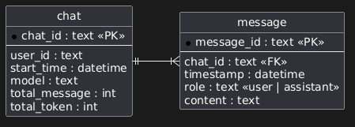

**รายงานความคืบหน้า รายวิชา Project 1 ครั้งที่ 1**  
**ภาควิชาวิศวกรรมคอมพิวเตอร์ คณะวิศวกรรมศาสตร์**  
**สถาบันเทคโนโลยีพระจอมเกล้าเจ้าคุณทหารลาดกระบัง**

1. หัวข้อโครงงาน (ภาษาอังกฤษ)	:      Application for network management and configuration automation (2)	    
2. การดำเนินการมีความคืบหน้า	:               15 %	%. (ประเมินจากทั้งรายวิชา Project 1 และ Project 2\)  
3. รายงานความคืบหน้าระหว่าง	: วันที่        10 กรกฎาคม 2569 	ถึง     7 สิงหาคม 2569 	  
4. สรุปความคืบหน้า (โครงงานประเภท Software Development)

| หัวข้อ | เปอร์เซ็นต์ความคืบหน้า (ครั้งที่) |  |  |  |  |
| ----- | :---: | ----- | ----- | ----- | ----- |
|  | **1** | **2** | **3** | **4** | **5** |
| 1\. ศึกษาทบทวนข้อกำหนดที่ควรมี และจำเป็นต้องมี | 50% |  |  |  |  |
| 2\. การออกแบบ UX/UI | 0% |  |  |  |  |
| 3\. การออกแบบ Use Case Diagram / Class Diagram / Sequence Diagram หรือ Diagram แบบอื่นๆ ที่อธิบายการทำงานของระบบ และโครงสร้างโปรแกรม | 30% |  |  |  |  |
| 4\. การออกแบบโครงสร้างของระบบ Software Architecture Diagram / System Architecture Diagram | 15% |  |  |  |  |
| 5\. ทำงานได้ตามขอกำหนด และ ทดสอบการทำงาน Unit Testing / Integration  Testing หรือ อื่นๆ ที่แสดงถึงการทำงานได้ตามขอกำหนด | 15% |  |  |  |  |
| 6\. การ Deploy และ Integrate ให้เป็นระบบที่ทำงานได้ตามข้อกำหนด | 5% |  |  |  |  |

**รายละเอียดความคืบหน้า** 

1. **ปัญหาและที่มาของ Configuration Automation**

การบริหารจัดการและกำหนดค่าการทำงานของอุปกรณ์เครือข่าย (Network Configuration) ในองค์กรส่วนใหญ่ในปัจจุบันยังคงพึ่งพาการทำงานด้วยมือ (Manual CLI Configuration) ผ่าน Console หรือ SSH ทีละอุปกรณ์ ซึ่งก่อให้เกิดปัญหาสำคัญต่อความมั่นคงปลอดภัยและเสถียรภาพของระบบเครือข่าย ดังนี้:

- ความผิดพลาดจากมนุษย์: การพิมพ์คำสั่ง CLI สดด้วยมือมีความเสี่ยงสูงที่จะเกิดการพิมพ์ผิด (Typo) หรือการลืมพารามิเตอร์สำคัญ เช่น การลืมระบุคีย์เวิร์ด \`add\` ในคำสั่ง \`switchport trunk allowed vlan\` ซึ่งส่งผลให้ VLAN เดิมทั้งหมดถูกลบและตัดขาดการเชื่อมต่อทันที  
- การตั้งค่าไม่เป็นไปตามมาตรฐานความปลอดภัย : ขาดกลไกการบังคับใช้นโยบายความปลอดภัยมาตรฐาน ส่งผลให้อุปกรณ์บางตัวเปิดใช้โปรโตคอลที่ไม่ปลอดภัย (เช่น Telnet, HTTP) รหัสผ่าน \`enable secret\` ไม่ได้เข้ารหัส หรือไม่มีการตั้งค่า \`login block-for\` ป้องกันการ Brute-force  
- การขาดระบบตรวจสอบก่อนนำไปใช้งานจริง: ผู้ดูแลระบบไม่สามารถเห็นภาพรวมของคำสั่งที่จะถูกส่งเข้าไปกระทบระบบเครือข่าย และไม่มีระบบตรวจสอบความขัดแย้งของคำสั่งก่อนส่งเข้าอุปกรณ์จริง  
- ความยากลำบากในการติดตามประวัติและกู้คืน: ขาดระบบจัดเก็บประวัติการเปลี่ยนแปลงที่เชื่อมโยงกับผู้สั่งการ ทำให้ไม่สามารถเปรียบเทียบความแตกต่าง (Diff) ระหว่างเวอร์ชันก่อนหน้าและปัจจุบันได้อย่างชัดเจน  
- ความเสี่ยงข้อมูลความลับรั่วไหลเมื่อใช้ AI : การส่งข้อมูลคอนฟิกจริงขึ้นไปยังระบบ External LLM (เช่น Gemini API) โดยตรงมีความเสี่ยงสูงที่จะทำให้ IP Address ภายในองค์กรและรหัสผ่านรั่วไหลออกสู่ภายนอก

2. ขอบเขตและ MVP ของกลุ่ม Configuration Automation

1. Configuration Management & Generation:  
   1. แบบฟอร์ม 6-Tab Configuration Builder (System/Hostname, Banner, SSH/Line VTY, Interface/VLAN, Routing/DHCP, Basic Security)  
   2. Jinja2 Template Rendering Engine รองรับคำสั่ง Conservative Command Set สำหรับ Cisco IOS 12.x+  
2. Security & Validation:  
   1. ระบบตรวจสอบแบบ Static Pre-deployment Scan ด้วย Regular Expressions (Regex) มากกว่า 10 กฎหลักตามมาตรฐาน CIS Cisco IOS Benchmark  
   2. การจำแนกความรุนแรง 3 ระดับ: Critical, Warning, Info  
   3. ระบบบันทึกเหตุผลการข้ามกฎความปลอดภัย (CIS Override Justification Logging)  
3. Configuration Version Control:  
   1. ตารางจัดเก็บประวัติเวอร์ชันของคอนฟิก  
   2. ระบบแสดงความแตกต่างของคอนฟิก   
   3. การออกแบบกระบวนการ Manual Restore / Rollback Workflow  
4. Configuration Deployment Workflow:  
   1. หน้าระบบ Deployment Plan Modal แสดงลำดับขั้นตอนและคำสั่งอย่างชัดเจนก่อนกดยืนยัน  
   2. การจำลองสถานะการส่งคำสั่งสำเร็จ (Simulated Success Status) ในระยะ Project 1  
5. PII Sensitive Data Masking:  
   1. ท่อกรองข้อมูลก่อนส่งออก External AI (Masking Middleware Pipeline)  
   2. การแปลง IP Address ด้วยอัลกอริทึม Crypto-PAn (yacryptopan) เพื่อรักษาโครงสร้าง Subnet/Prefix-preserving  
   3. การแปลงรหัสผ่านและคีย์ความลับ (enable secret, password 7, Pre-shared Key) ด้วย Regular Expressions  
6. AI Component :  
   1. บังคับใช้หลักการ Human-in-the-Loop โดย AI จะทำหน้าที่เป็น Co-pilot แนะนำและตรวจสอบเท่านั้น ห้าม AI ยิงคำสั่งเข้าสู่อุปกรณ์เครือข่ายโดยตรงเด็ดขาด

3. **ศึกษาข้อมูลด้าน Configuration Management และ AI** 

ทีมได้ศึกษาแนวคิดและเทคโนโลยีด้าน Network Automation จากหนังสือจำนวน 2 เล่ม ได้แก่ 

* [Network Programmability and Automation, 2nd Edition](https://www.oreilly.com/library/view/network-programmability-and/9781098110826/)   
* [AI for Networking Cookbook](https://www.oreilly.com/library/view/ai-networking-cookbook/9781805807995/)

โดยคัดเลือกอ่านหัวข้อที่เกี่ยวข้องกับโครงงานโดยตรง ไม่ได้ศึกษาทุกบทเท่ากัน   
หัวข้อสำคัญจาก Network Programmability and Automation, 2nd Edition ที่นำมาศึกษา ได้แก่:

*  แนวคิดและประเภทของ Network Automation เช่น การเก็บข้อมูล การจัดการคอนฟิก การตรวจสอบความสอดคล้อง และการตรวจสอบสถานะ  
* Data Formats และ Data Models เพื่อใช้พิจารณารูปแบบข้อมูลระหว่างระบบและการออกแบบ Schema  
* Jinja2 Template สำหรับสร้างคอนฟิกจากข้อมูลที่มีโครงสร้างและให้ผลลัพธ์ที่คาดการณ์ได้  
* การเชื่อมต่ออุปกรณ์ผ่าน Network API และ Netmiko สำหรับงานที่ต้องสื่อสารผ่าน SSH  
* การเปรียบเทียบเครื่องมือ Automation เช่น Ansible และ Nornir  
* แนวคิด Network Automation Architecture โดยเฉพาะ Source of Truth ซึ่งนำมาประยุกต์กับ Device Inventory ให้เป็นแหล่งข้อมูลอุปกรณ์กลางของระบบ

หัวข้อสำคัญจาก AI for Networking Cookbook ที่นำมาศึกษา ได้แก่:

* Prompt Engineering,การวิเคราะห์ Network Configuration,การสร้าง Backend API สำหรับแอปพลิเคชัน AI,แนวคิด Network Co-Pilot การศึกษาส่วนนี้ทำให้ทีมเห็นทั้งประโยชน์และข้อจำกัดของโมเดลภาษา เช่น ความสามารถในการอธิบายหรือช่วยร่างคำสั่ง และความเสี่ยงด้านคำตอบที่คลาดเคลื่อน ข้อมูลสำคัญรั่วไหล และข้อจำกัดของ External API

ผลจากการศึกษาทั้งสองเล่มทำให้ทีมกำหนดหลักการเบื้องต้นว่า งานที่มีคำตอบแน่นอน เช่น การสร้างคอนฟิกพื้นฐานและการตรวจสอบกฎ ควรใช้ Template หรือกฎแบบตายตัวเป็นหลัก ส่วน AI ควรใช้กับงานที่ต้องการการอธิบาย การสรุป หรือข้อเสนอแนะ และต้องมีการตรวจสอบโดยผู้ใช้ก่อนนำไปใช้กับอุปกรณ์จริง

4. **วิเคราะห์และคัดเลือกฟีเจอร์**  
   ทีมได้รวบรวมฟีเจอร์ที่เกี่ยวข้อง ได้แก่   
1. Configuration Generation   
2. Configuration Deployment  
3. Security Validation  
4. PII Sensitive Data Masking  
5. Version Control   
6. AI Component

จากนั้นจึงประเมินแต่ละฟีเจอร์โดยใช้ปัจจัยต่อไปนี้:

* ความสอดคล้องกับปัญหาของผู้ดูแลระบบเครือข่าย  
* ความจำเป็นต่อการสาธิตการทำงานแบบต้นจนจบ  
* ระยะเวลาและจำนวนสมาชิกของทีม  
* ความพร้อมของอุปกรณ์จริงและระบบจำลอง  
* ความแตกต่างของคำสั่งระหว่างผู้ผลิต รุ่น และระบบปฏิบัติการ  
* ความเสี่ยงจากการเปลี่ยนคอนฟิกบนอุปกรณ์จริง  
* ความซับซ้อนในการพัฒนา ทดสอบ และอธิบายผลลัพธ์

ทีมจึงแบ่งแนวทางพัฒนาออกเป็นกลุ่มหลัก ได้แก่ ความสามารถที่ต้องมีในรุ่นแรก โครงสร้างพื้นฐานที่ต้องเตรียมไว้ ความสามารถที่ทำภายหลัง และความสามารถที่ตัดออก ตัวอย่างผลการพิจารณา ได้แก่:

* ใช้ Jinja2 Template เป็นแกนหลักของการสร้างคอนฟิกพื้นฐาน เพราะผลลัพธ์ตรวจสอบและทดสอบซ้ำได้  
* ลดจำนวนกฎ CIS ให้เหลือชุดพื้นฐานที่สามารถพัฒนาและทดสอบได้จริงในเวลาที่กำหนด  
* ตัดความสามารถที่มีความเสี่ยงหรือซับซ้อนเกินขอบเขต เช่น Auto-Rollback, Cross-Device Impact Analysis และนโยบาย Multi-vendor ที่ซับซ้อน  
* จำกัด Cisco IOS เป็น Baseline หลัก ส่วนอุปกรณ์ยี่ห้ออื่นต้องยืนยันรุ่น ระบบปฏิบัติการ ชุดคำสั่ง และผลทดสอบก่อนกล่าวว่ารองรับ  
5. **ปรึกษาอาจารย์ที่ปรึกษา**

ทีมได้เข้าพบอาจารย์ที่ปรึกษาอย่างต่อเนื่องเพื่อทบทวนว่าฟีเจอร์ที่เลือกยังตอบโจทย์ผู้ดูแลระบบเครือข่ายหรือไม่ รวมถึงขอคำแนะนำเกี่ยวกับขอบเขต การจัดลำดับฟีเจอร์ การแบ่งงาน และแนวทางออกแบบระบบ

คำแนะนำสำคัญที่ทีมได้รับ ได้แก่:

* การจำกัดขอบเขต MVP และการทำสิ่งที่วัดผลได้จริง: อาจารย์เน้นย้ำว่าไม่ควรพยายามทำทุกอย่างพร้อมกัน ให้โฟกัสที่เส้นทางหลัก (Core Path):   
  * เลือกอุปกรณ์ → กรอกฟอร์ม → เรนเดอร์เทมเพลต → ตรวจสอบกฎ → พรีวิว → กดยืนยันให้ทำงานได้สมบูรณ์ก่อน  
* การแยกหน้าที่ Data Ownership และ Dependency: แต่ละระบบย่อยต้องชัดเจนว่าตนเองเป็นเจ้าของข้อมูลใด และต้องขอข้อมูลใดจากระบบอื่น เพื่อให้สามารถเขียน Mock Data พัฒนาคู่ขนานกันได้โดยไม่ติดบล็อก  
* การออกแบบฐานข้อมูล (Relational vs NoSQL): อาจารย์ให้คำแนะนำว่าการเลือกฐานข้อมูลต้องดูจากความสัมพันธ์ของข้อมูล โดยข้อมูล Configuration, Templates, Versions และ Validation Results มีความสัมพันธ์เชิงโครงสร้างและต้องการ Foreign Key Constraints ชัดเจน จึงเหมาะสมกับ Relational Database (PostgreSQL)  
* ข้อกำหนด 1 VLAN : 1 Subnet สำหรับ MVP: เพื่อลดความซับซ้อนในการคำนวณและตั้งค่า Routing/DHCP ในระยะเริ่มต้น ควรกำหนดให้ 1 VLAN ผูกกับ 1 IPv4 Subnet เสมอ  
* สถานะของอุปกรณ์จริงและ Candidate Test Vendors: อุปกรณ์อย่าง Huawei Router, MikroTik Switch และ Dell PowerConnect 7048 จะถูกระบุเป็น Candidate Test Vendors สำหรับทดสอบในห้องปฏิบัติการปิด (Isolated Lab) หลังการสอบกลางภาค โดยในระยะ P1 จะใช้ Cisco IOS เป็น Baseline หลักเท่านั้น

คำแนะนำดังกล่าวถูกนำมาใช้ปรับวิธีทำงานของทีม จากเดิมที่มีเพียงรายการฟีเจอร์ ให้เริ่มกำหนด MVP, เจ้าของข้อมูล, Dependency และ Schema ของแต่ละส่วนอย่างเป็นระบบ

4. **แบ่งหน้าที่ภายในทีม**

ทีมได้เริ่มแบ่งงานตามฟีเจอร์หรือระบบย่อย แทนการแบ่งเฉพาะ Frontend และ Backend เพื่อให้สมาชิกแต่ละคนรับผิดชอบงานของตนตั้งแต่การศึกษาปัญหา กำหนดขอบเขต ออกแบบข้อมูล ไปจนถึงการระบุวิธีเชื่อมต่อกับฟีเจอร์อื่น

เจ้าของแต่ละฟีเจอร์มีหน้าที่หลักดังนี้:

1. คิดศึกษาสิ่งที่คาดว่าจะเป็น MVP  (Minimum Viable Product) ของฟีเจอร์  
2. ระบุข้อมูลที่ฟีเจอร์เป็นเจ้าของและข้อมูลที่ต้องขอจากฟีเจอร์อื่น  
3. ออกแบบ Schema และความสัมพันธ์ของข้อมูลเบื้องต้น  
4. อัปเดตเอกสารกลางเพื่อให้สมาชิกตรวจสอบความคืบหน้าได้  
5. **กำหนดผลิตภัณฑ์ขั้นต่ำที่ใช้งานได้ของแต่ละฟีเจอร์เท่าที่ศึกษา**

สมาชิกแต่ละคนเริ่มกำหนดผลิตภัณฑ์ขั้นต่ำที่ใช้งานได้ MVP  (Minimum Viable Product)ของฟีเจอร์ที่รับผิดชอบ เพื่อให้ขอบเขตเหมาะสมกับเวลาและทรัพยากรของทีม โดยการกำหนด MVP ไม่ได้พิจารณาเพียงจำนวนหน้าจอ แต่พิจารณาว่าผู้ใช้สามารถทำงานหลักของฟีเจอร์ได้สำเร็จหรือไม่

**Configuration Generation**   
	ระบบสร้าง configuration โดยการใช้ AI ในระบบนี้ MVP คือ

1. สร้าง config ที่สามารถใช้งานได้และ syntax ถูกต้องโดยจะเริ่มจาก cisco ก่อน  
2. การสร้าง config จะอิง device แบบตัวเดี่ยว   
3. ระบบสามารถซ่อน Ip address ได้เมื่อ prompt และเมื่อ AI  ส่ง config กลับมาจะต้องไม่เสีย context

โดยจะแบ่งการพัฒนาออกเป็น 2 ส่วนได้แก่

1.  AI configuration generation

ในส่วนนี้จะต้องทำ chat history จึงมีการออกแบบ schema ของแชทเมื่อคุยกับ AI ว่าจะเก็บประวัติอย่างไร นี่คือ ER Diagram เวอชั่นที่ 1  
  
(รูปภาพ ER diagram ของ chat history v1)

จากในรูปจะมี 2 entity คือ chat และ message เป็นความสัมพันธ์แบบ 1-to-many โดย chat มี message ได้หลายอันและ message แต่ละอันอยู่ได้แค่ 1 chat เท่านั้น 

2. PII Masking

 เป็นระบบการจัดการ sensitive information ซึ่งมี library ให้ใช้หลายตัวซึ่งตอนนี้มาร์คไว้ในใจ 3 ตัวได้แก่

1. netconan  
2. yacryptopan  
3. presidio

แต่ละตัวมีข้อดีข้อเสียต่างกันขึ้นอยู่กับการจัดการ data ซึ่งตอนนี้ผู้จัดทำยังออกแบบการเก็บข้อมูลยังไม่ครบถ้วนจึงทำให้ยังไม่ตัดสินใจว่าจะใช้ตัวไหน 

Data หลัก ๆ ที่คาดว่าต้องจัดการคือ IP address และ password ต่าง ๆ ซึ่งที่น่าเป็นกังวลคือเรื่อง IP address ที่เมื่อถูก mask แล้วอาจจะเสีย context ได้ ซึ่งตรงนี้มีวิธีแก้ปัญหาอยู่คือการใช้ yacryptopan ที่ใช้ Algorithm คือ Crypto-PAn ที่เมื่อ anonymize ip address แล้วจะยังคงอยู่ใน subnet เดียวกันและมี ip address ไปทิศทางเดียวกันโดยที่เลข ip address เปลี่ยนไปจากเดิม

Component Diagram ของ AI assistance  

