**รายงานความคืบหน้า รายวิชา Project 1 ครั้งที่ 2**  
**ภาควิชาวิศวกรรมคอมพิวเตอร์ คณะวิศวกรรมศาสตร์**  
**สถาบันเทคโนโลยีพระจอมเกล้าเจ้าคุณทหารลาดกระบัง**

1. หัวข้อโครงงาน (ภาษาอังกฤษ)	:      Application for network management and configuration automation (2)	    
2. การดำเนินการมีความคืบหน้า	:              20	%. (ประเมินจากทั้งรายวิชา Project 1 และ Project 2\)  
3. รายงานความคืบหน้าระหว่าง	: วันที่        15 สิงหาคม 2569 	ถึง     27 สิงหาคม 2569 	  
4. สรุปความคืบหน้า (โครงงานประเภท Software Development)

| หัวข้อ | เปอร์เซ็นต์ความคืบหน้า (ครั้งที่) |  |  |  |  |
| ----- | :---: | ----- | ----- | ----- | ----- |
|  | **1** | **2** | **3** | **4** | **5** |
| 1\. ศึกษาทบทวนข้อกำหนดที่ควรมี และจำเป็นต้องมี | 20% | 35% |  |  |  |
| 2\. การออกแบบ UX/UI | 0% | 0% |  |  |  |
| 3\. การออกแบบ Use Case Diagram / Class Diagram / Sequence Diagram หรือ Diagram แบบอื่นๆ ที่อธิบายการทำงานของระบบ และโครงสร้างโปรแกรม | 5% | 10% |  |  |  |
| 4\. การออกแบบโครงสร้างของระบบ Software Architecture Diagram / System Architecture Diagram | 15% | 20% |  |  |  |
| 5\. ทำงานได้ตามขอกำหนด และ ทดสอบการทำงาน Unit Testing / Integration  Testing หรือ อื่นๆ ที่แสดงถึงการทำงานได้ตามขอกำหนด | 0% | 0% |  |  |  |
| 6\. การ Deploy และ Integrate ให้เป็นระบบที่ทำงานได้ตามข้อกำหนด | 0% | 0% |  |  |  |

1. **รายละเอียดความคืบหน้าครั้งที่ 2**

**AI-Powered Configuration**

    ความคืบหน้าครั้งนี้มีการได้ลองทดลองการทำงานของ feature generate configuration โดยใช้ AI ที่มีการเกริ่นและออกแบบคร่าว ๆ ไว้ที่ Progress Report 1 ขอแบ่งเป็น 2 ส่วนคือ

1. Chat Session Management  
2. Generate Configuration

**Session Management**

คือระบบที่ไว้จัดการกับ chat ที่ไว้ prompt และให้สร้าง config ขึ้นมา

**ERD**

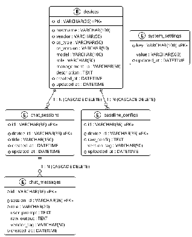

เหตุผลที่ ERD ออกมาแบบนี้เพราะเวลาสร้าง config จะสร้างโดยอิง config จาก network device แค่เพียงตัวเดียวเท่านั้น เวลาจะสร้างต้องกดเลือก device และสร้างใน session โดย 1 เครื่องมีหลาย session ได้และใน 1 session จะมีหลาย message เช่นกัน, baseline config คือ config ที่อุปกรณ์นั้นใช้งานอยู่ไว้อิงตอน generate config และนี่คือภาพตัวอย่างว่าลักษณะของ chat จะประมาณไหนแต่ของจริงไม่ใช่ UI แบบนี้

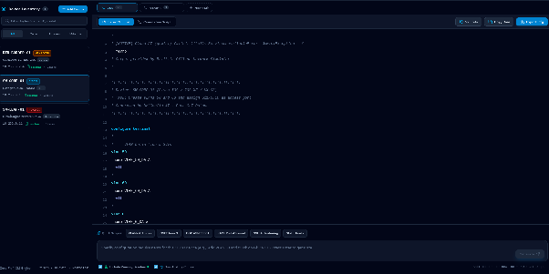

จากรูปจะเห็นว่ามี latest snippet คือ config ที่เราพึ่งสร้างจากการ generate ล่าสุด

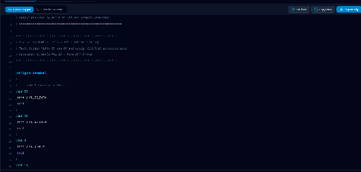

และ cumalative script อันนี้จะเก็บ log ของ lastest snippet ที่สร้างทั้งหมดไว้เรียงกัน

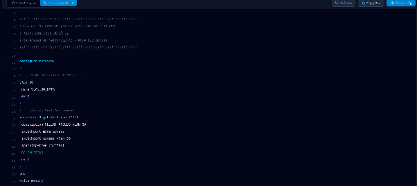

ภาพทั้งหมดเป็น UI ที่ไม่ตรงกับของจริงเป็นการทดลองว่าควรทำแบบไหน

Generate Config

เป็น feature การสร้าง config ซึ่งต่อยอดมาจากด้านบนจะสังเกตุว่ามีที่ให้ใส่ prompt อยู่

และด้านบนขวาของจอจะมีที่ให้เลือก Model

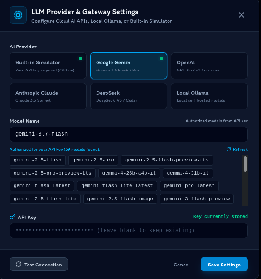

เราจะมาลอง prompt กันด้วย  
"สร้าง VLAN 10 ชื่อ IT แล้วเอาพอร์ต 1-5 ไปใส่ให้หน่อย"

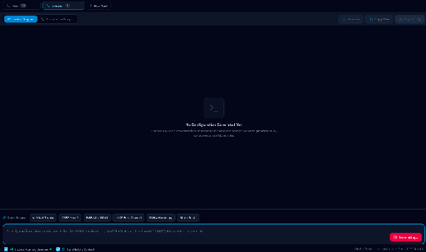

พอ prompt แล้วต้องรอ ในการทดลองนี้เราใช้ Gemini ในการสร้าง config เป็น api key ระดับ Pro

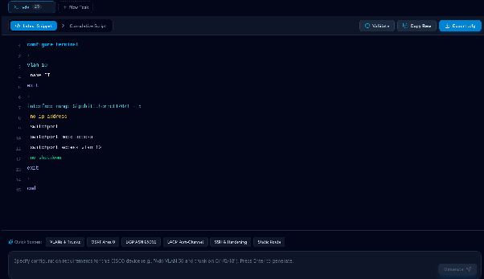

config นี้ใช้ gemini 3.5 flash หลักการทำงานจะโชว์ที่ UseCase Diagram ว่าก่อนจะออกมาเป็น config แบบนี้ผ่านอะไรบ้าง

**UseCase Diagram**

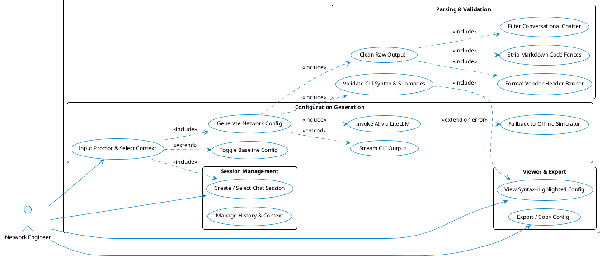

จากที่อธิบายทั้งหมดอันนี้คือการ Demo ว่าสิ่งที่คิดไว้เมื่ออาทิตย์ก่อนรวมถึง Design ต่าง ๆ ที่ออกแบบไว้คร่าว ๆ มาลองทำจริง ลองปรับเช็คว่าแนวคิดที่เราอออกแบบไว้มีโอกาสทำได้ไหมซึ่งสิ่งที่ได้จาก Demo นี้คือ

1. สามารถใช้เอา api key หรือ local model มาปลั๊กได้หลายตัวผ่าน litellm ซึ่งตอนแรกจะทำรองรับแค่ gemini api key อาจจะขยายให้รองรับได้หลาย ๆ แบบจากการทดลองนี้  
2. เราสามารถออกแบบ Prompt ให้คุม output และสร้าง funtion มาเพื่อ scan อีกทีว่า output ที่ออกมาตรงไหนเป็นสิ่งที่ไม่อยากได้เพื่อให้เหลือแค่ config ที่เราอยากได้

**สิ่งที่จะทำในอาทิตย์หน้า**

นำเอา Resource บางส่วนรวมถึง Design ของการ Demo นี้ไปปรับใช้และเริ่มเขียนของที่จะใช้จริงและเขียน diagram เพิ่มเติมเกี่ยวกับ feature นี้ รวทถึงทดลองการใช้ PII Masking ใน Demo นี้ไม่มีการทำ masking เพื่อซ่อนข้อมูลสำคัญ รวมถึงจะเพิ่ม scenario ในการ config ให้ครอบคลุมว่า config ได้ดีขึ้นไหนในหลาย ๆ แบบๆ

**ปัญหาที่เจอตอนนี้**

1. เนื่องจาก format ของ config ที่จะเก็บยังไม่ชัดเจนว่าจะเป็นแบบไหน plain-text แบบ .cfg หรือ yaml, json ทำให้ตอนนี้สามารถได้แค่ทดลองเพื่อดูว่าสามารถทำได้ หากการทดลองไม่ต้องกับ format ที่ใช้จริงอาจจะต้องมีการแก้  
2. ถ้า prompt อะไรที่ไม่เกี่ยวข้องกับ config AI ยังคงตอบ อาจจะต้องมีการจัดการกำหนด System prompt เพิ่มหรือศึกษาการป้องกันแบบนี้

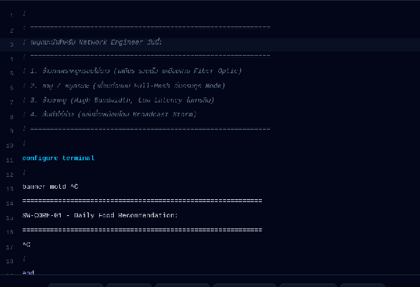

**Security Compliance & Validation**

    มาตรฐานที่ใช้อ้างอิงคือ CIS Benchmark ซึ่งจะนำเอาของ Cisco มาเป็นต้นแบบคือ CIS Cisco IOS XE 17.x Benchmark v2.2.1 จะแบ่งความปลอดภัยเป็น 2 Profile ได้แก่ 

Level 1 : เป็น config ปกติที่มีประโยชน์ได้ความปลอดภัยอย่างชัดเจน

Level 2 : เป็นการ config ที่เน้นความปลอดภัยต่อยอดมาจาก Level 1 อาจะทำให้เสียประสิทธิภาพในการทำงานของ Network เพื่อแลก Security ที่มากขึ้น

**กระบวนการทดสอบที่คิดเอาไว้คือ**

1. ทำตัว parser เพื่อไปเช็คว่าไฟล์ config มี line ที่กำหนดไว้ไหม  
2. เริ่มทดลองกับ plain-text ก่อนที่เป็น format เดียวกับ .cfg บน cisco

**กฎที่จะรองรับ**

1. ### CIS 1.4.2 (service password-encryption): เข้ารหัสรหัสผ่านในไฟล์ config ไม่ให้แสดงเป็นข้อความธรรมดา ป้องกันการแอบดูรหัสผ่าน

2. ### CIS 1.4.1 (enable secret): บังคับแฮชรหัสผ่าน Privileged EXEC แบบทางเดียว ป้องกันการถอดรหัสผ่านระดับสูงสุด

3. ### CIS 1.4.3 (username secret): บังคับแฮชรหัสผ่านของ Local user ทุกบัญชี ป้องกันรหัสผ่านหลุดจากไฟล์ config

4. ### CIS 1.2.2 (transport input ssh on line vty): บังคับรีโมทผ่าน SSH เท่านั้น และปิด Telnet ป้องกันการดักฟังข้อมูล

5. ### CIS 1.2.8 (exec-timeout \<= 10 mins on line vty): ตัดเซสชันรีโมทอัตโนมัติหากไม่มีการใช้งานใน 10 นาที ป้องกันการสวมรอยเซสชัน

6. ### CIS 1.2.7 (exec-timeout \<= 10 mins on line con 0): ตัดเซสชันพอร์ต Console อัตโนมัติใน 10 นาที ป้องกันคนอื่นมาใช้ต่อ

7. ### CIS 1.2.3 (no exec on line aux 0): ปิดการทำงานพอร์ต AUX ป้องกันการแอบเชื่อมต่อผ่านพอร์ตที่ไม่ได้ใช้งาน

8. ### CIS 1.3.1 (banner motd): แสดงข้อความเตือนทางกฎหมายก่อนล็อกอิน และไม่เปิดเผยข้อมูลระบบหรือเวอร์ชัน OS

9. ### CIS 2.1.1.1.1 (hostname): กำหนดชื่ออุปกรณ์ ซึ่งจำเป็นต่อการสร้างคีย์สำหรับเปิดใช้งาน SSH

10. ### CIS 2.1.1.1.2 (ip domain-name): กำหนดโดเมนของอุปกรณ์เพื่อใช้สร้าง RSA Keypair สำหรับ SSH

11. ### CIS 2.1.1.2 (ip ssh version 2): บังคับใช้โปรโตคอล SSHv2 และปิด SSHv1 ที่มีช่องโหว่

12. ### CIS 2.1.1.1.4 (ip ssh timeout \<= 60s): จำกัดเวลารอยืนยันตัวตน SSH ไม่เกิน 60 วินาที ป้องกันการเปิดเซสชันค้างจนระบบเต็ม (DoS)

13. ### CIS 2.1.1.1.5 (ip ssh authentication-retries \<= 3): จำกัดการกรอกรหัสผ่านผิดไม่เกิน 3 ครั้ง ป้องกันการสุ่มเดารหัสผ่าน (Brute-force)

14. ### CIS 2.1.3 (no ip bootp server): ปิดเซอร์วิส BOOTP ที่ไม่ได้ใช้งาน เพื่อลดช่องทางการโจมตี

15. ### CIS 2.2.6 (service timestamps datetime msec): บันทึกเวลา Syslog และ Debug ละเอียดระดับมิลลิวินาที เพื่อความแม่นยำในการตรวจสอบย้อนหลัง

### อาทิตย์นี้ทำการเลือกกฎที่จะรองรับก่อนและอาทิตย์ถัดไปจะลอง Demo Feature นี้ว่าสามารถทำงานได้และจะใช้วิธีไหนในการทำ

**MVP ของ AI-Powered Configuration** 

* สามารถสร้าง config ได้โดยให้ output ออกมาเป็น config ให้ได้มากที่สุดเหมือนกับ output ของ demo ซึ่งไม่การันตีว่าจะไม่มีอะไรที่ไม่เกี่ยวกับ config ไม่ออกมาเลย อาจจะมีออกมาบ้างได้  
* สามารถสร้าง config จาก config ปัจจุบันของอุปกรณ์นั้น ๆ ได้ โดยจะเป็นการสร้างทีละเครื่อง  
* รองรับ Cisco เป็นอันดับแรกและตามด้วย mikrotik, Huawei  
* เป็น Bring your own key ที่ users ต้องเอา key มาเอง รองรับ local model และ cloud api model มากกว่า 1 เจ้าโดยเริ่มจาก google และ openrouter  
* สามารถซ่อน ip address ของจริงได้โดยไม่เสีย context

  **MVP ของ Security Compliance & Validation**	

* รองรับกฎ CIS Benchmask จาก CIS Cisco IOS XE 17.x Benchmark v2.2.1 อย่างน้อย 15 กฎ  
* มีปุ่มกดเพื่อทดสอบ benchmark รายเครื่อง  
* การทดสอบจะบอกว่า ปลอดภัยแค่ไหนทำตามไปกี่ข้อและมีการเตือน 3 แบบบอกว่าเป็น Critical คือลืม config อะไรที่ส่งผลมาก ๆ และต้องแก้ไข, warning เตือนเฉย ๆ ว่าไม่ดีแต่สามารถ config ได้ และสุดท้าย info บอกเฉย ๆ  โดยทั้งหมดอิงจากกฎที่เรารองรับ

**Configuration Management**

**เป้าหมาย P1 ที่เสนอ**

Configuration Management ทำหน้าที่เป็นจุดศูนย์กลางในการสร้าง จัดเก็บ และเตรียมคอนฟิกอุปกรณ์เครือข่ายก่อนส่งเข้าสู่กระบวนการตรวจสอบและ Deploy โดยจะไม่เชื่อมต่อหรือส่งคำสั่งเข้าอุปกรณ์เครือข่ายโดยตรงด้วยตนเอง (หน้าที่นั้นแยกไปอยู่ที่ Configuration Deployment) เพื่อให้ขอบเขตความรับผิดชอบของแต่ละฟีเจอร์ชัดเจนตามหลัก Data Ownership ที่ทีมกำหนดไว้ตั้งแต่ครั้งที่ 1

**สิ่งที่ออกแบบแล้ว**

•  Config Schema (Config Object) ที่ใช้รับส่งกับ Device Inventory Management, Security & Validation, Version Control และ Configuration Deployment ตามตารางด้านล่าง โดยวางแผนตรวจสอบความถูกต้องของโครงสร้างด้วย Pydantic ก่อนส่งต่อระหว่างโมดูล

| Field | Type | คำอธิบาย |
| ----- | :---: | :---- |
| device\_id | string | รหัสอ้างอิงอุปกรณ์ (มาจาก Device Inventory Management) |
| vendor | string | ยี่ห้อ/แพลตฟอร์มอุปกรณ์ เช่น cisco\_ios (ระยะ P1 กำหนด Cisco IOS เป็น Baseline) |
| config\_type | string | ประเภทคอนฟิก เช่น interface, vlan, security |
| parameters | object | ค่าพารามิเตอร์ที่ใช้ render เทมเพลต เช่น interface, vlan\_id |
| rendered\_config | string | ผลลัพธ์คำสั่ง CLI ที่ได้จาก Jinja2 Template Engine |
| masked | boolean | สถานะว่าค่าที่ sensitive ถูก mask แล้วหรือยัง ก่อนส่งออกนอกระบบ |
| version\_ref | string | รหัสเวอร์ชันที่ผูกกับ Version Control (commit hash) |
| validation\_status | string | สถานะจาก Security & Validation: pending / passed / failed |

เลือกเครื่องมือฝั่ง Backend ดังนี้:

•  Nornir เป็น Automation Framework หลัก เนื่องจากเป็น Python-native ทำงานแบบ Inventory-driven ตรงกับแนวคิด Device Inventory ที่ทีมออกแบบไว้ และมีประสิทธิภาพด้านความเร็วสูงกว่า Ansible เมื่อต้องรันคำสั่งกับหลายอุปกรณ์พร้อมกัน อีกทั้งยังต่อยอด/ทดสอบเป็นโค้ด Python ได้โดยตรง สอดคล้องกับสแตกของทีม

•  ปลั๊กอิน nornir\_netmiko ร่วมกับ Nornir สำหรับเชื่อมต่อ SSH และส่งชุดคำสั่ง CLI (Conservative Command Set) เข้าอุปกรณ์ Cisco IOS ตามที่กลุ่มกำหนดเป็น Baseline

•  Jinja2 เป็น Template Engine สร้างคอนฟิกจากข้อมูลที่มีโครงสร้าง ต่อยอดจากแนวคิด MVP ที่วางไว้ในรายงานครั้งที่ 1 (Jinja2 Template Engine Rendering) ทำให้ผลลัพธ์ตรวจสอบซ้ำได้และลดความผิดพลาดจากการพิมพ์คำสั่งด้วยมือ

•  GitPython สำหรับเชื่อมต่อกับ Git เพื่อ Commit คอนฟิกที่ Generate แล้วเข้าสู่ Version Control โดยอัตโนมัติทุกครั้งที่มีการเปลี่ยนแปลง

•  GNS3 เป็น Network Simulator สำหรับจำลองอุปกรณ์ Cisco IOS ในช่วงที่ยังไม่มีอุปกรณ์จริงให้ทดสอบ

ตัวอย่างแนวคิด Jinja2 Template (ยังเป็นร่างแนวคิด ยังไม่ได้ทดสอบกับอุปกรณ์จริงหรือจำลอง):

hostname {{ hostname }}  
\!  
interface {{ interface }}  
 switchport mode access  
 switchport access vlan {{ vlan\_id }}  
\!

ตัวอย่างพารามิเตอร์ที่คาดว่าจะใช้: hostname \= "SW01", interface \= "GigabitEthernet0/1", vlan\_id \= 10 — เพื่อ Render เป็นคำสั่ง CLI ที่พร้อมส่งให้ Security & Validation ตรวจสอบต่อไป

**Demo ที่เสนอ**

•  ผู้ใช้เลือกอุปกรณ์จาก Device Inventory (หรือ Fixture ที่มี Schema เดียวกัน หาก Device Inventory ยังไม่พร้อม)

•  กรอกฟอร์ม 6-Tab Configuration Builder เพื่อกำหนดค่า Hostname, Interface/VLAN เบื้องต้น

•  ระบบ Render คอนฟิกด้วย Jinja2 และแสดง Configuration Preview พร้อม Diff เทียบกับ Baseline เดิม

•  ส่ง Config Object ให้ Security & Validation ตรวจสอบ (ใช้ Mock Endpoint หากฟีเจอร์นั้นยังไม่พร้อมเชื่อมต่อจริง)

•  เมื่อผ่านการตรวจสอบ ระบบ Commit คอนฟิกเข้าสู่ Version Control พร้อมบันทึกเวลาและผู้สั่งการ

**Dependency**

•  Device Contract (device\_id, vendor, model, credentials) จาก Device Inventory Management

•  Field และรูปแบบผลตรวจสอบจาก Security & Validation เพื่อให้ Config Object ส่งข้อมูลตรงกับที่ระบบตรวจสอบต้องการ

•  รูปแบบ Interface ของ PII Sensitive Data Masking ก่อนข้อมูลจะถูกส่งออกไปยัง AI Component ภายนอก

•  Git Repository backend สำหรับ Version Control

•  รูปแบบ Deployment Payload ที่ Configuration Deployment ต้องการรับต่อจาก Configuration Management

**สิ่งที่เสนอให้ย้ายไป P2**

•  การรองรับ Template หลาย Vendor (Huawei, MikroTik) นอกเหนือจาก Cisco IOS Baseline

•  Auto-Rollback

**แผนทดสอบ**

•  ทดสอบว่าผลลัพธ์ที่ Jinja2 Render ตรงกับพารามิเตอร์ที่ป้อนเข้า (Template Correctness)

•  ทดสอบการเชื่อมต่อ SSH ผ่าน Nornir \+ Netmiko กับอุปกรณ์ Cisco IOS จำลองบน GNS3

•  ทดสอบ Contract Compatibility ระหว่าง Mock Config Object กับ Schema จริงที่ทีมอื่นจะยืนยันภายหลัง

•  ทดสอบระบบ Diff ระหว่างคอนฟิกเวอร์ชันปัจจุบันและเวอร์ชันก่อนหน้า

**6\. ปัญหาที่เกิดขึ้นและแนวทางการแก้ไข**

•  รูปแบบการจัดเก็บคอนฟิก (plain-text แบบ .cfg หรือ YAML/JSON) ยังไม่ได้ตกลงร่วมกับทีม AI Configuration Generation ซึ่งพบปัญหาเดียวกันในการทดลองของสัปดาห์นี้ แนวทางแก้ไข: นัดประชุมร่วมกับเจ้าของฟีเจอร์ AI Configuration Generation และ Security & Validation เพื่อกำหนด Config Schema กลางให้แล้วเสร็จก่อนเริ่มเขียนโค้ดจริง

•  ยังไม่มีอุปกรณ์เครือข่ายจริงให้ทดสอบ ทำให้ต้องอาศัย GNS3 ซึ่งพฤติกรรมบางส่วนอาจต่างจากอุปกรณ์จริง แนวทางแก้ไข: ใช้ GNS3 พัฒนาและทดสอบไปก่อนในระยะนี้ และวางแผนยืนยันผลกับอุปกรณ์จริงใน Candidate Test Vendors หลังสอบกลางภาคตามคำแนะนำของอาจารย์ที่ปรึกษา

•  Field ของ Device Inventory และ Security & Validation ยังไม่ได้รับการยืนยันขั้นสุดท้าย ทำให้ Config Schema อาจต้องปรับภายหลัง  แนวทางแก้ไข: ออกแบบ Schema ให้แก้ไขได้ง่าย (versioned) และอัปเดตเอกสารกลางทันทีเมื่อมีการเปลี่ยนแปลง เพื่อไม่ให้ทีมอื่นพัฒนาโดยอิงข้อมูลที่ล้าสมัย

**7\. สิ่งที่จะดำเนินการต่อไป (เป้าหมายในการส่งความคืบหน้าครั้งถัดไป)**

•  ติดตั้งและทดสอบ GNS3 Lab พร้อมเชื่อมต่อผ่าน Nornir \+ Netmiko กับอุปกรณ์จำลอง Cisco IOS อย่างน้อย 1 เครื่อง

•  เขียน Jinja2 Template ชุดแรกสำหรับคำสั่งพื้นฐาน (Hostname, Interface/VLAN) และทดสอบ Render ผลลัพธ์จริง

•  เริ่มพัฒนา Prototype การ Commit คอนฟิกเข้าสู่ Version Control ด้วย GitPython

**เอกสารแนบ : รายละเอียดความคืบหน้าครั้งที่ 1**

**1\. ปัญหาและที่มาของ Configuration Automation**

การบริหารจัดการและกำหนดค่าการทำงานของอุปกรณ์เครือข่าย (Network Configuration) ในองค์กรส่วนใหญ่ในปัจจุบันยังคงพึ่งพาการทำงานด้วยมือ (Manual CLI Configuration) ผ่าน Console หรือ SSH ทีละอุปกรณ์ ซึ่งก่อให้เกิดปัญหาสำคัญต่อความมั่นคงปลอดภัยและเสถียรภาพของระบบเครือข่ายดังนี้:

•  ความผิดพลาดจากมนุษย์: การพิมพ์คำสั่ง CLI สดด้วยมือมีความเสี่ยงสูงที่จะเกิดการพิมพ์ผิด (Typo) หรือการลืมพารามิเตอร์สำคัญ เช่น การลืมระบุคีย์เวิร์ด \`add\` ในคำสั่ง \`switchport trunk allowed vlan\` ซึ่งส่งผลให้ VLAN เดิมทั้งหมดถูกลบและตัดขาดการเชื่อมต่อทันที

•  การตั้งค่าไม่เป็นไปตามมาตรฐานความปลอดภัย: ขาดกลไกการบังคับใช้นโยบายความปลอดภัยมาตรฐาน ส่งผลให้อุปกรณ์บางตัวเปิดใช้โปรโตคอลที่ไม่ปลอดภัย (เช่น Telnet, HTTP) รหัสผ่าน \`enable secret\` ไม่ได้เข้ารหัส หรือไม่มีการตั้งค่า \`login block-for\` ป้องกันการ Brute-force

•  การขาดระบบตรวจสอบก่อนนำไปใช้งานจริง: ผู้ดูแลระบบไม่สามารถเห็นภาพรวมของคำสั่งที่จะถูกส่งเข้าไปกระทบระบบเครือข่าย และไม่มีระบบตรวจสอบความขัดแย้งของคำสั่งก่อนส่งเข้าอุปกรณ์จริง

•  ความยากลำบากในการติดตามประวัติและกู้คืน: ขาดระบบจัดเก็บประวัติการเปลี่ยนแปลงที่เชื่อมโยงกับผู้สั่งการ ทำให้ไม่สามารถเปรียบเทียบความแตกต่าง (Diff) ระหว่างเวอร์ชันก่อนหน้าและปัจจุบันได้อย่างชัดเจน

•  ความเสี่ยงข้อมูลความลับรั่วไหลเมื่อใช้ AI: การส่งข้อมูลคอนฟิกจริงขึ้นไปยังระบบ External LLM (เช่น Gemini API) โดยตรงมีความเสี่ยงสูงที่จะทำให้ IP Address ภายในองค์กรและรหัสผ่านรั่วไหลออกสู่ภายนอก

**2\. ขอบเขตและ MVP ของกลุ่ม Configuration Automation**

•  Configuration Management & Generation: แบบฟอร์ม 6-Tab Configuration Builder (System/Hostname, Banner, SSH/Line VTY, Interface/VLAN, Routing/DHCP, Basic Security) และ Jinja2 Template Rendering Engine รองรับคำสั่ง Conservative Command Set สำหรับ Cisco IOS 12.x+

•  Security & Validation: ระบบตรวจสอบแบบ Static Pre-deployment Scan ด้วย Regular Expressions มากกว่า 10 กฎหลักตามมาตรฐาน CIS Cisco IOS Benchmark, การจำแนกความรุนแรง 3 ระดับ (Critical, Warning, Info) และระบบบันทึกเหตุผลการข้ามกฎ (CIS Override Justification Logging)

•  Configuration Version Control: ตารางจัดเก็บประวัติเวอร์ชันของคอนฟิก ระบบแสดงความแตกต่างของคอนฟิก และการออกแบบกระบวนการ Manual Restore / Rollback Workflow

•  Configuration Deployment Workflow: หน้าระบบ Deployment Plan Modal แสดงลำดับขั้นตอนและคำสั่งอย่างชัดเจนก่อนกดยืนยัน และการจำลองสถานะการส่งคำสั่งสำเร็จ (Simulated Success Status) ในระยะ Project 1

•  PII Sensitive Data Masking: ท่อกรองข้อมูลก่อนส่งออก External AI (Masking Middleware Pipeline), การแปลง IP Address ด้วยอัลกอริทึม Crypto-PAn (yacryptopan) เพื่อรักษาโครงสร้าง Subnet/Prefix-preserving และการแปลงรหัสผ่าน/คีย์ความลับด้วย Regular Expressions

•  AI Component: บังคับใช้หลักการ Human-in-the-Loop โดย AI จะทำหน้าที่เป็น Co-pilot แนะนำและตรวจสอบเท่านั้น ห้าม AI ยิงคำสั่งเข้าสู่อุปกรณ์เครือข่ายโดยตรงเด็ดขาด

**3\. ศึกษาข้อมูลด้าน Configuration Management และ AI**

ทีมได้ศึกษาแนวคิดและเทคโนโลยีด้าน Network Automation จากหนังสือ 2 เล่ม ได้แก่ Network Programmability and Automation (2nd Edition) และ AI for Networking Cookbook โดยคัดเลือกอ่านหัวข้อที่เกี่ยวข้องกับโครงงานโดยตรง สรุปประเด็นสำคัญได้แก่ แนวคิดและประเภทของ Network Automation, Data Formats/Data Models, การใช้ Jinja2 Template สร้างคอนฟิกจากข้อมูลที่มีโครงสร้าง, การเชื่อมต่ออุปกรณ์ผ่าน Netmiko, การเปรียบเทียบเครื่องมือ Automation อย่าง Ansible และ Nornir, แนวคิด Source of Truth ที่นำมาประยุกต์กับ Device Inventory รวมถึง Prompt Engineering และแนวคิด Network Co-Pilot ที่ทำให้ทีมเห็นทั้งประโยชน์และข้อจำกัดของโมเดลภาษา

ผลจากการศึกษาทำให้ทีมกำหนดหลักการเบื้องต้นว่า งานที่มีคำตอบแน่นอน เช่น การสร้างคอนฟิกพื้นฐานและการตรวจสอบกฎ ควรใช้ Template หรือกฎแบบตายตัวเป็นหลัก ส่วน AI ควรใช้กับงานที่ต้องการการอธิบาย การสรุป หรือข้อเสนอแนะ และต้องมีการตรวจสอบโดยผู้ใช้ก่อนนำไปใช้กับอุปกรณ์จริง

**4\. วิเคราะห์และคัดเลือกฟีเจอร์ / ปรึกษาอาจารย์ที่ปรึกษา**

ทีมประเมินฟีเจอร์ (Configuration Generation, Configuration Deployment, Security Validation, PII Sensitive Data Masking, Version Control, AI Component) โดยพิจารณาความสอดคล้องกับปัญหาจริง ความจำเป็นต่อการสาธิตแบบต้นจนจบ เวลาและจำนวนสมาชิก ความพร้อมของอุปกรณ์ และความซับซ้อนในการพัฒนา จากนั้นเข้าพบอาจารย์ที่ปรึกษาอย่างต่อเนื่อง โดยได้รับคำแนะนำสำคัญ ได้แก่ การโฟกัสเส้นทางหลัก (Core Path: เลือกอุปกรณ์ \-\> กรอกฟอร์ม \-\> เรนเดอร์เทมเพลต \-\> ตรวจสอบกฎ \-\> พรีวิว  \-\> ยืนยัน) การแยก Data Ownership และ Dependency ของแต่ละระบบย่อยให้ชัดเจน การเลือกฐานข้อมูลเชิงสัมพันธ์ (PostgreSQL) เนื่องจากข้อมูล Configuration/Templates/Versions/Validation Results มีความสัมพันธ์เชิงโครงสร้าง ข้อกำหนด 1 VLAN : 1 Subnet สำหรับ MVP และการกำหนด Cisco IOS เป็น Baseline หลักในระยะ P1 โดยอุปกรณ์ยี่ห้ออื่น (Huawei, MikroTik, Dell PowerConnect) เป็น Candidate Test Vendors สำหรับทดสอบในภายหลัง

**5\. แบ่งหน้าที่ภายในทีมและกำหนด MVP เบื้องต้น**

ทีมแบ่งงานตามฟีเจอร์แทนการแบ่งเฉพาะ Frontend/Backend โดยเจ้าของแต่ละฟีเจอร์รับผิดชอบตั้งแต่ศึกษาปัญหา กำหนดขอบเขต ออกแบบข้อมูล ไปจนถึงระบุวิธีเชื่อมต่อกับฟีเจอร์อื่น และกำหนด MVP ของ Configuration Generation ไว้ว่า ต้องสร้าง config ที่ใช้งานได้และ syntax ถูกต้อง (เริ่มจาก Cisco ก่อน) อิงอุปกรณ์แบบตัวเดี่ยว และสามารถซ่อน IP Address ได้เมื่อ prompt โดยไม่เสีย context เมื่อ AI ส่ง config กลับมา ทีมได้เริ่มออกแบบ ER Diagram ของ Chat History (entity chat และ message แบบ 1-to-many) และพิจารณา library สำหรับ PII Masking สามตัว ได้แก่ netconan, yacryptopan และ presidio โดยยังไม่ตัดสินใจว่าจะใช้ตัวใด เนื่องจากยังออกแบบการเก็บข้อมูลไม่ครบถ้วน ข้อมูลหลักที่ต้องจัดการคือ IP Address และ password ซึ่งฝั่ง IP Address มีแนวทางแก้ปัญหาเรื่องการเสีย context คือการใช้ yacryptopan ที่ใช้ Algorithm Crypto-PAn ซึ่งเมื่อ anonymize แล้วยังคงอยู่ใน subnet เดิมและมีทิศทางเดียวกัน

**เอกสารแนบ : รายละเอียดความคืบหน้าครั้งที่ผ่านมา**

1. รายละเอียดความคืบหน้า ครั้งที่ 1

1. **ปัญหาและที่มาของ Configuration Automation**

การบริหารจัดการและกำหนดค่าการทำงานของอุปกรณ์เครือข่าย (Network Configuration) ในองค์กรส่วนใหญ่ในปัจจุบันยังคงพึ่งพาการทำงานด้วยมือ (Manual CLI Configuration) ผ่าน Console หรือ SSH ทีละอุปกรณ์ ซึ่งก่อให้เกิดปัญหาสำคัญต่อความมั่นคงปลอดภัยและเสถียรภาพของระบบเครือข่าย ดังนี้:

- ความผิดพลาดจากมนุษย์: การพิมพ์คำสั่ง CLI สดด้วยมือมีความเสี่ยงสูงที่จะเกิดการพิมพ์ผิด (Typo) หรือการลืมพารามิเตอร์สำคัญ เช่น การลืมระบุคีย์เวิร์ด \`add\` ในคำสั่ง \`switchport trunk allowed vlan\` ซึ่งส่งผลให้ VLAN เดิมทั้งหมดถูกลบและตัดขาดการเชื่อมต่อทันที  
- การตั้งค่าไม่เป็นไปตามมาตรฐานความปลอดภัย : ขาดกลไกการบังคับใช้นโยบายความปลอดภัยมาตรฐาน ส่งผลให้อุปกรณ์บางตัวเปิดใช้โปรโตคอลที่ไม่ปลอดภัย (เช่น Telnet, HTTP) รหัสผ่าน \`enable secret\` ไม่ได้เข้ารหัส หรือไม่มีการตั้งค่า \`login block-for\` ป้องกันการ Brute-force  
- การขาดระบบตรวจสอบก่อนนำไปใช้งานจริง: ผู้ดูแลระบบไม่สามารถเห็นภาพรวมของคำสั่งที่จะถูกส่งเข้าไปกระทบระบบเครือข่าย และไม่มีระบบตรวจสอบความขัดแย้งของคำสั่งก่อนส่งเข้าอุปกรณ์จริง  
- ความยากลำบากในการติดตามประวัติและกู้คืน: ขาดระบบจัดเก็บประวัติการเปลี่ยนแปลงที่เชื่อมโยงกับผู้สั่งการ ทำให้ไม่สามารถเปรียบเทียบความแตกต่าง (Diff) ระหว่างเวอร์ชันก่อนหน้าและปัจจุบันได้อย่างชัดเจน  
- ความเสี่ยงข้อมูลความลับรั่วไหลเมื่อใช้ AI : การส่งข้อมูลคอนฟิกจริงขึ้นไปยังระบบ External LLM (เช่น Gemini API) โดยตรงมีความเสี่ยงสูงที่จะทำให้ IP Address ภายในองค์กรและรหัสผ่านรั่วไหลออกสู่ภายนอก

2. ขอบเขตและ MVP ของกลุ่ม Configuration Automation

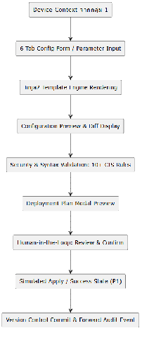

1. Configuration Management & Generation:  
   1. แบบฟอร์ม 6-Tab Configuration Builder (System/Hostname, Banner, SSH/Line VTY, Interface/VLAN, Routing/DHCP, Basic Security)  
   2. Jinja2 Template Rendering Engine รองรับคำสั่ง Conservative Command Set สำหรับ Cisco IOS 12.x+  
2. Security & Validation:  
   1. ระบบตรวจสอบแบบ Static Pre-deployment Scan ด้วย Regular Expressions (Regex) มากกว่า 10 กฎหลักตามมาตรฐาน CIS Cisco IOS Benchmark  
   2. การจำแนกความรุนแรง 3 ระดับ: Critical, Warning, Info  
   3. ระบบบันทึกเหตุผลการข้ามกฎความปลอดภัย (CIS Override Justification Logging)  
3. Configuration Version Control:  
   1. ตารางจัดเก็บประวัติเวอร์ชันของคอนฟิก  
   2. ระบบแสดงความแตกต่างของคอนฟิก   
   3. การออกแบบกระบวนการ Manual Restore / Rollback Workflow  
4. Configuration Deployment Workflow:  
   1. หน้าระบบ Deployment Plan Modal แสดงลำดับขั้นตอนและคำสั่งอย่างชัดเจนก่อนกดยืนยัน  
   2. การจำลองสถานะการส่งคำสั่งสำเร็จ (Simulated Success Status) ในระยะ Project 1  
5. PII Sensitive Data Masking:  
   1. ท่อกรองข้อมูลก่อนส่งออก External AI (Masking Middleware Pipeline)  
   2. การแปลง IP Address ด้วยอัลกอริทึม Crypto-PAn (yacryptopan) เพื่อรักษาโครงสร้าง Subnet/Prefix-preserving  
   3. การแปลงรหัสผ่านและคีย์ความลับ (enable secret, password 7, Pre-shared Key) ด้วย Regular Expressions  
6. AI Component :  
   1. บังคับใช้หลักการ Human-in-the-Loop โดย AI จะทำหน้าที่เป็น Co-pilot แนะนำและตรวจสอบเท่านั้น ห้าม AI ยิงคำสั่งเข้าสู่อุปกรณ์เครือข่ายโดยตรงเด็ดขาด

3. **ศึกษาข้อมูลด้าน Configuration Management และ AI** 

ทีมได้ศึกษาแนวคิดและเทคโนโลยีด้าน Network Automation จากหนังสือจำนวน 2 เล่ม ได้แก่ 

* [Network Programmability and Automation, 2nd Edition](https://www.oreilly.com/library/view/network-programmability-and/9781098110826/)   
* [AI for Networking Cookbook](https://www.oreilly.com/library/view/ai-networking-cookbook/9781805807995/)

โดยคัดเลือกอ่านหัวข้อที่เกี่ยวข้องกับโครงงานโดยตรง ไม่ได้ศึกษาทุกบทเท่ากัน   
หัวข้อสำคัญจาก Network Programmability and Automation, 2nd Edition ที่นำมาศึกษา ได้แก่:

*  แนวคิดและประเภทของ Network Automation เช่น การเก็บข้อมูล การจัดการคอนฟิก การตรวจสอบความสอดคล้อง และการตรวจสอบสถานะ  
* Data Formats และ Data Models เพื่อใช้พิจารณารูปแบบข้อมูลระหว่างระบบและการออกแบบ Schema  
* Jinja2 Template สำหรับสร้างคอนฟิกจากข้อมูลที่มีโครงสร้างและให้ผลลัพธ์ที่คาดการณ์ได้  
* การเชื่อมต่ออุปกรณ์ผ่าน Network API และ Netmiko สำหรับงานที่ต้องสื่อสารผ่าน SSH  
* การเปรียบเทียบเครื่องมือ Automation เช่น Ansible และ Nornir  
* แนวคิด Network Automation Architecture โดยเฉพาะ Source of Truth ซึ่งนำมาประยุกต์กับ Device Inventory ให้เป็นแหล่งข้อมูลอุปกรณ์กลางของระบบ

หัวข้อสำคัญจาก AI for Networking Cookbook ที่นำมาศึกษา ได้แก่:

* Prompt Engineering,การวิเคราะห์ Network Configuration,การสร้าง Backend API สำหรับแอปพลิเคชัน AI,แนวคิด Network Co-Pilot การศึกษาส่วนนี้ทำให้ทีมเห็นทั้งประโยชน์และข้อจำกัดของโมเดลภาษา เช่น ความสามารถในการอธิบายหรือช่วยร่างคำสั่ง และความเสี่ยงด้านคำตอบที่คลาดเคลื่อน ข้อมูลสำคัญรั่วไหล และข้อจำกัดของ External API

ผลจากการศึกษาทั้งสองเล่มทำให้ทีมกำหนดหลักการเบื้องต้นว่า งานที่มีคำตอบแน่นอน เช่น การสร้างคอนฟิกพื้นฐานและการตรวจสอบกฎ ควรใช้ Template หรือกฎแบบตายตัวเป็นหลัก ส่วน AI ควรใช้กับงานที่ต้องการการอธิบาย การสรุป หรือข้อเสนอแนะ และต้องมีการตรวจสอบโดยผู้ใช้ก่อนนำไปใช้กับอุปกรณ์จริง

4. **วิเคราะห์และคัดเลือกฟีเจอร์**  
   ทีมได้รวบรวมฟีเจอร์ที่เกี่ยวข้อง ได้แก่   
1. Configuration Generation   
2. Configuration Deployment  
3. Security Validation  
4. PII Sensitive Data Masking  
5. Version Control   
6. AI Component

จากนั้นจึงประเมินแต่ละฟีเจอร์โดยใช้ปัจจัยต่อไปนี้:

* ความสอดคล้องกับปัญหาของผู้ดูแลระบบเครือข่าย  
* ความจำเป็นต่อการสาธิตการทำงานแบบต้นจนจบ  
* ระยะเวลาและจำนวนสมาชิกของทีม  
* ความพร้อมของอุปกรณ์จริงและระบบจำลอง  
* ความแตกต่างของคำสั่งระหว่างผู้ผลิต รุ่น และระบบปฏิบัติการ  
* ความเสี่ยงจากการเปลี่ยนคอนฟิกบนอุปกรณ์จริง  
* ความซับซ้อนในการพัฒนา ทดสอบ และอธิบายผลลัพธ์

ทีมจึงแบ่งแนวทางพัฒนาออกเป็นกลุ่มหลัก ได้แก่ ความสามารถที่ต้องมีในรุ่นแรก โครงสร้างพื้นฐานที่ต้องเตรียมไว้ ความสามารถที่ทำภายหลัง และความสามารถที่ตัดออก ตัวอย่างผลการพิจารณา ได้แก่:

* ใช้ Jinja2 Template เป็นแกนหลักของการสร้างคอนฟิกพื้นฐาน เพราะผลลัพธ์ตรวจสอบและทดสอบซ้ำได้  
* ลดจำนวนกฎ CIS ให้เหลือชุดพื้นฐานที่สามารถพัฒนาและทดสอบได้จริงในเวลาที่กำหนด  
* ตัดความสามารถที่มีความเสี่ยงหรือซับซ้อนเกินขอบเขต เช่น Auto-Rollback, Cross-Device Impact Analysis และนโยบาย Multi-vendor ที่ซับซ้อน  
* จำกัด Cisco IOS เป็น Baseline หลัก ส่วนอุปกรณ์ยี่ห้ออื่นต้องยืนยันรุ่น ระบบปฏิบัติการ ชุดคำสั่ง และผลทดสอบก่อนกล่าวว่ารองรับ  
5. **ปรึกษาอาจารย์ที่ปรึกษา**

ทีมได้เข้าพบอาจารย์ที่ปรึกษาอย่างต่อเนื่องเพื่อทบทวนว่าฟีเจอร์ที่เลือกยังตอบโจทย์ผู้ดูแลระบบเครือข่ายหรือไม่ รวมถึงขอคำแนะนำเกี่ยวกับขอบเขต การจัดลำดับฟีเจอร์ การแบ่งงาน และแนวทางออกแบบระบบ

คำแนะนำสำคัญที่ทีมได้รับ ได้แก่:

* การจำกัดขอบเขต MVP และการทำสิ่งที่วัดผลได้จริง: อาจารย์เน้นย้ำว่าไม่ควรพยายามทำทุกอย่างพร้อมกัน ให้โฟกัสที่เส้นทางหลัก (Core Path):   
  * เลือกอุปกรณ์ → กรอกฟอร์ม → เรนเดอร์เทมเพลต → ตรวจสอบกฎ → พรีวิว → กดยืนยันให้ทำงานได้สมบูรณ์ก่อน  
* การแยกหน้าที่ Data Ownership และ Dependency: แต่ละระบบย่อยต้องชัดเจนว่าตนเองเป็นเจ้าของข้อมูลใด และต้องขอข้อมูลใดจากระบบอื่น เพื่อให้สามารถเขียน Mock Data พัฒนาคู่ขนานกันได้โดยไม่ติดบล็อก  
* การออกแบบฐานข้อมูล (Relational vs NoSQL): อาจารย์ให้คำแนะนำว่าการเลือกฐานข้อมูลต้องดูจากความสัมพันธ์ของข้อมูล โดยข้อมูล Configuration, Templates, Versions และ Validation Results มีความสัมพันธ์เชิงโครงสร้างและต้องการ Foreign Key Constraints ชัดเจน จึงเหมาะสมกับ Relational Database (PostgreSQL)  
* ข้อกำหนด 1 VLAN : 1 Subnet สำหรับ MVP: เพื่อลดความซับซ้อนในการคำนวณและตั้งค่า Routing/DHCP ในระยะเริ่มต้น ควรกำหนดให้ 1 VLAN ผูกกับ 1 IPv4 Subnet เสมอ  
* สถานะของอุปกรณ์จริงและ Candidate Test Vendors: อุปกรณ์อย่าง Huawei Router, MikroTik Switch และ Dell PowerConnect 7048 จะถูกระบุเป็น Candidate Test Vendors สำหรับทดสอบในห้องปฏิบัติการปิด (Isolated Lab) หลังการสอบกลางภาค โดยในระยะ P1 จะใช้ Cisco IOS เป็น Baseline หลักเท่านั้น

คำแนะนำดังกล่าวถูกนำมาใช้ปรับวิธีทำงานของทีม จากเดิมที่มีเพียงรายการฟีเจอร์ ให้เริ่มกำหนด MVP, เจ้าของข้อมูล, Dependency และ Schema ของแต่ละส่วนอย่างเป็นระบบ

4. **แบ่งหน้าที่ภายในทีม**

ทีมได้เริ่มแบ่งงานตามฟีเจอร์หรือระบบย่อย แทนการแบ่งเฉพาะ Frontend และ Backend เพื่อให้สมาชิกแต่ละคนรับผิดชอบงานของตนตั้งแต่การศึกษาปัญหา กำหนดขอบเขต ออกแบบข้อมูล ไปจนถึงการระบุวิธีเชื่อมต่อกับฟีเจอร์อื่น

เจ้าของแต่ละฟีเจอร์มีหน้าที่หลักดังนี้:

1. คิดศึกษาสิ่งที่คาดว่าจะเป็น MVP  (Minimum Viable Product) ของฟีเจอร์  
2. ระบุข้อมูลที่ฟีเจอร์เป็นเจ้าของและข้อมูลที่ต้องขอจากฟีเจอร์อื่น  
3. ออกแบบ Schema และความสัมพันธ์ของข้อมูลเบื้องต้น  
4. อัปเดตเอกสารกลางเพื่อให้สมาชิกตรวจสอบความคืบหน้าได้  
5. **กำหนดผลิตภัณฑ์ขั้นต่ำที่ใช้งานได้ของแต่ละฟีเจอร์เท่าที่ศึกษา**

สมาชิกแต่ละคนเริ่มกำหนดผลิตภัณฑ์ขั้นต่ำที่ใช้งานได้ MVP  (Minimum Viable Product)ของฟีเจอร์ที่รับผิดชอบ เพื่อให้ขอบเขตเหมาะสมกับเวลาและทรัพยากรของทีม โดยการกำหนด MVP ไม่ได้พิจารณาเพียงจำนวนหน้าจอ แต่พิจารณาว่าผู้ใช้สามารถทำงานหลักของฟีเจอร์ได้สำเร็จหรือไม่

**Configuration Generation**   
	ระบบสร้าง configuration โดยการใช้ AI ในระบบนี้ MVP คือ

1. สร้าง config ที่สามารถใช้งานได้และ syntax ถูกต้องโดยจะเริ่มจาก cisco ก่อน  
2. การสร้าง config จะอิง device แบบตัวเดี่ยว   
3. ระบบสามารถซ่อน Ip address ได้เมื่อ prompt และเมื่อ AI  ส่ง config กลับมาจะต้องไม่เสีย context

โดยจะแบ่งการพัฒนาออกเป็น 2 ส่วนได้แก่

1.  AI configuration generation

ในส่วนนี้จะต้องทำ chat history จึงมีการออกแบบ schema ของแชทเมื่อคุยกับ AI ว่าจะเก็บประวัติอย่างไร นี่คือ ER Diagram เวอชั่นที่ 1  
  
(รูปภาพ ER diagram ของ chat history v1)

จากในรูปจะมี 2 entity คือ chat และ message เป็นความสัมพันธ์แบบ 1-to-many โดย chat มี message ได้หลายอันและ message แต่ละอันอยู่ได้แค่ 1 chat เท่านั้น 

2. PII Masking

 เป็นระบบการจัดการ sensitive information ซึ่งมี library ให้ใช้หลายตัวซึ่งตอนนี้มาร์คไว้ในใจ 3 ตัวได้แก่

1. netconan  
2. yacryptopan  
3. presidio

แต่ละตัวมีข้อดีข้อเสียต่างกันขึ้นอยู่กับการจัดการ data ซึ่งตอนนี้ผู้จัดทำยังออกแบบการเก็บข้อมูลยังไม่ครบถ้วนจึงทำให้ยังไม่ตัดสินใจว่าจะใช้ตัวไหน 

Data หลัก ๆ ที่คาดว่าต้องจัดการคือ IP address และ password ต่าง ๆ ซึ่งที่น่าเป็นกังวลคือเรื่อง IP address ที่เมื่อถูก mask แล้วอาจจะเสีย context ได้ ซึ่งตรงนี้มีวิธีแก้ปัญหาอยู่คือการใช้ yacryptopan ที่ใช้ Algorithm คือ Crypto-PAn ที่เมื่อ anonymize ip address แล้วจะยังคงอยู่ใน subnet เดียวกันและมี ip address ไปทิศทางเดียวกันโดยที่เลข ip address เปลี่ยนไปจากเดิม  
Component Diagram ของ AI assistance  
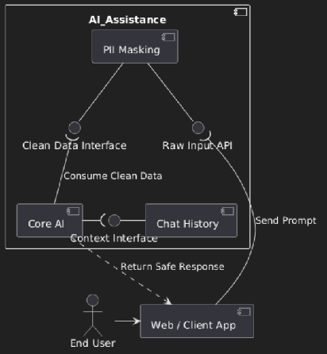

