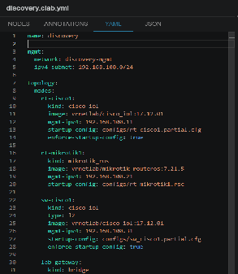
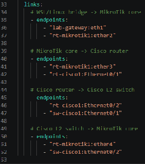
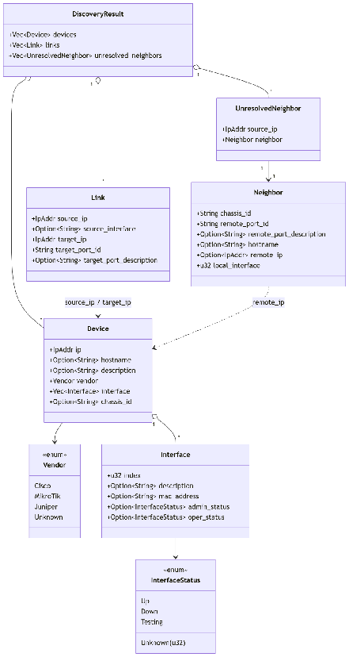
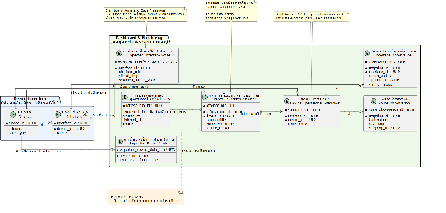
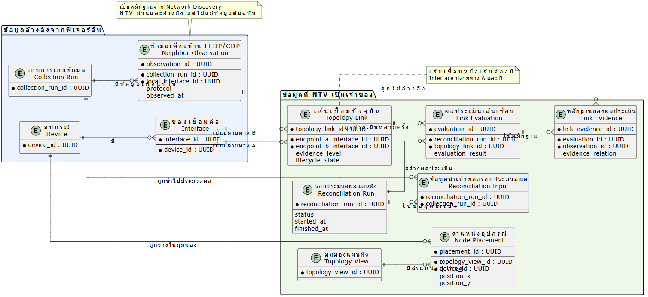

**รายงานความคืบหน้า รายวิชา Project 1 ครั้งที่ 1**  
**ภาควิชาวิศวกรรมคอมพิวเตอร์ คณะวิศวกรรมศาสตร์**  
**สถาบันเทคโนโลยีพระจอมเกล้าเจ้าคุณทหารลาดกระบัง**

1. หัวข้อโครงงาน (ภาษาอังกฤษ)	:      Application for network management and configuration automation (1)	    
2. การดำเนินการมีความคืบหน้า	:               15%	%. (ประเมินจากทั้งรายวิชา Project 1 และ Project 2\)  
3. รายงานความคืบหน้าระหว่าง	: วันที่        10 กรกฎาคม 2569 	ถึง     7 สิงหาคม 2569 	  
4. สรุปความคืบหน้า (โครงงานประเภท Software Development)

| หัวข้อ | เปอร์เซ็นต์ความคืบหน้า (ครั้งที่) |  |  |  |  |
| ----- | :---: | ----- | ----- | ----- | ----- |
|  | **1** | **2** | **3** | **4** | **5** |
| 1\. ศึกษาทบทวนข้อกำหนดที่ควรมี และจำเป็นต้องมี | 50% |  |  |  |  |
| 2\. การออกแบบ UX/UI | 0% |  |  |  |  |
| 3\. การออกแบบ Use Case Diagram / Class Diagram / Sequence Diagram หรือ Diagram แบบอื่นๆ ที่อธิบายการทำงานของระบบ และโครงสร้างโปรแกรม | 30% |  |  |  |  |
| 4\. การออกแบบโครงสร้างของระบบ Software Architecture Diagram / System Architecture Diagram | 15% |  |  |  |  |
| 5\. ทำงานได้ตามขอกำหนด และ ทดสอบการทำงาน Unit Testing / Integration  Testing หรือ อื่นๆ ที่แสดงถึงการทำงานได้ตามขอกำหนด | 15% |  |  |  |  |
| 6\. การ Deploy และ Integrate ให้เป็นระบบที่ทำงานได้ตามข้อกำหนด | 5% |  |  |  |  |

5. รายละเอียดความคืบหน้า และ ปัญหาที่เกิดขึ้นและแนวทางการแก้ไข  
1. ปัญหาและวัตถุประสงค์ของ Network Management

ข้อมูลตัวตนของอุปกรณ์ สถานะการทำงาน และความสัมพันธ์ระหว่างอุปกรณ์อาจกระจัดกระจายหรือไม่เป็นปัจจุบัน ทำให้ผู้ดูแลเครือข่ายแยกได้ยากว่าเหตุขัดข้องเกิดจากอุปกรณ์ติดต่อไม่ได้ ระบบเก็บข้อมูลล้มเหลว หรือข้อมูลที่แสดงเก่าเกินกำหนด นอกจากนี้ การตรวจสอบด้วยตนเองและการวาดแผนผังจากความจำใช้เวลาและอาจคลาดเคลื่อนจากสภาพเครือข่ายจริง

โครงงานย่อย Network Management จึงมีวัตถุประสงค์เพื่อสร้าง Device Inventory เป็นแหล่งข้อมูลอุปกรณ์กลาง เก็บข้อมูลสถานะจากอุปกรณ์แบบอ่านอย่างเดียว แสดงสถานะล่าสุดพร้อมเวลาที่เก็บ และสร้างแผนผังเครือข่ายจากหลักฐาน LLDP/CDP รวมถึงบันทึกกิจกรรมสำคัญ เช่น การเพิ่มอุปกรณ์ การสั่งเก็บข้อมูล และการเปลี่ยนตำแหน่งบนแผนผัง

2. ขอบเขตและ MVP ของกลุ่ม  Network Management

ฟีเจอร์ที่กลุ่ม Network Management รับผิดชอบ ได้แก่ Authentication & RBAC, Audit Trail, Manual Device Enrollment, Device Inventory Management, Network Discovery แบบอ่านอย่างเดียว, Dashboard & Monitoring และ Network Topology Visualization  

3. การศึกษาข้อมูลด้าน Network Management

ทีมได้ศึกษาแนวคิดและเทคโนโลยีด้าน Network Management จากหนังสือ [Network Programmability and Automation, 2nd Edition](https://www.oreilly.com/library/view/network-programmability-and/9781098110826/) โดยคัดเลือกหัวข้อที่เกี่ยวข้องกับขอบเขตของกลุ่ม ดังนี้:

1. แนวคิด Network Automation สำหรับการเก็บข้อมูลและตรวจสอบสถานะ  
2. Data Formats และ Data Models สำหรับกำหนดสัญญาข้อมูลและออกแบบ Database Schema  
3. Network API, SNMP และ SSH แบบอ่านอย่างเดียวสำหรับสื่อสารกับอุปกรณ์  
4. LLDP/CDP สำหรับเก็บข้อมูลเพื่อนบ้านและใช้เป็นหลักฐานของเส้นเชื่อม  
5. Network Automation Architecture และแนวคิด Source of Truth ซึ่งนำมาประยุกต์ให้ Device Inventory เป็นแหล่งข้อมูลตัวตนอุปกรณ์กลาง  
6. ข้อจำกัดของ External API ระบบจำลอง และอุปกรณ์จริงที่อาจมีพฤติกรรมต่างกัน

ผลการศึกษาทำให้กำหนดหลักการว่า Network Management ต้องแยกตัวตนถาวรของอุปกรณ์ออกจากข้อมูลสถานะตามเวลา แสดงเวลาที่เก็บข้อมูลอย่างชัดเจน และไม่อ้างว่าข้อมูลเป็น Real-time หากระบบไม่ได้ติดตามอย่างต่อเนื่อง

4. วิเคราะห์และคัดเลือกฟีเจอร์  
   ทีมได้รวบรวมฟีเจอร์ที่เกี่ยวข้องกับการทำงานของผู้ดูแลระบบเครือข่าย ได้แก่   
1. Dashboard & Monitoring   
2. Audit Trail  
3. Authentication  
4. Device Inventory Management   
5. Manual Device Enrollment  
6. Network Discovery  
7. Network Topology 

จากนั้นจึงประเมินแต่ละฟีเจอร์โดยใช้ปัจจัยต่อไปนี้:

* ความสอดคล้องกับปัญหาของผู้ดูแลระบบเครือข่าย  
* ความจำเป็นต่อการสาธิตการทำงานแบบต้นจนจบ  
* ระยะเวลาและจำนวนสมาชิกของทีม  
* ความพร้อมของอุปกรณ์จริงและระบบจำลอง  
* ความแตกต่างของคำสั่งระหว่างผู้ผลิต รุ่น และระบบปฏิบัติการ  
* ความเสี่ยงจากการเปลี่ยนคอนฟิกบนอุปกรณ์จริง  
* ความซับซ้อนในการพัฒนา ทดสอบ และอธิบายผลลัพธ์  
5. วิเคราะห์และคัดเลือกฟีเจอร์

ทีมได้เข้าพบอาจารย์ที่ปรึกษาอย่างต่อเนื่องเพื่อทบทวนว่าฟีเจอร์ที่เลือกยังตอบโจทย์ผู้ดูแลระบบเครือข่ายหรือไม่ รวมถึงขอคำแนะนำเกี่ยวกับขอบเขต การจัดลำดับฟีเจอร์ การแบ่งงาน และแนวทางออกแบบระบบ

คำแนะนำสำคัญที่ทีมได้รับ ได้แก่:

* หลังจากรวบรวมฟีเจอร์แล้ว ต้องลงรายละเอียดและประเมินว่าส่วนใดควรทำก่อนหรือหลัง ไม่ควรพยายามทำทุกฟีเจอร์พร้อมกัน  
* ควรออกแบบ Device Inventory ฝั่ง Backend ให้เป็นข้อมูลกลาง แล้วให้ Discovery นำข้อมูลเข้า ขณะที่ Dashboard, Topology และกลุ่ม Configuration Automation ขอใช้ข้อมูลจากส่วนกลางนี้  
*  แต่ละระบบย่อยควรระบุหน้าที่ ข้อมูลที่รับ ข้อมูลที่ส่ง และ Dependency ให้ชัดเจน เพื่อให้สมาชิกสามารถพัฒนางานคู่ขนานกันโดยใช้ข้อมูลจำลองได้      
* ควรจัดทำภาพสถาปัตยกรรมแบบ Component Diagram หรือภาพกล่องและลูกศร เพื่อแสดงองค์ประกอบ การเชื่อมต่อ และผู้รับผิดชอบแต่ละส่วน  
* SNMP แบบ Read-only สามารถใช้สำหรับค้นหาและอ่านข้อมูลอุปกรณ์ได้ แต่ควรมี Manual Entry รองรับอุปกรณ์ที่ไม่ได้เปิด SNMP และไม่ควรใช้ SNMP เป็นวิธีหลักในการแก้ไขคอนฟิกหลายรายการ  
* ระบบจำลองช่วยทดสอบกรณีพื้นฐานได้ แต่ไม่สามารถแทนพฤติกรรมของอุปกรณ์จริงได้ทั้งหมด จึงต้องวางแผนทดสอบกับอุปกรณ์จริงเมื่อมีความพร้อม  
*  ต้องระบุว่าข้อมูลใดควรแสดงบน Dashboard เช่น VLAN, โหมดพอร์ต สถานะพอร์ต และสถานะลิงก์ พร้อมแยกข้อมูลสรุปออกจากข้อมูลรายละเอียด  
* การเลือกใช้ Relational Database หรือ NoSQL ต้องพิจารณาจากลักษณะข้อมูลและการใช้งาน ไม่ควรเลือกจากชื่อเทคโนโลยีเพียงอย่างเดียว

คำแนะนำดังกล่าวถูกนำมาใช้ปรับวิธีทำงานของทีม จากเดิมที่มีเพียงรายการฟีเจอร์ ให้เริ่มกำหนด MVP, เจ้าของข้อมูล, Dependency และ Schema ของแต่ละส่วนอย่างเป็นระบบ

6. การแบ่งงานภายในกลุ่ม Network Management

สมาชิกทั้งสองคนแบ่งงานตามกลุ่มฟีเจอร์ โดยครอบคลุมตั้งแต่ศึกษาปัญหา กำหนดขอบเขต ออกแบบข้อมูล และระบุวิธีเชื่อมต่อกับส่วนอื่น ดังนี้:

* กลุ่มงานที่ 1: Authentication & RBAC, Audit Trail, Dashboard & Monitoring และ Network Topology Visualization  
* กลุ่มงานที่ 2: Manual Device Enrollment, Device Inventory Management และ Network Discovery

7. ความคืบหน้าตามฟีเจอร์

**Authentication, RBAC และ Audit Trail**

กำหนดขอบเขตเบื้องต้นให้ระบบมีผู้ใช้สามบทบาท ได้แก่ Admin, Operator และ Viewer เพื่อแยกสิทธิ์การดูข้อมูล การเพิ่มหรือแก้ไขอุปกรณ์ การสั่ง Refresh/Discovery และการแก้ตำแหน่งบน Topology ทุก API ต้องตรวจสิทธิ์ และเหตุการณ์สำคัญต้องถูกส่งไปยัง Audit Trail โดยไม่บันทึกรหัสผ่าน Key หรือ SNMP Community ลงใน Log

**Manual Device Enrollment และ Device Inventory**

กำหนดให้ Device Inventory เป็น Source of Truth ของตัวตนอุปกรณ์และ Interface โดยเป็นเจ้าของ Device ID, Interface ID, Hostname, Device Type, Vendor, Model, OS/Platform, Management Address, Site/Group และ Active Status การเพิ่มอุปกรณ์ด้วยตนเองต้องตรวจข้อมูลซ้ำและรองรับกรณีที่อุปกรณ์ยังติดต่อไม่ได้ โดยไม่บังคับว่าต้องเปิด SNMP จึงจะบันทึกอุปกรณ์ได้

ข้อมูลลับจะไม่ถูกเก็บซ้ำใน Dashboard หรือ Inventory แต่เก็บเพียง Credential Reference และแยกขอบเขตสิทธิ์อ่านข้อมูล (\`READ\_ONLY\`) ออกจากสิทธิ์เปลี่ยน Configuration (\`CONFIG\_WRITE\`)

**Network discorvery**  
	MVP  (Minimum Viable Product): สามารถค้นหาอุปกรณ์ Router, Switch โดยใช้ Protocols SNMP และ LLDP เพื่อนำมาสร้าง Network diagram ฝั่งเว็บไซต์ (Frontend) ได้  
	การจำลองเครื่อข่ายเสมือน: กลับมาใช้ ContainerLab เป็นตัวทดสอบแทน EVE-NG โดย ใช้ Router 2ตัว (Cisco IOL, Mikrotik Router OS) และ L2 Switch (Cisco IOL) 1 ตัว และ lab-gateway สำหรับเชื่อมต่อเครื่องมือ (Network discovery) กับ เครือข่ายจำลอง  
  
  
	  
**โครงสร้างของข้อมูล Network discovery**  
  
ความคืบหน้าปัจจุบัน: 

- ทำเป็น CLI เพื่อทดสอบค้นหา โดยพิมพ์ oxian scan \<ip ตัวแรกที่เปิด SNMP ไว้\> หลังจากนั้นจะทำการ scan device ตัวแรก โดยดึงข้อมูลผ่าน oid ดังนี้  
  - get\_device\_info()  
    - sys\_name: oid\!(1, 3, 6, 1, 2, 1, 1, 5, 0\)  
    - sys\_descr: oid\!(1, 3, 6, 1, 2, 1, 1, 1, 0\)  
    - sys\_object\_id: oid\!(1, 3, 6, 1, 2, 1, 1, 2, 0\)

		       \-   	get\_device\_interface() ต้องใช้การ walk แต่ละ oid จะต้องไล่ทีละ index  
			\- descriptions: oid\!(1, 3, 6, 1, 2, 1, 2, 2, 1, 2\) \# description address ของแต่ละ interface  
			\- macs: oid\!(1, 3, 6, 1, 2, 1, 2, 2, 1, 6\) \# mac address ของแต่ละ interface  
			\- admin\_status: oid\!(1, 3, 6, 1, 2, 1, 2, 2, 1, 7\)  
			\- oper\_status: oid\!(1, 3, 6, 1, 2, 1, 2, 2, 1, 8\)  
		      \- 	chassis\_id ใช้เพื่อระบุ id สำหรับ L2 device

- หลังจากได้ข้อมูลพื้นฐานของ device ตัวแรกแล้วจะเริ่มทำการค้นหาเพื่อนบ้านผ่าน LLDP ใช้ฟังก์ชัน discover\_neighbors() จะทำการค้นหาเพื่อนบ้านก่อน แล้วเก็บเป็น array ส่งกลับฟังก์ชันหลักโดยเก็บข้อมูลทั้งหมดดังนี้  
  - hostnames  
  - ports \# port id เครื่องเพื่อนบ้าน  
  - port\_descriptions \# description link เครื่องเพื่อนบ้าน  
  - addresses \# ip สำหรับ management ของเครื่องเพื่อนบ้าน

  ใช้ LLDP-MID (1, 0, 8802, 1, 1, 2, 1\) ในการทำ SNMP Walk แล้วดึงค่าของแต่ละ Sub-tree เพื่อดึงข้อมูลเพื่อนบ้านมา	

- หลังจากได้ Array ของเพื่อนบ้าน ทำการเพิ่มเข้า Queue เพื่อเก็บข้อมูล device ถัดไป แล้วจะวนแบบนี้ไปเรื่อยๆ จนกว่ากว่า Queue จะหมด หากเจอ IP ที่ซ้ำจะข้ามไป  
- หากเจออุปกรณ์ แต่ไม่สามารถดึงข้อมูล chassis\_id, ip หรือ hostname ได้จะทำการใส่ใน unresolved\_neighbors เป็น device ที่เจอในระบบแต่ไม่มีข้อมูล  
- หลังจาก Queue หมดแล้ว จะทำการสร้าง Array สำหรับเก็บ Link และ Link ที่เชื่อมต่อ device แต่ละตัวโดยหาก source\_ip \== target\_ip จะไม่สร้าง Link ซ้ำ  
- ข้อมูลที่ได้จากการ Discovery (ซึ่งต้องส่งต่อให้กับ backend)

- ใกล้ถึง MVP ขาดส่วนของการเชื่อมกับ backend ทำ bindings เพื่อเชื่อม lib ที่เขียนโดยภาษา rust ปัจจุบันทำเป็น CLI เพื่อทดสอบ

ปัญหาที่พบ:

- วาง flow การค้นหาผิด โดยใช้ Feature ของเฉพาะบาง vendor คือ Cisco Discovery Protocol (CDP) ทำให้ OID .1.3.6.1.4.1.9.9.23.1.2.1.1 (CDP) ใช้ดึงข้อมูล Neighbor ได้เฉพาะอุปกรณ์ของ Cisoc  
- ตั้งค่า snmp community string ผิดทำให้ไม่สามารถดึงข้อมูลจาก router ได้  
- EVE-NG ลงผ่าน VMWare เนื่องจากการจำลองอุปกรณ์ router และ switch ต้องมี image ไฟล์ os ของอุปกรณ์นั้นๆ จึงกลับไปใช้แบบเดิมคือ Containerlab  
- ถ้า router \-\> switch \-\> router แล้ว switch ไม่มี SNMP และ IP management จะไม่เจอ router ที่อยู่อีกฝั่ง

สิ่งที่จะทำต่อจากนี้

- เพิ่มส่วนของ binding ระหว่าง backend กับ network discovery เพื่อให้ backend ที่เขียนด้วยภาษา python สามารถเรียกใช้ native lib แปลงโดย pyo3 ที่เขียนโดยภาษา rust ได้  
- รองรับ SNMP หลายเวอร์ชัน โดยปัจจุบัน ตัว network discovery ถูกพัฒนาและทดสอบบน SNMP v2c และไม่ได้ implement เรื่องความปลอดภัย กับ รองรับ SNMP v1, v3 ได้  
- ทำข้อมูลที่ discovery ได้ส่งให้หลังบ้านทำ API และให้ Website สามารถ กดเพื่อสแกนและสร้างเป็น Network Topology ได้  
- เพื่อการดึง Routing Table จาก Router และทำการสแกนทั้ง Subnet แบบ auto (เก็บไว้ต่อเติมในภาคเรียนที่สองครับ)

**Backend**   
ความคืบหน้าปัจจุบัน:

- ใช้ Fastapi และวางโครงสร้าง และ folder โดยเป็นรูปแบบ feature-based โครงสร้าง api v1 router ได้แก่  
  - ai\_assisted\_config  
  - cis\_security\_validation  
  - config\_generation  
  - config\_version\_control  
  - device\_groups  
  - devices  
  - network\_device\_discovery

	สิ่งที่จะทำต่อจากนี้

- API path network\_device\_discovery ไปดึงฟังก์ชันจาก lib network discovery และส่งต่อให้ Website นำไปแสดงผล

**Dashboard & Monitoring**  
ระบบแสดงภาพสถานะการทำงานล่าสุดที่เก็บจากอุปกรณ์ ณ ช่วงเวลาหนึ่ง ช่วยให้วิศวกรตอบได้ว่า

- มีอุปกรณ์ใดเข้าถึงไม่ได้?  
- การเก็บข้อมูลจากอุปกรณ์สำเร็จหรือไม่?  
- ปัญหาอยู่ที่ Switch Uplink หรือ Access Port?  
- Port อยู่ VLAN ใด?  
- Router มีทางออกสำหรับ WAN ไหม?  
- ข้อมูลยังเชื่อถือได้หรือไม่?  
- ก่อนเกิดเหตุมีการดำเนินการอะไร?  
- อุปกรณ์ ping ได้แต่ละระบบอ่านข้อมูลไม่ได้?  
- ยังไม่มีข้อมูลหรือเก็บข้อมูลผิดพลาด?  
- Port ใดถูกอุปกรณ์ปิด เพราะความผิดปกติ?  
- การไม่มี Default Route เป็นความผิดปกติจริงหรือไม่?  
- Network ทำงานแต่ยังมีความเสี่ยง Security หรือไม่?  
- ระบบแอพพลิเคชันของเรา ส่วนใดพร้อมใช้งาน?

ขอบเขต MVP ระดับฟีเจอร์แบ่งออกเป็น 5 กลุ่มหลัก ได้แก่:

- สถานะล่าสุดและภาพรวมเครือข่าย:   
  - แสดงชุดข้อมูลสถานะล่าสุด (Operational Snapshot) และสรุปจำนวนอุปกรณ์ที่ติดต่อได้ ติดต่อไม่ได้ ยังไม่ทราบสถานะ เก็บข้อมูลล้มเหลว หรือมีข้อมูลเก่าเกินกำหนด  
- การเก็บและตีความสถานะ:   
  - ให้ผู้ใช้สั่งอัปเดตข้อมูลของอุปกรณ์ที่ลงทะเบียน และแยกสถานะการเข้าถึงอุปกรณ์ (Reachability), ผลการเก็บข้อมูล (Collection Status), สถานะการทำงาน (Operational State) และความใหม่ของข้อมูล (Data Freshness) ออกจากกัน  
- การตรวจหาปัญหาจากสถานะที่คาดหวัง:   
  - เปรียบเทียบสถานะจริงกับค่าที่ผู้ใช้กำหนดว่าควรเป็นด้วยกฎแบบตายตัว เพื่อค้นหาปัญหา เช่น อุปกรณ์ติดต่อไม่ได้ การเก็บข้อมูลล้มเหลว Uplink หรือ WAN สำคัญไม่ทำงาน พอร์ตเป็น Err-disabled และ Edge Router ไม่มี Default Route ตามที่กำหนด  
- รายละเอียดของ Switch และ Router:   
  - แสดงสถานะ Interface, Access/Trunk, VLAN, Uplink, Layer 3 Interface, WAN และ Default Route โดยพิจารณาบทบาทและความสำคัญของ Interface เพื่อลดการแจ้งเตือนเกินจริงจาก Access Port ที่ปิดตามปกติ  
- การตรวจสอบต่อและการเชื่อมโยงฟีเจอร์อื่น:   
  - รองรับการกดจากข้อมูลสรุปไปยัง Device, Interface หรือ Route ที่เกี่ยวข้อง พร้อมแสดง Security Summary, Recent Activity, ความพร้อมของ Backend และ Database, Offline Mode และทางลัดไปยัง Workflow สำคัญตามสิทธิ์ของผู้ใช้

รายละเอียด Feature ของ MVP  (Minimum Viable Product):

- DF-01 : Current Operational Snapshot  
  - แสดงภาพสถานะล่าสุดของอุปกรณ์เครือข่าย(Operational Snapshot)ที่ลงทะเบียนใน Device Inventory โดยระบุเวลาที่ข้อมูลถูกเก็บอย่างชัดเจน และไม่อ้างว่าเป็นข้อมูล Real-time  
- DF-02 : Network Overview  
  - สรุปภาพรวมของอุปกรณ์และข้อมูลปฏิบัติการ เช่น Reachable, Unreachable, Unknown, Collection Failed และ Stale เพื่อให้ผู้ใช้เห็นสถานการณ์เบื้องต้นจากหน้าเดียว  
- DF-03 : Manual Operational Refresh  
  - ให้ผู้ใช้เป็นผู้สั่ง Refresh ข้อมูล สำหรับอุปกรณ์ที่ต้องการตรวจ โดยเชื่อมต่อเฉพาะอุปกรณ์ที่ลงทะเบียน  
- DF-04 : Operational State Separation  
  - สร้าง State ที่แยกสถานะออกจากกัน ได้แก่ :   
    - Reachability บอกว่า   ติดต่ออุปกรณ์ได้หรือไม่  
    - Collection Status บอกว่า  เก็บและแปลงข้อมูลสำเร็จหรือไม่  
    - Operational State บอกว่า Interface, WAN หรือ Routing ทำงานอย่างไร  
    - Data Freshness บอกว่า ข้อมูลยังใหม่หรือเก่าแล้ว  
- DF-05 : Operational Problem Summary  
  - สรุปรายการปัญหาสำคัญที่ตรวจพบจาก สถานะการทำงานที่เก็บจากอุปกรณ์ กับ สิ่งที่คาดจะให้สถานะของอุปกรณ์มันเป็น ด้วยกฏที่แน่นอน  
    - ครอบคลุมปัญหาหลักในระดับ Feature ได้แก่:  
      - ไม่สามารถติดต่ออุปกรณ์ได้  
      - การเก็บข้อมูลจากอุปกรณ์ล้มเหลว  
      - ข้อมูลสถานะการทำงานเก่า (Stale Operational Data) เกินกำหนด  
      - Interface สำคัญของ Swtich มีปัญหา  
      - พอร์ตถูกปิดใช้งานเนื่องจากตรวจพบข้อผิดพลาด  
      - ขา WAN ที่สำคัญมีปัญหา  
      - ไม่พบ Default Route ที่กำหนดไว้ว่าต้องมี  
- DF-06 : Switch Operational Visibility  
  - แสดงสถานะการทำงานของ Switch ทั้งในหน้า Dashboard Summary และหน้า Switch Detail เพื่อให้ผู้ใช้ตรวจสอบ Interface, Access/Trunk, VLAN และปัญหาของ Uplink ได้  
    - ระบบต้องพิจารณาทั้งบทบาทของพอร์ต ระดับความสำคัญ และสาเหตุที่พอร์ตไม่ทำงาน เพื่อหลีกเลี่ยงการแจ้งเตือนพอร์ตปกติจำนวนมากจนบดบังปัญหาที่ต้องรีบแก้ไขจริง ๆ  
      - Access Port Down ทั่วไป: พอร์ตที่ต่อกับคอมพิวเตอร์หรือเครื่องพิมพ์ อาจ Down เพราะปิดเครื่องหรือถอดสาย จึงอาจเป็นเรื่องปกติ  
      - Critical Uplink Down: พอร์ตสำคัญที่เชื่อมต่อ Switch, Router หรือเครือข่ายส่วนอื่น หาก Down อาจทำให้ผู้ใช้หลายคนใช้งานไม่ได้ จึงต้องแจ้งเตือน  
      - Err-disabled Port: อุปกรณ์ปิดพอร์ตอัตโนมัติเนื่องจากพบความผิดปกติ เช่น Port Security หรือ BPDU Guard จึงควรแจ้งให้ผู้ดูแลตรวจสอบ  
- DF-07 : Router Operational Visibility  
  - แสดงสถานะการทำงานของ Router ทั้งในหน้า Dashboard Summary และหน้า Router Detail เพื่อให้ผู้ใช้ตรวจสอบ Layer 3 Interface, WAN และ Default Route ได้  
- DF-08 : Expected State and Criticality  
  - ให้ผู้ใช้กำหนดความคาดหวังของอุปกรณ์และ Interface ก่อนที่ระบบจะสรุปว่า สถานะในปัจจุบัน ผิดปกติ  
  - Feature นี้ครอบคลุมแนวคิดระดับ Feature ได้แก่:   
    - Interface Role : ระบุว่าช่องเชื่อมต่อมีหน้าที่อะไร เพื่อช่วยตีความสถานะได้ถูกต้อง   
      - Access, Uplink หรือ WAN   
    - Critical Flag  : ระบุว่าช่องเชื่อมต่อนี้มีความสำคัญต่อระบบหรือไม่ หากมีปัญหาจะได้รับระดับการแจ้งเตือนสูงขึ้น  
      - Uplink ที่เชื่อมต่อ Core Switch ถูกกำหนดเป็นช่องเชื่อมต่อสำคัญ  
    - Expected Interface State  : ระบุสถานะที่ผู้ใช้คาดหวังให้ช่องเชื่อมต่อมี เช่น ควรทำงานหรือยอมให้ปิดได้   
      - Gi0/1 ควรอยู่ในสถานะ Up  
    - Edge Router Expectation : ระบุว่า Router ตัวใดทำหน้าที่เป็นทางออกของเครือข่ายและควรมีสิ่งใดอยู่  
      - Router ทางออกควรมี Default Route อย่างน้อยหนึ่งเส้น  
    - Expected Network State  : ภาพรวมของเงื่อนไขทั้งหมดที่ผู้ใช้กำหนดว่าเครือข่ายควรมีหรือควรทำงานอย่างไร   
      - Uplink ต้อง Up, WAN ต้องทำงาน และ Edge Router ต้องมี Default Route  
- DF-09 :  Data Freshness and Last Known State  
  - แสดงเวลาที่เก็บข้อมูลสำเร็จล่าสุด ความใหม่ของข้อมูลเมื่อเทียบกับเวลาปัจจุบัน และผลของความพยายาม Collection ล่าสุด  
- DF-10 : Operational Drill-down  
  - ให้ผู้ใช้กดจาก Summary หรือจำนวนปัญหาไปยังรายการ Device, Interface หรือ Route ที่เกี่ยวข้อง เพื่อเปิดดูหลักฐานและรายละเอียดต่อได้ทันที  
- DF-11 : Security Summary  
  - แสดงจำนวน ระดับปัญหาจาก Security & Validation Feature โดย Dashboard อ่านและสรุปข้อมูลจากเจ้าของข้อมูล ไม่สร้างผลการตรวจความปลอดภัยเอง  
- DF-12 : Recent Activity and Audit Integration  
  - แสดงกิจกรรมล่าสุดจาก Audit Trail และบันทึกการ Refresh  
- DF-13 : System Health and Offline Mode Status  
  - แสดงความพร้อมของ Backend, Database และสถานะ Offline Mode เพื่อให้ผู้ใช้ทราบว่าระบบ MyNetMate พร้อมทำงานหรือไม่  
- DF-14 : Quick Actions   
  - มีทางลัดไปยัง Workflow สำคัญ เช่น Device Inventory, Configuration Generation , Security Validation และ Audit Trail โดยแสดงตามสิทธิ์ของผู้ใช้

ข้อมูล และ Schema เบื้องต้นของ Dashboard & Monitoring

Dashboard & Monitoring เป็นเจ้าของข้อมูลที่เกิดจากกระบวนการติดตามสถานะของตนเอง แต่ใช้ข้อมูลตัวตนอุปกรณ์ ผู้ใช้ ความปลอดภัย และประวัติกิจกรรมจากฟีเจอร์เจ้าของข้อมูล โดยไม่สร้างข้อมูลเหล่านั้นซ้ำ

ข้อมูลที่ Dashboard & Monitoring เป็นเจ้าของ

| กลุ่มข้อมูลเบื้องต้น | ข้อมูลสำคัญที่เก็บ | จุดประสงค์ |
| ----- | ----- | ----- |
| รอบอัปเดตสถานะ (operational\_refresh\_runs) | ผู้เริ่ม เวลาเริ่ม–สิ้นสุด และสถานะของรอบ | ควบคุมการสั่ง Refresh และติดตามผลของแต่ละรอบ |
| ผลการเก็บข้อมูลรายอุปกรณ์ (device\_collection\_attempts) | อุปกรณ์ ผล Reachability, Collection Status และสาเหตุที่ล้มเหลว | แยกกรณีติดต่อไม่ได้ เก็บข้อมูลไม่ได้ และเก็บได้เพียงบางส่วน |
| ชุดข้อมูลสถานะ (device\_operational\_snapshots) | อุปกรณ์ เวลาที่เก็บสำเร็จ และแหล่งที่มาของข้อมูล | เก็บหลักฐานสถานะที่สำเร็จในแต่ละช่วงเวลา |
| สถานะช่องเชื่อมต่อ (interface\_operational\_observations) | Interface, Admin/Operational Status, Access/Trunk, VLAN และ Err-disabled | แสดงและตรวจสอบสถานะของ Switch และ Router Interface |
| เส้นทางที่ตรวจพบ (route\_observations) | ปลายทาง Next Hop, Outgoing Interface และสถานะของ Default Route | ตรวจว่า Router มีเส้นทางออกตามที่กำหนดหรือไม่ |
| ค่าที่ควรเป็นระดับอุปกรณ์ (expected\_device\_states) | อุปกรณ์เป็น Edge Router หรือไม่ และต้องมี Default Route หรือไม่ | ใช้เปรียบเทียบสถานะจริงระดับอุปกรณ์ |
| ค่าที่ควรเป็นระดับ Interface (expected\_interface\_states) | Interface Role, Critical Flag และ Expected Admin State | แยกพอร์ตทั่วไปออกจาก Uplink หรือ WAN ที่สำคัญ |

ข้อมูลที่ต้องขอจากฟีเจอร์อื่น

| ฟีเจอร์เจ้าของข้อมูล | ข้อมูลที่ Dashboard & Monitoring ต้องใช้ |
| ----- | ----- |
| Device Inventory | Device ID, Interface ID, Hostname, Device Type, Vendor, Model, OS Version, Management Address, Site, Group และสถานะการใช้งานของอุปกรณ์ |
| Authentication และ RBAC | User ID และสิทธิ์ในการดูข้อมูล สั่ง Refresh หรือแก้ไข Expected State |
| Network Discovery  | บริการเก็บข้อมูลแบบอ่านอย่างเดียวจากอุปกรณ์ที่ลงทะเบียน พร้อมผล Reachability, Collection Status, ข้อมูลที่ Parser แปลงแล้ว เวลาเก็บ และสาเหตุที่ล้มเหลวอย่างปลอดภัย |
| Security & Validation | จำนวนปัญหา ระดับความรุนแรง ผล Pass/Fail และเวลาที่ตรวจล่าสุดสำหรับ Security Summary |
| Audit Trai | กิจกรรมล่าสุดของระบบ ขณะที่ D\&M ส่งเหตุการณ์ Refresh และการแก้ Expected State ไปบันทึก |
| Settings และ System Health | Offline Mode และสถานะความพร้อมของ Backend กับ Database |

ความสัมพันธ์ของข้อมูลเบื้องต้น

**Network Topology Visualization**

ฟีเจอร์แสดงแผนผังเครือข่าย (Network Topology Visualization) มีเป้าหมายให้ผู้ใช้เห็นว่าอุปกรณ์ใดเชื่อมต่อกับอุปกรณ์ใด ผ่านช่องเชื่อมต่อใด โดยสร้างแผนผังจากข้อมูล LLDP/CDP ที่เก็บจากอุปกรณ์จริง ไม่ใช่โปรแกรมวาดแผนผังหรือสร้างเส้นเชื่อมจากการคาดเดาของผู้ใช้

 MVP  (Minimum Viable Product) ของ Network Topology Visualization :

- แสดง Router และ Switch ที่ลงทะเบียนใน Device Inventory และเก็บข้อมูลสำเร็จแล้วเป็นอุปกรณ์บนแผนผัง  
- สร้างเส้นเชื่อมโดยอัตโนมัติจากข้อมูลเพื่อนบ้าน  พร้อมบอก Interface ทั้งสองฝั่ง  
- แสดงแหล่งที่มา เวลาที่ตรวจล่าสุด และระดับของหลักฐาน เช่น พบข้อมูลฝั่งเดียวหรือพบข้อมูลตรงกันทั้งสองฝั่ง  
- แสดงคำเตือนเมื่อยังระบุปลายทางไม่ได้ ข้อมูลขัดแย้ง หรือข้อมูลเก่า โดยไม่ลบเส้นเชื่อมทันทีเมื่อการเก็บข้อมูลล้มเหลวเพียงรอบเดียว  
- ให้ผู้ใช้ลากตำแหน่งอุปกรณ์ ย่อ–ขยาย เลื่อนแผนผัง เปิดรายละเอียดอุปกรณ์หรือช่องเชื่อมต่อ และสั่งเก็บข้อมูลใหม่แบบอ่านอย่างเดียวได้  
- ใช้ระบบสิทธิ์และประวัติการดำเนินงานส่วนกลางในการควบคุมการสั่งเก็บข้อมูลใหม่และการแก้ตำแหน่งบนแผนผัง

**ข้อมูลและ Schema เบื้องต้นของ Network Topology Visualization**

ข้อมูลที่ Network Topology Visualization เป็นเจ้าของ

| กลุ่มข้อมูลเบื้องต้น | หน้าที่ |
| ----- | ----- |
| มุมมองแผนผัง (topology\_views) | เก็บมุมมองแผนผังหลักและเงื่อนไขการแสดงผล |
| ตำแหน่งอุปกรณ์ (topology\_node\_placements) | เก็บตำแหน่งของอุปกรณ์บนมุมมอง โดยไม่เปลี่ยนข้อมูลเครือข่ายจริง |
| รอบประมวลผลแผนผัง (topology\_reconciliation\_runs) | บันทึกรอบที่นำข้อมูลจากการเก็บอุปกรณ์มาประมวลผลเป็นแผนผัง |
| ข้อมูลนำเข้าของรอบประมวลผล (topology\_reconciliation\_inputs) | ระบุว่ารอบประมวลผลใช้ผลการเก็บข้อมูลรอบใดบ้าง |
| เส้นเชื่อมปัจจุบัน (topology\_links) | เก็บช่องเชื่อมต่อสองฝั่ง ระดับหลักฐาน และสถานะปัจจุบันของเส้นเชื่อม |
| ผลประเมินและหลักฐานของเส้นเชื่อม (topology\_link\_evaluations, topology\_link\_evidence) | เก็บผลการประเมินแต่ละรอบและอ้างกลับไปยังข้อมูล LLDP/CDP ที่ใช้เป็นหลักฐาน |

**ข้อมูลที่ NTV ต้องขอจากฟีเจอร์อื่น**

| ฟีเจอร์เจ้าของข้อมูล | ข้อมูลที่ NTV ต้องใช้ |
| ----- | ----- |
| Device Inventory | Device ID, Interface ID, ชื่ออุปกรณ์ ประเภท ผู้ผลิต พื้นที่ติดตั้ง และสถานะการใช้งาน |
| Network Discovery | รอบการเก็บข้อมูล ผลสำเร็จหรือล้มเหลว และข้อมูลเพื่อนบ้าน LLDP/CDP พร้อมเวลาและช่องเชื่อมต่อที่ตรวจพบ |
| Authentication และ RBAC | User ID และสิทธิ์ในการดูแผนผัง แก้ตำแหน่ง หรือสั่งเก็บข้อมูลใหม่ |
| Audit Trail | NTV ส่งเหตุการณ์การสั่งเก็บข้อมูลใหม่และการเปลี่ยนตำแหน่งแผนผังไปบันทึก |

**ความสัมพันธ์ของข้อมูลเบื้องต้น**

****

ข้อมูลอุปกรณ์ Interface และข้อมูลเพื่อนบ้านยังคงเป็นของ Device Inventory และ Network Discovery ส่วน NTV เก็บเฉพาะมุมมอง ตำแหน่ง ผลการประมวลผล และข้อสรุปของเส้นเชื่อม เพื่อลดการทำสำเนาข้อมูลและทำให้ทุกเส้นเชื่อมตรวจย้อนกลับไปยังหลักฐานได้

6. สิ่งที่จะดำเนินการต่อไป  
- สรุป Device Inventory Schema, Credential Reference และ Mock Data Contract  
- เชื่อม Rust Discovery Library กับ FastAPI  
- บันทึก Device, Interface, Collection Result และ Neighbor Observation ลงฐานข้อมูล  
- เชื่อม Operational Snapshot กับ Dashboard  
- สร้าง Topology จาก LLDP/CDP Evidence

