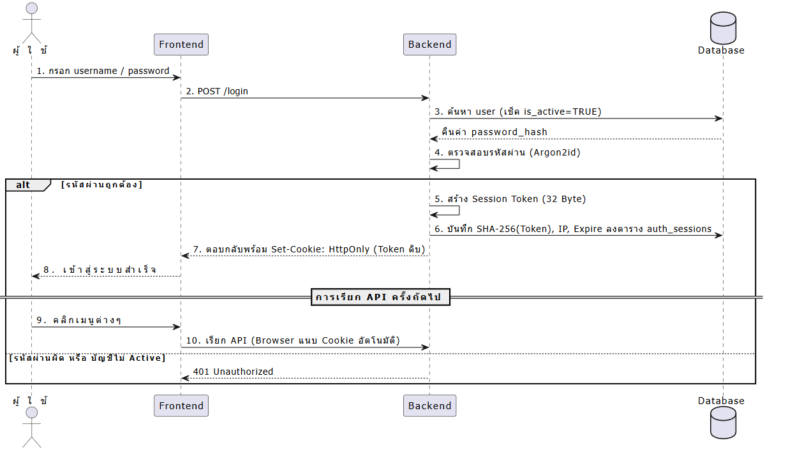
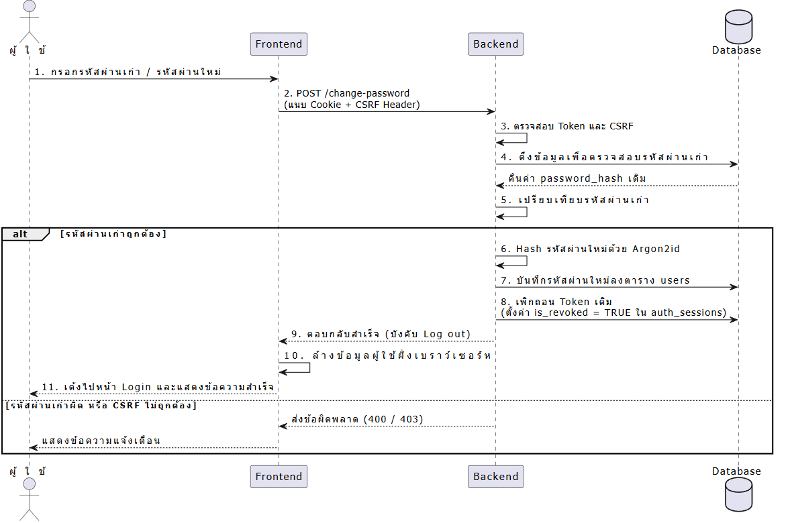
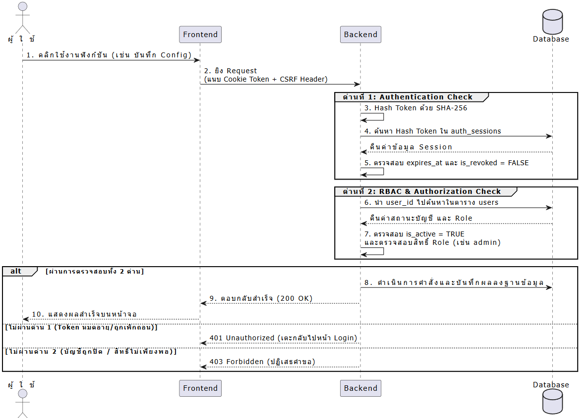
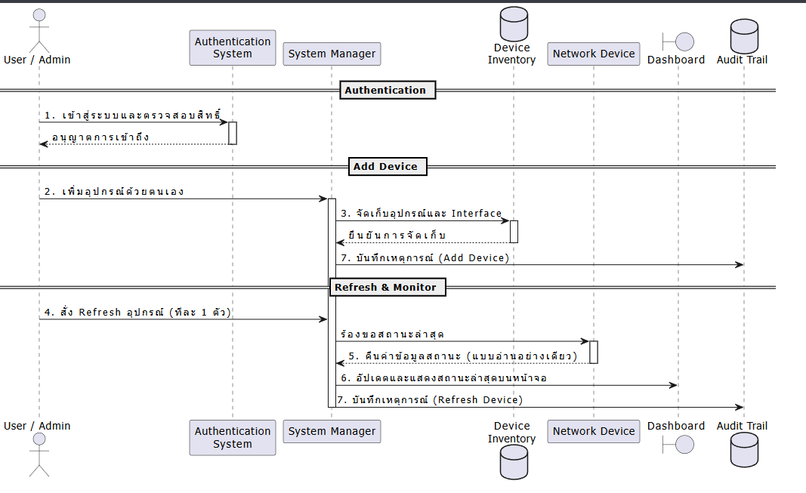
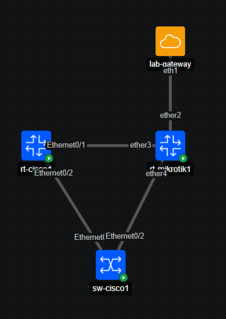
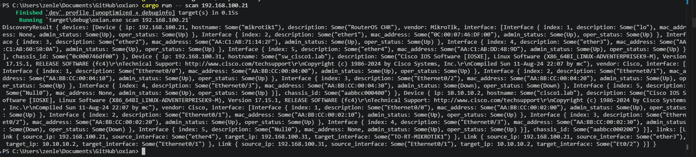
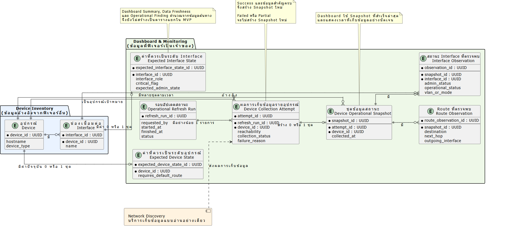
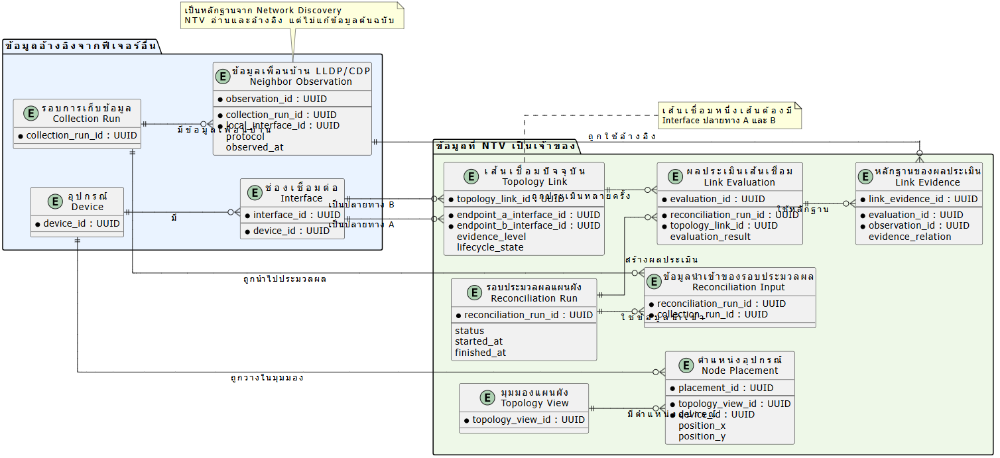

**รายงานความคืบหน้า รายวิชา Project 1 ครั้งที่ 2**  
**ภาควิชาวิศวกรรมคอมพิวเตอร์ คณะวิศวกรรมศาสตร์**  
**สถาบันเทคโนโลยีพระจอมเกล้าเจ้าคุณทหารลาดกระบัง**

1. หัวข้อโครงงาน (ภาษาอังกฤษ)	:      Application for network management and configuration automation (1)	    
2. การดำเนินการมีความคืบหน้า	:              20	%. (ประเมินจากทั้งรายวิชา Project 1 และ Project 2\)  
3. รายงานความคืบหน้าระหว่าง	: วันที่        15 สิงหาคม 2569 	ถึง     27 สิงหาคม 2569 	  
4. สรุปความคืบหน้า (โครงงานประเภท Software Development)

| หัวข้อ | เปอร์เซ็นต์ความคืบหน้า (ครั้งที่) |  |  |  |  |
| ----- | :---: | ----- | ----- | ----- | ----- |
|  | **1** | **2** | **3** | **4** | **5** |
| 1\. ศึกษาทบทวนข้อกำหนดที่ควรมี และจำเป็นต้องมี | 50% | 65% |  |  |  |
| 2\. การออกแบบ UX/UI | 0% | 0% |  |  |  |
| 3\. การออกแบบ Use Case Diagram / Class Diagram / Sequence Diagram หรือ Diagram แบบอื่นๆ ที่อธิบายการทำงานของระบบ และโครงสร้างโปรแกรม | 30% | 40% |  |  |  |
| 4\. การออกแบบโครงสร้างของระบบ Software Architecture Diagram / System Architecture Diagram | 15% | 30% |  |  |  |
| 5\. ทำงานได้ตามขอกำหนด และ ทดสอบการทำงาน Unit Testing / Integration  Testing หรือ อื่นๆ ที่แสดงถึงการทำงานได้ตามขอกำหนด | 15% | 20% |  |  |  |
| 6\. การ Deploy และ Integrate ให้เป็นระบบที่ทำงานได้ตามข้อกำหนด | 5% | 5% |  |  |  |

5. รายละเอียดความคืบหน้า

**สรุปความคืบหน้าตั้งแต่รายงานครั้งที่ 1**

	ในรายงานความคืบหน้าครั้งที่ 1 กลุ่ม Network Management ได้กำหนดขอบเขตของ Authentication & RBAC, Audit Trail, Dashboard & Monitoring และ Network Topology Visualization ในระดับเบื้องต้น โดยระบุเป้าหมายของแต่ละฟีเจอร์ ข้อมูลที่ต้องใช้ และความสัมพันธ์กับ Device Inventory และ Network Discovery

	ในช่วงการรายงานครั้งที่ 2 งานในส่วนดังกล่าวมีความคืบหน้าหลักด้านการออกแบบระบบ โดยได้ขยายแนวคิดเบื้องต้นให้เป็นขอบเขตที่ชัดเจนขึ้น สำหรับใช้เป็นข้อตกลงก่อนเริ่มพัฒนาและรวมระบบ

	ในรอบรายงานนี้ ความคืบหน้าหลักอยู่ที่การจัดทำเอกสารออกแบบและเตรียมความพร้อมสำหรับการบูรณาการระบบ ได้แก่ การกำหนดขอบเขต ข้อมูลส่วนกลาง API Contract และเกณฑ์ทดสอบของแต่ละฟีเจอร์ โดยการพัฒนาและทดสอบแบบ Full-stack จะดำเนินการในขั้นตอนถัดไปหลังจากทีมยืนยันขอบเขต ผู้รับผิดชอบ และ Dependency ร่วมกันแล้ว 

**การแบ่งขอบเขตและความรับผิดชอบของทีม**

จากการแบ่งงานในกลุ่ม Network Management งานแบ่งออกเป็นสองกลุ่มหลัก ได้แก่

* Authentication & RBAC, Audit Trail, Dashboard & Monitoring และ Network Topology Visualization อยู่ในกลุ่มฟีเจอร์ที่นาย นภัทรรับผิดชอบด้านการศึกษาและออกแบบ  
* Manual Device Enrollment, Device Inventory Management และ Network Discovery อยู่ในความรับผิดชอบของกลุ่มฟีเจอร์ที่นาย ฉัตรนรินทร์รับผิดชอบด้านการศึกษาและออกแบบ

**การออกแบบฐานข้อมูลส่วนกลาง**	

หลังรายงานความคืบหน้าครั้งที่ 1 ทีมได้ลงรายละเอียดการออกแบบข้อมูลส่วนกลาง เพื่อให้แต่ละฟีเจอร์อ้างอิงข้อมูลชุดเดียวกัน ลดการสร้างตารางซ้ำ และทำให้สามารถพัฒนาส่วนต่าง ๆ แยกกันผ่าน Data Contract ได้

แนวทางการออกแบบกำหนดให้ฐานข้อมูล PostgreSQL เป็นแหล่งข้อมูลส่วนกลาง โดยแบ่งเจ้าของข้อมูลตามความรับผิดชอบของแต่ละฟีเจอร์ ดังนี้

| ข้อมูลส่วนกลาง | ฟีเจอร์เจ้าของข้อมูล | Feature ที่นำข้อมูลไปใช้ | สถานะ |
| :---- | :---- | :---- | :---- |
| users | Authenticatgion & RBAC | ทุกฟีเจอร์ที่ต้องตรวจผู้ใช้และสิทธิ์ | ออกแบบแล้ว |
| auth\_sessions | Authentication & RBAC | Authentication และ Protected API | ออกแบบแล้ว  |
| devices | Device Inventory | Dashboard,Network Topology Visualization  และ Configuration Automation | รอยืนยัน |
| interfaces | Device Inventory | Dashboard, Network Discovery และ NTV | รอยืนยัน |
| audit\_logs | Audit Trail | Dashboard และ ฟีเจอร์ที่สร้างเหตุการณ์ | ออกแบบและตรวจ Contract แล้ว |
| ข้อมูล Operational Snapshot | Dashboard & Monitoring หรือ Shared Collection | Dashboard | รอยืนยัน |
| ข้อมูล Collection Run และ Neighbor Observation | Network Discovery | Network Topology Visualization | รอยืนยัน |
| ข้อมูล Topology View และ Node Placement | Network Topology Visualization | Network Topology Visualization Page | รอยืนยัน |
| ข้อมูล Topology Reconciliation และ Current Link | Network Topology Visualization | Network Topology Visualization Page | รอยืนยัน |

**ความคืบหน้ารายฟีเจอร์**  
**Authentication & RBAC**  
Authentication & RBAC มีเป้าหมายให้ผู้ใช้เข้าสู่ระบบและเข้าถึงฟังก์ชันตามบทบาท โดยแบ่งผู้ใช้ออกเป็น Admin, Operator และ Viewer การตรวจสิทธิ์ต้องดำเนินการที่ Backend ทุกครั้ง   
**MVP (Minimum Viable Product) ของ Authentication & RBAC**  
ระบบจัดการผู้ใช้งานพื้นฐานที่เน้นความปลอดภัย สามารถควบคุมสิทธิ์ได้แม่นยำ และมีผลบังคับใช้ในทันที

- สถาปัตยกรรมการยืนยันตัวตน (Authentication)  
  - ใช้กลไก Opaque Server-side Session หมายความว่าตัว Token จะเป็นแค่ตัวอักษรสุ่มจาก CSPRNG 32 bytes ที่ไม่มีข้อมูลอะไรบอกเลยว่าใครเป็นเจ้าของ ซึ่งข้อมูลว่าตั๋วใบนี้เป็นของใคร และมีสิทธิ์อะไร จะถูกเก็บไว้ในสมุดจดที่ฝั่งเซิร์ฟเวอร์ (Database) เท่านั้น ผู้ใช้มีหน้าที่แค่ถือตั๋วใบนี้มายื่นให้เซิร์ฟเวอร์ดูทุกครั้งที่กดเมนูต่างๆ  
  - เหตุผล: เพื่อให้ระบบสามารถบังคับยกเลิก Session (Logout), ระงับบัญชี (Deactivate) หรือเปลี่ยนระดับสิทธิ์ ให้มีผลกับ Protected Request ถัดไป  
  - จัดเก็บ Token ฝั่งผู้ใช้ผ่าน HttpOnly Cookie เพื่อป้องกันสคริปต์อันตรายดึงข้อมูล (XSS)  
- มาตรฐานความปลอดภัย  
  - Password Hashing ใช้ Algorithm อย่าง Argon2id สำหรับรหัสผ่านทั้งหมด  
  - Token Security การเก็บ Session Token ที่สุ่มสร้างขึ้น(32 Byte) ถูกนำไปเข้ากระบวนการ Hash (SHA-256) ก่อนบันทึกลงฐานข้อมูล  
  - CSRF Protection บังคับใช้กลไกป้องกัน การโจมตีแบบ CSRF สำหรับทุกคำสั่งที่มีการแก้ไข   
- การควบคุมสิทธิ์ (Role-Based Access Control)  
  - Admin ผู้ดูแลระบบ (จัดการความปลอดภัยและบัญชีผู้ใช้อื่น)  
  - Operator: วิศวกรหน้างาน (จัดการอุปกรณ์ และวางแผนการกำหนดค่าเครือข่าย)  
  - Viewer: ผู้เยี่ยมชม (ดูข้อมูลหน้า Dashboard , Device , Network Topology)  
- ขอบเขตฟังก์ชันการจัดการผู้ใช้งาน (User Management Scope)  
  - Admin สามารถ: สร้างผู้ใช้ใหม่, ระงับบัญชี (Deactivate), และเปลี่ยน Role ของผู้ใช้อื่นได้  
  - ผู้ใช้งานทั่วไป สามารถ: เปลี่ยนรหัสผ่านของตนเองได้  
  - สิ่งที่คาดว่าตัดออกจาก MVP ( ระบบสมัครสมาชิกด้วยตนเอง, ฟังก์ชันลืมรหัสผ่าน/ส่งอีเมล, และการให้ Admin รีเซ็ตรหัสผ่านแทนผู้ใช้อื่น)

**การออกแบบ Database Schema  ของ Authentication & RBAC**  
Authentication & RBAC สามารถควบคุมสิทธิ์และทำงานแบบมีผลบังคับใช้ทันที ตามที่กล่าวมา จึงได้ออกแบบโครงสร้างฐานข้อมูลหลักเพื่อรองรับการทำงาน 2 ส่วน ดังนี้

| ตาราง users  |  |  |
| :---- | :---- | :---- |
| **Field** | **Type** | **คำอธิบาย** |
| id | UUID | Primary Key แบบรหัสสุ่ม เพื่อหลีกเลี่ยงการใช้ตัวเลขเรียงลำดับ ป้องกันผู้ไม่หวังดีเดาสุ่มรหัส |
| username | VARCHAR | กำหนด UNIQUE และใช้คำสั่ง CHECK บังคับให้เป็นตัวพิมพ์เล็กเสมอ เพื่อป้องกันปัญหาความสับสนตอนเข้าสู่ระบบ |
| email | VARCHAR | กำหนดให้เป็นข้อมูลทางเลือก |
| password\_hash | VARCHAR | จัดเก็บเฉพาะรหัสผ่านที่ถูกเข้ารหัส Argon2id |
| role | VARCHAR | เก็บระดับสิทธิ์การใช้งาน (admin, operator, viewer) สำหรับระบบ RBAC |
| is\_active | BOOLEAN | สถานะบัญชี หากถูกระงับจะเปลี่ยนจาก TRUE เป็น FALSE |
| created\_at | TIMESTAMP WITH TIME ZONE | เก็บวันเวลาที่สร้างข้อมูลล่าสุด |
| updated\_at | TIMESTAMP WITH TIME ZONE | เก็บวันเวลาที่แก้ไขข้อมูลล่าสุด |

| ตาราง auth\_sessions |  |  |
| :---- | :---- | :---- |
| **Field** | **Type** | **คำอธิบาย** |
| id | UUID | Primary Key สำหรับอ้างอิงภายใน Database  |
| session\_token\_hash | CHAR (64) | เก็บค่าToken ที่ผ่านการ Hash (SHA-256) มาแล้ว เพื่อความปลอดภัย |
| user\_id | UUID | เป็น Foreign Key ที่เชื่อมโยงกลับไปยังตาราง users |
| expires\_at | TIMESTAMP WITH TIME ZONE | กำหนดเวลาหมดอายุของ Token |
| is\_revoked | BOOLEAN | สถานะการถูกเพิกถอนสิทธิ์ หากถูกระงับ (ตั้งเป็น TRUE) เซิร์ฟเวอร์จะปฎิเสธผู้ใช้ให้ออกจากระบบทันที |
| ip\_address | VARCHAR | เก็บบันทึก IP ที่ล็อกอิน เพื่อใช้ตรวจสอบย้อนหลัง (Audit) หาความผิดปกติในการเข้าใช้งาน |
| user\_agent | TEXT | เก็บบันทึกอุปกรณ์ ที่ล็อกอิน เพื่อใช้ตรวจสอบย้อนหลัง (Audit) หาความผิดปกติในการเข้าใช้งาน |

**Flow การทำงาน**  
**กระบวนการเข้าสู่ระบบ (Login Flow)**  
เป็น กระบวนการตรวจสอบสิทธิ์และสร้าง Session แบบ Opaque  

1. \[Frontend\] ผู้ใช้กรอก username และ password แล้วกดเข้าสู่ระบบ  
2. \[Backend\] เซิร์ฟเวอร์รับข้อมูล และดำเนินการตรวจสอบ:  
3. ค้นหา username ในตาราง users และตรวจสอบสถานะบัญชี (is\_active ต้องเป็น TRUE)  
4. นำ password ที่ผู้ใช้พิมพ์มา ตรวจสอบความถูกต้องกับ password\_hash ในฐานข้อมูลด้วยอัลกอริทึม Argon2id  
5. \[Backend\] หากรหัสผ่านถูกต้อง เซิร์ฟเวอร์จะสร้าง Session Token (สุ่มตัวอักษร 32 Byte)  
6. \[Backend\] นำ Token ที่สุ่มได้ไปเข้ากระบวนการ Hash (SHA-256) แล้วบันทึกค่า Hash ลงในตาราง auth\_sessions พร้อมกับเก็บข้อมูล IP Address และวันเวลาที่หมดอายุ  
7. \[Backend \-\> Frontend\] เซิร์ฟเวอร์แนบ Token "ตัวดิบ" กลับไปหาเบราว์เซอร์ของผู้ใช้ ในรูปแบบของ HttpOnly Cookie  
8. \[Frontend\] เบราว์เซอร์จัดเก็บ Cookie ไว้ (โดยที่ JavaScript เข้าถึงไม่ได้) และจะแนบ Cookie นี้ส่งกลับไปหาเซิร์ฟเวอร์อัตโนมัติในการเรียกใช้งานเมนูอื่นๆ ถัดไป

**กระบวนการเปลี่ยนรหัสผ่านของตนเอง (Self-change Password Flow)**  
กระบวนการนี้ต้องการความปลอดภัย จึงต้องมีการตรวจสอบทั้งรหัสผ่านเก่าและป้องกันการโจมตีแบบ CSRF ควบคู่กัน  

1. \[Frontend\] ผู้ใช้กรอก รหัสผ่านเก่า (Old Password) และ รหัสผ่านใหม่ (New Password)  
2. \[Frontend\] ระบบแนบ Cookie (Token) และเพิ่ม Header CSRF Protection ส่งไปให้เซิร์ฟเวอร์  
3. \[Backend\] เซิร์ฟเวอร์ตรวจสอบ Cookie Token และ ตรวจ Exact Origin/Referer ,Header ว่ามาจากผู้ใช้งานจริง (ตรวจสอบ CSRF)  
4. \[Backend\] เซิร์ฟเวอร์นำ รหัสผ่านเก่า ไปตรวจสอบกับฐานข้อมูล ว่าตรงกับของเดิมหรือไม่  
5. \[Backend\] หากรหัสผ่านเก่าถูกต้อง เซิร์ฟเวอร์จะนำ รหัสผ่านใหม่ ไปเข้ารหัส (Hash) ด้วย Argon2id และบันทึกทับลงในตาราง users  
6. \[Backend\] (กลไกความปลอดภัย) เซิร์ฟเวอร์จะเปลี่ยนสถานะตั๋ว (Token) เดิมให้ถูกเพิกถอน (is\_revoked \= TRUE) ในตาราง auth\_sessions เพื่อบังคับให้ผู้ใช้งานต้องล็อกอินใหม่ด้วยรหัสผ่านใหม่ทันที  
7. \[Frontend\] ล้างข้อมูลผู้ใช้ เด้งกลับไปยังหน้าต่าง Login พร้อมแสดงข้อความ "เปลี่ยนรหัสผ่านสำเร็จ กรุณาเข้าสู่ระบบอีกครั้ง

**กระบวนการตรวจสอบสิทธิ์การใช้งาน (Protected Request & RBAC Flow)**  
กระบวนการนี้จะเกิดขึ้นทุกครั้งที่ผู้ใช้งานคลิกเมนู หรือสั่งการใดๆ ภายในระบบ (เช่น การกดบันทึก Config อุปกรณ์ หรือ การดึงข้อมูล Dashboard) เพื่อป้องกันไม่ให้ผู้ที่ไม่มีสิทธิ์แอบเข้ามากดได้ โดยมีขั้นตอนดังนี้  

1. \[Frontend\] ผู้ใช้คลิกใช้งานฟังก์ชันในระบบ (เช่น สั่งบันทึก Config)  
2. \[Frontend \-\> Backend\] เบราว์เซอร์จะยิงคำขอ (Request) ไปหาเซิร์ฟเวอร์ โดยจะ แนบ HttpOnly Cookie (Session Token) ไปด้วยโดยอัตโนมัติ และแนบ Header CSRF Protection (สำหรับคำสั่งที่มีการแก้ไขข้อมูล)  
3. \[Backend\] การตรวจสอบด่านที่ 1 (Authentication Check):  
4. เซิร์ฟเวอร์นำ Cookie Token ที่ได้รับ มาผ่านกระบวนการ Hash (SHA-256)  
5. นำค่า Hash ไปค้นหาในตาราง auth\_sessions ว่ามีตัวตนจริงหรือไม่  
6. ตรวจสอบว่าตั๋วใบนี้ ยังไม่หมดอายุ (expires\_at) และ ยังไม่ถูกระงับ (is\_revoked \= FALSE)  
7. (หากตั๋วหมดอายุหรือถูกเพิกถอน ระบบจะเตะผู้ใช้กลับไปหน้า Login ทันที)  
8. \[Backend\] การตรวจสอบด่านที่ 2 (RBAC & Authorization Check):  
9. เซิร์ฟเวอร์นำ user\_id จากด่านแรก ไปตรวจสอบสถานะในตาราง users  
10. ตรวจสอบว่าบัญชีนี้ ยังเปิดใช้งานอยู่ (is\_active \= TRUE) (เพื่อรองรับกรณีแอดมินเพิ่งกด Deactivate บัญชีนี้เมื่อ 1 วินาทีที่แล้ว)  
11. ตรวจสอบ ระดับสิทธิ์ (role) ว่ามีสิทธิ์ทำคำสั่งนี้หรือไม่ (เช่น คำสั่งบันทึก Config ต้องเป็น admin หรือ operator เท่านั้น หากสิทธิ์เป็นเพียง viewer ระบบจะปฏิเสธคำขอทันที)  
12. \[Backend\] เมื่อผ่านการตรวจสอบอย่างเข้มงวดทั้ง 2 ด่าน (ใช้หลักการ Default Deny หรือปฏิเสธไว้ก่อนเสมอ) ระบบจึงจะอนุญาตให้ฟังก์ชันนั้นทำงาน และบันทึกผลลงฐานข้อมูล  
13. \[Frontend\] รับผลลัพธ์จากเซิร์ฟเวอร์ และแสดงผลสำเร็จหน้าจอ

**ข้อกำหนดการส่งข้อมูลให้ Audit Trail**  
เนื่องจากระบบ Authentication ถือเป็นด่านหน้าด้านความปลอดภัยของโปรเจกต์ จึงได้ออกแบบข้อกำหนด (Contract) สำหรับการส่งประวัติการใช้งานไปบันทึกที่ระบบ Audit Trail กลาง เพื่อสร้างมาตรฐานข้อมูลและป้องกันการละเมิด Data Privacy โดยแบ่งการทำงานเป็น 3 ส่วนหลัก ดังนี้

**โครงสร้างการส่งข้อมูลพื้นฐาน (Caller Function Signature)**  
การบันทึกประวัติทุกครั้ง มี ฟังก์ชันตัวกลางชื่อ record\_auth\_event() สำหรับส่งประวัติการใช้งานไปบันทึกที่ระบบ Audit Trail กลาง โค้ดส่วน Authentication จะถูกบังคับให้ส่งพารามิเตอร์พื้นฐาน 4 ส่วน ได้แก่

| record\_auth\_event( action: str, \-- action: ชื่อเหตุการณ์ที่เกิดขึ้น resource\_type: str, – ประเภทของเป้าหมายที่ถูกกระทำ (เช่น ระบบ auth, หรือ บัญชีผู้ใช้)  resource\_id: UUID|null, \-- รหัสประจำตัวของเป้าหมายที่ถูกกระทำ ,ID ของเป้าหมาย (nullable) actor\_id: UUID|null – รหัสประจำตัวของผู้ที่ลงมือกระทำ, ID ของผู้กระทำที่ยืนยันตัวตนแล้ว (nullable) ) |
| :---- |

กฎการระบุตัวตน: ระบบกำหนดกฎว่า actor\_id ต้องเป็นรหัสของผู้ใช้ที่ ยืนยันตัวตนสำเร็จแล้ว เท่านั้น หากเกิดการล็อกอินล้มเหลว (เช่น ใส่รหัสผ่านผิด) ระบบจะบันทึกตัวผู้กระทำเป็นค่าว่าง (null) เนื่องจากยังไม่สามารถพิสูจน์ได้ว่าผู้กระทำคือใคร แต่ระบบจะไปบันทึกเป้าหมายที่ถูกโจมตีลงใน resource\_id แทน เพื่อความถูกต้องของ Log

**ตัวอย่าง event สำคัญ**

| เหตุการณ์ | resource\_type / resource\_id | actor\_id | เหตุผล |
| :---- | :---- | :---- | :---- |
| Login สำเร็จ | auth / null | ID ของผู้ใช้ | ยืนยันตัวตนแล้ว |
| Login ด้วยบัญชีที่ไม่มี | auth / null | null | ไม่รู้ใครพยายามเข้า |
| มีบัญชีจริง แต่ password ผิด | user / ID ของบัญชีนั้น | null | รู้เป้าหมาย |
| Logout | auth / null | ID ผู้ใช้ปัจจุบัน | ผู้ใช้ยืนยันตัวแล้ว |
| Admin ปิดบัญชี Operator | user / ID Operator | ID Admin | รู้ทั้งผู้กระทำและเป้าหมาย |

**การควบคุมหมวดหมู่เหตุการณ์อัตโนมัติ (Canonical Mapping & DTO Translation)**

เพื่อป้องกันความผิดพลาดจากการเขียนโค้ด ฟังก์ชันใน record\_auth\_event() จึงถูกออกแบบให้ทำหน้าที่เป็นเสมือน Registry Map ควบคุมความถูกต้อง

- ลดภาระการเขียนโค้ด เมื่อมีการส่งชื่อเหตุการณ์เข้ามา (เช่น user.login\_failed) ฟังก์ชันจะทำการจับคู่ และเติมข้อมูลสถานะความสำเร็จ (result) รวมถึงประเภทของข้อผิดพลาด (safe\_error\_category) ให้โดยอัตโนมัติตามตารางมาตรฐานที่ตกลงกันไว้ เช่น

| user.login\_failed → result \= failure → safe\_error\_category \= authentication\_error → created\_at \= เวลาปัจจุบัน |
| :---- |

- ระบบป้องกันข้อมูลแปลกปลอม ระบบจะอนุญาตให้บันทึกเฉพาะเหตุการณ์ที่มีในตารางสัญญาเท่านั้น หากมีการส่งรหัสเหตุการณ์ที่ผิดแปลกเข้ามา ระบบจะปฏิเสธการทำงาน (Throw Exception) ทันทีเพื่อป้องกันข้อมูลขยะเข้าสู่ Database

**Demo ที่เสนอ**

1. Login ด้วยบัญชี demo\_operator  
2. แสดงว่า Operator เข้าถึงเฉพาะหน้าหรือ API ที่ได้รับอนุญาต  
3. Admin เปลี่ยน Role/Deactivate แล้ว Session เก่าของ Operator ได้ 401  
4. แสดงว่า Session เดิมของ Operator ถูกปฏิเสธทันที  
5. ทดลองเปลี่ยนรหัสผ่านและตรวจว่า Session เดิมไม่สามารถนำกลับมาใช้ได้  
6. Viewer เรียก API ที่แก้ไขข้อมูลแล้วได้ 403

#### **Dependency**

* Database Migration สำหรับ users และ auth\_sessions  
* Audit Writer และ Event Catalog กลาง  
* Frontend Route Guard  
* Environment Variable สำหรับ Secret และบัญชีทดสอบ  
* การยืนยันว่าใครเป็นเจ้าของ Auth Backend, Frontend และ Migration

#### **แผนทดสอบ**

ทดสอบ Login สำเร็จและล้มเหลว การหมดอายุและเพิกถอน Session การเปลี่ยน Role การระงับบัญชี การปฏิเสธสิทธิ์ การป้องกันไม่ให้ข้อมูลลับปรากฏใน Response และการสร้างบัญชีทดสอบเฉพาะ Development/Test Environment

**Audit Trail**

Audit Trail เป็นศูนย์กลางสำหรับเก็บประวัติการกระทำสำคัญของระบบ เพื่อให้ทีมสามารถตรวจสอบย้อนหลังได้ว่าใครทำอะไร กับข้อมูลใด และเกิดผลสำเร็จหรือล้มเหลวเมื่อใด

ระบบนี้ช่วยสนับสนุนความปลอดภัย ความโปร่งใส และการวิเคราะห์ปัญหาภายหลัง โดยเฉพาะเหตุการณ์จาก Authentication, Device Inventory, Config Generation, CIS Benchmark และ Settings

**MVP (Minimum Viable Product) ของ Audit Trail** 

- การจัดการข้อมูลแบบรวมศูนย์ (Centralized Storage) ระบบจะใช้ตาราง audit\_logs ในฐานข้อมูลกลาง เป็นตารางแกนหลักเพียงตารางเดียวในการจัดเก็บเหตุการณ์ทั้งหมด  
- นโยบายความมั่นคงปลอดภัยและข้อมูลส่วนบุคคล (Security & Data Privacy)   
  - นโยบายการบันทึกข้อมูลทางเดียว (Append-Only Policy) ระบบไม่อนุญาตให้มีช่องทาง API สำหรับการแก้ไข (Update) หรือลบ (Delete) ประวัติการใช้งานที่ถูกบันทึกไปแล้ว เพื่อป้องกันการทุจริตและการเปลี่ยนแปลงหลักฐานทางระบบ  
  - การปกปิดข้อมูลความลับตั้งแต่ต้นทาง (Redaction at Source) ข้อมูลที่มีความอ่อนไหว เช่น รหัสผ่าน (Password), โทเค็น (Token), และข้อมูลส่วนบุคคล (PII) จะต้องเข้าสู่กระบวนการคัดกรองและปกปิด (Masking/Redaction) ให้เรียบร้อยตั้งแต่ระดับ Server-side ก่อนที่จะถูกเขียนลงฐานข้อมูลเสมอ  
- ความสมบูรณ์ของข้อมูล (Data Integrity)  
  - การผูกธุรกรรม (Transaction Bounding)  กระบวนการบันทึก Audit Log จะต้องทำงานอยู่ภายใต้ฐานข้อมูลธุรกรรม (Database Transaction) เดียวกันกับการกระทำหลัก (Business Action) เสมอ หากการกระทำหลักเกิดข้อผิดพลาดและถูกยกเลิก (Rollback) ข้อมูลการบันทึกประวัติจะต้องถูกยกเลิกไปพร้อมกัน เพื่อป้องกันความขัดแย้งของข้อมูล (Data Inconsistency)  
- การเข้าถึงและการให้บริการข้อมูล (Data Access & API)  
  - Full Audit API: ระบบเตรียม API สำหรับการเรียกดูข้อมูลประวัติการใช้งานทั้งหมด โดยรองรับการกรองข้อมูล (Filtering) และการแบ่งหน้าแสดงผล (Cursor-based Pagination) ซึ่ง API ส่วนนี้จะถูกจำกัดสิทธิ์ให้เรียกใช้งานได้เฉพาะผู้ใช้งานระดับผู้ดูแลระบบ (Admin) เท่านั้น  
- การทำงานร่วมกับโมดูลอื่น (Producer Integration) ระบบ Audit Trail ถูกออกแบบให้สามารถรองรับการรับข้อมูลเหตุการณ์ (Event Logging) จากฟีเจอร์หลัก อย่างเช่น  
  - ระบบยืนยันตัวตนและการเข้าถึง (Authentication & RBAC)  
  - ระบบจัดการอุปกรณ์ (Device Inventory)  
  - ระบบสร้างชุดคำสั่ง (Configuration Generation)  
  - ระบบตรวจสอบมาตรฐานความปลอดภัย (CIS Benchmark)  
  - ระบบจัดการการตั้งค่า (System Settings)

**การออกแบบ Database Schema  ของ Audit Trail**

| ตาราง audit\_logs |  |  |
| :---- | :---- | :---- |
| **Field** | **Type** | **คำอธิบาย** |
| id | UUID | Primary Key รหัสของบันทึกเหตุการณ์ |
| user\_id	 | UUID, Nullable | Foreign Key , รหัสของผู้ใช้งานผู้กระทำเหตุการณ์ (Actor) อนุญาตให้เป็น NULL ได้ในกรณีที่เป็นการทำงานของระบบ (System Action) หรือการล็อกอินที่ไม่พบบัญชีในระบบ |
| action | VARCHAR | ชื่อเหตุการณ์ที่เกิดขึ้น โดยใช้รูปแบบ Canonical Dotted Event Format (เช่น user.login\_success, device.create) |
| resource\_type | VARCHAR | ประเภทของทรัพยากรเป้าหมายที่ถูกกระทำ (เช่น device, config, scan, user, settings, auth) |
| resource\_id | UUID | รหัสประจำตัวของทรัพยากรเป้าหมาย อนุญาตให้เป็น NULL ได้หากการกระทำนั้นไม่มีเป้าหมายที่เฉพาะเจาะจง (เช่น การดัดแปลง Global Settings) |
| result | VARCHAR | ผลลัพธ์ของการกระทำ บังคับให้รับค่าเฉพาะ 'success' (สำเร็จ) หรือ 'failure' (ล้มเหลว) |
| safe\_error\_category | VARCHAR | หมวดหมู่ของข้อผิดพลาด (ในกรณีที่ result เป็น failure) โดยจำกัดค่าตาม Allowlist ที่ระบบอนุญาตเท่านั้น เช่น authentication\_error |
| description | TEXT | รายละเอียดเพิ่มเติมของเหตุการณ์ โดยข้อมูลในฟิลด์นี้จะต้องผ่านกระบวนการลบข้อมูลความลับ (Data Redaction) ก่อนบันทึกเสมอ |
| created\_at | TIMESTAMP WITH TIME ZONE | วันและเวลาที่เกิดเหตุการณ์ (Timestamp) สำหรับใช้เป็นตัวอ้างอิงในการแสดงผลและการเรียงลำดับ |

**การกำหนดสิทธิ์ความเป็นเจ้าของข้อมูล (Data Ownership)** 

- สิทธิ์ความเป็นเจ้าของโครงสร้างข้อมูล (Schema Owner) โครงสร้างตาราง audit\_logs จะต้องอ้างอิงตามฐานข้อมูลกลาง  ไม่อนุญาตให้โมดูลอื่นสร้าง Schema หรือตารางสำหรับเก็บ Audit แยก  
- สิทธิ์ความเป็นเจ้าของการเขียนข้อมูล (Write Owner) โมดูล Audit Trail เป็นผู้รับผิดชอบฟังก์ชันภายใน (Internal Writer) สำหรับการบันทึกข้อมูลแต่เพียงผู้เดียว โดยโมดูลอื่นจะต้องส่งข้อมูลผ่านฟังก์ชันที่กำหนดเท่านั้น  
- สิทธิ์ความเป็นเจ้าของการอ่านข้อมูล (Read Owner) โมดูล Audit Trail รับผิดชอบ API สำหรับดึงข้อมูลแบบเต็ม (Full Audit API) ในขณะที่โมดูล Dashboard & Monitoring (D\&M) ทำหน้าที่เป็นดึงข้อมูลแบบอ่านอย่างเดียว (Read-only Consumer) เพื่อนำไปแสดงผลในส่วน Recent Activity เท่านั้น

**แค็ตตาล็อกเหตุการณ์มาตรฐาน (Canonical Event Catalog)**

รูปแบบของเหตุการณ์ (Action) ภายในระบบจะต้องยึดมาตรฐาน Canonical Dotted Event Format

- นิยาม ชื่อเหตุการณ์จะต้องประกอบด้วยคำที่คั่นด้วยเครื่องหมายจุด (Dotted Event) เช่น user.login\_success หรือ device.create  
- ความอิสระของข้อมูล (Data Decoupling) คำนำหน้า (Segment แรก) ของชื่อเหตุการณ์ ไม่จำเป็นต้องสอดคล้องกับฟิลด์ resource\_type เสมอไป เนื่องจาก resource\_type จะถูกประเมินและจับคู่โดยระบบขึ้นทะเบียนเหตุการณ์กลาง (Global Action Registry) ในภายหลัง

**การขึ้นทะเบียนเหตุการณ์กลางและการตรวจสอบความถูกต้อง (Global Action Registry and Writer Validation)**

ระบบมีกลไกตรวจสอบ (Validate) พารามิเตอร์ที่ได้รับเทียบกับ ตารางขึ้นทะเบียนเหตุการณ์กลาง (Global Action Registry)  ก่อนทำการบันทึกลงฐานข้อมูลเสมอ เพื่อป้องกันการบันทึกข้อมูลที่ไม่สอดคล้องกัน

 การจับคู่เหตุการณ์สำหรับระบบยืนยันตัวตน (Authentication Mapping)

| เหตุการณ์  (Canonical Action) | ประเภททรัพยากร (resource\_type) |  ผลลัพธ์  (result) | หมวดหมู่ข้อผิดพลาด | กฎการผูกความสัมพันธ์ (Binding Rule) |
| :---- | :---- | :---- | :---- | :---- |
| user.login\_success | auth | success | null | ผู้กระทำ \= ผู้ใช้ที่เข้าสู่ระบบสำเร็จ, เป้าหมาย \= null |
| user.login\_failed | auth | failure | authentication\_error | ผู้กระทำ \= null, เป้าหมาย \= null |
| user.login\_failed | user | failure | authentication\_error | ผู้กระทำ \= null, เป้าหมาย \= บัญชีที่ถูกพยายามเข้าใช้งาน |
| user.logout | auth | success | null | ผู้กระทำ \= ผู้ใช้ปัจจุบันที่ทำการออกจากระบบ |
| user.password\_changed | user | success | null | ผู้กระทำและเป้าหมาย \= ผู้ใช้คนเดียวกัน |
| user.created / updated / deactivated | user | success | null | ผู้กระทำ \= ผู้ดูแลระบบ (Admin), เป้าหมาย \= ผู้ใช้ที่ถูกจัดการ |
| auth.permission\_denied | auth | failure | authorization\_error | ผู้กระทำ \= ผู้ใช้ที่ถูกปฏิเสธสิทธิ์, เป้าหมาย \= UUID ของระบบที่ถูกเรียก |

**การจับคู่เหตุการณ์สำหรับระบบการทำงานหลัก**

| เหตุการณ์  (Canonical Action) | ประเภททรัพยากร (resource\_type) |  ผลลัพธ์  (result) | กฎการผูกความสัมพันธ์ (Binding Rule) |
| :---- | :---- | :---- | :---- |
| device.create / update / delete | device | success | ผู้กระทำ \= ผู้ใช้ปัจจุบัน, เป้าหมาย \= ID ของอุปกรณ์ |
| config.generate | config | success | ผู้กระทำ \= ผู้ใช้ปัจจุบัน, เป้าหมาย \= ID ของประวัติการสร้างชุดคำสั่ง |
| scan.run | device | success | ผู้กระทำ \= ผู้ใช้ปัจจุบัน, เป้าหมาย \= ID ของอุปกรณ์ที่ถูกสแกน |
| scan.override | scan | success | ผู้กระทำ \= ผู้ดูแลระบบ (Admin), เป้าหมาย \= ID ของผลการสแกน |
| settings.update | settings | success | ผู้กระทำ \= ผู้ดูแลระบบ (Admin), เป้าหมาย \= null เสมอ (Global Setting) |

**หมวดหมู่ข้อผิดพลาดที่อนุญาตและกฎการบังคับใช้ (Safe Error Category Allowlist & Enforcement)**

**หมวดหมู่ข้อผิดพลาดที่ระบบอนุญาต (Allowlist)** 

ระบบอนุญาตให้บันทึกหมวดหมู่ข้อผิดพลาดลงในฟิลด์ safe\_error\_category ได้เฉพาะค่าดังต่อไปนี้ 

- authentication\_error, authorization\_error, และ null

**กฎการบังคับใช้ (Enforcement Rules)**

1. **การปฏิเสธคำขอ (Rejection)** หากระบบได้รับเหตุการณ์ที่ไม่อยู่ในตารางทะเบียนกลาง หรือมีโครงสร้างความสัมพันธ์ (resource\_type, result, safe\_error\_category) ไม่ตรงตามเงื่อนไข ระบบจะปฏิเสธการบันทึกข้อมูลนั้นทันที  
2. **การป้องกันการข้ามขั้นตอน (Bypass Prevention)** ไม่อนุญาตให้โมดูลใดๆ กำหนด Error Category ขึ้นเองอย่างอิสระ  
3. **การประมวลผลข้อมูลความลับ (Data Redaction)** ระบบจะต้องผ่านกระบวนการคัดกรองเพื่อลบข้อมูลความลับก่อนเขียนลงฐานข้อมูลเสมอ  
4. **นโยบายข้อผิดพลาดจากการตรวจสอบข้อมูล (Validation Error Policy)** ในระยะแรก ระบบจะไม่เก็บบันทึกประวัติสำหรับข้อผิดพลาดประเภท HTTP 400/422 ทั่วไป (เช่น การกรอกฟอร์มผิด) เพื่อลดปริมาณข้อมูลขยะ (Log Noise) และป้องกันความเสี่ยงที่ข้อมูลดิบจากผู้ใช้งานจะรั่วไหลเข้าสู่ระบบ

การประมวลผลข้อมูลความลับ (Data Redaction): ระบบจะต้องผ่านกระบวนการคัดกรองเพื่อลบข้อมูลความลับก่อนเขียนลงฐานข้อมูลเสมอ

นโยบายข้อผิดพลาดจากการตรวจสอบข้อมูล (Validation Error Policy): ในระยะ P1 ระบบจะไม่เก็บบันทึกประวัติสำหรับข้อผิดพลาดประเภท HTTP 400/422 ทั่วไป (เช่น การกรอกฟอร์มผิด) เพื่อลดปริมาณข้อมูลขยะ (Log Noise) และป้องกันความเสี่ยงที่ข้อมูลดิบจากผู้ใช้งานจะรั่วไหลเข้าสู่ระบบ

#### **Demo ที่เสนอ**

1. ทดลอง Login สำเร็จและล้มเหลว ตรวจว่ามี Audit Event ตาม Canonical Action หรือไม่  
2. ให้ Viewer เรียก API ที่ไม่มีสิทธิ์และตรวจว่าเกิด auth.permission\_denied  
3. ให้ Admin เปิด Full Audit Trail และสาธิตให้เห็นว่า Operator และ Viewer ถูกปฏิเสธการเข้าถึง API นี้  
4. ตรวจสอบในฐานข้อมูลตรง (Raw Database) ว่าต้องไม่มี Password, Token หรือ Credential Secret ปะปนอยู่

#### Dependency

* Central Migration สำหรับการสร้างตาราง audit\_logs  
* Authentication ในฐานะผู้สร้างเหตุการณ์ (Event Producer)  
* Business Feature อื่นๆ ที่ต้องเรียกใช้ Audit Writer  
* Dashboard ในฐานะผู้บริโภคข้อมูล (Read-only Consumer)  
* การยืนยันข้อตกลงเจ้าของ Audit Writer และ Audit API

#### สิ่งที่เสนอให้ย้ายไป P2

* SIEM Integration  
* WORM หรือ Cryptographic Tamper-proof Storage  
* Advanced PDF/CSV Export  
* Alerting Engine  
* Automated Retention  
* Permission ระดับรายฟิลด์

#### แผนทดสอบ

* ทดสอบ Transaction Rollback และ Append-only Policy  
* ทดสอบการจำกัดสิทธิ์ Admin-only Access และการทำ Redaction ทั้งใน API และฐานข้อมูล  
* ทดสอบ Anonymous Failed Login และ Permission-denied Event  
* ทดสอบ Cursor Pagination โดยต้องไม่มีข้อมูลซ้ำหรือถูกข้าม

**ปัญหาที่เกิดขึ้นและแนวทางการแก้ไขของ Audit และ Authentication**

- ขอบเขตและเจ้าของข้อมูลระหว่างฟีเจอร์ยังไม่ชัดเจนในบางส่วน  
  ข้อมูล Device, Interface, Collection Result, Operational Snapshot และ Neighbor Observation ถูกใช้งานร่วมกันหลายฟีเจอร์ จึงมีความเสี่ยงต่อการออกแบบตารางซ้ำหรือใช้ข้อมูลไม่ตรงกัน  
  แนวทางการแก้ไข กำหนด Central Schema, Data Ownership และ Data Contract ให้แต่ละฟีเจอร์อ้างอิงข้อมูลจากเจ้าของข้อมูลเพียงชุดเดียว และจัดทำ Mock Data Contract ก่อนเริ่มเชื่อมระบบจริง  
- รูปแบบ Authentication เดิมมีความซับซ้อนเกินความจำเป็น  
  แนวคิด Stateful JWT เดิมยังต้องตรวจสอบตาราง auth\_sessions และข้อมูลผู้ใช้ทุก Protected Request อยู่แล้ว จึงไม่ได้ประโยชน์จากความเป็น Stateless อย่างชัดเจน  
  แนวทางการแก้ไข ปรับเป็น Database-backed Opaque Server-side Session ผ่าน HttpOnly Cookie เพื่อให้ Logout, Deactivate และการเปลี่ยน Role มีผลกับ Protected Request ถัดไปได้ทันที และลดความซับซ้อนของ Token  
- Audit Log มีความเสี่ยงต่อข้อมูลลับและข้อมูลไม่เป็นมาตรฐาน  
  หากแต่ละฟีเจอร์บันทึก Log ด้วยรูปแบบของตนเอง อาจเกิดข้อมูลซ้ำ ข้อมูลไม่สอดคล้อง หรือมี Password, Token และข้อมูลสำคัญหลุดลงฐานข้อมูล  
  แนวทางการแก้ไข กำหนด Global Action Registry และฟังก์ชันกลาง record\_audit\_event() เพื่อตรวจสอบรูปแบบเหตุการณ์ ทำ Redaction ก่อนบันทึก และกำหนดให้การเขียน Log อยู่ใน Transaction เดียวกับ Business Action

**สิ่งที่จะดำเนินการต่อไปของ Authentication และ Audit Trail**

- สรุปและยืนยัน Schema   
- เริ่มพัฒนา Authentication & RBAC ได้แก่ Login, Logout, Current User, Change Password, Admin User Management   
- พัฒนาฟังก์ชัน record\_audit\_event() พร้อม Global Action Registry, Redaction และ API สำหรับ Admin ดู Audit Log แบบ Cursor Pagination  
- สร้าง Mock Data และเริ่มเชื่อม Operational Snapshot เข้ากับ Dashboard เพื่อแสดงสถานะอุปกรณ์และ Recent Activity  
- เริ่มสร้าง Topology จากหลักฐาน LLDP/CDP โดยแสดงความสัมพันธ์ของอุปกรณ์พร้อมข้อมูลเวลาและระดับความน่าเชื่อถือของหลักฐาน

**Network Discovery**

1. **ความคืบหน้าปัจจุบัน**  
   1. พัฒนา Core Engine สำหรับ Network Discovery ด้วยภาษา Rust สำเร็จเรียบร้อย (รองรับการค้นหาอุปกรณ์ผ่านโปรโตคอล SNMP และ LLDP)  
   2. อยู่ระหว่างขั้นตอนการทำ Python Binding เพื่อนำ Engine ภาษา Rust มาใช้เป็น Native Module บน Python  
2. **ปัญหาและอุปสรรคที่พบ**  
   1. **ความซับซ้อนของ Async Boundary:** Core Engine ฝั่ง Rust ทำงานแบบ Asynchronous เมื่อทำ Binding เข้ากับ Python ทำให้การจัดการ Event Loop/Future และการ await ฝั่ง Python มีความซับซ้อนสูง  
   2. **Type Hinting & Code Completion:** ต้องสร้าง Wrapper และไฟล์ Type Stub (.pyi) แยกเพิ่มเติม เพื่อให้ฝั่ง Python สามารถแสดง Autocomplete ได้ถูกต้อง  
   3. **Data Mapping ซ้ำซ้อน:** ข้อมูลจาก Rust ต้องนำมา map เข้า Data Model ฝั่ง Python อีกรอบ ทำให้เกิดความซ้ำซ้อนของ Schema และเป็นภาระในการ Maintenance ระยะยาว หากมีการแก้ไข Data Structure  
3. **สิ่งที่จะดำเนินการต่อไป**  
   1. ปรับเปลี่ยนสถาปัตยกรรมโดย**ย้าย Logic ของ Network Discovery มาพัฒนาเป็น Python Module แบบ Native โดยตรง (Pure Python / Python Async)** เพื่อลดความซับซ้อนจากการทำ Cross-Language Binding, แก้ปัญหา Data Model ซ้ำซ้อน และช่วยให้การพัฒนา บำรุงรักษา รวมถึง Type Support ในอนาคตทำได้คล่องตัวยิ่งขึ้น	

**Manual Device Enrollment และ Device Inventory Management** 

1. **Device Inventory Management**   
   1. **สถานะปัจจุบัน:** อยู่ในขั้นตอนการศึกษาและออกแบบโครงสร้างฐานข้อมูล (Database Schema **Design)**   
   2. **การดำเนินงาน:** อยู่ระหว่างค้นคว้าแนวทางปฏิบัติที่ดี (Best Practices) ในการออกแบบ Database สำหรับจัดเก็บข้อมูลอุปกรณ์เครือข่าย, สเปกฮาร์ดแวร์, ความสัมพันธ์ระหว่างพอร์ต/อินเทอร์เฟซ และสถานะของอุปกรณ์ เพื่อให้รองรับการขยายตัว (Scalability) และการคิวรีข้อมูลได้อย่างมีประสิทธิภาพในระยะยาว   
2. **Manual Device Enrollment**   
   1. **สถานะปัจจุบัน:** เตรียมขึ้นโครงสร้างหน้า UI สำหรับการเพิ่มและกำหนดค่าอุปกรณ์แบบ **Manual**  
   2. **ปัญหาและอุปสรรคที่พบ (Blocker):** งานฝั่ง UI มีส่วนที่ต้องเชื่อมโยงกับการแสดงผลตำแหน่งและความสัมพันธ์ของอุปกรณ์บน Network Topology ซึ่งปัจจุบันติดปัญหา Dependency (ไลบรารี Topology เดิมไม่รองรับ React 19\) ทำให้ต้องรอการสรุปและเปลี่ยนไปใช้ไลบรารี Visualization ตัวใหม่ก่อน จึงจะสามารถพัฒนา Flow หน้า UI ส่วนนี้ให้สมบูรณ์ได้   
3. **สิ่งที่จะดำเนินการต่อไป**  
   1. สรุปและจัดทำ Schema Diagram พร้อม Data Dictionary สำหรับ Device Inventory ตามแนวทาง Best Practice เลือกและ Integrate ไลบรารี Network Topology ตัวใหม่ที่เข้ากันได้กับ React 19 เพื่อปลดล็อกการพัฒนาหน้า UI ของ Manual Device Enrollment ต่อไป

**เอกสารแนบ : รายละเอียดความคืบหน้าครั้งที่ผ่านมา**

1. รายละเอียดความคืบหน้า ครั้งที่ 1  
1. ปัญหาและวัตถุประสงค์ของ Network Management

ข้อมูลตัวตนของอุปกรณ์ สถานะการทำงาน และความสัมพันธ์ระหว่างอุปกรณ์อาจกระจัดกระจายหรือไม่เป็นปัจจุบัน ทำให้ผู้ดูแลเครือข่ายแยกได้ยากว่าเหตุขัดข้องเกิดจากอุปกรณ์ติดต่อไม่ได้ ระบบเก็บข้อมูลล้มเหลว หรือข้อมูลที่แสดงเก่าเกินกำหนด นอกจากนี้ การตรวจสอบด้วยตนเองและการวาดแผนผังจากความจำใช้เวลาและอาจคลาดเคลื่อนจากสภาพเครือข่ายจริง

โครงงานย่อย Network Management จึงมีวัตถุประสงค์เพื่อสร้าง Device Inventory เป็นแหล่งข้อมูลอุปกรณ์กลาง เก็บข้อมูลสถานะจากอุปกรณ์แบบอ่านอย่างเดียว แสดงสถานะล่าสุดพร้อมเวลาที่เก็บ และสร้างแผนผังเครือข่ายจากหลักฐาน LLDP/CDP รวมถึงบันทึกกิจกรรมสำคัญ เช่น การเพิ่มอุปกรณ์ การสั่งเก็บข้อมูล และการเปลี่ยนตำแหน่งบนแผนผัง

2. ขอบเขตและ MVP ของกลุ่ม  Network Management

ฟีเจอร์ที่กลุ่ม Network Management รับผิดชอบ ได้แก่ Authentication & RBAC, Audit Trail, Manual Device Enrollment, Device Inventory Management, Network Discovery แบบอ่านอย่างเดียว, Dashboard & Monitoring และ Network Topology Visualization  

3. การศึกษาข้อมูลด้าน Network Management

ทีมได้ศึกษาแนวคิดและเทคโนโลยีด้าน Network Management จากหนังสือ [Network Programmability and Automation, 2nd Edition](https://www.oreilly.com/library/view/network-programmability-and/9781098110826/) โดยคัดเลือกหัวข้อที่เกี่ยวข้องกับขอบเขตของกลุ่ม ดังนี้:

1. แนวคิด Network Automation สำหรับการเก็บข้อมูลและตรวจสอบสถานะ  
2. Data Formats และ Data Models สำหรับกำหนดสัญญาข้อมูลและออกแบบ Database Schema  
3. Network API, SNMP และ SSH แบบอ่านอย่างเดียวสำหรับสื่อสารกับอุปกรณ์  
4. LLDP/CDP สำหรับเก็บข้อมูลเพื่อนบ้านและใช้เป็นหลักฐานของเส้นเชื่อม  
5. Network Automation Architecture และแนวคิด Source of Truth ซึ่งนำมาประยุกต์ให้ Device Inventory เป็นแหล่งข้อมูลตัวตนอุปกรณ์กลาง  
6. ข้อจำกัดของ External API ระบบจำลอง และอุปกรณ์จริงที่อาจมีพฤติกรรมต่างกัน

ผลการศึกษาทำให้กำหนดหลักการว่า Network Management ต้องแยกตัวตนถาวรของอุปกรณ์ออกจากข้อมูลสถานะตามเวลา แสดงเวลาที่เก็บข้อมูลอย่างชัดเจน และไม่อ้างว่าข้อมูลเป็น Real-time หากระบบไม่ได้ติดตามอย่างต่อเนื่อง

4. วิเคราะห์และคัดเลือกฟีเจอร์  
   ทีมได้รวบรวมฟีเจอร์ที่เกี่ยวข้องกับการทำงานของผู้ดูแลระบบเครือข่าย ได้แก่   
1. Dashboard & Monitoring   
2. Audit Trail  
3. Authentication  
4. Device Inventory Management   
5. Manual Device Enrollment  
6. Network Discovery  
7. Network Topology 

จากนั้นจึงประเมินแต่ละฟีเจอร์โดยใช้ปัจจัยต่อไปนี้:

* ความสอดคล้องกับปัญหาของผู้ดูแลระบบเครือข่าย  
* ความจำเป็นต่อการสาธิตการทำงานแบบต้นจนจบ  
* ระยะเวลาและจำนวนสมาชิกของทีม  
* ความพร้อมของอุปกรณ์จริงและระบบจำลอง  
* ความแตกต่างของคำสั่งระหว่างผู้ผลิต รุ่น และระบบปฏิบัติการ  
* ความเสี่ยงจากการเปลี่ยนคอนฟิกบนอุปกรณ์จริง  
* ความซับซ้อนในการพัฒนา ทดสอบ และอธิบายผลลัพธ์  
5. วิเคราะห์และคัดเลือกฟีเจอร์

ทีมได้เข้าพบอาจารย์ที่ปรึกษาอย่างต่อเนื่องเพื่อทบทวนว่าฟีเจอร์ที่เลือกยังตอบโจทย์ผู้ดูแลระบบเครือข่ายหรือไม่ รวมถึงขอคำแนะนำเกี่ยวกับขอบเขต การจัดลำดับฟีเจอร์ การแบ่งงาน และแนวทางออกแบบระบบ

คำแนะนำสำคัญที่ทีมได้รับ ได้แก่:

* หลังจากรวบรวมฟีเจอร์แล้ว ต้องลงรายละเอียดและประเมินว่าส่วนใดควรทำก่อนหรือหลัง ไม่ควรพยายามทำทุกฟีเจอร์พร้อมกัน  
* ควรออกแบบ Device Inventory ฝั่ง Backend ให้เป็นข้อมูลกลาง แล้วให้ Discovery นำข้อมูลเข้า ขณะที่ Dashboard, Topology และกลุ่ม Configuration Automation ขอใช้ข้อมูลจากส่วนกลางนี้  
*  แต่ละระบบย่อยควรระบุหน้าที่ ข้อมูลที่รับ ข้อมูลที่ส่ง และ Dependency ให้ชัดเจน เพื่อให้สมาชิกสามารถพัฒนางานคู่ขนานกันโดยใช้ข้อมูลจำลองได้      
* ควรจัดทำภาพสถาปัตยกรรมแบบ Component Diagram หรือภาพกล่องและลูกศร เพื่อแสดงองค์ประกอบ การเชื่อมต่อ และผู้รับผิดชอบแต่ละส่วน  
* SNMP แบบ Read-only สามารถใช้สำหรับค้นหาและอ่านข้อมูลอุปกรณ์ได้ แต่ควรมี Manual Entry รองรับอุปกรณ์ที่ไม่ได้เปิด SNMP และไม่ควรใช้ SNMP เป็นวิธีหลักในการแก้ไขคอนฟิกหลายรายการ  
* ระบบจำลองช่วยทดสอบกรณีพื้นฐานได้ แต่ไม่สามารถแทนพฤติกรรมของอุปกรณ์จริงได้ทั้งหมด จึงต้องวางแผนทดสอบกับอุปกรณ์จริงเมื่อมีความพร้อม  
*  ต้องระบุว่าข้อมูลใดควรแสดงบน Dashboard เช่น VLAN, โหมดพอร์ต สถานะพอร์ต และสถานะลิงก์ พร้อมแยกข้อมูลสรุปออกจากข้อมูลรายละเอียด  
* การเลือกใช้ Relational Database หรือ NoSQL ต้องพิจารณาจากลักษณะข้อมูลและการใช้งาน ไม่ควรเลือกจากชื่อเทคโนโลยีเพียงอย่างเดียว

คำแนะนำดังกล่าวถูกนำมาใช้ปรับวิธีทำงานของทีม จากเดิมที่มีเพียงรายการฟีเจอร์ ให้เริ่มกำหนด MVP, เจ้าของข้อมูล, Dependency และ Schema ของแต่ละส่วนอย่างเป็นระบบ

6. การแบ่งงานภายในกลุ่ม Network Management

สมาชิกทั้งสองคนแบ่งงานตามกลุ่มฟีเจอร์ โดยครอบคลุมตั้งแต่ศึกษาปัญหา กำหนดขอบเขต ออกแบบข้อมูล และระบุวิธีเชื่อมต่อกับส่วนอื่น ดังนี้:

* กลุ่มงานที่ 1: Authentication & RBAC, Audit Trail, Dashboard & Monitoring และ Network Topology Visualization  
* กลุ่มงานที่ 2: Manual Device Enrollment, Device Inventory Management และ Network Discovery

7. ความคืบหน้าตามฟีเจอร์

**Authentication, RBAC และ Audit Trail**

กำหนดขอบเขตเบื้องต้นให้ระบบมีผู้ใช้สามบทบาท ได้แก่ Admin, Operator และ Viewer เพื่อแยกสิทธิ์การดูข้อมูล การเพิ่มหรือแก้ไขอุปกรณ์ การสั่ง Refresh/Discovery และการแก้ตำแหน่งบน Topology ทุก API ต้องตรวจสิทธิ์ และเหตุการณ์สำคัญต้องถูกส่งไปยัง Audit Trail โดยไม่บันทึกรหัสผ่าน Key หรือ SNMP Community ลงใน Log

**Manual Device Enrollment และ Device Inventory**

กำหนดให้ Device Inventory เป็น Source of Truth ของตัวตนอุปกรณ์และ Interface โดยเป็นเจ้าของ Device ID, Interface ID, Hostname, Device Type, Vendor, Model, OS/Platform, Management Address, Site/Group และ Active Status การเพิ่มอุปกรณ์ด้วยตนเองต้องตรวจข้อมูลซ้ำและรองรับกรณีที่อุปกรณ์ยังติดต่อไม่ได้ โดยไม่บังคับว่าต้องเปิด SNMP จึงจะบันทึกอุปกรณ์ได้

ข้อมูลลับจะไม่ถูกเก็บซ้ำใน Dashboard หรือ Inventory แต่เก็บเพียง Credential Reference และแยกขอบเขตสิทธิ์อ่านข้อมูล (\`READ\_ONLY\`) ออกจากสิทธิ์เปลี่ยน Configuration (\`CONFIG\_WRITE\`)

**Network discorvery**  
	MVP  (Minimum Viable Product): สามารถค้นหาอุปกรณ์ Router, Switch โดยใช้ Protocols SNMP และ LLDP เพื่อนำมาสร้าง Network diagram ฝั่งเว็บไซต์ (Frontend) ได้  
	การจำลองเครื่อข่ายเสมือน: กลับมาใช้ ContainerLab เป็นตัวทดสอบแทน EVE-NG โดย ใช้ Router 2ตัว (Cisco IOL, Mikrotik Router OS) และ L2 Switch (Cisco IOL) 1 ตัว และ lab-gateway สำหรับเชื่อมต่อเครื่องมือ (Network discovery) กับ เครือข่ายจำลอง  
  
  
	  
**โครงสร้างของข้อมูล Network discovery**  
  
ความคืบหน้าปัจจุบัน: 

- ทำเป็น CLI เพื่อทดสอบค้นหา โดยพิมพ์ oxian scan \<ip ตัวแรกที่เปิด SNMP ไว้\> หลังจากนั้นจะทำการ scan device ตัวแรก โดยดึงข้อมูลผ่าน oid ดังนี้  
  - get\_device\_info()  
    - sys\_name: oid\!(1, 3, 6, 1, 2, 1, 1, 5, 0\)  
    - sys\_descr: oid\!(1, 3, 6, 1, 2, 1, 1, 1, 0\)  
    - sys\_object\_id: oid\!(1, 3, 6, 1, 2, 1, 1, 2, 0\)

		       \-   	get\_device\_interface() ต้องใช้การ walk แต่ละ oid จะต้องไล่ทีละ index  
			\- descriptions: oid\!(1, 3, 6, 1, 2, 1, 2, 2, 1, 2\) \# description address ของแต่ละ interface  
			\- macs: oid\!(1, 3, 6, 1, 2, 1, 2, 2, 1, 6\) \# mac address ของแต่ละ interface  
			\- admin\_status: oid\!(1, 3, 6, 1, 2, 1, 2, 2, 1, 7\)  
			\- oper\_status: oid\!(1, 3, 6, 1, 2, 1, 2, 2, 1, 8\)  
		      \- 	chassis\_id ใช้เพื่อระบุ id สำหรับ L2 device

- หลังจากได้ข้อมูลพื้นฐานของ device ตัวแรกแล้วจะเริ่มทำการค้นหาเพื่อนบ้านผ่าน LLDP ใช้ฟังก์ชัน discover\_neighbors() จะทำการค้นหาเพื่อนบ้านก่อน แล้วเก็บเป็น array ส่งกลับฟังก์ชันหลักโดยเก็บข้อมูลทั้งหมดดังนี้  
  - hostnames  
  - ports \# port id เครื่องเพื่อนบ้าน  
  - port\_descriptions \# description link เครื่องเพื่อนบ้าน  
  - addresses \# ip สำหรับ management ของเครื่องเพื่อนบ้าน

  ใช้ LLDP-MID (1, 0, 8802, 1, 1, 2, 1\) ในการทำ SNMP Walk แล้วดึงค่าของแต่ละ Sub-tree เพื่อดึงข้อมูลเพื่อนบ้านมา	

- หลังจากได้ Array ของเพื่อนบ้าน ทำการเพิ่มเข้า Queue เพื่อเก็บข้อมูล device ถัดไป แล้วจะวนแบบนี้ไปเรื่อยๆ จนกว่ากว่า Queue จะหมด หากเจอ IP ที่ซ้ำจะข้ามไป  
- หากเจออุปกรณ์ แต่ไม่สามารถดึงข้อมูล chassis\_id, ip หรือ hostname ได้จะทำการใส่ใน unresolved\_neighbors เป็น device ที่เจอในระบบแต่ไม่มีข้อมูล  
- หลังจาก Queue หมดแล้ว จะทำการสร้าง Array สำหรับเก็บ Link และ Link ที่เชื่อมต่อ device แต่ละตัวโดยหาก source\_ip \== target\_ip จะไม่สร้าง Link ซ้ำ  
- ข้อมูลที่ได้จากการ Discovery (ซึ่งต้องส่งต่อให้กับ backend)

- ใกล้ถึง MVP ขาดส่วนของการเชื่อมกับ backend ทำ bindings เพื่อเชื่อม lib ที่เขียนโดยภาษา rust ปัจจุบันทำเป็น CLI เพื่อทดสอบ

ปัญหาที่พบ:

- วาง flow การค้นหาผิด โดยใช้ Feature ของเฉพาะบาง vendor คือ Cisco Discovery Protocol (CDP) ทำให้ OID .1.3.6.1.4.1.9.9.23.1.2.1.1 (CDP) ใช้ดึงข้อมูล Neighbor ได้เฉพาะอุปกรณ์ของ Cisoc  
- ตั้งค่า snmp community string ผิดทำให้ไม่สามารถดึงข้อมูลจาก router ได้  
- EVE-NG ลงผ่าน VMWare เนื่องจากการจำลองอุปกรณ์ router และ switch ต้องมี image ไฟล์ os ของอุปกรณ์นั้นๆ จึงกลับไปใช้แบบเดิมคือ Containerlab  
- ถ้า router \-\> switch \-\> router แล้ว switch ไม่มี SNMP และ IP management จะไม่เจอ router ที่อยู่อีกฝั่ง

สิ่งที่จะทำต่อจากนี้

- เพิ่มส่วนของ binding ระหว่าง backend กับ network discovery เพื่อให้ backend ที่เขียนด้วยภาษา python สามารถเรียกใช้ native lib แปลงโดย pyo3 ที่เขียนโดยภาษา rust ได้  
- รองรับ SNMP หลายเวอร์ชัน โดยปัจจุบัน ตัว network discovery ถูกพัฒนาและทดสอบบน SNMP v2c และไม่ได้ implement เรื่องความปลอดภัย กับ รองรับ SNMP v1, v3 ได้  
- ทำข้อมูลที่ discovery ได้ส่งให้หลังบ้านทำ API และให้ Website สามารถ กดเพื่อสแกนและสร้างเป็น Network Topology ได้  
- เพื่อการดึง Routing Table จาก Router และทำการสแกนทั้ง Subnet แบบ auto (เก็บไว้ต่อเติมในภาคเรียนที่สองครับ)

**Backend**   
ความคืบหน้าปัจจุบัน:

- ใช้ Fastapi และวางโครงสร้าง และ folder โดยเป็นรูปแบบ feature-based โครงสร้าง api v1 router ได้แก่  
  - ai\_assisted\_config  
  - cis\_security\_validation  
  - config\_generation  
  - config\_version\_control  
  - device\_groups  
  - devices  
  - network\_device\_discovery

	สิ่งที่จะทำต่อจากนี้

- API path network\_device\_discovery ไปดึงฟังก์ชันจาก lib network discovery และส่งต่อให้ Website นำไปแสดงผล

**Dashboard & Monitoring**  
ระบบแสดงภาพสถานะการทำงานล่าสุดที่เก็บจากอุปกรณ์ ณ ช่วงเวลาหนึ่ง ช่วยให้วิศวกรตอบได้ว่า

- มีอุปกรณ์ใดเข้าถึงไม่ได้?  
- การเก็บข้อมูลจากอุปกรณ์สำเร็จหรือไม่?  
- ปัญหาอยู่ที่ Switch Uplink หรือ Access Port?  
- Port อยู่ VLAN ใด?  
- Router มีทางออกสำหรับ WAN ไหม?  
- ข้อมูลยังเชื่อถือได้หรือไม่?  
- ก่อนเกิดเหตุมีการดำเนินการอะไร?  
- อุปกรณ์ ping ได้แต่ละระบบอ่านข้อมูลไม่ได้?  
- ยังไม่มีข้อมูลหรือเก็บข้อมูลผิดพลาด?  
- Port ใดถูกอุปกรณ์ปิด เพราะความผิดปกติ?  
- การไม่มี Default Route เป็นความผิดปกติจริงหรือไม่?  
- Network ทำงานแต่ยังมีความเสี่ยง Security หรือไม่?  
- ระบบแอพพลิเคชันของเรา ส่วนใดพร้อมใช้งาน?

ขอบเขต MVP ระดับฟีเจอร์แบ่งออกเป็น 5 กลุ่มหลัก ได้แก่:

- สถานะล่าสุดและภาพรวมเครือข่าย:   
  - แสดงชุดข้อมูลสถานะล่าสุด (Operational Snapshot) และสรุปจำนวนอุปกรณ์ที่ติดต่อได้ ติดต่อไม่ได้ ยังไม่ทราบสถานะ เก็บข้อมูลล้มเหลว หรือมีข้อมูลเก่าเกินกำหนด  
- การเก็บและตีความสถานะ:   
  - ให้ผู้ใช้สั่งอัปเดตข้อมูลของอุปกรณ์ที่ลงทะเบียน และแยกสถานะการเข้าถึงอุปกรณ์ (Reachability), ผลการเก็บข้อมูล (Collection Status), สถานะการทำงาน (Operational State) และความใหม่ของข้อมูล (Data Freshness) ออกจากกัน  
- การตรวจหาปัญหาจากสถานะที่คาดหวัง:   
  - เปรียบเทียบสถานะจริงกับค่าที่ผู้ใช้กำหนดว่าควรเป็นด้วยกฎแบบตายตัว เพื่อค้นหาปัญหา เช่น อุปกรณ์ติดต่อไม่ได้ การเก็บข้อมูลล้มเหลว Uplink หรือ WAN สำคัญไม่ทำงาน พอร์ตเป็น Err-disabled และ Edge Router ไม่มี Default Route ตามที่กำหนด  
- รายละเอียดของ Switch และ Router:   
  - แสดงสถานะ Interface, Access/Trunk, VLAN, Uplink, Layer 3 Interface, WAN และ Default Route โดยพิจารณาบทบาทและความสำคัญของ Interface เพื่อลดการแจ้งเตือนเกินจริงจาก Access Port ที่ปิดตามปกติ  
- การตรวจสอบต่อและการเชื่อมโยงฟีเจอร์อื่น:   
  - รองรับการกดจากข้อมูลสรุปไปยัง Device, Interface หรือ Route ที่เกี่ยวข้อง พร้อมแสดง Security Summary, Recent Activity, ความพร้อมของ Backend และ Database, Offline Mode และทางลัดไปยัง Workflow สำคัญตามสิทธิ์ของผู้ใช้

รายละเอียด Feature ของ MVP  (Minimum Viable Product):

- DF-01 : Current Operational Snapshot  
  - แสดงภาพสถานะล่าสุดของอุปกรณ์เครือข่าย(Operational Snapshot)ที่ลงทะเบียนใน Device Inventory โดยระบุเวลาที่ข้อมูลถูกเก็บอย่างชัดเจน และไม่อ้างว่าเป็นข้อมูล Real-time  
- DF-02 : Network Overview  
  - สรุปภาพรวมของอุปกรณ์และข้อมูลปฏิบัติการ เช่น Reachable, Unreachable, Unknown, Collection Failed และ Stale เพื่อให้ผู้ใช้เห็นสถานการณ์เบื้องต้นจากหน้าเดียว  
- DF-03 : Manual Operational Refresh  
  - ให้ผู้ใช้เป็นผู้สั่ง Refresh ข้อมูล สำหรับอุปกรณ์ที่ต้องการตรวจ โดยเชื่อมต่อเฉพาะอุปกรณ์ที่ลงทะเบียน  
- DF-04 : Operational State Separation  
  - สร้าง State ที่แยกสถานะออกจากกัน ได้แก่ :   
    - Reachability บอกว่า   ติดต่ออุปกรณ์ได้หรือไม่  
    - Collection Status บอกว่า  เก็บและแปลงข้อมูลสำเร็จหรือไม่  
    - Operational State บอกว่า Interface, WAN หรือ Routing ทำงานอย่างไร  
    - Data Freshness บอกว่า ข้อมูลยังใหม่หรือเก่าแล้ว  
- DF-05 : Operational Problem Summary  
  - สรุปรายการปัญหาสำคัญที่ตรวจพบจาก สถานะการทำงานที่เก็บจากอุปกรณ์ กับ สิ่งที่คาดจะให้สถานะของอุปกรณ์มันเป็น ด้วยกฏที่แน่นอน  
    - ครอบคลุมปัญหาหลักในระดับ Feature ได้แก่:  
      - ไม่สามารถติดต่ออุปกรณ์ได้  
      - การเก็บข้อมูลจากอุปกรณ์ล้มเหลว  
      - ข้อมูลสถานะการทำงานเก่า (Stale Operational Data) เกินกำหนด  
      - Interface สำคัญของ Swtich มีปัญหา  
      - พอร์ตถูกปิดใช้งานเนื่องจากตรวจพบข้อผิดพลาด  
      - ขา WAN ที่สำคัญมีปัญหา  
      - ไม่พบ Default Route ที่กำหนดไว้ว่าต้องมี  
- DF-06 : Switch Operational Visibility  
  - แสดงสถานะการทำงานของ Switch ทั้งในหน้า Dashboard Summary และหน้า Switch Detail เพื่อให้ผู้ใช้ตรวจสอบ Interface, Access/Trunk, VLAN และปัญหาของ Uplink ได้  
    - ระบบต้องพิจารณาทั้งบทบาทของพอร์ต ระดับความสำคัญ และสาเหตุที่พอร์ตไม่ทำงาน เพื่อหลีกเลี่ยงการแจ้งเตือนพอร์ตปกติจำนวนมากจนบดบังปัญหาที่ต้องรีบแก้ไขจริง ๆ  
      - Access Port Down ทั่วไป: พอร์ตที่ต่อกับคอมพิวเตอร์หรือเครื่องพิมพ์ อาจ Down เพราะปิดเครื่องหรือถอดสาย จึงอาจเป็นเรื่องปกติ  
      - Critical Uplink Down: พอร์ตสำคัญที่เชื่อมต่อ Switch, Router หรือเครือข่ายส่วนอื่น หาก Down อาจทำให้ผู้ใช้หลายคนใช้งานไม่ได้ จึงต้องแจ้งเตือน  
      - Err-disabled Port: อุปกรณ์ปิดพอร์ตอัตโนมัติเนื่องจากพบความผิดปกติ เช่น Port Security หรือ BPDU Guard จึงควรแจ้งให้ผู้ดูแลตรวจสอบ  
- DF-07 : Router Operational Visibility  
  - แสดงสถานะการทำงานของ Router ทั้งในหน้า Dashboard Summary และหน้า Router Detail เพื่อให้ผู้ใช้ตรวจสอบ Layer 3 Interface, WAN และ Default Route ได้  
- DF-08 : Expected State and Criticality  
  - ให้ผู้ใช้กำหนดความคาดหวังของอุปกรณ์และ Interface ก่อนที่ระบบจะสรุปว่า สถานะในปัจจุบัน ผิดปกติ  
  - Feature นี้ครอบคลุมแนวคิดระดับ Feature ได้แก่:   
    - Interface Role : ระบุว่าช่องเชื่อมต่อมีหน้าที่อะไร เพื่อช่วยตีความสถานะได้ถูกต้อง   
      - Access, Uplink หรือ WAN   
    - Critical Flag  : ระบุว่าช่องเชื่อมต่อนี้มีความสำคัญต่อระบบหรือไม่ หากมีปัญหาจะได้รับระดับการแจ้งเตือนสูงขึ้น  
      - Uplink ที่เชื่อมต่อ Core Switch ถูกกำหนดเป็นช่องเชื่อมต่อสำคัญ  
    - Expected Interface State  : ระบุสถานะที่ผู้ใช้คาดหวังให้ช่องเชื่อมต่อมี เช่น ควรทำงานหรือยอมให้ปิดได้   
      - Gi0/1 ควรอยู่ในสถานะ Up  
    - Edge Router Expectation : ระบุว่า Router ตัวใดทำหน้าที่เป็นทางออกของเครือข่ายและควรมีสิ่งใดอยู่  
      - Router ทางออกควรมี Default Route อย่างน้อยหนึ่งเส้น  
    - Expected Network State  : ภาพรวมของเงื่อนไขทั้งหมดที่ผู้ใช้กำหนดว่าเครือข่ายควรมีหรือควรทำงานอย่างไร   
      - Uplink ต้อง Up, WAN ต้องทำงาน และ Edge Router ต้องมี Default Route  
- DF-09 :  Data Freshness and Last Known State  
  - แสดงเวลาที่เก็บข้อมูลสำเร็จล่าสุด ความใหม่ของข้อมูลเมื่อเทียบกับเวลาปัจจุบัน และผลของความพยายาม Collection ล่าสุด  
- DF-10 : Operational Drill-down  
  - ให้ผู้ใช้กดจาก Summary หรือจำนวนปัญหาไปยังรายการ Device, Interface หรือ Route ที่เกี่ยวข้อง เพื่อเปิดดูหลักฐานและรายละเอียดต่อได้ทันที  
- DF-11 : Security Summary  
  - แสดงจำนวน ระดับปัญหาจาก Security & Validation Feature โดย Dashboard อ่านและสรุปข้อมูลจากเจ้าของข้อมูล ไม่สร้างผลการตรวจความปลอดภัยเอง  
- DF-12 : Recent Activity and Audit Integration  
  - แสดงกิจกรรมล่าสุดจาก Audit Trail และบันทึกการ Refresh  
- DF-13 : System Health and Offline Mode Status  
  - แสดงความพร้อมของ Backend, Database และสถานะ Offline Mode เพื่อให้ผู้ใช้ทราบว่าระบบ MyNetMate พร้อมทำงานหรือไม่  
- DF-14 : Quick Actions   
  - มีทางลัดไปยัง Workflow สำคัญ เช่น Device Inventory, Configuration Generation , Security Validation และ Audit Trail โดยแสดงตามสิทธิ์ของผู้ใช้

ข้อมูล และ Schema เบื้องต้นของ Dashboard & Monitoring

Dashboard & Monitoring เป็นเจ้าของข้อมูลที่เกิดจากกระบวนการติดตามสถานะของตนเอง แต่ใช้ข้อมูลตัวตนอุปกรณ์ ผู้ใช้ ความปลอดภัย และประวัติกิจกรรมจากฟีเจอร์เจ้าของข้อมูล โดยไม่สร้างข้อมูลเหล่านั้นซ้ำ

ข้อมูลที่ Dashboard & Monitoring เป็นเจ้าของ

| กลุ่มข้อมูลเบื้องต้น | ข้อมูลสำคัญที่เก็บ | จุดประสงค์ |
| ----- | ----- | ----- |
| รอบอัปเดตสถานะ (operational\_refresh\_runs) | ผู้เริ่ม เวลาเริ่ม–สิ้นสุด และสถานะของรอบ | ควบคุมการสั่ง Refresh และติดตามผลของแต่ละรอบ |
| ผลการเก็บข้อมูลรายอุปกรณ์ (device\_collection\_attempts) | อุปกรณ์ ผล Reachability, Collection Status และสาเหตุที่ล้มเหลว | แยกกรณีติดต่อไม่ได้ เก็บข้อมูลไม่ได้ และเก็บได้เพียงบางส่วน |
| ชุดข้อมูลสถานะ (device\_operational\_snapshots) | อุปกรณ์ เวลาที่เก็บสำเร็จ และแหล่งที่มาของข้อมูล | เก็บหลักฐานสถานะที่สำเร็จในแต่ละช่วงเวลา |
| สถานะช่องเชื่อมต่อ (interface\_operational\_observations) | Interface, Admin/Operational Status, Access/Trunk, VLAN และ Err-disabled | แสดงและตรวจสอบสถานะของ Switch และ Router Interface |
| เส้นทางที่ตรวจพบ (route\_observations) | ปลายทาง Next Hop, Outgoing Interface และสถานะของ Default Route | ตรวจว่า Router มีเส้นทางออกตามที่กำหนดหรือไม่ |
| ค่าที่ควรเป็นระดับอุปกรณ์ (expected\_device\_states) | อุปกรณ์เป็น Edge Router หรือไม่ และต้องมี Default Route หรือไม่ | ใช้เปรียบเทียบสถานะจริงระดับอุปกรณ์ |
| ค่าที่ควรเป็นระดับ Interface (expected\_interface\_states) | Interface Role, Critical Flag และ Expected Admin State | แยกพอร์ตทั่วไปออกจาก Uplink หรือ WAN ที่สำคัญ |

ข้อมูลที่ต้องขอจากฟีเจอร์อื่น

| ฟีเจอร์เจ้าของข้อมูล | ข้อมูลที่ Dashboard & Monitoring ต้องใช้ |
| ----- | ----- |
| Device Inventory | Device ID, Interface ID, Hostname, Device Type, Vendor, Model, OS Version, Management Address, Site, Group และสถานะการใช้งานของอุปกรณ์ |
| Authentication และ RBAC | User ID และสิทธิ์ในการดูข้อมูล สั่ง Refresh หรือแก้ไข Expected State |
| Network Discovery  | บริการเก็บข้อมูลแบบอ่านอย่างเดียวจากอุปกรณ์ที่ลงทะเบียน พร้อมผล Reachability, Collection Status, ข้อมูลที่ Parser แปลงแล้ว เวลาเก็บ และสาเหตุที่ล้มเหลวอย่างปลอดภัย |
| Security & Validation | จำนวนปัญหา ระดับความรุนแรง ผล Pass/Fail และเวลาที่ตรวจล่าสุดสำหรับ Security Summary |
| Audit Trai | กิจกรรมล่าสุดของระบบ ขณะที่ D\&M ส่งเหตุการณ์ Refresh และการแก้ Expected State ไปบันทึก |
| Settings และ System Health | Offline Mode และสถานะความพร้อมของ Backend กับ Database |

ความสัมพันธ์ของข้อมูลเบื้องต้น

**Network Topology Visualization**

ฟีเจอร์แสดงแผนผังเครือข่าย (Network Topology Visualization) มีเป้าหมายให้ผู้ใช้เห็นว่าอุปกรณ์ใดเชื่อมต่อกับอุปกรณ์ใด ผ่านช่องเชื่อมต่อใด โดยสร้างแผนผังจากข้อมูล LLDP/CDP ที่เก็บจากอุปกรณ์จริง ไม่ใช่โปรแกรมวาดแผนผังหรือสร้างเส้นเชื่อมจากการคาดเดาของผู้ใช้

 MVP  (Minimum Viable Product) ของ Network Topology Visualization :

- แสดง Router และ Switch ที่ลงทะเบียนใน Device Inventory และเก็บข้อมูลสำเร็จแล้วเป็นอุปกรณ์บนแผนผัง  
- สร้างเส้นเชื่อมโดยอัตโนมัติจากข้อมูลเพื่อนบ้าน  พร้อมบอก Interface ทั้งสองฝั่ง  
- แสดงแหล่งที่มา เวลาที่ตรวจล่าสุด และระดับของหลักฐาน เช่น พบข้อมูลฝั่งเดียวหรือพบข้อมูลตรงกันทั้งสองฝั่ง  
- แสดงคำเตือนเมื่อยังระบุปลายทางไม่ได้ ข้อมูลขัดแย้ง หรือข้อมูลเก่า โดยไม่ลบเส้นเชื่อมทันทีเมื่อการเก็บข้อมูลล้มเหลวเพียงรอบเดียว  
- ให้ผู้ใช้ลากตำแหน่งอุปกรณ์ ย่อ–ขยาย เลื่อนแผนผัง เปิดรายละเอียดอุปกรณ์หรือช่องเชื่อมต่อ และสั่งเก็บข้อมูลใหม่แบบอ่านอย่างเดียวได้  
- ใช้ระบบสิทธิ์และประวัติการดำเนินงานส่วนกลางในการควบคุมการสั่งเก็บข้อมูลใหม่และการแก้ตำแหน่งบนแผนผัง

**ข้อมูลและ Schema เบื้องต้นของ Network Topology Visualization**

ข้อมูลที่ Network Topology Visualization เป็นเจ้าของ

| กลุ่มข้อมูลเบื้องต้น | หน้าที่ |
| ----- | ----- |
| มุมมองแผนผัง (topology\_views) | เก็บมุมมองแผนผังหลักและเงื่อนไขการแสดงผล |
| ตำแหน่งอุปกรณ์ (topology\_node\_placements) | เก็บตำแหน่งของอุปกรณ์บนมุมมอง โดยไม่เปลี่ยนข้อมูลเครือข่ายจริง |
| รอบประมวลผลแผนผัง (topology\_reconciliation\_runs) | บันทึกรอบที่นำข้อมูลจากการเก็บอุปกรณ์มาประมวลผลเป็นแผนผัง |
| ข้อมูลนำเข้าของรอบประมวลผล (topology\_reconciliation\_inputs) | ระบุว่ารอบประมวลผลใช้ผลการเก็บข้อมูลรอบใดบ้าง |
| เส้นเชื่อมปัจจุบัน (topology\_links) | เก็บช่องเชื่อมต่อสองฝั่ง ระดับหลักฐาน และสถานะปัจจุบันของเส้นเชื่อม |
| ผลประเมินและหลักฐานของเส้นเชื่อม (topology\_link\_evaluations, topology\_link\_evidence) | เก็บผลการประเมินแต่ละรอบและอ้างกลับไปยังข้อมูล LLDP/CDP ที่ใช้เป็นหลักฐาน |

**ข้อมูลที่ NTV ต้องขอจากฟีเจอร์อื่น**

| ฟีเจอร์เจ้าของข้อมูล | ข้อมูลที่ NTV ต้องใช้ |
| ----- | ----- |
| Device Inventory | Device ID, Interface ID, ชื่ออุปกรณ์ ประเภท ผู้ผลิต พื้นที่ติดตั้ง และสถานะการใช้งาน |
| Network Discovery | รอบการเก็บข้อมูล ผลสำเร็จหรือล้มเหลว และข้อมูลเพื่อนบ้าน LLDP/CDP พร้อมเวลาและช่องเชื่อมต่อที่ตรวจพบ |
| Authentication และ RBAC | User ID และสิทธิ์ในการดูแผนผัง แก้ตำแหน่ง หรือสั่งเก็บข้อมูลใหม่ |
| Audit Trail | NTV ส่งเหตุการณ์การสั่งเก็บข้อมูลใหม่และการเปลี่ยนตำแหน่งแผนผังไปบันทึก |

**ความสัมพันธ์ของข้อมูลเบื้องต้น**

****

ข้อมูลอุปกรณ์ Interface และข้อมูลเพื่อนบ้านยังคงเป็นของ Device Inventory และ Network Discovery ส่วน NTV เก็บเฉพาะมุมมอง ตำแหน่ง ผลการประมวลผล และข้อสรุปของเส้นเชื่อม เพื่อลดการทำสำเนาข้อมูลและทำให้ทุกเส้นเชื่อมตรวจย้อนกลับไปยังหลักฐานได้

6. สิ่งที่จะดำเนินการต่อไป  
- สรุป Device Inventory Schema, Credential Reference และ Mock Data Contract  
- เชื่อม Rust Discovery Library กับ FastAPI  
- บันทึก Device, Interface, Collection Result และ Neighbor Observation ลงฐานข้อมูล  
- เชื่อม Operational Snapshot กับ Dashboard  
- สร้าง Topology จาก LLDP/CDP Evidence

