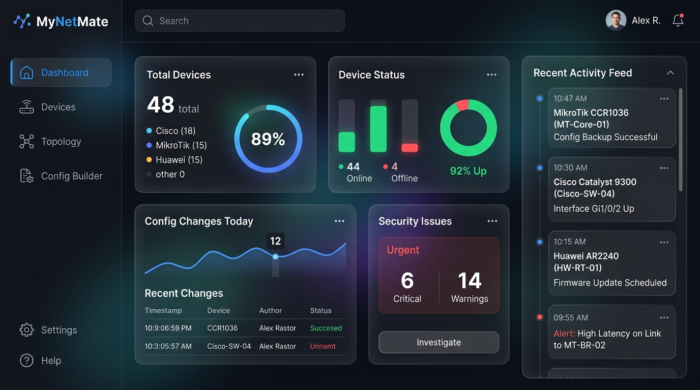
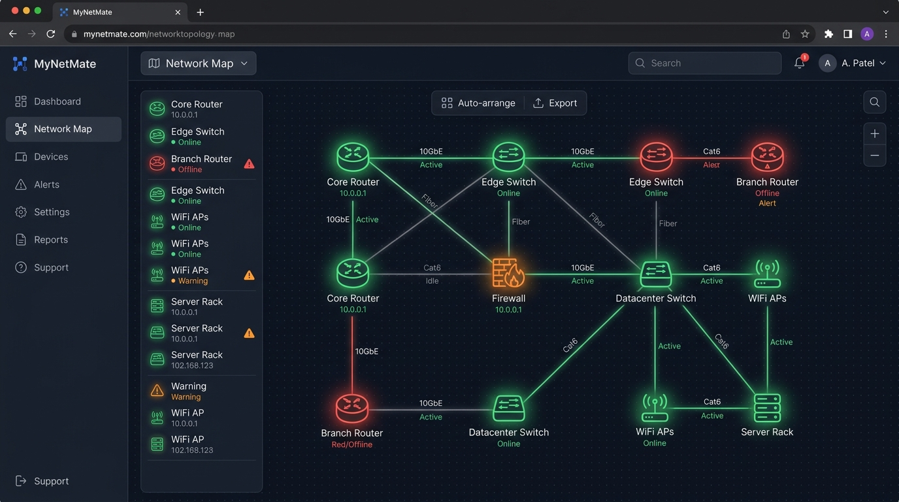
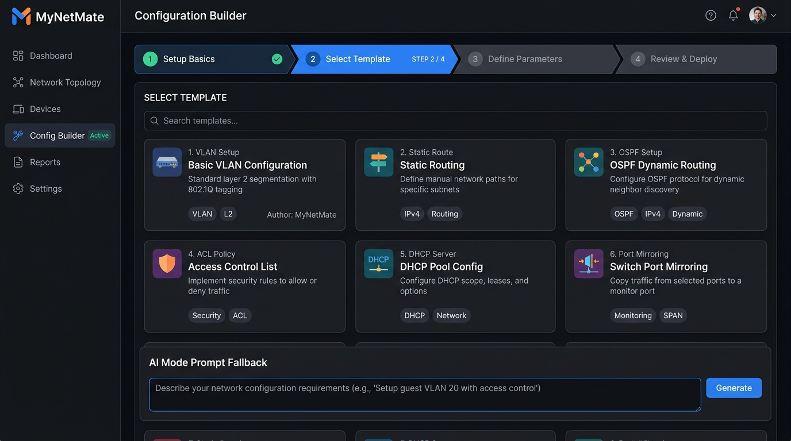

# 🌐 MyNetMate — UI Mockups & Page Structure

นี่คือโครงสร้าง Mockup UI และผังหน้าจอทั้งหมดของโปรเจค **MyNetMate** ที่ออกแบบมาในธีม Modern Dark Mode (Glassmorphism) ตามฟีเจอร์ที่อัปเดตล่าสุด

## 🖼️ UI Mockups Preview

````carousel

<!-- slide -->

<!-- slide -->

````

---

## 🗺️ โครงสร้างหน้าเว็บ (Sitemap & Components)

ทุกหน้าจะมี **Sidebar Navigation** ทางซ้ายมือ (พับเก็บได้) ประกอบด้วยเมนูหลักดังนี้:

### 1. 🏠 P1 — Dashboard (หน้าแรก)
*   **Metric Cards (แถวบน):**
    *   Total devices (แยก Cisco, MikroTik, Huawei)
    *   Online / Offline status
    *   Config changes today
    *   Security issues (CIS Rules fail)
*   **Recent Activity Feed:** แสดงรายการความเคลื่อนไหวล่าสุดในระบบ (ใคร ทำอะไร กับอุปกรณ์ไหน)
*   **Quick Actions:** ปุ่มลัดสำหรับ Add Device, Generate Config

### 2. 🗄️ P2 — Device Management (จัดการอุปกรณ์)
หน้าสำหรับจัดการ Inventory แบ่งเป็น 4 Tabs หลัก:
*   **Tab A - Device List:** ตารางแสดงอุปกรณ์ทั้งหมด (ค้นหา, กรองตาม Vendor/Group)
*   **Tab B - Add Device (Manual):** ฟอร์มเพิ่มอุปกรณ์แบบกรอกเอง
*   **Tab C - Auto Discovery:** ระบบสแกนหาอุปกรณ์อัตโนมัติ (ใส่ IP Range, SNMP Credential)
*   **Tab D - Device Groups:** จัดกลุ่มอุปกรณ์ (เช่น Core Switch, Floor 1)

### 3. 🕸️ P3 — Network Topology (แผนผังเครือข่าย)
*   **Interactive Canvas:** หน้าจอวาดและแสดงการเชื่อมต่อ (Drag & Drop)
*   **Node Menu:** คลิกขวาที่อุปกรณ์เพื่อสั่ง Generate Config หรือดูประวัติได้ทันที
*   **Status Indicator:** จุดสีเขียว/แดง แสดงสถานะ Online/Offline ของแต่ละ Node

### 4. ⚡ P4 — Configuration Builder (สร้าง Config)
หัวใจหลักของ **MyNetMate** ทำงานแบบ **4-Step Wizard**:
1.  **Select Device:** เลือกเป้าหมายจาก Inventory (รองรับเลือกหลายตัว/ทั้ง Group)
2.  **Select Template:** เลือก Template (เช่น VLAN, Static Route) + มีช่องกรอก **AI Prompt**
3.  **Parameters:** กรอกค่าตัวแปรตาม Template
4.  **Generate:** ระบบจะเอาข้อมูลไป Gen Config (พร้อมทำ PII Masking ให้)

### 5. 🛡️ P5 — Review & Pre-deployment (ตรวจสอบก่อน Push)
ด่านสุดท้ายก่อนสคริปต์ไปถึงอุปกรณ์จริง (Safe Deploy Workflow)
*   **Left Panel (Code Review):** ดูโค้ดที่จะรันจริง (ส่วนที่เป็น Password จะโดนเซ็นเซอร์ `***`)
*   **Right Panel (Security Checklist):** ผลการตรวจสอบ CIS Benchmarks
*   **Pre-flight Check:** ระบบเช็คว่า Config ใหม่จะ **"ตัดขาตัวเอง"** หรือไม่ (เช็ค Management IP, SSH)
*   **Action Button:** ปุ่ม **Safe Deploy (Commit Confirmed)**

### 6. 🕒 P6 — Version Control & Audit Trail
*   **Version List:** ประวัติการเก็บ Config ของแต่ละเครื่อง
*   **Diff Viewer:** เปรียบเทียบโค้ด 2 เวอร์ชั่น (เขียว=เพิ่ม, แดง=ลบ)
*   **Rollback:** สั่งย้อนเวลากลับไปใช้ Config ก่อนหน้าได้

### 7. ⚙️ P7 — Settings (ตั้งค่าระบบ)
*   **AI/API Keys:** ใส่ Gemini API Key, คุม Token Budget
*   **Driver & Plugin Management:** โหลด Driver ของ Vendor ใหม่ๆ (Extensible Architecture)
*   **Credential Profiles:** จัดการชุดรหัสผ่าน SSH/SNMP ส่วนกลาง
*   **CIS Rules & Patterns:** ปรับแต่งกฎความปลอดภัย และ Regex PII
