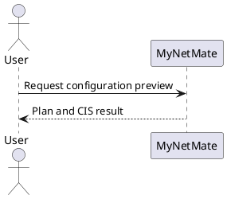
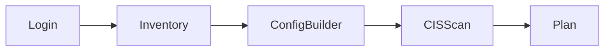

# Obsidian Extensions Guide for AI Agents

> **Vault:** MyNetMate / CEPP68-33  
> **Snapshot date:** 2026-09-03  
> **Purpose:** บอก AI และสมาชิกทีมว่า Obsidian Vault นี้มีส่วนเสริมอะไร เปิดใช้งานอะไรอยู่ ใช้ syntax/คำสั่งใดได้ และต้องระวังอะไร

## 1. Source of Truth และกติกาสำหรับ AI

1. รายการ Community plugins ที่เปิดใช้งานจริงอยู่ใน [`.obsidian/community-plugins.json`](.obsidian/community-plugins.json)
2. ชื่อ เวอร์ชัน และความต้องการขั้นต่ำของแต่ละ plugin อยู่ใน `.obsidian/plugins/<plugin-id>/manifest.json`
3. รายการ Core plugins อยู่ใน [`.obsidian/core-plugins.json`](.obsidian/core-plugins.json)
4. หากข้อมูลในไฟล์นี้ไม่ตรงกับไฟล์ใน `.obsidian/` ให้ยึดสถานะจริงใน `.obsidian/` และแจ้งว่าคู่มือนี้ควรอัปเดต
5. AI สามารถสร้างหรือแก้ Markdown, YAML properties, Mermaid, PlantUML, Dataview query, Templater template, Kanban board และ flashcard ที่ plugin เหล่านี้รองรับได้เมื่อผู้ใช้ร้องขอ
6. อย่าแก้ `main.js`, `manifest.json` หรือไฟล์ภายใน `.obsidian/plugins/` ด้วยตนเอง ยกเว้นผู้ใช้สั่งให้พัฒนา/ซ่อม plugin โดยตรง
7. คำสั่งใน Command Palette อาจเปลี่ยนตามเวอร์ชัน ให้ตรวจคู่มือที่ลิงก์ไว้หรือค้นชื่อ plugin ใน Command Palette เมื่อไม่แน่ใจ
8. กฎความปลอดภัยของโปรเจกต์ยังมีผลเสมอ: ห้ามส่ง IP, Password, Key, Config จริง หรือ Network Diagram ที่ระบุตัวตนได้ไปยังบริการภายนอกก่อน Mask ข้อมูล

## 2. Community Plugins ที่ติดตั้งและเปิดใช้งาน

Community plugins ทั้ง 12 ตัวด้านล่างอยู่ในรายการ Enabled ณ วันที่บันทึก snapshot นี้

| Plugin                   | ID                           | Version | ใช้ทำอะไร                                                          | คู่มือ/คำสั่ง                                                                                                                                                                         |
| ------------------------ | ---------------------------- | ------: | ------------------------------------------------------------------ | ------------------------------------------------------------------------------------------------------------------------------------------------------------------------------------- |
| Advanced Tables          | `table-editor-obsidian`      |  0.23.2 | ช่วยจัดรูปแบบ แทรก ย้าย เรียง และคำนวณสูตรใน Markdown table        | [Help](https://github.com/tgrosinger/advanced-tables-obsidian/blob/main/docs/help.md) · [Formula syntax](https://github.com/tgrosinger/md-advanced-tables/blob/main/docs/formulas.md) |
| Git                      | `obsidian-git`               |  2.39.0 | ดู diff, commit, pull และ push Vault จาก Obsidian                  | [Documentation](https://publish.obsidian.md/git-doc/) · [Repository](https://github.com/Vinzent03/obsidian-git)                                                                       |
| Dataview                 | `dataview`                   |  0.5.68 | Query properties และสร้างตาราง/รายการ/Dashboard จากโน้ต            | [Documentation](https://blacksmithgu.github.io/obsidian-dataview/)                                                                                                                    |
| Templater                | `templater-obsidian`         |  2.25.0 | สร้าง Template แบบมีตัวแปร ฟังก์ชัน และ automation                 | [Documentation](https://silentvoid13.github.io/Templater/)                                                                                                                            |
| Quick Switcher++         | `darlal-switcher-plus`       |   6.1.6 | ค้นไฟล์ หัวข้อ สัญลักษณ์ แท็บ คำสั่ง Bookmark และไฟล์ที่เกี่ยวข้อง | [Commands and usage](https://github.com/darlal/obsidian-switcher-plus)                                                                                                                |
| File Explorer Note Count | `file-explorer-note-count`   |   1.2.4 | แสดงจำนวนโน้ตใต้แต่ละโฟลเดอร์ใน File Explorer                      | [README](https://github.com/ozntel/file-explorer-note-count/blob/main/README.md)                                                                                                      |
| Excalidraw               | `obsidian-excalidraw-plugin` |  2.26.4 | วาด diagram, sketch, UI flow และเชื่อมภาพกับโน้ต                   | [Documentation](https://excalidraw-obsidian.online/) · [Repository](https://github.com/zsviczian/obsidian-excalidraw-plugin)                                                          |
| PlantUML                 | `obsidian-plantuml`          |   1.9.0 | Render UML จาก fenced code block                                   | [Plugin usage](https://github.com/joethei/obsidian-plantuml) · [PlantUML language](https://plantuml.com/)                                                                             |
| Mermaid Tools            | `mermaid-tools`              |   1.4.1 | เพิ่ม toolbar ช่วยเขียน Mermaid ที่ Obsidian รองรับอยู่แล้ว        | [Repository](https://github.com/dartungar/obsidian-mermaid) · [Mermaid syntax](https://mermaid.js.org/intro/)                                                                         |
| Spaced Repetition        | `obsidian-spaced-repetition` |  1.15.4 | ทำ flashcard และจัดรอบทบทวนโน้ต                                    | [Documentation](https://stephenmwangi.com/obsidian-spaced-repetition/)                                                                                                                |
| Kanban                   | `obsidian-kanban`            |  2.0.51 | สร้าง Kanban board ที่เก็บข้อมูลเป็น Markdown                      | [Documentation](https://publish.obsidian.md/kanban/Obsidian+Kanban+Plugin) · [Repository](https://github.com/mgmeyers/obsidian-kanban)                                                |
| Periodic Notes           | `periodic-notes`             |  0.0.17 | สร้างและเปิด Daily, Weekly, Monthly, Quarterly และ Yearly notes    | [Commands and usage](https://github.com/liamcain/obsidian-periodic-notes/blob/main/README.md)                                                                                         |

## 3. วิธีใช้และคำสั่งสำคัญ

### 3.1 Advanced Tables

สถานะปัจจุบัน:

- ใช้รูปแบบตารางแบบ `normal`
- `Tab` เลื่อนไปเซลล์ถัดไป
- `Shift+Tab` ย้อนกลับหนึ่งเซลล์
- `Enter` เลื่อนไปแถวถัดไป
- แสดงไอคอน Table Controls บน Ribbon

ใช้ Markdown table มาตรฐาน เพื่อให้ไฟล์ยังอ่านได้บน GitHub และ editor อื่น:

```markdown
| Feature | Priority | Status |
|---|---|---|
| Authentication | P1-INFRA | Planned |
| Config Builder | P1-CORE | In progress |
```

คำสั่งที่ตรวจพบจาก plugin เวอร์ชันที่ติดตั้ง:

- `Advanced Tables: Format table at the cursor`
- `Advanced Tables: Format all tables in this file`
- `Advanced Tables: Insert row before current`
- `Advanced Tables: Insert column before current`
- `Advanced Tables: Move row up/down`
- `Advanced Tables: Move column left/right`
- `Advanced Tables: Delete row/column`
- `Advanced Tables: Sort rows ascending/descending`
- `Advanced Tables: Left/Center/Right align column`
- `Advanced Tables: Transpose`
- `Advanced Tables: Evaluate table formulas`
- `Advanced Tables: Open table controls toolbar`

AI ควรสร้างตารางเป็น Markdown มาตรฐานก่อน ส่วนการจัดแนวและประเมินสูตรให้ผู้ใช้เรียกคำสั่งของ plugin ใน Obsidian

### 3.2 Dataview

เหมาะสำหรับ Dashboard เอกสาร Feature, ผู้รับผิดชอบ, Priority และสถานะ เมื่อโน้ตมี YAML properties ที่สม่ำเสมอ เช่น:

```yaml
---
feature: Authentication
priority: P1-INFRA
status: planned
owner: Naphat
updated: 2026-09-03
---
```

ตัวอย่าง query:

```dataview
TABLE priority, status, owner, updated
FROM "02_feature"
WHERE feature
SORT priority ASC
```

ยังไม่พบ `dataview` code block ที่ใช้งานจริงใน Vault ณ วันที่ทำ snapshot นี้ ห้ามสมมติว่าเอกสารเดิมมี properties พร้อม Query ก่อนตรวจไฟล์จริง

### 3.3 Templater

ตัวอย่างตัวแปรพื้นฐาน:

```markdown
created: <% tp.date.now("YYYY-MM-DD") %>
file: <% tp.file.title %>
```

คำสั่งหลัก:

- `Templater: Open insert template modal`
- `Templater: Create new note from template`
- `Templater: Jump to next cursor location`

สถานะปัจจุบัน: ยังไม่พบ `data.json` ของ Templater จึงยังไม่ยืนยัน Template folder หรือ automation settings ก่อนสร้างระบบ Template ให้ถามผู้ใช้ว่าจะเก็บ Template ไว้ที่ใด

### 3.4 Quick Switcher++

Quick Switcher++ ขยาย Core Quick Switcher ซึ่งต้องเปิดอยู่เสมอ Trigger เริ่มต้นที่สำคัญ:

| Trigger  | Mode                 |
| -------- | -------------------- |
| `#`      | ค้น Headings         |
| `@`      | ค้น Symbols ในโน้ต   |
| `>`      | ค้นและเรียก Commands |
| `'`      | ค้น Bookmarks        |
| `~`      | Related Items        |
| `+`      | Workspaces           |
| `vault ` | เปิด Vault อื่น      |

หมายเหตุ: Core `workspaces` ถูกปิดอยู่ จึงไม่ควรคาดว่า `+` mode จะใช้งานได้จนกว่าจะเปิด Core plugin ดังกล่าว

### 3.5 File Explorer Note Count

ทำงานผ่าน UI อัตโนมัติ ไม่มี syntax ใน Markdown และไม่มีคำสั่งที่ AI ต้องสร้าง

### 3.6 Excalidraw

ใช้สำหรับภาพที่ต้องจัดวางอย่างอิสระ เช่น System Overview, Presentation Sketch และ UI Flow ส่วน diagram ที่ต้องแก้ผ่านข้อความหรือ review ใน Git ให้เลือก Mermaid ก่อน

สถานะปัจจุบัน:

- Drawing folder: `Excalidraw`
- Library folder: `Excalidraw/Libraries`
- Script folder: `Excalidraw/Scripts`
- Autosave: เปิด ทุก 60 วินาทีบน Desktop
- Auto-export SVG/PNG: ปิด
- AI feature toggle: เปิด
- พบโฟลเดอร์ `Excalidraw` และ drawing อย่างน้อย 1 ไฟล์ใน Vault

ข้อควรระวัง: การเปิด AI toggle ไม่ได้ยืนยันว่า API key พร้อมใช้งาน และ Excalidraw AI ไม่ได้ยืนยันว่ามี PII masking pipeline ตามข้อกำหนด MyNetMate ห้ามส่ง diagram/config ที่มีข้อมูลจริงไปยัง AI ภายนอกก่อน Mask

### 3.7 PlantUML

Syntax ที่ plugin รองรับ:

````markdown

````

- ใช้ `plantuml-svg` เมื่อต้องการภาพ SVG ความละเอียดสูง
- ใช้ `plantuml-ascii` สำหรับ ASCII sequence diagram
- การ include ไฟล์ `.puml` รองรับเฉพาะ Local rendering

ข้อควรระวังสำคัญ: ปัจจุบันไม่มีไฟล์ตั้งค่า plugin จึงใช้ค่าเริ่มต้น `https://www.plantuml.com/plantuml` สำหรับ render ผ่านอินเทอร์เน็ต ห้ามใส่ IP, Password, Key, Config หรือ topology จริง หากต้องใช้ข้อมูลสำคัญให้ตั้ง Local `.jar` หรือ private server ก่อน

### 3.8 Mermaid Tools

Obsidian รองรับ Mermaid โดยตรง ส่วน Mermaid Tools เพิ่ม toolbar สำหรับแทรกองค์ประกอบ ตัวอย่าง:

````markdown

````

พบ Mermaid code block ในเอกสารของ Vault อย่างน้อย 22 ไฟล์ จึงควรใช้ Mermaid เป็นตัวเลือกแรกสำหรับ Flowchart, Sequence, Class, ER, State, Gantt และ Dependency Diagram ที่ต้อง review ผ่าน Git

### 3.9 Spaced Repetition

ค่าปัจจุบัน:

- Flashcard tag: `#flashcards`
- Note review tag: `#review`
- Algorithm: `SM-2-OSR`
- Highlight เช่น `==answer==` สามารถแปลงเป็น cloze ได้
- ไม่ประมวลผลไฟล์ `**/*.excalidraw.md`

ตัวอย่าง:

```markdown
#flashcards

คำสั่ง Cisco สำหรับเข้า Global Configuration Mode คืออะไร?::configure terminal

Default port ของ SSH คืออะไร?:::22
```

เหมาะกับการทบทวน Cisco commands, CIS rules, คำศัพท์ และคำถามเตรียมสอบ/ตอบกรรมการ ไม่ควรใช้เป็นแหล่งอ้างอิงความถูกต้องของ Config

### 3.10 Kanban

คำสั่งหลัก:

- `Kanban: Create new board`
- `Kanban: Convert empty note to Kanban`
- `Kanban: Add a list`
- `Kanban: Archive completed cards in active board`
- `Kanban: Toggle between Kanban and markdown mode`
- `Kanban: View as board/table/list`

โครงสร้างขั้นต่ำ:

```markdown
---
kanban-plugin: board
---

## Backlog

- [ ] Define API contract

## In Progress

- [ ] Implement authentication

## Done
```

ยังไม่พบ Kanban board ใน Vault ณ วันที่ทำ snapshot นี้

### 3.11 Periodic Notes

คำสั่งที่มีตามชนิด note ที่เปิดใช้ เช่น:

- `Periodic Notes: Open daily note`
- `Periodic Notes: Open weekly note`
- `Periodic Notes: Open monthly note`
- `Periodic Notes: Next/Previous weekly note`
- `Periodic Notes: Next/Previous monthly note`

ตัวอย่าง Template variable:

```markdown
# Weekly Progress — {{date:gggg [Week] WW}}
```

สถานะปัจจุบัน: Daily, Weekly, Monthly, Quarterly และ Yearly ยังไม่ได้กำหนด Format, Template หรือ Folder จึงต้องตั้งค่าก่อนเริ่ม workflow จริง

### 3.12 Git

คำสั่งที่ใช้บ่อย:

- `Git: Open source control view`
- `Git: List changed files`
- `Git: Open diff view`
- `Git: Pull`
- `Git: Commit`
- `Git: Commit all changes`
- `Git: Commit-and-sync`

สถานะปัจจุบัน:

- Auto commit/push/pull interval: ปิด (`0`)
- Auto pull on startup: ปิด
- Pull before push: เปิด
- Sync method: `merge`
- Push ไม่ได้ถูกปิด แต่จะเกิดเมื่อผู้ใช้เรียกคำสั่งเอง

AI ห้ามสั่ง Commit, Push, Discard, Reset หรือแก้ประวัติ Git เพียงเพราะ plugin นี้ติดตั้งอยู่ ต้องได้รับคำขอที่ชัดเจนจากผู้ใช้ และกฎห้ามแก้/commit/push `mynetmate/network-discovery/` ยังคงมีผลเสมอ

## 4. Core Plugins และ Appearance ที่เกี่ยวข้อง

Core plugins ที่เปิดและมีประโยชน์กับงานนี้ ได้แก่ File Explorer, Search, Quick Switcher, Graph, Backlinks, Canvas, Outgoing Links, Tags, Properties, Page Preview, Daily Notes, Templates, Note Composer, Command Palette, Bookmarks, Outline, Word Count, File Recovery, Sync และ Bases

สถานะที่ควรรู้:

- Core `Quick Switcher`, `Command Palette` และ `Bookmarks` เปิดอยู่ จึงรองรับ mode ที่เกี่ยวข้องของ Quick Switcher++
- Core `Workspaces` ปิดอยู่
- Core `Daily Notes` และ `Templates` เปิด แต่ยังไม่พบไฟล์ตั้งค่าเฉพาะ
- Core `Sync` เปิดในรายการ plugin แต่ไฟล์นี้ไม่ยืนยันว่า Vault เชื่อมกับ Obsidian Sync remote แล้ว
- Active theme: `Blue Topaz`
- Installed theme สำรอง: `GitHub Theme`
- Interface/Text font: `Sarabun`, 18px

## 5. แนวทางเลือกเครื่องมือสำหรับ MyNetMate

| งาน | ตัวเลือกแรก | ใช้เมื่อ |
|---|---|---|
| Architecture / Dependency / Sequence Diagram | Mermaid | ต้องการแก้เป็นข้อความ ดู diff และ render ใน Obsidian/GitHub |
| UML เป็นทางการ | PlantUML แบบ Local | ต้องการ PlantUML-specific syntax และตั้งค่า local renderer แล้ว |
| Sketch / Presentation / UI Flow | Excalidraw | ต้องจัดวางภาพอย่างอิสระและไม่มีข้อมูลลับส่งออกภายนอก |
| ตารางเอกสารทั่วไป | Markdown + Advanced Tables | ต้องการข้อมูล portable และแก้ไขง่าย |
| Dashboard จาก metadata | Dataview | โน้ตมี YAML properties ที่เป็นมาตรฐานแล้ว |
| เอกสารรูปแบบซ้ำ | Templater | กำหนด Template folder และ schema แล้ว |
| Sprint board | Kanban | ต้องการ task board ภายใน Vault โดยไม่ซ้ำกับ tracker หลักของทีม |
| Meeting / Weekly progress | Periodic Notes + Templater | ตั้ง Folder, Format และ Template แล้ว |
| ทบทวนความรู้ | Spaced Repetition | ใช้กับความรู้และการเตรียมสอบ ไม่ใช้ตัดสิน Config production |

## 6. การอัปเดตไฟล์นี้เมื่อเพิ่ม/ลบ Extension

เมื่อผู้ใช้ติดตั้ง ลบ เปิด หรือปิด Extension ให้ AI ทำขั้นตอนต่อไปนี้:

1. อ่าน `.obsidian/community-plugins.json`
2. อ่าน `manifest.json` ของ plugin ที่ติดตั้งจริงทุกตัว
3. เปรียบเทียบกับตารางในหัวข้อ 2
4. อัปเดต Version, สถานะ, คู่มือ, syntax, configuration และข้อควรระวังที่เปลี่ยน
5. หากหาคู่มือคำสั่งจากแหล่งทางการไม่ได้ ให้ปล่อยช่อง `คู่มือ/คำสั่ง` ว่างไว้เพื่อให้ผู้ใช้เติมภายหลัง ห้ามเดา URL
6. อัปเดต `Snapshot date`
